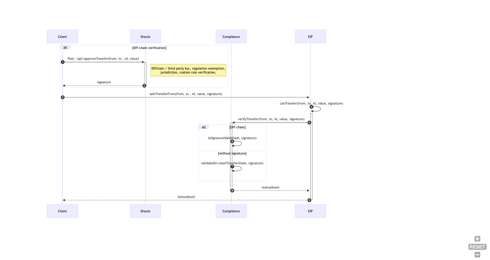
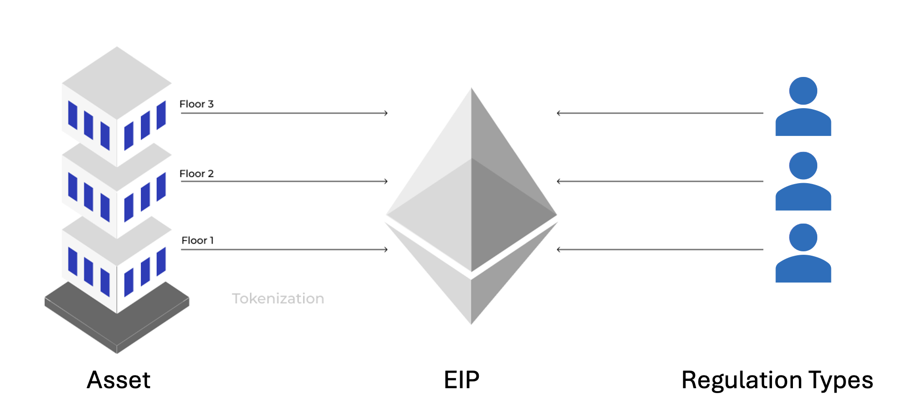

## 摘要

本提案是一个安全代币标准，它扩展了 [ERC-1155](./eip-1155.md)  ，旨在为管理符合要求的真实资产安全代币提供一个灵活的框架。它引入了分区的概念，其中每个 `tokenId` 代表一个具有自己权利和特权的独特分区。这使其适用于各种用例，尤其是半同质化资产管理。该标准还包括代币锁定、强制转移以进行恢复、地址冻结、支付和使用链下凭证的动态合规性管理等功能。

## 动机

对代币化现实世界资产日益增长的需求，需要一种能够满足安全代币独特要求的代币标准。现有的标准虽然功能强大，但并未完全满足灵活分区和全面合规性管理的需求。

建立在 [ERC-1155](./eip-1155.md) 的基础上引入分区，允许创建代表部分所有权、不同股份类别或单个代币合约中其他不同单位的半同质化代币。这种灵活性对于代币化复杂的现实世界资产（如房地产或基金）至关重要。

此外，它还包括安全代币必不可少的功能，例如用于归属或持有期的代币锁定、用于在密钥丢失时进行恢复的强制转移、用于监管合规性的地址冻结、有效的支付机制以及使用链下凭证的动态合规性管理。

通过为这些功能提供标准化接口，本提案旨在促进可互操作且符合要求的安全代币生态系统的开发。

## 规范

本文档中的关键词“必须”，“禁止”，“需要”，“应该”，“不应该”，“推荐”，“不推荐”，“可以”和“可选”应按照 RFC 2119 和 RFC 8174 中的描述进行解释。

### 接口

```solidity
pragma solidity ^0.8.0;

interface IERC7518 is IERC1155, IERC165{
  event TokensLocked(address indexed account, uint indexed id, uint256 amount, uint256 releaseTime);

  event TokenUnlocked(address indexed account, uint indexed id);

  event TokensForceTransferred(address indexed from, address indexed to, uint indexed id, uint256 amount);

  event AddressFrozen(address indexed account, bytes data);

  event AddressUnfrozen(address indexed account, bytes data);

  // Emitted when the transferability of tokens with a specific ID is restricted.
  // 当具有特定 ID 的代币的转移性受到限制时发出。
  event TransferRestricted(uint indexed id);

  // Emitted when the transferability restriction of tokens with a specific ID is removed.
  // 当移除具有特定 ID 的代币的转移性限制时发出。
  event TransferRestrictionRemoved(uint indexed id);

  event PayoutDelivered(address indexed from, address indexed to, uint256 amount);

  /**
  * @dev Retrieves the transferable balance of tokens for the specified account and ID.
  * @dev 检索指定帐户和 ID 的代币的可转移余额。
  * @param account The address of the account.
  * @param id The token ID.
  * @param id 代币 ID。
  * @return The transferable balance of tokens.
  * @return 代币的可转移余额。
  */
  function transferableBalance(address account, uint id) external view returns (uint);

  /**
  * @dev Retrieves the locked balance of tokens for the specified account and ID.
  * @dev 检索指定帐户和 ID 的代币的锁定余额。
  * @param account The address of the account.
  * @param id The token ID.
  * @param id 代币 ID。
  * @return The locked balance of tokens.
  * @return 代币的锁定余额。
  */
  function lockedBalanceOf(address account, uint256 id) external view returns (uint256);

  /**
  * @dev Restricts the transferability of tokens with the specified ID.
  * @dev 限制具有指定 ID 的代币的转移性。
  * @param id The token ID.
  * @param id 代币 ID。
  * @return A boolean value indicating whether the operation was successful.
  * @return 一个布尔值，指示操作是否成功。
  */
  function restrictTransfer(uint id) external returns (bool);

  /**
  * @dev Removes the transferability restriction of tokens with the specified ID.
  * @dev 移除具有指定 ID 的代币的转移性限制。
  * @param id The token ID.
  * @param id 代币 ID。
  * @return A boolean value indicating whether the operation was successful.
  * @return 一个布尔值，指示操作是否成功。
  */
  function removeRestriction(uint id) external returns (bool);

  /**
  * @notice Transfers `_value` amount of an `_id` from the `_from` address to the `_to` address specified (with safety call).
  * @notice 将指定数量的 `_value` 个 `_id` 从 `_from` 地址转移到 `_to` 地址（带有安全调用）。
  * @dev Caller must be approved to manage the tokens being transferred out of the `_from` account (see "Approval" section of the standard).
  * @dev 调用者必须获得批准才能管理从 `_from` 帐户转移出去的代币（请参阅标准的“批准”部分）。

  * After the above conditions are met, this function MUST check if `_to` is a smart contract (e.g. code size > 0). If so, it MUST call `onERC1155Received` on `_to` and act appropriately (see "Safe Transfer Rules" section of the standard).  
  * 满足上述条件后，此函数必须检查 `_to` 是否为智能合约（例如，代码大小 > 0）。如果是，则必须在 `_to` 上调用 `onERC1155Received` 并采取适当的措施（请参阅标准的“安全转移规则”部分）。
  * @param _from    Source address
  * @param _from    源地址
  * @param _to      Target address
  * @param _to      目标地址
  * @param _id      ID of the token type
  * @param _id      代币类型的 ID
  * @param _value   Transfer amount
  * @param _value   转移数量
  * @param _data    Additional data with no specified format, MUST be sent unaltered in call to `onERC1155Received` on `_to`
  * @param _data    其他数据，没有指定格式，必须在调用 `_to` 上的 `onERC1155Received` 时保持不变
  */
  function safeTransferFrom(address _from, address _to, uint256 _id, uint256 _value, bytes calldata _data) override external;

  /**
  * @dev Checks if a transfer is allowed.
  * @dev 检查是否允许转移。
  * @param from The address to transfer tokens from.
  * @param from 从中转移代币的地址。
  * @param to The address to transfer tokens to.
  * @param to 将代币转移到的地址。
  * @param id The token ID.
  * @param id 代币 ID。
  * @param amount The amount of tokens to transfer.
  * @param amount 要转移的代币数量。
  * @param data Additional data related to the transfer.
  * @param data 与转移相关的其他数据。
  * @return status A boolean value indicating whether the transfer is allowed.
  * @return status 一个布尔值，指示是否允许转移。
  */
  function canTransfer(address from, address to, uint id, uint amount, bytes calldata data) external view returns (bool status);

  /**
  * @dev lock token till a particular block time.
  * @dev 锁定代币直到特定区块时间。
  * @param account The address of the account for which tokens will be locked.
  * @param account 将锁定代币的帐户地址。
  * @param id The token ID.
  * @param id 代币 ID。
  * @param amount The amount of tokens to be locked for the account.
  * @param amount 要为帐户锁定的代币数量。
  * @param releaseTime The timestamp indicating when the locked tokens can be released.
  * @param releaseTime 指示何时可以释放锁定代币的时间戳。
  * @return bool Returns true if the tokens are successfully locked, otherwise false.
  * @return bool 如果代币已成功锁定，则返回 true，否则返回 false。
  */
  function lockTokens(address account, uint id, uint256 amount, uint256 releaseTime) external returns (bool);

  /**
  * @dev Unlocks tokens that have crossed the release time for a specific account and id.
  * @dev 解锁已超过特定帐户和 id 的释放时间的代币。
  * @param account The address of the account to unlock tokens for.
  * @param account 要为其解锁代币的帐户地址。
  * @param id The token ID.
  * @param id 代币 ID。
  */
  function unlockToken(address account, uint256 id) external;

  /**
  * @dev Force transfer in cases like recovery of tokens.
  * @dev 在代币恢复等情况下强制转移。
  * @param from The address to transfer tokens from.
  * @param from 从中转移代币的地址。
  * @param to The address to transfer tokens to.
  * @param to 将代币转移到的地址。
  * @param id The token ID.
  * @param id 代币 ID。
  * @param amount The amount of tokens to transfer.
  * @param amount 要转移的代币数量。
  * @param data Additional data related to the transfer.
  * @param data 与转移相关的其他数据。
  * @return A boolean value indicating whether the operation was successful.
  * @return 一个布尔值，指示操作是否成功。
  */
  function forceTransfer(address from, address to, uint256 id, uint256 amount, bytes memory data) external returns (bool);

  /**
  * @dev Freezes specified address.
  * @dev 冻结指定的地址。
  * @param account The address to be frozen.
  * @param account 要冻结的地址。
  * @param data Additional data related to the freeze operation.
  * @param data 与冻结操作相关的其他数据。
  * @return A boolean value indicating whether the operation was successful.
  * @return 一个布尔值，指示操作是否成功。
  */
  function freezeAddress(address account, bytes calldata data) external returns (bool);

  /**
  * @dev Unfreezes specified address.
  * @dev 解冻指定的地址。
  * @param account The address to be unfrozen.
  * @param account 要解冻的地址。
  * @param data Additional data related to the unfreeze operation.
  * @param data 与解冻操作相关的其他数据。
  * @return A boolean value indicating whether the operation was successful.
  * @return 一个布尔值，指示操作是否成功。
  */
  function unFreeze(address account, bytes memory data) external returns (bool);

  /**
  * @dev Sends payout to single address with corresponding amounts.
  * @dev 将支付发送到具有相应金额的单个地址。
  * @param to address to send the payouts to.
  * @param to 发送支付的地址。
  * @param amount amount representing the payouts to be sent.
  * @param amount 表示要发送的支付的金额。
  * @return A boolean indicating whether the batch payouts were successful.
  * @return 一个布尔值，指示批量支付是否成功。
  */* 
  function payout(address calldata to, uint256 calldata amount) public returns (bool);

  /**
  * @dev Sends batch payouts to multiple addresses with corresponding amounts.
  * @dev 将批量支付发送到具有相应金额的多个地址。
  * @param to An array of addresses to send the payouts to.
  * @param to 一个用于发送支付的地址数组。
  * @param amount An array of amounts representing the payouts to be sent.
  * @param amount 一个表示要发送的支付的金额数组。
  * @return A boolean indicating whether the batch payouts were successful.
  * @return 一个布尔值，指示批量支付是否成功。
  */
  function batchPayout(address[] calldata to, uint256[] calldata amount) public returns (bool);
}
```

### 代币方法

### `transferableBalance`

检索指定帐户和 ID 的代币的可转移余额。

```solidity
function transferableBalance(address account,uint id) external view returns (uint)
```

- 必须计算并返回指定帐户和 ID 的代币的可转移余额，即当前 `balanceOf(account, id) - lockedBalanceOf(account, id)`。

### `lockedBalanceOf`

检索指定帐户和 ID 的代币的锁定余额。

```solidity
function lockedBalanceOf(address account,uint256 id) external view returns (uint256)
```

- 必须检索并返回指定 `account` 和 `id` 的代币的锁定余额。

### `restrictTransfer`

限制具有指定 ID 的代币的转移性。

```solidity
function restrictTransfer(uint id) external returns (bool)
```

- 必须限制具有指定 `id` 的代币的转移性。
- 应该发出 `TransferRestricted`。

### `removeRestriction`

移除具有指定 ID 的代币的转移性限制。

```solidity
function removeRestriction(uint id) external returns (bool)
```

- 必须移除具有指定 `id` 的代币的转移性限制。必须检查 `id` 之前是否受到限制。
- 应该发出 `TransferRestrictionRemoved`。

### `safeTransferFrom`

```solidi
function safeTransferFrom(address _from, address _to, uint256 _id, uint256 _value, bytes calldata _data) override external;
```

- 如果 `_to` 是零地址，则必须恢复。
- 如果代币 `_id` 的持有者余额低于发送的 `_value`，则必须恢复。
- 必须恢复任何其他错误。
- 必须发出 `TransferSingle` 事件以反映余额变化（请参阅标准的“安全转移规则”部分）。
- 必须调用 `canTransfer` 函数以检查转移是否可以继续

### `canTransfer`

确定将指定数量的代币从一个地址转移到另一个地址。

```solidity
function canTransfer(address from,address to,uint id,uint amount,bytes calldata data) external view returns (bool status);
```

- 准确确定是否允许转移代币。
- 必须验证 `to` 和 `from` 不是冻结地址。
- 必须验证转移的 `id` 不应受到限制
- 必须检查 `amount` 是否为可转移余额。
- 可以调用外部合约以验证转移。
- 不应修改任何状态或执行任何副作用。

### `lockTokens`

锁定帐户中指定数量的代币，持续指定的时间。

```solidity
function lockTokens(address account,uint id,uint256 amount,uint256 releaseTime) external returns (bool);
```

- 必须强制执行基于时间的对代币转移或使用的限制。
- 如果持有者的余额小于数量，则必须恢复。
- 应该使用适当的访问控制措施，以确保只有授权实体才能锁定代币。
- 必须执行输入验证，以防止潜在的漏洞和未经授权的代币锁定。
- 应该安全地记录释放时间，并确保锁定的代币仅在指定时间过后才会被释放。
- 应该发出 `TokensLocked`。

### `unlockToken`

解锁已超过特定帐户和 id 的释放时间的代币。

```solidity
function unlockToken(address account,uint256 id) external;
```

- 必须解锁指定 `account` 地址和 `id` 的代币。
- 必须解锁所有释放时间 > `block.time` 的代币
- 如果没有解锁任何代币，则应该恢复以节省 gas。
- 应该发出 `TokenUnlocked`。

### `forceTransfer`

在代币恢复等情况下强制转移

```solidity
function forceTransfer(address from,address to,uint256 id,uint256 amount,bytes memory data) external returns (bool);
```

- 必须绕过正常的转移限制和授权检查。
- 如果 `from` 地址未冻结，则必须恢复。
- 如果 `to` 地址已冻结，则必须恢复。
- 必须确保只有授权实体具有调用此函数的能力。
- 与冻结操作相关的其他数据。
- 应该发出 `TokensForceTransferred`。

### `freeze`

冻结指定的地址。Freeze 函数接收要冻结的 `account address` 和附加数据，并返回一个 `boolean` 值，指示操作是否成功。

```solidity
function freezeAddress(address account,bytes data) external returns (bool);
```

- 必须阻止 `account` 转移和支付。
- 应该实施适当的访问控制措施，以确保只有经过授权的地址才能解冻。
- 应该发出 `AddressFrozen`。

### `unFreeze`

Unfreeze 函数接收要解冻的 `account address` 和附加数据，并返回一个 `boolean` 值，指示操作是否成功。

```solidity
function unFreeze(address account,bytes memory data) external returns (bool);
```

- 必须考虑解冻地址的含义，因为它授予无限制的转移和操作能力。
- 必须解冻指定的 `account`
- 应该实施适当的访问控制措施，以确保只有经过授权的地址才能解冻。
- 应该发出 `AddressUnfrozen`。

### `payout`

将付款发送到单个地址，接收者将收到特定数量的代币。

```solidity
function payout(address calldata to,uint256 calldata amount) public returns (bool)
```

- 如果 `to` 地址是冻结地址，则必须恢复。
- 应该有足够的余额从发行人地址转移代币。
- 应该发出 `PayoutDelivered`。

### `batchPayout`

一次将付款发送到多个地址，每个地址都收到特定数量的代币。它可用于各种目的，例如分配奖励、股息或利息支付。

```solidity
function batchPayout(address[] calldata to,uint256[] calldata amount) public returns (bool)
```

- 如果 `to` 地址是冻结地址，则必须恢复。
- 应该有足够的余额从发行人地址转移代币。
- 应该发出 `PayoutDelivered`。

### 互操作性

该提案通过代币包装方法促进与 [ERC-3643](./eip-3643.md)  代币的互操作性。该过程涉及两个关键组件：代表原始代币的 [ERC-3643](./eip-3643.md)  代币合约和包装版本的拟议代币合约。寻求包装其代币的用户与包装合约交互，该合约安全地锁定其原始代币，并将等量的拟议代币铸造到他们的地址。相反，通过调用合约的 withdraw 函数来实现解包，从而导致燃烧拟议的代币并释放相应的原始代币。事件的发出是为了透明化，并实施了强大的安全措施，以保护用户资产并解决合约代码中任何潜在的漏洞。通过这种设计，该提案确保与 [ERC-3643](./eip-3643.md)  代币的无缝转换和兼容性，从而在以太坊生态系统中促进更大的实用性和可用性。

### 互操作性接口

```solidity
interface IERC1155Wrapper is IERC7518 {

/**
@dev Emitted when a new wrapped token address is added to the set.
@dev 当新的包装代币地址被添加到集合中时发出。
@param wrappedTokenAddress The address of the wrapped token that was added.
@param wrappedTokenAddress 添加的包装代币的地址。
*/
event WrappedTokenAddressSet(address wrappedTokenAddress);

/**
@dev Emitted when tokens are wrapped.
@dev 当代币被包装时发出。
@param The ERC1155 token ID of the wrapped tokens.
@param The 包装代币的 ERC1155 代币 ID。
@param amount The amount of tokens that were wrapped.
@param amount 包装的代币数量。
*/
event TokensWrapped(uint indexed id, uint256 amount);

/**
@dev Emitted when tokens are unwrapped.
@dev 当代币被解包时发出。
@param wrappedTokenId Is the ERC1155 token ID of the wrapped tokens.
@param wrappedTokenId 是包装代币的 ERC1155 代币 ID。
@param amount The amount of tokens that were unwrapped.
@param amount 解包的代币数量。
*/
event TokensUnwrapped(uint indexed wrappedTokenId, uint256 amount);

/**
* @dev Sets the wrapped token address and logic for deciding partitions.
* @dev 设置包装代币地址和用于决定分区的逻辑。
* @param wrappedTokenAddress The address of the wrapped token contract.
* @param wrappedTokenAddress 包装代币合约的地址。
* @return A boolean value indicating whether the operation was successful.
* @return 一个布尔值，指示操作是否成功。
*/
function setWrappedToken(address token) external returns (bool);

/**
* @dev Wraps the specified amount of tokens by depositing the original tokens and receiving new standard tokens.
* @dev 通过存入原始代币并接收新的标准代币来包装指定数量的代币。
* @param amount The amount of tokens to wrap.
* @param amount 要包装的代币数量。
* @param data Additional data for partition.
* @param data 分区的其他数据。
* @return A boolean value indicating whether the operation was successful.
* @return 一个布尔值，指示操作是否成功。
*/
function wrapToken(uint256 amount, bytes calldata data) external returns (bool);

/**
* @notice Wraps a specified amount of tokens from a given partition into the main balance.
* @notice 将指定数量的代币从给定的分区包装到主余额中。
* @dev This function allows users to convert tokens from a specific partition back to the main balance,making them fungible with tokens from other partitions.
* @dev 此函数允许用户将代币从特定分区转换回主余额，使其与其他分区的代币具有同质性。
* @param partitionId The unique identifier of the partition from which tokens will be wrapped.
* @param partitionId 要从中包装代币的分区的唯一标识符。
* @param id The unique identifier of the token.
* @param id 代币的唯一标识符。
* @param amount The amount of tokens to be wrapped from the specified partition.
* @param amount 要从指定分区包装的代币数量。
* @param data Additional data that may be used to handle the wrap process (optional).
* @param data 可能用于处理包装过程的附加数据（可选）。
* @return success A boolean indicating whether the wrapping operation was successful or not.
* @return success 一个布尔值，指示包装操作是否成功。
*/

function wrapTokenFromPartition(bytes32 partitionId, uint256 id, uint256 amount, bytes calldata data) external returns (bool);
/**
* @dev Unwraps the specified amount of wrapped tokens by depositing the current tokens and receiving the original tokens.
* @dev 通过存入当前代币并接收原始代币来解包指定数量的包装代币。
* @param wrappedTokenId internal partition id.
* @param wrappedTokenId 内部分区 ID。
* @param amount The amount of wrapped tokens to unwrap.
* @param amount 要解包的包装代币数量。
* @param data Additional data for partition.
* @param data 分区的其他数据。
* @return A boolean value indicating whether the operation was successful.
* @return 一个布尔值，指示操作是否成功。
*/
function unwrapToken(uint256 wrappedTokenId, uint256 amount, bytes calldata data) external returns (bool);

/**
* @dev Retrieves the balance of wrapped tokens for the specified account and ID.
* @dev 检索指定帐户和 ID 的包装代币的余额。
* @param account The address of the account.
* @param account 帐户的地址。
* @param id The token ID.
* @param id 代币 ID。
* @param data Additional data for partition.
* @param data 分区的其他数据。
* @return The balance of wrapped tokens.
* @return 包装代币的余额。
*/
function wrappedBalanceOf(address account, uint256 id, bytes calldata data) external view returns (uint256);

/**
* @dev Retrieves the balance of original tokens for the specified account and ID.
* @dev 检索指定帐户和 ID 的原始代币的余额。
* @param account The address of the account.
* @param account 帐户的地址。
* @param id The token ID.
* @param id 代币 ID。
* @param data Additional data for partition.
* @param data 分区的其他数据。
* @return The balance of original tokens.
* @return 原始代币的余额。
*/
function originalBalanceOf(address account, uint256 id, bytes calldata data) external view returns (uint256);
}
```

### 互操作性方法

### `setWrappedTokenAddress`

```solidity
function setWrappedTokenAddress(address token) external returns (bool);
```

- `token` 地址可以是任何安全代币标准，例如 [ERC-3643](./eip-3643.md)。

### `wrapToken`

```solidity
function wrapToken(uint256 amount, bytes calldata data) external returns (bool);
```

- 必须将代币锁定在链上 vault 类型的智能合约中。
- 必须铸造等量的拟议代币。
- 必须验证 [ERC-1155](./eip-1155.md)  `id` 与相应的 [ERC-20](./eip-20.md)  兼容安全代币的映射。

### `wrapTokenFromPartition`

```solidity
function wrapTokenFromPartition(bytes32 partitionId, uint256 id, uint256 amount, bytes calldata data) external returns (bool);
```

- 必须从源标准锁定代币数量，并铸造等量的拟议代币。
- 应该将代币锁定在智能合约中，以实现与投资者的一对一映射。
- 必须验证 `id` 与相应的半同质化安全代币 `partitionId` 的映射。

### `unwrapToken`

```solidity
function unwrapToken(uint256 wrappedTokenId, uint256 amount, bytes calldata data) external returns (bool);
```

- 必须销毁拟议的代币并释放原始代币。
- 必须验证该代币是否不受该提案的任何锁定功能的约束。

### 分区管理

该提案利用 [ERC-1155](./eip-1155.md) 的 `tokenId` 功能来表示代币合约中的不同分区。每个 `tokenId` 对应于具有自己权利、特权和合规性规则的唯一分区。这使得能够创建代表部分所有权、不同股份类别或其他细粒度单位的半同质化代币。

分区模式在管理安全代币方面提供了极大的灵活性和强大功能：

1. 动态分配：分区允许在不同类别或类型之间动态分配代币。例如，在房地产代币化场景中，发行人可以最初将代币分配给美国合格投资者的“Reg D”分区和非美国投资者的“Reg S”分区。随着产品的进展和需求的变化，发行人可以根据投资者的资格动态地将代币铸造到适当的分区中，从而确保最佳的分配和合规性。
2. 临时非同质化：分区支持代币的临时非同质化。在某些情况下，证券在一段时间内可能需要被视为非同质化，例如以不同发行价出售的相同标的资产的代币。通过将代币分配给特定的分区，发行人可以强制执行这些限制并维持它们之间必要的隔离，但可以在稍后合并它们以防止流动性碎片化。合并的发生是通过创建一个新的联合分区，并部署一个合并合约，用户可以在其中存入旧的分区代币以接收新的联合分区代币。
3. 细粒度合规性：每个分区都可以有自己的一组合规性规则和交易限制。这允许基于每个分区的特定特征，对代币交易进行更细粒度的控制。例如，与其它分区相比，代表特定股份类别的分区可能具有不同的交易限制或支付权。
4. 高效的资产管理：分区简化了复杂资产结构的治理。无需为每个股份类别或资产类型部署单独的合约，发行人可以在单个拟议合约中管理多个分区，从而降低部署成本并简化整体资产管理。

### 合规性管理



本提案包括用于根据监管要求和发行人定义的规则管理代币转移的函数。`canTransfer` 函数会根据代币限制、冻结地址、可转移余额和代币锁定等因素检查是否允许转移。

为方便动态合规性管理，它引入了链下凭证的概念。这些凭证是由授权实体（例如，发行人或指定的合规性服务）生成的签名消息，证明特定转账的合规性。`canTransfer` 函数可以验证这些凭证以确定转账的资格。

以下是如何将链下凭证与该提案一起使用的示例：

1. 代币发行人定义了一组代币转移的合规性规则和要求。
2. 当用户发起转账时，他们会向指定的合规性服务提交包含必要详细信息（发送者、接收者、金额等）的请求。
3. 合规性服务根据预定义的规则和要求评估转账请求，同时考虑投资者资格、转账限制和监管合规性等因素。
4. 如果转账被认为是合规的，合规性服务将生成包含相关详细信息的签名凭证，并将其返回给用户。
5. 用户在调用拟议合约上的 `safeTransferFrom` 函数时，会将签名凭证作为附加参数包括在内。
6. `canTransfer` 函数通过检查签名并确保凭证详细信息与转账参数匹配来验证凭证的真实性和有效性。
7. 如果凭证有效且转账满足所有其他要求，则允许继续进行转账。

通过利用链下凭证，该提案实现了动态合规性管理，允许发行人执行复杂且不断发展的合规性规则，而无需更新代币合约本身。这种方法在面对不断变化的监管要求时提供了灵活性和适应性。

### 代币恢复

如果钱包丢失或受到入侵，本提案包括一个 `forceTransfer` 函数，该函数允许授权实体（例如，发行人或指定的恢复代理）将代币从一个地址转移到另一个地址。此函数绕过通常的转移限制，可用作恢复机制。

### 支付管理

提供用于向代币持有人有效分配付款的函数。`payout` 函数允许将付款发送到单个地址，而 `batchPayout` 允许在单个事务中将付款发送到多个地址。这些函数简化了将股息、利息或其他付款分配给代币持有人的过程。

### 现实世界例子



#### 用例 1：商业房地产的代币化

在此用例中，一栋拥有 100 层的商业房地产正在使用本提案进行代币化。每层楼都被表示为一个唯一的非同质化代币 (NFT) 分区，可以实现部分所有权和对各个楼层的单独管理。

1. 财产表示：整个商业地产都使用拟议的合约进行代币化，每层楼都分配有一个唯一的 tokenId，代表一个 NFT 分区。

2. 部分所有权：每个楼层的 NFT 分区可以分为多个同质化代币，从而实现部分所有权。例如，如果一个楼层分为 100 个代币，则多个投资者可以拥有该楼层的部分。

3. 动态定价：由于每层楼都是一个单独的分区，因此可以根据楼层高度、便利设施或市场需求等因素动态调整分区内代币的定价。这种灵活性允许准确表示不同楼层的可变价值。

4. 所有权转移：可以使用 safeTransferFrom 函数将每个楼层 NFT 分区的所有权无缝转移给代币持有人。这可以无缝转移特定楼层的所有权。

5. 合规性管理：可以根据监管要求或发行人定义的规则，将不同的合规性规则和转账限制应用于每个分区（楼层）。canTransfer 函数可用于在允许转账之前强制执行这些规则。

6. 付款：payout 和 batchPayout 函数可用于有效地向特定楼层分区的代币持有人分配租金收入、股息或其他付款。

通过利用该提案，此用例展示了在保持对财产中各个单元的所有权、定价、合规性和付款方面的细粒度控制的同时，代币化复杂房地产资产的能力。

#### 用例 2：具有 Reg S 和 Reg D 分区的证券代币化

在此用例中，一家公司正在代币化其证券，并且希望遵守针对美国合格投资者 (Reg D) 和非美国投资者 (Reg S) 的不同法规。

1. 初始分区：该公司部署了一个拟议的标准并创建了两个分区：一个用于 Reg D 投资者（美国合格投资者），另一个用于 Reg S 投资者（非美国投资者）。

2. 动态分配：随着发行的进展，该公司可以根据投资者资格将代币动态地铸造到适当的分区中。例如，如果有美国合格投资者想要参与，则可以在 Reg D 分区中铸造代币，而为非美国投资者铸造的代币则在 Reg S 分区中铸造。

3. 合规性管理：每个分区都可以有自己的一组合规性规则和转账限制。canTransfer 函数可以与链下合规性服务集成，以根据每个分区的特定规则验证转账的资格。

4. 临时非同质化：在初始发行期间，由于不同的监管要求，Reg D 和 Reg S 分区中的代币可能需要被视为非同质化的。但是，在持有期之后，该公司可以创建一个新的联合分区，并允许代币持有人存入其旧的分区代币以接收新的联合分区代币，从而合并这两个类别。

5. 付款：payout 和 batchPayout 函数可用于根据每个分区中代币持有人的各自权利和特权向他们分配股息、利息支付或其他付款。

通过