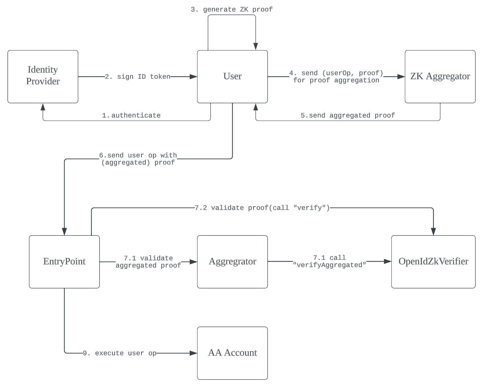

```md
---
eip: 7522
title: AA 账户的 OIDC ZK 验证器
description: 兼容 ERC-4337 的 OIDC ZK 验证器
author: Shu Dong (@dongshu2013) <shu@hexlink.io>, Yudao Yan <dean@dauth.network>, Song Z <s@misfit.id>, Kai Chen <kai@dauth.network>
discussions-to: https://ethereum-magicians.org/t/eip-7522-oidc-zk-verifier/15862
status: Draft
type: Standards Track
category: ERC
created: 2023-09-20
requires: 4337
---

## 摘要

账户抽象为智能账户开辟了新的用例，使用户能够根据其特定需求定制身份验证和恢复机制。为了释放出诸如社交登录等更便捷的验证方法的潜力，我们不可避免地需要连接智能账户和 OpenID Connect(OIDC)，鉴于其作为最广泛接受的身份验证协议的地位。在本 EIP 中，我们提出了一个兼容 [ERC-4337](./eip-4337.md) 的 OIDC ZK 验证器。用户可以将他们的 ERC-4337 账户与 OIDC 身份相关联，并授权 OIDC 验证器通过链上验证关联的 OIDC 身份来验证用户操作。

## 动机

连接 OIDC 身份和智能账户一直是一个非常有趣但也充满挑战的问题。验证 OIDC 颁发的 IdToken 很简单。 IdToken 通常采用 JWT 格式，对于常见的 JWT，它们通常由三个部分组成，一个头部部分、一个声明部分和一个签名部分。用户声明的身份应包含在声明部分中，签名部分通常是颁发者针对头部和声明部分组合的哈希的已知公钥的 RSA 签名。

解决此问题的最常见方法是利用多方计算 (MPC)。然而，MPC 解决方案的局限性是显而易见的。首先，它依赖于第三方服务来签署和聚合签名，这引入了中心化风险，例如单点故障和供应商锁定。其次，它导致了隐私问题，因为无法以加密方式保证用户的 Web2 身份与其 Web3 地址之间的分离。

所有这些问题都可以通过 ZK 验证来解决。由于 Web2 身份和 Web3 账户之间的连接将被隐藏，因此隐私将得到保证。ZK 证明生成过程是完全去中心化的，因为它可以在客户端完成，而无需涉及任何第三方服务。ZK 证明聚合也已被证明是可行的，并为大规模降低验证成本铺平了道路。

在此 EIP 中，我们提出了一种新的模型，将 OIDC ZK 验证应用于 ERC-4337 账户验证。我们还定义了验证器的最小功能集以及 ZK 证明的输入，以统一不同 ZK 实现的接口。现在，可以将 ERC-4337 账户与其 OIDC 身份相关联，并使用 OpenID ZK 验证器来验证用户操作。由于 ZK 验证的成本很高，一种常见的用例是使用验证器作为监护人来恢复账户所有者（如果所有者密钥丢失或被盗）。可以设置多个 OIDC 身份（例如，Google 账户、Facebook 账户）作为监护人，以最大程度地降低身份提供商引入的中心化风险。

## 规范

本文档中的关键词“MUST”，“MUST NOT”，“REQUIRED”，“SHALL”，“SHALL NOT”，“SHOULD”，“SHOULD NOT”，“RECOMMENDED”，“MAY” 和 “OPTIONAL” 应解释为 RFC 2119 中所述。

### 定义

**身份提供商(IDP)**: 用于验证用户身份并提供签名 ID 令牌的服务

**用户**: 用于验证用户身份并生成 ZK 证明的客户端

**ZK 聚合器**: 用于聚合来自多个用户的 ZK 证明的链下服务

**OpenIdZkVerifier**: 用于验证 ZK 证明的链上合约

**EntryPoint**，**Aggregator** 和 **AA Account** 在 ERC-4337 中定义。

### 示例流程



### 接口

```
struct OpenIdZkProofPublicInput {
    bytes32 jwtHeaderAndPayloadHash;
    bytes32 userIdHash;
    uint256 expirationTimestamp;
    bytes jwtSignature;
}

interface IOpenIdZkVerifier {
    // @notice 获取 open id 认证器的验证密钥
    function getVerificationKeyOfIdp() external view returns(bytes memory);
 
    // @notice 获取账户的 id 哈希
    function getIdHash(address account) external view returns(bytes32);

    // @notice 该函数验证证明并给出用户操作
    // @params op: ERC-4337 定义的用户操作
    //         input: 包含 JWT 信息的 zk 证明输入以进行证明
    //         proof: 为输入和 op 生成的 ZK 证明
    function verify(
        UserOp memory op,
        OpenIdZkProofPublicInput input,
        bytes memory proof
    ) external;

    // @notice 该函数验证聚合的证明，给出用户操作列表
    // @params ops: ERC-4337 定义的用户操作列表
    //         inputs: 包含 JWT 信息的 zk 证明输入列表以进行证明
    //         aggregatedProof: 为输入和操作聚合的 ZK 证明
    function verifyAggregated(
        UserOp[] memory ops,
        OpenIdZkProofPublicInput[] memory inputs,
        bytes memory aggregatedProof
    ) external;
}
```

## 合理依据

为了链上验证身份所有权，**IOpenIdVerifier** 至少需要三条信息：

1. 用户 ID，用于在 IDP 中标识用户。**getIdHash** 函数返回给定智能账户地址的用户 ID 的哈希值。可能存在链接到同一用户 ID 的多个智能账户。

2. 身份提供商用于签署 ID 令牌的密钥对的公钥。它由 **getVerificationKeyOfIdp** 函数提供。

3. 用于验证 OIDC 身份的 ZK 证明。验证由 **verify** 函数完成。除了证明之外，该函数还采用两个额外的参数：要执行的用户操作和要证明的公共输入。**verifyAggregated** 类似于 **verify** 函数，但使用输入和操作列表作为参数

**OpenIdZkProofPublicInput** 结构必须包含以下字段：

| 字段      | 描述 |
| ----------- | ----------- |
| jwtHeaderAndPayloadHash | JWT 头部加有效载荷的哈希值 |
| userIdHash   | 用户 ID 的哈希值，用户 ID 应作为声明的值存在 |
| expirationTimestamp | JWT 的到期时间，可以是 “exp” 声明的值 |
| jwtSignature | JWT 的签名 |

我们没有在结构中包含验证密钥和用户操作哈希，因为我们假设公钥可以由 **getVerificationKeyOfIdp** 函数提供，并且用户操作哈希可以从传入的原始用户操作计算得出。

## 安全注意事项

该证明必须验证 *expirationTimestamp* 以防止重放攻击。**expirationTimestamp** 应该是增量的，并且可能是 JWT 有效载荷中的 **exp** 字段。该证明必须验证用户操作以防止抢跑攻击。该证明必须验证 **userIdHash**。验证器必须验证来自每个用户操作的发送者是否通过 **getIdHash** 函数链接到用户 ID 哈希。

## 版权

版权及相关权利通过 CC0 放弃。
```