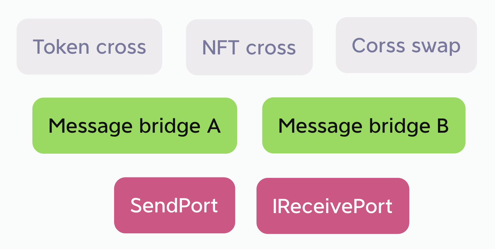
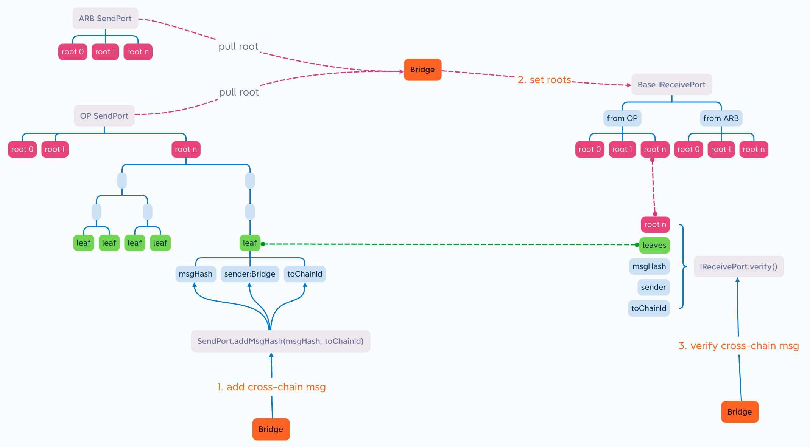
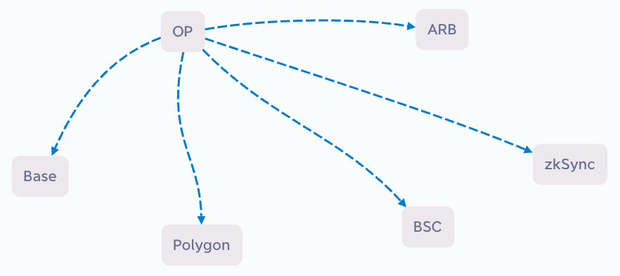
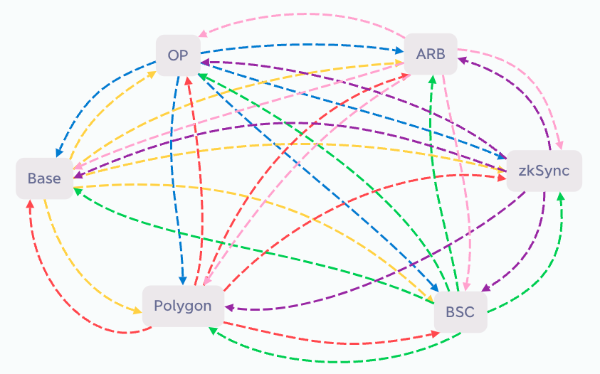
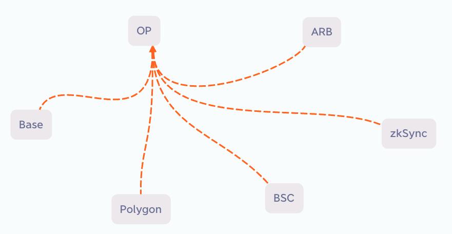

## 摘要

公共跨链端口 (PCP) 的目标是安全高效地连接各种 EVM 链。它用从多个链拉取消息的方法取代了向多个链推送消息的方法，显著减少了跨链桥的数量和 gas 成本，随着更多跨链桥项目构建在 PCP 上，整体安全性也随之提高。

## 动机

目前，L2 和 L1 之间存在官方的跨链桥，但 L2 之间没有。如果存在 10 个需要相互跨链的 L2 链，则需要 10 x 9 = 90 个跨链桥。但是，如果使用拉取机制将来自其他 9 个链的消息合并到一个同步到自身链的事务中，则只需要 10 个跨链桥。这显著减少了所需的跨链桥数量并最大限度地降低了 gas 成本。

这种实现方式，在多个跨链桥项目的参与下，将大大提高安全性。目前存在大量冗余的跨链桥建设，这无助于提高安全性。通过使用标准化的 `SendPort` 合约，如果同一跨链消息由多个冗余桥传输，则目标链的 `IReceivePort` 上的验证应产生相同的结果。这个结果经过多个跨链桥项目的确认，比依赖单个确认提供更高的安全性。本 EIP 的目的是鼓励更多跨链桥项目参与，将冗余建设转化为增强安全性。

为了吸引跨链桥项目参与，除了减少桥的数量和 gas 成本之外，`SendPort` 中使用 Hash MerkleTree 数据结构可确保添加跨链消息不会增加桥的开销。跨链桥的传输只需要一个小型根，从而进一步节省 gas。

### 使用场景

本 EIP 将跨链生态系统分为 3 层，并在基础层定义了 `SendPort` 合约和 `IReceivePort` 接口。其他层的实现留给生态系统项目参与者。



除了跨链消息传递之外，应用程序可以使用桥作为服务，例如 Token 跨链。

跨链消息传递桥可以与 Token 跨链功能结合使用，如参考实现中的代码示例所示。或者，它们可以分开。以 NFT 跨链应用程序为例，它可以重用 Token 的消息传递桥，甚至可以利用多个消息传递桥。重用多个桥进行消息验证可以显著提高安全性，而无需为跨链和验证服务产生额外成本。

## 规范

本文档中的关键词“必须 (MUST)”，“禁止 (MUST NOT)”，“必需 (REQUIRED)”，“应该 (SHALL)”，“不应该 (SHALL NOT)”，“推荐 (SHOULD)”，“不推荐 (SHOULD NOT)”，“可以 (MAY)”，和“可选 (OPTIONAL)”按照 [RFC 2119](https://datatracker.ietf.org/doc/html/rfc2119) 和 [RFC 8174](https://datatracker.ietf.org/doc/html/rfc8174) 中的描述进行解释。

跨链的本质是通知目标链关于源链上发生的事件。此过程可以分为 3 个步骤。下图说明了总体原理：



### 1.添加跨链消息

在本 EIP 下，`SendPort` 合约部署在每个链上。它负责收集该链上的跨链消息并将其打包。`SendPort` 作为一个公共、无需许可、无管理员和自动的系统运行。跨链桥运营商从 `SendPort` 检索跨链消息并将其传输到目标链以完成跨链消息传递过程。

`SendPort` 合约可以服务于多个桥，并负责收集在该链上发生的事件（即，跨链消息）并将其打包到 MerkleTree 中。例如，让我们考虑一个 Bridge 合约收到用户 USDT 存款的场景。它可以将此事件的哈希和目标链的 ID 发送到 `SendPort` 合约。`SendPort` 将此信息以及发送者地址的哈希（即，Bridge 合约的地址）作为数组中的一个叶子添加。在一段时间内（例如，1 分钟）收集到一定数量的叶子后，`SendPort` 自动将它们打包到 MerkleTree 中并开始下一个收集阶段。`SendPort` 的角色仅专注于事件收集和打包。它自主运行，无需管理。因此，无需在每个链上重复部署 `SendPort`，**推荐**一个链一个 `SendPort`。

`SendPort.addMsgHash()` 函数可以被不同的跨链桥项目或任何其他合约调用。该函数不需要许可，这意味着可能会发送不正确或欺诈性的消息。为了防止欺诈，`SendPort` 在打包过程中包含发送者的地址。这表明 `sender` 打算将信息 `msgHash` 发送到 `toChainId` 链。当此信息在目标链上解码时，它可以帮助防止欺诈活动。

### 2.拉取根 & 设置根

在完成打包新的 MerkleTree 后，包载体（通常是跨链桥项目）从多个链拉取根，并将其存储在每个链的 `IReceivePort` 合约中。

一个根包含从一个源链到多个目标链的消息。对于包载体，该根**可能**不包含相关消息，或者**可能**不包含打算用于特定目标链的消息。因此，包载体可以根据其相关性自行决定是否将根传输到特定目标链。

因此，`IReceivePort` 合约不是唯一的，而是由包载体基于 `IReceivePort` 接口实现的。使用多个包载体，将会有多个 `IReceivePort` 合约。

### 3.验证跨链消息

`IReceivePort` 合约存储每个链的根，允许它在提供完整消息时验证消息的真实性。重要的是要注意，根本身不能用于解密消息；它只能用于验证其真实性。完整消息可以从源链的 `SendPort` 合约中检索。

由于根来自相同的 `SendPort`，因此不同 `IReceivePort` 合约中的根**应该**是相同的。换句话说，如果一条消息是真实的，则**应该**能够在不同的 `IReceivePort` 合约中验证为真实。这显著提高了安全性。它类似于多重签名的原理，如果大多数 `IReceivePort` 合约验证一条消息为真实，则它可能是真的。相反，任何验证消息为假的 `IReceivePort` 合约可能表明存在潜在的黑客攻击或相应跨链桥中的故障。这种去中心化的参与模型确保系统的安全性不会受到单点故障的影响。它将冗余建设转化为安全性的提高。

关于数据完整性：

`SendPort` 保留所有根和连续索引号，而不会删除或修改。每个跨链桥的 `IReceivePort` 合约**应该**也遵循这种方法。

### `ISendPort` 接口

```solidity
pragma solidity ^0.8.0;

interface ISendPort {
    event MsgHashAdded(uint indexed packageIndex, address sender, bytes32 msgHash, uint toChainId, bytes32 leaf);

    event Packed(uint indexed packageIndex, uint indexed packTime, bytes32 root);

    struct Package {
        uint packageIndex;
        bytes32 root;
        bytes32[] leaves;
        uint createTime;
        uint packTime;
    }

    function addMsgHash(bytes32 msgHash, uint toChainId) external;

    function pack() external;

    function getPackage(uint packageIndex) external view returns (Package memory);

    function getPendingPackage() external view returns (Package memory);
}
```

令：

- `Package`：在一定时间内收集跨链消息并将其打包成一个包。
  - `packageIndex`：包的索引，从 0 开始。
  - `root`：由来自 `leaves` 的 MerkleTree 生成的根，表示打包的包。
  - `leaves`：每个叶子代表一个跨链消息，它是从 `msgHash`、`sender` 和 `toChainId` 计算出的哈希。
    - `msgHash`：消息的哈希，从外部合约传入。
    - `sender`：外部合约的地址，无需显式传入。
    - `toChainId`：目标链的链 ID，从外部合约传入。
  - `createTime`：包开始收集消息的时间戳。它也是前一个包被打包的时间戳。
  - `packTime`：包被打包的时间戳。打包后，不能再添加叶子。
- `addMsgHash()`：外部合约将跨链消息的哈希发送到 SendPort。
- `pack()`：手动触发打包过程。通常，当最后一个提交者提交其消息时会自动触发。如果等待最后一个提交者的时间太长，则可以手动触发打包过程。
- `getPackage()`：检索 SendPort 中的每个包，包括已打包和挂起的包。
- `getPendingPackage()`：检索 SendPort 中的挂起包。

### `IReceivePort` 接口

```solidity
pragma solidity ^0.8.0;

interface IReceivePort {
    event PackageReceived(uint indexed fromChainId, uint indexed packageIndex, bytes32 root);

    struct Package {
        uint fromChainId;
        uint packageIndex;
        bytes32 root;
    }

    function receivePackages(Package[] calldata packages) external;

    function getRoot(uint fromChainId, uint packageIndex) external view returns (bytes32);

    function verify(
        uint fromChainId,
        uint packageIndex,
        bytes32[] memory proof,
        bytes32 msgHash,
        address sender
    ) external view returns (bool);
}
```

令：

- `Package`：在一定时间内收集跨链消息并将其捆绑成一个包。
  - `fromChainId`：包的来源链。
  - `packageIndex`：包的索引，从 0 开始。
  - `root`：由来自 `leaves` 的 MerkleTree 生成的根，表示打包的包。
- `receivePackages()`：接收来自不同源链 SendPort 的多个根。
- `getRoot()`：从特定链检索特定根。
- `verify()`：验证源链上的消息是否由发送者发送。

## 原理

传统方法涉及使用推送方法，如下图所示：



如果存在 6 个链，则每个链都需要推送到其他 5 个链，从而需要 30 个跨链桥，如下图所示：



当 N 个链需要相互跨链通信时，所需的跨链桥数量计算为：num = N * (N - 1)。

使用拉取方法可以将来自 5 个链的批量跨链消息合并到 1 个事务中，从而显著减少所需的跨链桥数量，如下图所示：



如果每个链将来自其他 5 个链的消息拉取到其自身链上，则只需要 6 个跨链桥。对于需要跨链通信的 N 个链，所需的跨链桥数量为：num = N。

因此，拉取方法可以大大减少跨链桥的数量。

MerkleTree 数据结构可以有效地压缩跨链消息的大小。无论跨链消息的数量如何，都可以将它们压缩为单个根，表示为 byte32 值。包载体只需要传输根，从而导致低 gas 成本。

## 向后兼容性

本 EIP 不会更改共识层，因此对于整个以太坊来说，不存在向后兼容性问题。

本 EIP 不会更改其他 ERC 标准，因此对于以太坊应用程序来说，不存在向后兼容性问题。

## 参考实现

以下是跨链桥的示例合约：

### `SendPort.sol`

```solidity
pragma solidity ^0.8.0;

import "./ISendPort.sol";

contract SendPort is ISendPort {
    uint public constant PACK_INTERVAL = 6000;
    uint public constant MAX_PACKAGE_MESSAGES = 100;

    uint public pendingIndex = 0;

    mapping(uint => Package) public packages;

    constructor() {
        packages[0] = Package(0, bytes32(0), new bytes32[](0), block.timestamp, 0);
    }

    function addMsgHash(bytes32 msgHash, uint toChainId) public {
        bytes32 leaf = keccak256(
            abi.encodePacked(msgHash, msg.sender, toChainId)
        );
        Package storage pendingPackage = packages[pendingIndex];
        pendingPackage.leaves.push(leaf);

        emit MsgHashAdded(pendingPackage.packageIndex, msg.sender, msgHash, toChainId, leaf);

        if (pendingPackage.leaves.length >= MAX_PACKAGE_MESSAGES) {
            console.log("MAX_PACKAGE_MESSAGES", pendingPackage.leaves.length);
            _pack();
            return;
        }

        // console.log("block.timestamp", block.timestamp);
        if (pendingPackage.createTime + PACK_INTERVAL <= block.timestamp) {
            console.log("PACK_INTERVAL", pendingPackage.createTime, block.timestamp);
            _pack();
        }
    }

    function pack() public {
        require(packages[pendingIndex].createTime + PACK_INTERVAL <= block.timestamp, "SendPort::pack: pack interval too short");

       _pack();
    }

    function getPackage(uint packageIndex) public view returns (Package memory) {
        return packages[packageIndex];
    }

    function getPendingPackage() public view returns (Package memory) {
        return packages[pendingIndex];
    }

    function _pack() internal {
        Package storage pendingPackage = packages[pendingIndex];
        bytes32[] memory _leaves = pendingPackage.leaves;
        while (_leaves.length > 1) {
            _leaves = _computeLeaves(_leaves);
        }
        pendingPackage.root = _leaves[0];
        pendingPackage.packTime = block.timestamp;

        emit Packed(pendingPackage.packageIndex, pendingPackage.packTime, pendingPackage.root);

        pendingIndex = pendingPackage.packageIndex + 1;
        packages[pendingIndex] = Package(pendingIndex, bytes32(0), new bytes32[](0), pendingPackage.packTime, 0);
    }

    function _computeLeaves(bytes32[] memory _leaves) pure internal returns (bytes32[] memory _nextLeaves) {
        if (_leaves.length % 2 == 0) {
            _nextLeaves = new bytes32[](_leaves.length / 2);
            bytes32 computedHash;
            for (uint i = 0; i + 1 < _leaves.length; i += 2) {
                computedHash = _hashPair(_leaves[i], _leaves[i + 1]);
                _nextLeaves[i / 2] = computedHash;
            }

        } else {
            bytes32 lastLeaf = _leaves[_leaves.length - 1];
            _nextLeaves = new bytes32[]((_leaves.length / 2 + 1));
            bytes32 computedHash;
            for (uint i = 0; i + 1 < _leaves.length; i += 2) {
                computedHash = _hashPair(_leaves[i], _leaves[i + 1]);
                _nextLeaves[i / 2] = computedHash;
            }
            _nextLeaves[_nextLeaves.length - 1] = lastLeaf;
        }
    }

    function _hashPair(bytes32 a, bytes32 b) private pure returns (bytes32) {
        return a < b ? _efficientHash(a, b) : _efficientHash(b, a);
    }

    function _efficientHash(bytes32 a, bytes32 b) private pure returns (bytes32 value) {
        /// @solidity memory-safe-assembly
        assembly {
            mstore(0x00, a)
            mstore(0x20, b)
            value := keccak256(0x00, 0x40)
        }
    }
}
```

外部功能：

- `PACK_INTERVAL`：两个连续打包操作之间的最小时间间隔。如果超过此间隔，则可以启动新的打包操作。
- `MAX_PACKAGE_MESSAGES`：一旦收集到 `MAX_PACKAGE_MESSAGES` 条消息，就会立即触发打包操作。这优先于 `PACK_INTERVAL` 设置。

### `ReceivePort.sol`

```solidity
pragma solidity ^0.8.0;

import "@openzeppelin/contracts/access/Ownable.sol";
import "./IReceivePort.sol";

abstract contract ReceivePort is IReceivePort, Ownable {

    //fromChainId => packageIndex => root
    mapping(uint => mapping(uint => bytes32)) public roots;

    constructor() {}

    function receivePackages(Package[] calldata packages) public onlyOwner {
        for (uint i = 0; i < packages.length; i++) {
            Package calldata p = packages[i];
            require(roots[p.fromChainId][p.packageIndex] == bytes32(0), "ReceivePort::receivePackages: package already exist");
            roots[p.fromChainId][p.packageIndex] = p.root;

            emit PackageReceived(p.fromChainId, p.packageIndex, p.root);
        }
    }

    function getRoot(uint fromChainId, uint packageIndex) public view returns (bytes32) {
        return roots[fromChainId][packageIndex];
    }

    function verify(
        uint fromChainId,
        uint packageIndex,
        bytes32[] memory proof,
        bytes32 msgHash,
        address sender
    ) public view returns (bool) {
        bytes32 leaf = keccak256(
            abi.encodePacked(msgHash, sender, block.chainid)
        );
        return _processProof(proof, leaf) == roots[fromChainId][packageIndex];
    }

    function _processProof(bytes32[] memory proof, bytes32 leaf) internal pure returns (bytes32) {
        bytes32 computedHash = leaf;
        for (uint256 i = 0; i < proof.length; i++) {
            computedHash = _hashPair(computedHash, proof[i]);
        }
        return computedHash;
    }

    function _hashPair(bytes32 a, bytes32 b) private pure returns (bytes32) {
        return a < b ? _efficientHash(a, b) : _efficientHash(b, a);
    }

    function _efficientHash(bytes32 a, bytes32 b) private pure returns (bytes32 value) {
        /// @solidity memory-safe-assembly
        assembly {
            mstore(0x00, a)
            mstore(0x20, b)
            value := keccak256(0x00, 0x40)
        }
    }
}
```

### `BridgeExample.sol`

```solidity
pragma solidity ^0.8.0;

import "@openzeppelin/contracts/token/ERC20/IERC20.sol";
import "@openzeppelin/contracts/token/ERC20/utils/SafeERC20.sol";
import "./ISendPort.sol";
import "./ReceivePort.sol";

contract BridgeExample is ReceivePort {
    using SafeERC20 for IERC20;

    ISendPort public sendPort;

    mapping(bytes32 => bool) public usedMsgHashes;

    mapping(uint => address) public trustBridges;

    mapping(address => address) public crossPairs;

    constructor(address sendPortAddr) {
        sendPort = ISendPort(sendPortAddr);
    }

    function setTrustBridge(uint chainId, address bridge) public onlyOwner {
        trustBridges[chainId] = bridge;
    }

    function setCrossPair(address fromTokenAddr, address toTokenAddr) public onlyOwner {
        crossPairs[fromTokenAddr] = toTokenAddr;
    }

    function getLeaves(uint packageIndex, uint start, uint num) view public returns(bytes32[] memory) {
        ISendPort.Package memory p = sendPort.getPackage(packageIndex);
        bytes32[] memory result = new bytes32[](num);
        for (uint i = 0; i < p.leaves.length && i < num; i++) {
            result[i] = p.leaves[i + start];
        }
        return result;
    }

    function transferTo(
        uint toChainId,
        address fromTokenAddr,
        uint amount,
        address receiver
    ) public {
        bytes32 msgHash = keccak256(
            abi.encodePacked(toChainId, fromTokenAddr, amount, receiver)
        );
        sendPort.addMsgHash(msgHash, toChainId);

        IERC20(fromTokenAddr).safeTransferFrom(msg.sender, address(this), amount);
    }

    function transferFrom(
        uint fromChainId,
        uint packageIndex,
        bytes32[] memory proof,
        address fromTokenAddr,
        uint amount,
        address receiver
    ) public {
        bytes32 msgHash = keccak256(
            abi.encodePacked(block.chainid, fromTokenAddr, amount, receiver)
        );

        require(!usedMsgHashes[msgHash], "transferFrom: Used msgHash");

        require(
            verify(
                fromChainId,
                packageIndex,
                proof,
                msgHash,
                trustBridges[fromChainId]
            ),
            "transferFrom: verify failed"
        );

        usedMsgHashes[msgHash] = true;

        address toTokenAddr = crossPairs[fromTokenAddr];
        require(toTokenAddr != address(0), "transferFrom: fromTokenAddr is not crossPair");
        IERC20(toTokenAddr).safeTransfer(receiver, amount);
    }
}
```

## 安全注意事项

关于跨链桥之间的竞争和双重支出：

`SendPort` 负责一项任务：打包要跨链传输的消息。消息的传输和验证由每个跨链桥项目独立实施。目的是确保不同的跨链桥在源链上获得的跨链消息是一致的。因此，跨链桥之间无需竞争传输或验证根的权利。每个桥都独立运行。如果一个跨链桥的实施中存在错误，则会对自身构成风险，但不会影响其他跨链桥。

**建议**：

1. 不要让任何人调用 `IReceivePort.receivePackages()`。
2. 执行验证时，存储已验证的 `msgHash`，以避免在后续验证期间出现双重支出。
3. 不要信任 MerkleTree 中的所有发送者。

关于伪造跨链消息：

由于 `SendPort` 是一个没有使用限制的公共合约，因此任何人都可以向其发送任意跨链消息。`SendPort` 在打包过程中包含 `msg.sender`。如果黑客试图伪造跨链消息，则黑客的地址将与伪造的消息一起包含在打包中。在验证期间，可以识别黑客的地址。这就是为什么建议不要信任 MerkleTree 中的所有发送者的原因。

关于消息顺序：

虽然 `SendPort` 按时间对收到的跨链消息进行排序，但不能保证验证期间的顺序。例如，如果用户执行 10 ETH 的跨链转账，然后执行 20 USDT 的跨链转账，则在目标链上，他可以先提取 20 USDT 再提取 10 ETH，反之亦然。具体顺序取决于 `IReceivePort` 的实现。

## 版权

在 [CC0](../LICENSE.md) 下放弃版权和相关权利。
