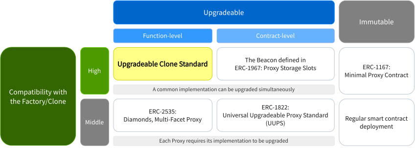
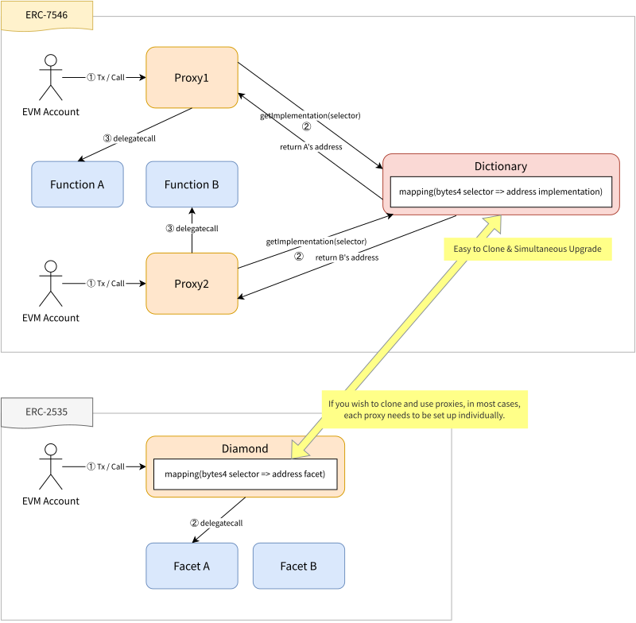
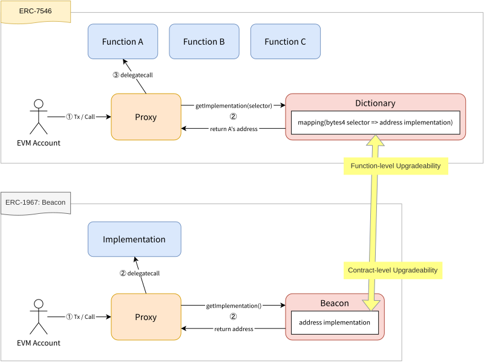

```md
---
eip: 7546
title: 可扩展合约的可升级克隆
description: 一种可升级、可克隆、可水平扩展的代理模式。
author: Shogo Ochiai (@shogochiai) <shogo.ochiai@pm.me>, Kai Hiroi (@KaiHiroi) <kai.hiroi@pm.me>
discussions-to: https://ethereum-magicians.org/t/eip-7546-upgradeable-clone/16256
status: Draft
type: Standards Track
category: ERC
created: 2023-10-25
requires: 165, 1967, 7201
---

## 摘要
对于尝试在以太坊虚拟机（EVM）上创建可克隆和可升级合约的开发者来说，一直是一个重大的挑战。虽然 [ERC-2535](./eip-2535.md) Diamonds 和其他现有的代理标准提供了部分解决方案，但一个全面的答案仍然难以捉摸。我们的提案通过引入两个主要功能来解决这一差距。

### 函数级别的可升级性
与 [ERC-2535](./eip-2535.md) 保持一致，此功能允许选择性地重定向单个函数调用的实现合约。 这种对升级的精细控制允许在每个函数的基础上进行修改。 此外，按函数分割实现合约有助于缓解合约大小上限（截至 EVM 上海版本或更早版本为 24.576kB）带来的限制。

### Factory/Clone 友好 & 同步可升级性
借鉴 [ERC-1967](./eip-1967.md) 中的 Beacon 模型，我们的方法旨在简化同时克隆和更新 Proxy 合约的过程。 这种方法旨在保持不同实例之间的一致功能，每个实例都有自己的状态。 通常，代理仅限于基本的可升级性功能或遵循 [ERC-1167](./eip-1167.md) 标准。 然而，我们的解决方案将这两种功能组合到一个紧凑的代理中。

## 动机
由于以太坊虚拟机（EVM）的固有局限性，如合约大小限制和堆栈深度，智能合约开发经常遇到障碍。 此外，解决智能合约逻辑及其编译器中的漏洞是长期存在的问题。 虽然人们希望尽量减少对受信任的第三方进行升级的依赖，但引入复杂的治理结构来管理升级可能会大大增加加密 DevOps 的工作量，从而增加开发人员可能对推进其项目产生的担忧。 这种担忧可能会限制智能合约开发中的复杂性和创新。 我们的方法旨在简化智能合约编程，使其更易于访问和更令人愉快。 它通过清楚地将 DevOps 问题与业务逻辑区分开来，从而增强代码库的清晰度，促进审计，并允许通过语言模型（LM）技术进行更有针对性的分析，这些技术是为特定基础设施和领域需求量身定制的。

### 用例
随着时间的推移，已经提出和使用了各种智能合约设计模式。 此 *可升级克隆标准（UCS）* 适用于这些现有模式可能不足以满足的场景。 为了阐明这一点，我们定义了一些关键术语：

- **合约级别可升级性**：一个 Proxy 合约对应一个实现合约，负责 Proxy 的所有逻辑。
- **函数级别可升级性**：一个 Proxy 合约对应多个实现合约，基本上每个合约负责一个特定函数。
- **Factory**：一个克隆具有通用实现的 Proxy 的合约。 在可升级性的上下文中，它允许同步升级这些克隆的 Proxy。

以下是用例：

1. 对于没有可升级性或 Factory 的基本需求，*常规智能合约部署* 就足够了。
2. 当需要 Factory 而不需要可升级性时，[ERC-1167](./eip-1167.md) 适用。
3. 对于没有 Factory 的合约级别可升级性，可以使用 [ERC-1822](./eip-1822.md)。
4. 对于具有 Factory 的合约级别可升级性，可以使用 [ERC-1967](./eip-1967.md) 中的 Beacon。
5. 对于没有 Factory 的函数级别可升级性，可以使用 [ERC-2535](./eip-2535.md)。
6. 对于具有 Factory 的函数级别可升级性，此 ***可升级克隆标准*** 是理想的选择。




## 规范
> 本文档中的关键词“必须”、“不得”、“必需”、“应该”、“不应”、“建议”、“不建议”、“可以”和“可选”应按照 RFC 2119 和 RFC 8174 中的描述进行解释。

在 EVM 中，合约账户的特征在于四个主要字段：*nonce*、*balance*、*code* 和 *storage*。 此 ERC 的架构将这些功能模块化为三种不同类型的合约，每种合约在组合起来表示单个账户时都具有特定用途：

1. **Proxy 合约**：维护合约账户的状态，如 nonce、余额和存储。 此合约将 delegatecall 到 _函数合约_，如 _字典合约_ 中注册的那样，确保状态和逻辑分离但有效集成。
2. **字典合约**：充当调度器，根据函数选择器将函数调用路由到相应的 _函数合约_。 它管理合约行为的动态方面，促进函数升级和动态寻址。 通过从 _Proxy 合约_ 中分离出此合约，它可以实现 factory/clone 友好并支持同步可升级性。
3. **函数（实现）合约**：实现函数调用的可执行逻辑。 当被 _Proxy 合约_ delegatecall 时，它会执行合约代码中定义的实际计算或逻辑。

这种架构不仅与 EVM 合约账户的核心属性保持一致，而且通过阐明账户状态、函数分派和逻辑实现，大大增强了智能合约的模块化、可升级性和可扩展性。

### Proxy 合约
此合约请求 _字典合约_ 根据其函数选择器检索关联的 _函数合约_ 地址，然后 delegatecall 到该地址。

#### 存储 & 事件
此合约应按照 [ERC-1967](./eip-1967.md) 中定义的方法，将 _字典合约_ 地址存储在存储槽 `0x267691be3525af8a813d30db0c9e2bad08f63baecf6dceb85e2cf3676cff56f4` 中，该地址通过 `bytes32(uint256(keccak256('erc7546.proxy.dictionary')) - 1)` 获得。 这确保了地址存储在安全且可预测的槽中。

对字典地址的更改应发出事件。 当发出此类事件时，它必须使用签名：
```solidity
event DictionaryUpgraded(address dictionary);
```

#### 函数
对于通过 `CALL` 或 `STATICCALL` 进行的每次调用，此合约必须使用 `getImplementation(bytes4 functionSelector)` 函数 delegatecall 到从 _字典合约_ 检索到的相应 _函数合约_ 地址。 此合约还必须处理此 delegatecall 的返回值，以确保正确执行预期功能。 此外，为避免与 _字典合约_ 中注册的函数选择器发生潜在冲突，Proxy 不应定义任何外部函数。

### 字典合约
此合约管理函数选择器到相应 _函数合约_ 地址的映射。 它使用此映射来处理来自 _Proxy 合约_ 的请求。

#### 存储 & 事件
字典必须维护函数选择器到 _函数合约_ 地址的映射。

对此映射的更改应通过事件（或日志）进行通信。

```solidity
event ImplementationUpgraded(bytes4 functionSelector, address implementation);
```

#### 函数
##### `getImplementation`
此合约必须实现此函数以返回 _函数实现合约_ 地址。

```solidity
function getImplementation(bytes4 functionSelector) external view returns(address implementation);
```

##### `setImplementation`
此合约应实现此函数以更新或将新的函数选择器及其相应的 _函数实现合约_ 地址添加到映射中。

```solidity
function setImplementation(bytes4 functionSelector, address implementation) external;
```

##### `supportsInterface`
建议此合约实现 [ERC-165](./eip-165.md) 中定义的 `supportsInterface(bytes4 interfaceID)` 函数，以指示映射中引用的合约支持哪些接口。

##### `supportsInterfaces`
建议此合约实现 `supportsInterfaces()` 以返回已注册的 interfaceID 列表。
```solidity
function supportsInterfaces() public view returns (bytes4[] memory);
```

### 函数（实现）合约
此合约充当 _Proxy 合约_ delegatecall 的逻辑实现合约，并且其地址已在 _字典合约_ 中使用函数选择器注册。

#### 存储 & 事件
此合约不应使用其存储，但应通过 delegatecall 存储到 _Proxy 合约_。

_Proxy 合约_ 与多个 _函数合约_ 共享存储布局。 例如，使用从槽 0 开始的顺序槽分配（这是默认的编译器选项）可能会导致存储冲突。

为了防止存储冲突，此合约必须正确管理存储布局。 存储管理技术的讨论多年来一直是争论的主题，无论是在 ERC 级别还是在语言级别。 但是，目前还没有明确的标准。 因此，此 ERC 不会深入讨论存储管理技术的细节。

建议选择当时被认为最合适的存储管理方法。

例如，可以根据有用的存储布局模式（例如 ***[ERC-7201](./eip-7201.md)***）来安排存储。

#### 函数
此合约必须具有在 _字典合约_ 中注册的相同函数选择器。 否则，Proxy 的 delegatecall 将失败。 因此，建议每个 _函数合约_ 都实现 ERC-165 的 `supportsInterface(bytes4 interfaceID)`，以确保它在添加到字典时正确实现正在注册的函数选择器。


## 理由
### 与 [ERC-2535](./eip-2535.md) 的比较
虽然此 ERC 和 ERC-2535 都提供 [函数级别的可升级性](#函数级别的可升级性)，但它们的方法存在一个关键区别。 ERC-2535 在 Proxy 本身内维护实现合约的映射（在 ERC-2535 中称为 Facet）。 相比之下，此 ERC 将映射存储在外部 _字典合约_ 中。 映射的这种外部化有助于此标准的另一个重要功能：[Factory/Clone 友好 & 同步可升级性](#factoryclone-friendly--同步可升级性)。 通过将映射与 Proxy 分离，这种设计允许更轻松地克隆合约及其同步升级，这在 ERC-2535 框架中并不那么简单。



### 分离字典合约和代理合约：
将字典与代理分离是由与 [Factory/Clone 友好 & 同步可升级性](#factoryclone-friendly--同步可升级性) 对齐驱动的。

为了实现这一点，_函数实现合约_ 地址的管理功能被外部化为 _字典合约_，而不是将其包含在 _Proxy 合约_ 中，这与 Beacon Proxy 方法类似。

如果该功能位于 _Proxy 合约_ 中，则每个代理都需要升级其实现。
通过外部化此功能，可以同时克隆和升级通用实现。



### 利用函数选择器和实现地址的映射：
_Proxy 合约_ 利用函数选择器到 _字典合约_ 的相应 _函数实现合约_ 地址的映射，然后 delegatecall 到返回的实现地址，这与 [函数级别的可升级性](#函数级别的可升级性) 保持一致。

通过采用这种方法，Proxy 模拟了拥有一组在 _字典合约_ 中注册的 _函数实现合约_ 的行为。 此规范与 Diamond Standard 中概述的模式非常相似。


## 参考实现
有一些参考实现和测试作为 foundry 项目。

它包括以下内容：
- 参考实现
  - [Proxy 合约](../assets/eip-7546/src/Proxy.sol)
  - [字典合约](../assets/eip-7546/src/Dictionary.sol)
- 测试
  - [Proxy 规范测试](../assets/eip-7546/test/Proxy.spec.t.sol)
  - [字典规范测试](../assets/eip-7546/test/Dictionary.spec.t.sol)
  - [UCS 用例测试](../assets/eip-7546/test/UCS.usecase.t.sol)


## 安全考虑
### 实现管理的委托
这种将每次调用的所有实现委托给 _字典合约_ 的模式依赖于以下假设：_字典合约_ 的管理员以诚实信用行事，并且不会因疏忽而引入漏洞。

你不应将你的代理与不受信任的管理员提供的 _字典合约_ 连接。 此外，建议提供切换到由不同（或可能更值得信赖）的管理员管理的另一个 _字典合约_ 的选项。

虽然可以将 _字典合约_ 地址存储在代码区域中（例如，使用 Solidity 的 immutable 或 constant），但应谨慎设计，考虑到如果 _字典合约_ 的管理员与 _Proxy 合约_ 的管理员不同，则可能会永久丢失操纵实现的能力。

### 存储冲突
如上面的 [存储部分](#存储--事件-2) 中所述。 此设计模式涉及多个 _函数实现合约_ 共享单个 _Proxy 合约_ 存储。 因此，务必注意通过使用当时被认为最合适的存储管理方法来防止存储冲突。

### 不匹配的函数选择器
_字典合约_ 根据 _Proxy 合约_ 调用的函数选择器返回 _函数实现合约_ 地址。

如果 _字典合约_ 中注册的函数选择器与 _函数实现合约_ 中实现的函数选择器不匹配，则执行将失败。 为了防止意外行为，建议检查 _函数实现合约_ 是否包含在将实现地址设置为 _字典合约_ 的过程中正在注册的函数选择器（接口）。

### CALL 和 STATICCALL 的处理
_Proxy 合约_ 主要设计为响应 `CALL` 和 `STATICCALL` 操作码。 如果对该 _Proxy 合约_ 进行 `DELEGATECALL`，它将尝试通过 `getImplementation(bytes4 functionSelector)` 函数向 _字典合约_ 请求相应的实现，并使用其自身存储中存储的 _字典合约_ 地址。 虽然如果调用合约的存储布局与预期不符，此操作可能不会导致预期结果，但它不会对 _Proxy 合约_ 本身构成直接威胁。 开发人员应注意，通过 `DELEGATECALL` 调用此 _Proxy 合约_ 可能会导致意外且可能无法正常运行的结果，从而使其成为不适合交互的方法。


## 版权
版权和相关权利通过 [CC0](../LICENSE.md) 放弃。
```