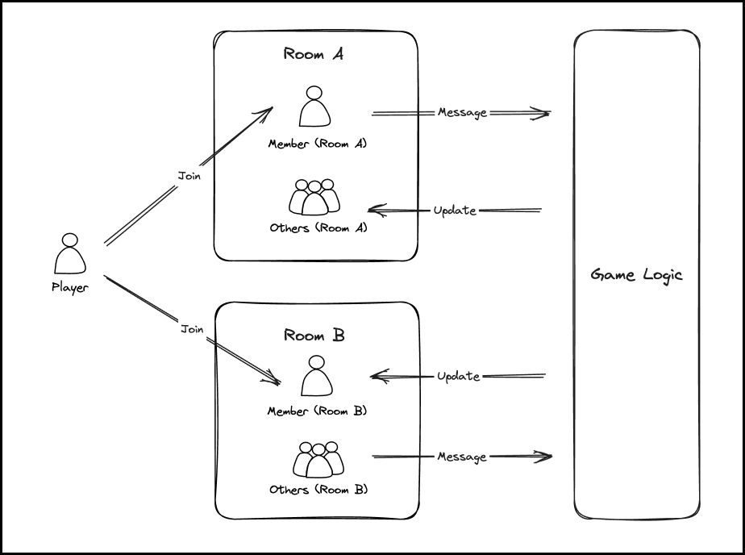

## 摘要

本提案介绍了一个多人游戏通信 (MGC) 接口，使用 `room` 来匹配和分组玩家，并使用 `message` 来处理玩家之间的动作。这允许一个智能合约处理多个玩家在链上玩游戏，防止中心化服务器影响游戏的公平性。

## 动机

常见的多人游戏通常在中心化服务器上进行。玩家无法得知服务器上是否存在伪造数据和作弊行为。游戏服务器的所有者可以随意匹配玩家、修改分数和级别，甚至关闭和暂停游戏。如果玩家的所有操作都发生在链上，那么来自链的每条消息都是玩家指令和操作的证明，从而进一步确保了游戏的公平性。多人游戏通信框架通过添加房间来垂直扩展，以处理和容纳多个玩家。 使用自定义消息编写链上游戏逻辑以进行水平扩展，允许游戏开发者使用智能合约构建多人和完全链上的游戏。
使用此标准的优势包括：
- 所有参与者都可以基于标准接口提供全面的游戏数据查询服务，并验证游戏的公平性。
- 它具有基本的分组和消息传递架构，从而降低了复杂性，并使开发人员可以专注于游戏核心逻辑的开发。
- 它具有更高的可组合性，开发人员可以将大型游戏分解为几个实现该标准的合约。
- 消息具有一对多和自定义功能，这更有利于开发人员针对不同的游戏进行扩展。
- 房间采用分层数据结构，每个成员将在每个房间中被分配一个新的 ID，以方便开发人员管理玩家的状态。

## 规范

本文档中的关键词“必须 (MUST)”，“禁止 (MUST NOT)”，“必需 (REQUIRED)”，“应该 (SHALL)”，“不应该 (SHALL NOT)”，“应当 (SHOULD)”，“不应当 (SHOULD NOT)”，“推荐 (RECOMMENDED)”，“不推荐 (NOT RECOMMENDED)”，“可以 (MAY)”和“可选 (OPTIONAL)”应按照 RFC 2119 和 RFC 8174 中描述的进行解释。

多人游戏通信的原则是使用相同的游戏逻辑来更改不同玩家组的状态。

它由两个核心部分组成：

**房间 (Room)**：玩家的容器，用于匹配和查看已连接的玩家。只有玩家加入房间后才能进行游戏。

**消息 (Message)**：玩家之间的动作，使用消息来执行游戏行为并更改房间中玩家的状态。



### 接口

#### `IMOG.sol`

```solidity
// SPDX-License-Identifier: CC0-1.0
pragma solidity >=0.8.0;

import "./Types.sol";

interface IMOG {
    /**
     * Create a new room.
     * @dev The entity MUST be assigned a unique Id.
     * @return New room id.
     */
    function createRoom() external returns (uint256);

    /**
     * Get the total number of rooms that have been created.
     * @return Total number of rooms.
     */
    function getRoomCount() external view returns (uint256);

    /**
     * Player joins room.
     * @dev The member MUST be assigned a unique Id.
     * @param _roomId is the id of the room.
     * @return Member id.
     */
    function joinRoom(uint256 _roomId) external returns (uint256);

    /**
     * Get the id of a member in a room.
     * @param _roomId is the id of the room.
     * @param _member is the address of a member.
     * @return Member id.
     */
    function getMemberId(uint256 _roomId, address _member)
        external
        view
        returns (uint256);

    /**
     * Check if a member exists in the room.
     * @param _roomId is the id of the room.
     * @param _member is the address of a member.
     * @return true exists, false does not exist.
     */
    function hasMember(uint256 _roomId, address _member)
        external
        view
        returns (bool);

    /**
     * Get all room IDs joined by a member.
     * @param _member is the address of a member.
     * @return An array of room ids.
     */
    function getRoomIds(address _member)
        external
        view
        returns (uint256[] memory);

    /**
     * Get the total number of members in a room.
     * @param _roomId is the id of the room.
     * @return Total members.
     */
    function getMemberCount(uint256 _roomId) external view returns (uint256);

    /**
     * A member sends a message to other members.
     * @dev Define your game logic here and use the content in the message to handle the member's state. The message MUST be assigned a unique Id
     * @param _roomId is the id of the room.
     * @param _to is an array of other member ids.
     * @param _message is the content of the message, encoded by abi.encode.
     * @param _messageTypes is data type array of message content.
     * @return Message id.
     */
    function sendMessage(
        uint256 _roomId,
        uint256[] memory _to,
        bytes memory _message,
        Types.Type[] memory _messageTypes
    ) external returns (uint256);

    /**
     * Get all messages received by a member in the room.
     * @param _roomId is the id of the room.
     * @param _memberId is the id of the member.
     * @return An array of message ids.
     */
    function getMessageIds(uint256 _roomId, uint256 _memberId)
        external
        view
        returns (uint256[] memory);

    /**
     * Get details of a message.
     * @param _roomId is the id of the room.
     * @param _messageId is the id of the message.
     * @return The content of the message.
     * @return Data type array of message content.
     * @return Sender id.
     * @return An array of receiver ids.
     */
    function getMessage(uint256 _roomId, uint256 _messageId)
        external
        view
        returns (
            bytes memory,
            Types.Type[] memory,
            uint256,
            uint256[] memory
        );
}


```

### 库

库 [`Types.sol`](../assets/eip-7566/Types.sol) 包含上述接口中使用的 Solidity 类型的枚举。

## 理由

### 为什么多人链上游戏是基于房间的？

由于房间是独立的，因此每个玩家在进入房间时都将被分配一个新的 ID。 新的游戏回合可以是房间，游戏任务可以是房间，游戏活动也可以是房间。

### 玩家在游戏中的状态。

游戏状态是指游戏中玩家的数据更改，而 `sendMessage` 实际上扮演着状态转换器的角色。 该提案非常灵活，您可以根据游戏逻辑在房间内部（内部）或房间外部（全局）定义一些数据。

### 如何初始化玩家数据？

您可以在 `createRoom` 或 `joinRoom` 中初始化玩家数据。

### 如何检查和处理玩家退出游戏的情况？

您可以使用 `block.timestamp` 或 `block.number` 记录成员最近的 `sendMessage` 时间。 并向 `sendMessage` 添加消息类型。 其他玩家可以使用此消息类型来抱怨某个成员已离线并惩罚该成员。

### 适当的游戏类别。

这是多人链上游戏而不是多人实时游戏标准。 游戏类别取决于您的合约部署在哪个网络上。 有些 Layer 2 网络处理区块的速度非常快，可以制作一些更实时的游戏。 通常，该网络更适合策略、交易卡牌、回合制、象棋、沙盒和结算。

## 参考实现

请参阅 [多人游戏通信示例](../assets/eip-7566/MultiplayerOnchainGame.sol)

## 安全注意事项

<!-- TODO: 需要讨论。 -->

## 版权

在 [CC0](../LICENSE.md) 下放弃版权和相关权利。