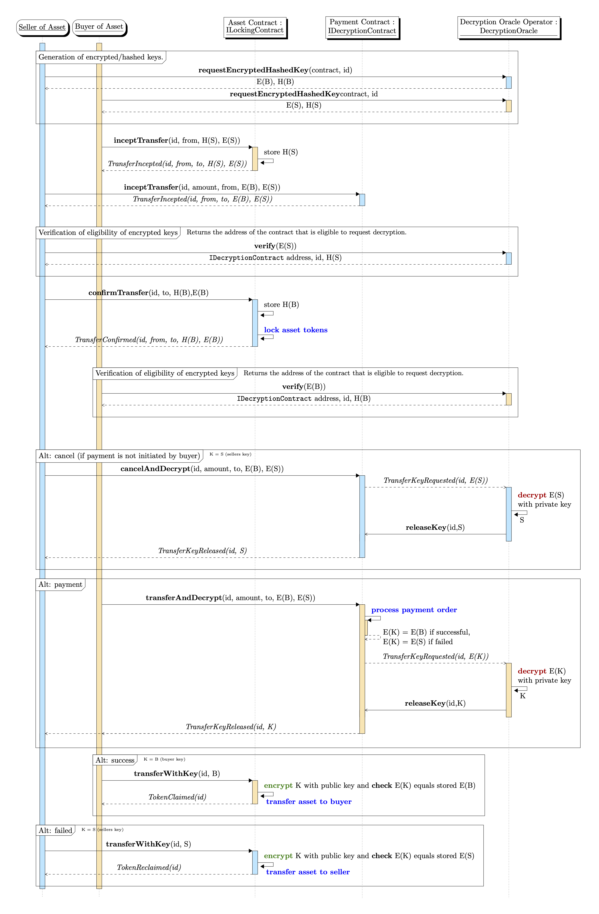
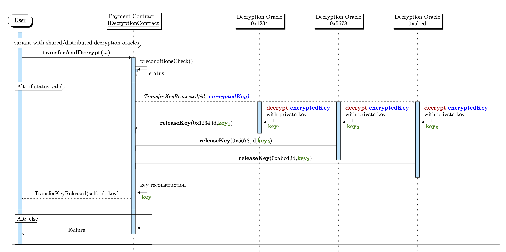

## 摘要

本提案中的接口模拟了一个函数式交易方案，以建立跨两个区块链的安全*交付与付款*，其中 a) 不需要中介，并且 b) 其中一个链可以安全地与无状态的“解密预言机”交互。这里，*交付与付款*指的是交换，例如，资产与付款；然而，这个概念是通用的，可以将一个链上的一个 Token 的转移（例如，付款）与另一个链上的另一个 Token 的成功转移（例如，资产）相关联。

该方案由两个智能合约实现，每个链上一个。一个智能合约在一个链上（例如，“资产链”）实现 `ILockingContract` 接口，另一个智能合约在另一个链上（例如，“支付链”）实现 `IDecryptionContract` 接口。实现 `ILockingContract` 的智能合约锁定其链上的一个 Token（例如，资产），直到提供一个密钥来加密为两个给定值之一。实现 `IDecryptionContract` 的智能合约（通过解密预言机）解密两个密钥之一，这取决于 Token 转移（例如，付款）的成功或失败。无状态解密预言机连接到运行 `IDecryptionContract` 的链上进行解密。

## 动机

在金融交易和分布式账本技术 (DLT) 领域，哈希链接合约 (HLC) 概念已被认为是有价值的，并且已经过彻底的研究。
该概念可能有助于解决交付与付款 (DvP) 的挑战，尤其是在资产链和支付系统（也可能是一个链）分离的情况下。
实现安全 DvP 的智能合约的一个突出应用是购买资产，其中资产在一个链（资产链）上管理，但付款在另一个链（支付链）上执行。
提出的解决方案基于 API 的交互机制，该机制桥接了所谓的资产链和相应的
支付系统之间的通信，或者需要复杂且有问题的时钟锁。[1]

在这里，我们提出了一种协议，该协议有助于以更少的开销实现安全的交付与付款，尤其是使用无状态预言机时。[2]

## 规范

### 方法

#### 在执行锁定的链上的智能合约（例如，资产链）

以下方法指定了实现锁定的智能合约的功能。有关更多信息，请参阅接口
文档 [`ILockingContract.sol`](../assets/eip-7573/contracts/ILockingContract.sol)。

##### 发起转移: `inceptTransfer`

```solidity
function inceptTransfer(uint256 id, int amount, address from, string keyHashedSeller, string memory keyEncryptedSeller) external;
```

从 Token 的购买者处调用以启动 Token 转移。发出 `TransferIncepted` 事件。
参数 `id` 是交易的标识符。参数 `from` 是卖方的地址（买方的地址是 `msg.sender`）。
参数 `keyHashedSeller` 是卖方可用于（重新）声明 Token 的密钥的哈希值。
参数 `keyEncryptedSeller` 是可以由买方用来声明 Token 的密钥的加密。
可以以这样一种方式实现该协议，即哈希方法与加密方法一致。请参阅下面的“加密”。

##### 发起转移: `confirmTransfer`

```solidity
function confirmTransfer(uint256 id, int amount, address to, string keyHashedBuyer, string memory keyEncryptedBuyer) external;
```

从 Token 的卖方处调用以确认 Token 转移。发出 `TransferConfirmed` 事件。
参数 `id` 是交易的标识符。参数 `to` 是买方的地址（卖方的地址是 `msg.sender`）。
参数 `keyHashedBuyer` 是买方可用于（重新）声明 Token 的密钥的哈希值。
参数 `keyEncryptedBuyer` 是可以由买方用来声明 Token 的密钥的加密。
可以以这样一种方式实现该协议，即哈希方法与加密方法一致。请参阅下面的“加密”。

如果交易规范，即四元组 (`id`, `amount`, `from`, `to`)，在对 `confirmTransfer` 的调用中
与之前对 `inceptTransfer` 的调用相匹配，并且余额充足，则相应的 `amount`
Token 被锁定（从 `from` 转移到智能合约），并发出 `TransferConfirmed`。

##### 转移: `transferWithKey`

```solidity
function transferWithKey(uint256 id, string memory key) external;
```

从交易 id 为 `id` 的 Token 的买方或卖方调用。

如果该方法是从买方 (`to`) 处调用的 *并且* `key` 的哈希值与 `keyHashedBuyer` 匹配，
则锁定的 Token 将转移给买方 (`to`)。 这将发出 `TokenClaimed`。

如果该方法是从卖方 (`from`) 处调用的 *并且* `key` 的哈希值与 `keyHashedSeller` 匹配，
则锁定的 Token 将（返回）转移给卖方 (`to`)。 这将发出 `TokenReclaimed`。

##### 总结

接口 `ILockingContract`:

```solidity
interface ILockingContract {
    event TransferIncepted(uint256 id, int amount, address from, address to, string keyHashedSeller, string keyEncryptedSeller);
    event TransferConfirmed(uint256 id, int amount, address from, address to, string keyHashedBuyer, string keyEncryptedBuyer);
    event TokenClaimed(uint256 id, string key);
    event TokenReclaimed(uint256 id, string key);

    function inceptTransfer(uint256 id, int amount, address from, string memory keyHashedSeller, string memory keyEncryptedSeller) external;
    function confirmTransfer(uint256 id, int amount, address to, string memory keyHashedBuyer, string memory keyEncryptedBuyer) external;
    function transferWithKey(uint256 id, string memory key) external;
}
```

#### 在另一个链上的执行条件解密的智能合约（例如，支付链）

以下方法指定了实现条件解密的智能合约的功能。有关更多信息，请参阅接口
文档 [`IDecryptionContract.sol`](../assets/eip-7573/contracts/IDecryptionContract.sol)。

##### 发起转移: `inceptTransfer`

```solidity
function inceptTransfer(uint256 id, int amount, address from, string memory keyEncryptedSuccess, string memory keyEncryptedFailure) external;
```

从金额的接收者处调用以启动付款转移。发出 `TransferIncepted`。
参数 `id` 是交易的标识符。参数 `from` 是付款发送者的地址（收款人的地址是 `msg.sender`）。
参数 `keyEncryptedSuccess` 是密钥的加密，如果调用 `transferAndDecrypt` 时转移成功，则将对其进行解密。
参数 `keyEncryptedFailure` 是密钥的加密，如果调用 `transferAndDecrypt` 时转移失败，或者如果 `cancelAndDecrypt` 成功，则将对其进行解密。

##### 转移: `transferAndDecrypt`

```solidity
function transferAndDecrypt(uint256 id, int amount, address to, string memory keyEncryptedSuccess, string memory keyEncryptedFailure) external;
```

从金额的发送者处调用以启动付款转移的完成。发出 `TransferKeyRequested` 事件，密钥取决于完成是否成功。
参数 `id` 是交易的标识符。参数 `to` 是付款接收者的地址（付款的发送者（来自）是隐式的 `msg.sender`）。
参数 `keyEncryptedSuccess` 是密钥的加密，如果转移成功，将对其进行解密。
参数 `keyEncryptedFailure` 是密钥的加密，如果转移失败，将对其进行解密。

如果值 (`id`, `amount`, `from` `to`, `keyEncryptedSuccess`, `keyEncryptedFailure`)
与之前对 `inceptTransfer` 的调用不匹配，该方法将不解密任何密钥，也不会执行付款转移。

##### 取消转移: `cancelAndDecrypt`

```solidity
function cancelAndDecrypt(uint256 id, address from, string memory keyEncryptedSuccess, string memory keyEncryptedFailure) external;
```

从金额的接收者处调用以取消付款转移（取消初始转移）。

该方法必须从之前调用 `inceptTransfer` 的调用者处调用
并使用完全相同的参数，并取消此特定转移。
如果满足这些前提条件，并且之前未发出对 `transferAndDecrypt` 的有效调用，
即如果未在 `TransferKeyRequested` 事件中发出 `keyEncryptedSuccess`，
则此方法将使用密钥 `keyEncryptedFailure` 发出 `TransferKeyRequested` 事件。

##### 释放 ILockingContract 访问密钥: `releaseKey`

```solidity
function releaseKey(uint256 id, string memory key) external;
```

从（可能外部的）解密预言机调用。

如果调用符合条件，则使用 `key` 的值发出事件 `TransferKeyReleased` 。

##### 总结

接口 `IDecryptionContract`:

```solidity
interface IDecryptionContract {
    event TransferIncepted(uint256 id, int amount, address from, address to, string keyEncryptedSuccess, string keyEncryptedFailure);
    event TransferKeyRequested(address sender, uint256 id, string encryptedKey);
    event TransferKeyReleased(address sender, uint256 id, bool success, string key);

    function inceptTransfer(uint256 id, int amount, address from, string memory keyEncryptedSuccess, string memory keyEncryptedFailure) external;
    function transferAndDecrypt(uint256 id, int amount, address to, string memory keyEncryptedSuccess, string memory keyEncryptedFailure) external;
    function cancelAndDecrypt(uint256 id, address from, string memory keyEncryptedSuccess, string memory keyEncryptedFailure) external;
    function releaseKey(uint256 id, string memory key) external;
}
```

### 加密和解密

两个智能合约的链接依赖于 `key`、`encryptedKey` 和 `hashedKey` 的使用。
只要解密预言机支持，该实现就可以自由支持多种加密方法。

使用解密预言机的公钥执行加密。
解密预言机提供了一种执行加密的方法，在这种情况下，甚至不需要知道加密方法，或者双方
都知道解密预言机的公钥，并且可以执行密钥的生成及其加密。

隐式地假设双方可以检查
字符串 `keyEncryptedBuyer` 和 `keyEncryptedSeller` 是否
采用有效格式。

为了避免在 `ILockingContract` 中进行链上加密，可以在 `ILockingContract` 上使用
更简单的哈希算法。 在这种情况下，解密预言机必须
提供一种允许获取加密密钥 *E(K)* (`keyEncrypted`) 的哈希值 *H(K)* (`keyHashed`) 的方法，而无需公开密钥 *K* (`key`)，参见 [^2]。

### 交付与付款的序列图

以下序列图总结了两个智能合约的相互作用：



## 原理

该协议力求节俭。转移与（最好是唯一的） `id` 相关联，该 `id` 可能
由交易
双方的一些额外交互生成。

`key` 和 `encryptedKey` 参数是字符串，允许灵活使用不同的加密方案。
解密/加密方案应该可以从 `encryptedKey` 的内容中推断出来。

### 确保安全的密钥解密 - 密钥格式

必须确保解密预言机仅针对符合条件的合约解密密钥。

似乎这需要我们在描述预言机中引入资格概念，这意味着某种状态。

可以通过为密钥引入文档格式和相应的资格验证协议来实现完全无状态的解密。我们建议以下元素：

- （未加密的）密钥文档包含实现 `IDecryptionContract` 的支付合约的地址。
- 解密预言机提供一个无状态函数 `verify`，该函数接收一个加密密钥并返回回调地址（将用于 `releaseKey` 调用），该地址存储在解密的密钥中，但不返回解密的密钥。
- 当向解密预言机提供加密密钥时，预言机解密文档并将解密的密钥传递给在文档解密密钥中找到的回调合约地址的 `releaseKey`。

我们建议以下 XML 模式用于解密密钥的文档：
```xml
<?xml version="1.0" encoding="utf-8"?>
<xs:schema attributeFormDefault="unqualified" elementFormDefault="qualified" targetNamespace="http://finnmath.net/erc/ILockingContract" xmlns:xs="http://www.w3.org/2001/XMLSchema">
    <xs:element name="releaseKey">
        <xs:complexType>
            <xs:simpleContent>
                <xs:extension base="xs:string">
                    <xs:attribute name="contract" type="xs:string" use="required" />
                    <xs:attribute name="transaction" type="xs:unsignedShort" use="required" />
                </xs:extension>
            </xs:simpleContent>
        </xs:complexType>
    </xs:element>
</xs:schema>
```

下面显示了相应的 XML 示例。
```xml
<?xml version="1.0" encoding="UTF-8" standalone="yes"?>
<releaseKey contract="eip155:1:0x1234567890abcdef1234567890abcdef12345678" transaction="3141" xmlns="http://finnmath.net/erc/ILockingContract">
    <!-- random data -->
    zZsnePj9ZLPkelpSKUUcg93VGNOPC2oBwX1oCcVwa+U=
</releaseKey>
```

## 安全注意事项

解密预言机不需要是单个受信任的实体。相反，可以采用阈值解密方案，其中多个预言机执行部分解密，需要它们中的法定人数来重建密钥。这通过减轻与单点故障或信任相关的风险来增强安全性。

在这种情况下，每个参与的解密预言机都将观察从发出的 `TransferKeyRequested` 事件发出的解密请求，然后使用部分解密结果调用 `releaseKey` 方法。以下序列图说明了这一点。



有关详细信息，请参见 [^2]。

## 版权

版权及相关权利通过 [CC0](../LICENSE.md) 放弃。

[^1]:
```csl-json
    {
      "type": "article",
      "id": 1,
      "author": [
        {
          "family": "La Rocca",
          "given": "Rosario"
        },
        {
          "family": "Mancini",
          "given": "Riccardo"
        },
        {
          "family": "Benedetti",
          "given": "Marco"
        },
        {
          "family": "Caruso",
          "given": "Matteo"
        },
        {
          "family": "Cossu",
          "given": "Stefano"
        },
        {
          "family": "Galano",
          "given": "Giuseppe"
        },
        {
          "family": "Mancini",
          "given": "Simone"
        },
        {
          "family": "Marcelli",
          "given": "Gabriele"
        },
        {
          "family": "Martella",
          "given": "Piero"
        },
        {
          "family": "Nardelli",
          "given": "Matteo"
        },
        {
          "family": "Oliviero",
          "given": "Ciro"
        }
      ],
      "DOI": "10.2139/ssrn.4386904",
      "title": "Integrating DLTs with Market Infrastructures: Analysis and Proof-of-Concept for Secure DvP between TIPS and DLT Platforms",
      "original-date": {
        "date-parts": [
          [2022, 7, 19]
        ]
      },
      "URL": "http://dx.doi.org/10.2139/ssrn.4386904"
    }
```

[^2]:
```csl-json
    {
      "type": "article",
      "id": 2,
      "author": [
        {
          "family": "Fries",
          "given": "Christian"
        },
        {
          "family": "Kohl-Landgraf",
          "given": "Peter"
        }
      ],
      "DOI": "10.2139/ssrn.4628811",
      "title": "A Proposal for a Lean and Functional Delivery versus Payment across two Blockchains",
      "original-date": {
        "date-parts": [
          [2023, 11, 9]
        ]
      },
      "URL": "http://dx.doi.org/10.2139/ssrn.4628811"
    }
```