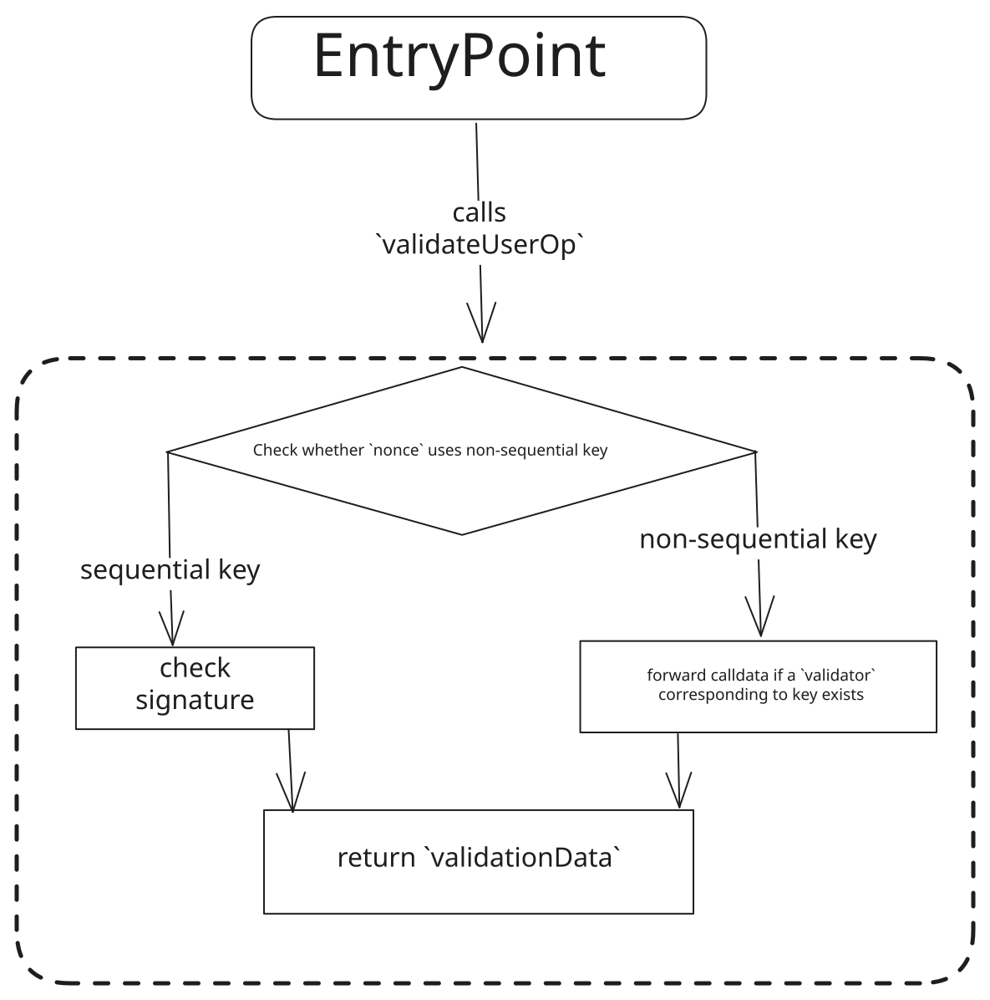

```md
---
eip: 7582
title: 具有委托验证的模块化账户
description: 使用基于 nonce 的插件扩展 ERC-4337 接口
author: Shivanshi Tyagi (@nerderlyne), Ross Campbell (@z0r0z)
discussions-to: https://ethereum-magicians.org/t/erc-7582-modular-accounts-with-delegated-validation/17640
status: Draft
type: Standards Track
category: ERC
created: 2023-12-25
requires: 4337
---

## 摘要

本提案标准化了一种方法，用于向基于现有接口（如 [ERC-4337](eip-4337.md)（例如，ERC-4337 的 `IAccount`））构建的智能合约账户添加插件和可组合逻辑。具体而言，通过正式化应用程序如何使用 ERC-4337 入口点 `NonceManager` 以及 `IEntryPoint` `UserOperationEvent` 的事件广播来处理插件交互，以及如何提取指定的验证器（在本例中，通过 `IAccount` 的 `validateUserOp` 方法），账户可以指定它们如何调用插件合约，并授予特殊的执行访问权限以进行更高级的操作。此外，这种极简主义的插件方法对开发者友好，并且通过不要求遵循 `IAccount` 接口的合约（其本身仅指定一个函数 `validateUserOp`）具有任何额外的函数，是对现有账户抽象标准的补充。

## 动机

智能合约账户（合约账户）是一种强大的工具，可以通过允许用户对其与区块链的交互进行编程来管理数字资产和执行交易。然而，在没有对安全抽象设计达成充分共识的情况下，它们的功能和灵活性通常受到限制（尽管采用 ERC-4337 是本提案的首选路径）。例如，合约账户通常无法支持社交恢复、支付计划以及传统金融系统中常见的其他功能，而没有高效且可预测的方案来委托执行和其他访问权限，以近似托管和更专业应用程序的 UX。

像 ERC-4337 这样的账户抽象标准已经简化了许多核心合约账户问题，例如交易费用支付，但为了充分利用这些系统的表达能力来实现用户意图，将合约账户访问和验证委托给其他合约的极简主义方法将有助于他们的 UX，并扩展围绕入口点进行操作的好处。

虽然 ERC-4337 中的 `IAccount` 接口没有指定向合约账户添加自定义验证逻辑以支持插件和类似扩展的方法，而无需升级或迁移，但它仍然包含足够的信息来高效地执行此操作。因此，本提案提供了一种方法，用于向基于现有接口构建的、具有单例 nonce 跟踪的智能合约账户添加插件和其他可组合的验证逻辑，例如 ERC-4337 的 `IAccount` 和 `NonceManager`。

## 规范

本文档中的关键词“必须（MUST）”、“禁止（MUST NOT）”、“需要（REQUIRED）”、“应当（SHALL）”、“不应当（SHALL NOT）”、“应该（SHOULD）”、“不应该（SHOULD NOT）”、“推荐（RECOMMENDED）”、“不推荐（NOT RECOMMENDED）”、“可以（MAY）”和“可选（OPTIONAL）”应按照 RFC 2119 和 RFC 8174 中描述的方式进行解释。



我们利用 ERC-4337 中半抽象 nonce 中的 key 作为指向 `validator` 标识符的指针。如果使用非顺序 key（`>type(uint64).max`）作为 ERC-4337 入口点 `UserOperation` (userOp) `nonce`，则 `sender` 合约账户中的 `validateUserOp` 函数必须提取验证器标识符，这可以是地址本身，也可以是指向存储中验证器地址的指针。一旦提取了验证器合约地址，提议的合约账户（以下简称 MADV 账户）必须将 userOp calldata 转发给验证器。此 calldata 应该是整个 userOp。作为对这种委托验证的响应，验证器合约必须返回 ERC-4337 `validationData`，并且 MADV `sender` 账户必须将其作为 `validationData` 返回给入口点。

在上述所有验证步骤中，验证器合约必须遵守 ERC-4337 入口点约定。请注意，虽然验证器 key 数据可能包含在 `UserOperation` 中的其他位置以实现类似的合约账户模块化，例如，通过将此数据打包到 `signature` 字段中，但本提案选择重新利用 `nonce` 作为此指针，以最大限度地降低 calldata 成本，并受益于 EntryPoint 的 `getNonce` 记账，以及 `UserOperationEvent` 中用户插件交互的可发现性，该事件公开了 `nonce`，但不公开其他 userOp 数据。

### ERC-4337 引用：

`PackedUserOperation` 接口

```solidity
/**
 * User Operation struct
 * @param sender                - The sender account of this request.
 *                                 请求的发送者账户。
 * @param nonce                 - Unique value the sender uses to verify it is not a replay. In MADV, the validator identifier is encoded in the high 192 bit (`key`) of the nonce value
 *                                 发送者用于验证它不是重放的唯一值。在 MADV 中，验证器标识符编码在 nonce 值的较高 192 位（`key`）中
 * @param initCode              - If set, the account contract will be created by this constructor/
 *                                 如果设置，账户合约将由此构造函数创建/
 * @param callData              - The method call to execute on this account.
 *                                 在此账户上执行的方法调用。
 * @param accountGasLimits      - Packed gas limits for validateUserOp and gas limit passed to the callData method call.
 *                                 validateUserOp 的打包 gas 限制和传递给 callData 方法调用的 gas 限制。
 * @param preVerificationGas    - Gas not calculated by the handleOps method, but added to the gas paid.
 *                                 不由 handleOps 方法计算的气体，但添加到支付的气体中。
 *                                  Covers batch overhead.
 *                                 涵盖批量开销。
 * @param gasFees               - packed gas fields maxPriorityFeePerGas and maxFeePerGas - Same as EIP-1559 gas parameters.
 *                                 打包的 gas 字段 maxPriorityFeePerGas 和 maxFeePerGas - 与 EIP-1559 gas 参数相同。
 * @param paymasterAndData      - If set, this field holds the paymaster address, verification gas limit, postOp gas limit and paymaster-specific extra data
 *                                 如果设置，此字段保存支付者的地址、验证 gas 限制、postOp gas 限制和特定于支付者的额外数据
 *                                  The paymaster will pay for the transaction instead of the sender.
 *                                 支付者将支付交易费用而不是发送者。
 * @param signature             - Sender-verified signature over the entire request, the EntryPoint address and the chain ID.
 *                                 发送者验证的整个请求、EntryPoint 地址和链 ID 的签名。
 */
struct PackedUserOperation {
    address sender;
    uint256 nonce;
    bytes initCode;
    bytes callData;
    bytes32 accountGasLimits;
    uint256 preVerificationGas;
    bytes32 gasFees;
    bytes paymasterAndData;
    bytes signature;
}
```

`IAccount` 接口

```solidity
interface IAccount {
    /**
     * Validate user's signature and nonce
     *  验证用户的签名和 nonce
     * the entryPoint will make the call to the recipient only if this validation call returns successfully.
     *  只有此验证调用成功返回，entryPoint 才会调用接收者。
     * signature failure should be reported by returning SIG_VALIDATION_FAILED (1).
     *  签名失败应通过返回 SIG_VALIDATION_FAILED (1) 来报告。
     * This allows making a "simulation call" without a valid signature
     *  这允许在没有有效签名的情况下进行“模拟调用”
     * Other failures (e.g. nonce mismatch, or invalid signature format) should still revert to signal failure.
     *  其他失败（例如，nonce 不匹配或无效的签名格式）仍应恢复以表示失败。
     *
     * @dev Must validate caller is the entryPoint.
     *       必须验证调用者是 entryPoint。
     *      Must validate the signature and nonce
     *       必须验证签名和 nonce
     * @param userOp              - The operation that is about to be executed.
     *                                 即将执行的操作。
     * @param userOpHash          - Hash of the user's request data. can be used as the basis for signature.
     *                                 用户请求数据的哈希值。可以用作签名的基础。
     * @param missingAccountFunds - Missing funds on the account's deposit in the entrypoint.
     *                                 入口点中帐户存款中缺少的资金。
     *                              This is the minimum amount to transfer to the sender(entryPoint) to be
     *                                这是转移到发送者（entryPoint）的最小金额
     *                              able to make the call. The excess is left as a deposit in the entrypoint
     *                               能够进行调用。多余的部分作为存款留在入口点中
     *                              for future calls. Can be withdrawn anytime using "entryPoint.withdrawTo()".
     *                               用于未来的调用。可以使用“entryPoint.withdrawTo()”随时提取。
     *                              In case there is a paymaster in the request (or the current deposit is high
     *                               如果请求中有支付者（或当前存款很高）
     *                              enough), this value will be zero.
     *                               够高)，此值将为零。
     * @return validationData       - Packaged ValidationData structure. use `_packValidationData` and
     *                                 打包的 ValidationData 结构。使用 `_packValidationData` 和
     *                              `_unpackValidationData` to encode and decode.
     *                               `_unpackValidationData` 进行编码和解码。
     *                              <20-byte> sigAuthorizer - 0 for valid signature, 1 to mark signature failure,
     *                               <20 字节> sigAuthorizer - 0 表示有效签名，1 表示标记签名失败，
     *                                 otherwise, an address of an "authorizer" contract.
     *                                 否则，表示“授权者”合约的地址。
     *                              <6-byte> validUntil - Last timestamp this operation is valid. 0 for "indefinite"
     *                               <6 字节> validUntil - 此操作有效的最后一个时间戳。0 表示“无限期”
     *                              <6-byte> validAfter - First timestamp this operation is valid
     *                               <6 字节> validAfter - 此操作有效的第一个时间戳
     *                                                    If an account doesn't use time-range, it is enough to
     *                                                     如果帐户不使用时间范围，则足以
     *                                                    return SIG_VALIDATION_FAILED value (1) for signature failure.
     *                                                     返回 SIG_VALIDATION_FAILED 值 (1) 以表示签名失败。
     *                              Note that the validation code cannot use block.timestamp (or block.number) directly.
     *                               请注意，验证代码不能直接使用 block.timestamp（或 block.number）。
     */
    function validateUserOp(
        PackedUserOperation calldata userOp,
        bytes32 userOpHash,
        uint256 missingAccountFunds
    ) external returns (uint256 validationData);
}
```

`NonceManager` 接口

```solidity
 /**
     * Return the next nonce for this sender.
     *  返回此发送者的下一个 nonce。
     * Within a given key, the nonce values are sequenced (starting with zero, and incremented by one on each userop)
     *  在给定的 key 中，nonce 值是按顺序排列的（从零开始，并在每个 userop 上递增 1）
     * But UserOp with different keys can come with arbitrary order.
     *  但是具有不同 key 的 UserOp 可以以任意顺序出现。
     *
     * @param sender the account address
     *   发送者账户地址
     * @param key the high 192 bit of the nonce, in MADV the validator identifier is encoded here 
     *   nonce 的高 192 位，在 MADV 中，验证器标识符在此处编码
     * @return nonce a full nonce to pass for next UserOp with this sender.
     *   nonce，一个完整的 nonce，用于传递给此发送者的下一个 UserOp。
     */
    function getNonce(address sender, uint192 key)
    external view returns (uint256 nonce);
```

`UserOperationEvent`

```solidity
/***
     * An event emitted after each successful request
     *  每次成功请求后发出的事件
     * @param userOpHash - unique identifier for the request (hash its entire content, except signature).
     *  userOpHash - 请求的唯一标识符（对其整个内容进行哈希处理，除了签名）。
     * @param sender - the account that generates this request.
     *  sender - 生成此请求的帐户。
     * @param paymaster - if non-null, the paymaster that pays for this request.
     *  paymaster - 如果非空，则是为此请求付费的支付者。
     * @param nonce - the nonce value from the request.
     *  nonce - 来自请求的 nonce 值。
     * @param success - true if the sender transaction succeeded, false if reverted.
     *  success - 如果发送者交易成功，则为 true，如果回滚，则为 false。
     * @param actualGasCost - actual amount paid (by account or paymaster) for this UserOperation.
     *  actualGasCost - 为此 UserOperation 支付的实际金额（由帐户或支付者支付）。
     * @param actualGasUsed - total gas used by this UserOperation (including preVerification, creation, validation and execution).
     *  actualGasUsed - 此 UserOperation 使用的总 gas（包括 preVerification、创建、验证和执行）。
     */
    event UserOperationEvent(bytes32 indexed userOpHash, address indexed sender, address indexed paymaster, uint256 nonce, bool success, uint256 actualGasCost, uint256 actualGasUsed);
```

## 原理

本提案旨在成为 ERC-4337 的极简主义扩展，允许添加额外的功能，而无需更改现有接口。保持提案的占用空间很小。

此外，通过将 nonce 字段重新用于验证器标识符，我们最大限度地降低了 calldata 成本并利用了现有的 `getNonce` 记账。`UserOperationEvent` 发出 nonce，可用于跟踪验证器调用，而无需额外的事件。还考虑了其他选项，例如将验证器标识符打包到 `signature` 字段中，但由于可能与其他签名方案冲突以及验证器调用的不透明性增加而被拒绝。

本提案允许 MADV 账户指定其自己的从 `nonce` 中提取验证器地址的方法。这为账户开发者提供了灵活性，并支持“just in time”验证器以及更可预测的插件重用存储模式。

要求很简单，就是使用 `nonce` 对标识符进行编码，并将提取的验证器合约中的 `validationData` 返回给 `EntryPoint`，这与 ERC-4337 `validateUserOp` 函数的要求一致。

## 向后兼容性

未发现向后兼容性问题。

## 参考实现

有关如何实现此提案的简单示例，请参见 [MADV 参考实现](../assets/eip-7582/MADVAccount.sol)。

## 安全考虑

由于本提案没有引入任何新函数，并且将验证器提取方法和批准逻辑的实现留给开发者，因此安全问题的范围有意保持较小。然而，特定的验证器用例需要进一步讨论和考虑整个 ERC-4337 验证流程及其底层安全性。

## 版权

通过 [CC0](../LICENSE.md) 放弃版权和相关权利。
```