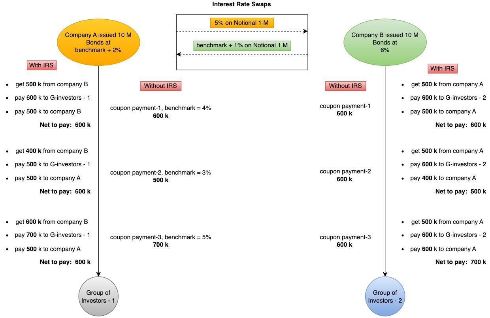

## 摘要

本提案介绍了一个用于链上利率互换的标准化框架。该提案的标准旨在促进各方之间无缝交换固定和浮动利率现金流，为去中心化金融（DeFi）应用提供基础。

## 动机

利率互换（IRS）是指一种衍生品合约，其中双方共同同意根据指定的名义金额交换一系列未来的利息支付。这种金融工具是用于对冲利率波动的战略工具。该机制需要利用基准指数来促进浮动利率和固定利率之间的交换。尽管它被广泛使用，但目前缺乏一个标准化框架，能够在区块链平台上表示 IRS 合约。

本提案通过建立一种一致且透明的方法来解决这一差距，以便在区块链环境中表示 IRS 合约。通过这样做，它将提高分布式账本技术上利率互换交易的互操作性、安全性和效率。

## 规范

本文档中的关键词“必须”、“禁止”、“需要”、“应”、“不应”、“应该”、“不应该”、“推荐”、“不推荐”、“可以”和“可选”应按照 RFC 2119 和 RFC 8174 中的描述进行解释。

### 示例流程



每个符合此 ERC 的合约都必须实现以下接口。该合约必须继承 [ERC-20](./eip-20.md) 以对互换现金流进行代币化。

```solidity
pragma solidity ^0.8.0;

/**
* @title ERC-7586 利率互换
*/
interface IERC7586 /** is ERC20, ERC165 */ {
    // events
    /**
    * @notice 必须在利率互换时发出
    * @param _amount 要转移的利息差额
    * @param _account 接收利息差额的帐户。必须是 `payer` 或 `receiver` 之一
    */
    event Swap(uint256 _amount, address _account);

    /**
    * @notice 必须在互换合约终止时发出
    * @param _payer 互换付款人
    * @param _receiver 互换接收人
    */
    event TerminateSwap(address indexed _payer, address indexed _receiver);

    // functions
    /**
    *  @notice 返回 IRS `payer`（付款人）帐户地址。同意支付固定利息的一方
    */
    function fixedRatePayer() external view returns(address);

    /**
    *  @notice 返回 IRS `receiver`（接收人）帐户地址。同意支付浮动利息的一方
    */
    function floatingRatePayer() external view returns(address);

    /**
    * @notice 返回互换利率和利差使用的小数位数 - 例如，`4` 表示将利率除以 `10000`
    *         要以基点单位表示利率，小数必须等于 `2`。这意味着利率必须除以 `100`
    *         1 个基点 = 0.01% = 0.0001
    *         例如：如果利率 = 2.5%，则 swapRate() => 250 `基点`
    */
    function ratesDecimals() external view returns(uint8);

    /**
    *  @notice 返回固定利率。所有利率必须乘以 10^(ratesDecimals)
    */
    function swapRate() external view returns(uint256);

    /**
    *  @notice 返回浮动利率的利差，即浮动利率的固定部分。所有利率必须乘以 10^(ratesDecimals)
    *          floatingRate = benchmark + spread （浮动利率=基准利率+利差）
    */
    function spread() external view returns(uint256);

    /**
    * @notice 返回计息基础
    *         例如，0 可以表示实际/实际，1 可以表示实际/360，以此类推
    */
    function dayCountBasis() external view returns(uint8);

    /**
    *  @notice 返回名义金额所使用的货币的合约地址（例如：USDC 合约地址）。
    *          如果名义金额以法定货币（如美元）表示，则返回零地址
    */
    function notionalCurrency() external view returns(address);

    /**
    * @notice 返回互换 IRS 时要转移的资产的可接受合约地址数组
    *         两个交易对手可能希望以不同的货币获得付款。
    *         例如：如果付款人想要以 USDC 接收付款，而接收人想要以 DAI 接收付款，则该函数应返回 [USDC, DAI] 或 [DAI, USDC]
    */
    function paymentAssets() external view returns(address[] memory);

    /**
    *  @notice 返回互换 IRS 时要转移的资产单位的名义金额。此金额用作计算利息支付的基础，并且可能不会被交换
    *          示例：如果双方同意以 USDC 互换利率，则名义金额可能等于 1,000,000 USDC
    */
    function notionalAmount() external view returns(uint256);

    /**
    *  @notice 返回一年内必须实现付款的次数
    */
    function paymentFrequency() external view returns(uint256);

    /**
    *  @notice 返回交换固定利息支付的具体日期数组。每个日期必须是一个 Unix 时间戳，如 block.timestamp 返回的时间戳
    *          此函数返回的数组的长度必须等于应实现的总互换次数
    *
    *  OPTIONAL（可选）
    */
    function fixPaymentDates() external view returns(uint256[] memory);

    /**
    *  @notice 返回交换浮动利息支付的具体日期数组。每个日期必须是一个 Unix 时间戳，如 block.timestamp 返回的时间戳
    *          此函数返回的数组的长度必须等于应实现的总互换次数
    *
    *  OPTIONAL（可选）
    */
    function floatingPaymentDates() external view returns(uint256[] memory);

    /**
    *  @notice 返回互换合约的开始日期。这是一个 Unix 时间戳，如 block.timestamp 返回的
    */
    function startingDate() external view returns(uint256);

    /**
    *  @notice 返回互换合约的到期日。这是一个 Unix 时间戳，如 block.timestamp 返回的
    */
    function maturityDate() external view returns(uint256);

    /**
    *  @notice 返回基准利率（参考利率）。所有利率必须乘以 10^(ratesDecimals)
    *          示例：以下利率之一的值：CF BIRC、EURIBOR、HIBOR、SHIBOR、SOFR、SONIA、TONAR 等。
    *                   或者手动设置
    */
    function benchmark() external view returns(uint256);

    /**
    *  @notice 返回可接受的参考利率（基准利率）的预言机合约地址，或者当双方同意手动设置基准利率时，返回零地址。
    *          此合约应该用于获取实时基准利率
    *          示例：`CF BIRC` 的合约地址
    *
    *  OPTIONAL（可选）。双方可以同意手动设置基准利率
    */
    function oracleContractsForBenchmark() external view returns(address);

    /**
    *  @notice 进行互换计算并将付款转移给交易对手
    */
    function swap() external returns(bool);

    /**
    *  @notice 在互换合约到期日之前终止该合约。必须由 `payer` 或 `receiver` 调用。
    */
    function terminateSwap() external;
}
```
### 互换现金流的代币化

与 IRS 相关的利息支付必须通过向各方发行数字 [ERC-20](./eip-20) 代币，根据互换条款进行代币化。每个代币应该代表特定的利息支付。每次发生互换（调用 `swap` 函数）时，每个方必须销毁一个代币。

## 原理

此标准允许参与 IRS 合约的各方定义基本参数，如名义金额、利率、支付频率和支付日期。这种灵活性适应了各种各样的金融协议，满足了不同参与者的独特需求。

为了适应广泛的用例，该标准引入了可选功能，如支付日期和手动基准设置。这允许各方根据特定要求定制合约，同时保持一组核心功能以实现基本功能。

为了确保实时准确的基准利率，该标准与预言机集成。各方可以选择使用预言机来获取基准利率，从而提高利率计算的可靠性和准确性。

## 向后兼容性

此标准向后兼容 ERC-20。

## 参考实现

完整的参考实现可以在[此处](../assets/eip-7586/ERC7586.sol)找到。

此参考实现是实现更高级互换类型的基础。

## 安全考虑

必须彻底评估各种类型的安全考虑

* 利率风险：这与利率波动可能产生的影响有关。
* 信用风险：存在一方或双方可能拖欠其各自责任的可能性。
* ERC-20 风险：必须考虑 ERC-20 标准中概述的所有安全方面。

双方必须在实施该标准之前确认他们了解这些安全风险。

## 版权

版权和相关权利通过 [CC0](../LICENSE.md) 放弃。