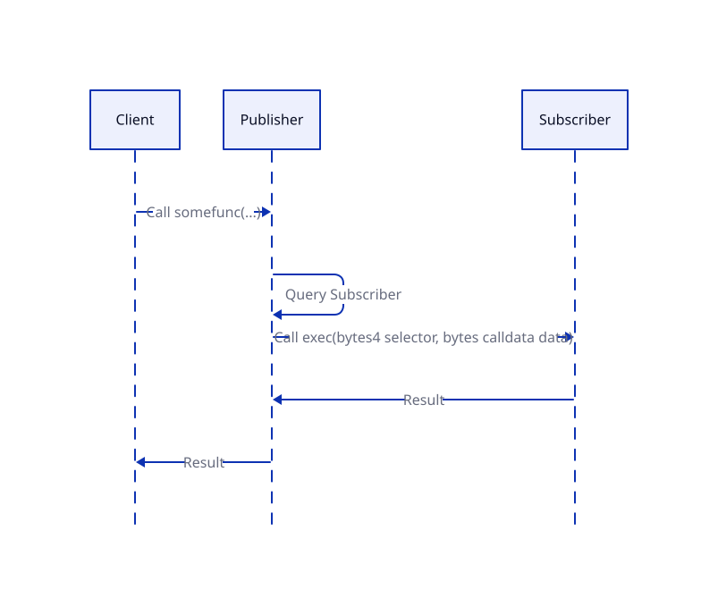

## 摘要
本 ERC 提出了一种用于发送数据的基于推送的机制，允许发布者合约在调用期间自动将某些数据推送到订阅者合约。具体实现依赖于两个接口：一个用于发布者合约推送数据，另一个用于订阅者合约接收数据。当发布者合约被调用时，它会检查被调用的函数是否与订阅者地址相对应。如果对应，则发布者合约将数据推送到订阅者合约。

## 动机
目前，许多 keeper 依赖链下数据或单独的数据收集过程来监控链上的事件。本提案旨在建立一个系统，其中发布者合约可以原子地推送数据，以告知订阅者合约有关更新。发布者和订阅者之间的直接链上交互允许系统更具信任性和效率。

本提案将在各种应用中提供显著优势，例如实现 DeFi 的无限和无需许可的扩展，以及增强 DAO 治理等。

### 借贷协议

发布者合约的一个例子可以是预言机，它可以通过启动对订阅者协议的调用来自动推送价格更新。借贷协议作为订阅者，可以根据收到的价格自动清算借贷头寸。

### 自动支付

服务提供商可以使用智能合约作为发布者合约，这样，当用户调用此合约时，它可以将信息推送到订阅者合约，例如，用户的钱包，如遵循 [ERC-6551](./eip-6551.md) 的 NFT 绑定账户或其他 智能合约钱包。因此，用户的智能合约钱包可以自动执行相应的支付操作。与传统的需要 `approve` 的方法相比，此解决方案允许在实现中实现更复杂的逻辑，例如限制支付等。

### 无需转移资产的 PoS

对于某些质押场景，尤其是 NFT 质押，PoS 合约可以设置为订阅者，而 NFT 合约可以设置为发布者。因此，可以通过合约交互实现质押，允许用户在无需转移资产的情况下赚取质押奖励。

当发生 NFT 的 `transfer` 等操作时，NFT 合约可以将此信息推送到 PoS 合约，然后 PoS 合约可以执行取消质押或其他功能。

### DAO 投票

DAO 治理合约作为发布者可以在投票完成后自动触发推送机制，调用相关的订阅者合约以直接实施投票结果，例如将资金注入到某个账户或池中。

## 规范

本文档中的关键词“MUST”、“MUST NOT”、“REQUIRED”、“SHALL”、“SHALL NOT”、“SHOULD”、“SHOULD NOT”、“RECOMMENDED”、“MAY”和“OPTIONAL”应按照 RFC 2119 中的描述进行解释。

### 概述

推送机制可以分为以下四个步骤：

1. 调用发布者合约。
2. 发布者合约从被调用函数的 `selector` 中查询订阅者列表。订阅者合约可以将选定的数据放入 `inbox`。
3. 发布者合约通过调用订阅者合约的 `exec` 函数来推送 `selector` 和数据。
4. 订阅者合约根据推送的 `selector` 和数据执行，或者它可以根据需要从发布者合约的 inbox 函数请求信息。

在第二步中，可以在发布者合约中配置被调用函数与相应订阅者之间的关系。提出了两种配置方案：

1. 无条件推送：任何对配置的 `selector` 的调用都会触发推送
2. 条件推送：只有对配置的 `selector` 的有条件调用才会根据配置触发推送。

允许为单个 `selector` 配置多个不同类型的订阅者合约。发布者合约将调用每个订阅者合约的 `exec` 函数来推送请求。

当从 `selector` 取消订阅合约时，发布者合约必须检查订阅者合约的 `isLocked` 函数是否返回 `true`。

发布者合约可以选择使用 `inbox` 机制来存储数据。

在第四步中，订阅者合约应在 `exec` 函数的实现中处理所有可能的 `selector` 请求和数据。在某些情况下，`exec` 可以调用发布者合约的 `inbox` 函数以获取完整的推送数据。



### 合约接口

如上所述，有两种类型的实现：无条件推送和条件推送。为了实现无条件推送，发布者合约应实现以下接口：

```
interface IPushForce {
    event ForceApprove(bytes4 indexed selector, address indexed target);
    event ForceCancel(bytes4 indexed selector, address indexed target);
    event RenounceForceApprove();
    event RenounceForceCancel();

    error MustRenounce();
    error ForceApproveRenounced();
    error ForceCancelRenounced();

    function isForceApproved(bytes4 selector, address target) external returns (bool);
    function forceApprove(bytes4 selector, address target) external;
    function forceCancel(bytes4 selector, address target) external;
    function isRenounceForceApprove() external returns (bool);
    function isRenounceForceCancel() external returns (bool);
    function renounceForceApprove(bytes memory) external;
    function renounceForceCancel(bytes memory) external;
}
```

`isForceApproved` 用于查询 `selector` 是否已经无条件绑定到地址为 `target` 的订阅者合约。
`forceApprove` 用于将 `selector` 绑定到订阅者合约 `target`。`forceCancel` 用于取消 `selector` 和 `target` 之间的绑定关系，其中 `target` 的 `isLocked` 函数返回 `true` 是必需的。

`renounceForceApprove` 用于放弃 `forceApprove` 权限。在调用 `renounceForceApprove` 函数后，不能再调用 `forceApprove`。类似地，`renounceForceCancel` 用于放弃 `forceCancel` 权限。在调用 `renounceForceCancel` 函数后，不能再调用 `forceCancel`。

为了实现条件推送，发布者合约应实现以下接口：

```
interface IPushFree {
    event Approve(bytes4 indexed selector, address indexed target, bytes data);
    event Cancel(bytes4 indexed selector, address indexed target, bytes data);

    function inbox(bytes4 selector) external returns (bytes memory);
    function isApproved(bytes4 selector, address target, bytes calldata data) external returns (bool);
    function approve(bytes4 selector, address target, bytes calldata data) external;
    function cancel(bytes4 selector, address target, bytes calldata data) external;
}
```

`isApproved`、`approve` 和 `cancel` 具有与 `IPushForce` 中的相应函数类似的功能。但是，此处引入了一个额外的 `data` 参数，用于检查是否需要推送。
此处的 `inbox` 用于存储数据，以防从订阅者合约调用。

发布者合约应实现 `_push(bytes4 selector, bytes calldata data)` 函数，该函数充当钩子。发布者合约中任何需要实现推送机制的函数都必须调用此内部函数。该函数必须包括基于 `selector` 和 `data` 查询无条件和有条件订阅合约，然后调用相应的订阅者的 `exec` 函数。

订阅者合约需要实现以下接口：

```solidity
interface IExec {
    function isLocked(bytes4 selector, bytes calldata data) external returns (bool);
    function exec(bytes4 selector, bytes calldata data) external;
}
```

`exec` 用于接收来自发布者合约的请求并进一步执行。
`isLocked` 用于检查订阅者合约是否可以基于 `selector` 和 `data` 取消订阅发布者合约的状态。它在收到取消订阅请求时触发。

## 原理

### 无条件和有条件配置

当发送合约被调用时，可能会触发推送，要求调用者支付由此产生的 gas 费用。
在某些情况下，有必要进行无条件推送，例如将价格变动推送到借贷协议。虽然，有条件推送将减少不必要的 gas 消耗。

### 取消订阅前检查 `isLocked`

在 `forceCancel` 或 `cancel` 之前，发布者合约必须调用订阅者合约的 `isLocked` 函数，以避免单方面取消订阅。订阅者合约可能对发布者合约具有重要的逻辑依赖性，因此取消订阅可能导致订阅者合约内部出现严重问题。因此，订阅者合约应充分考虑后实现 `isLocked` 函数。

### `inbox` 机制

在某些情况下，发布者合约可能只将必要的带有 `selector` 的数据推送到订阅者合约，而完整的数据可能存储在 `inbox` 中。在收到来自发布者合约的推送后，订阅者合约可以选择调用 `inbox`。
`inbox` 机制简化了推送信息，同时仍确保了完整数据的可用性，从而减少了 gas 消耗。

### 使用函数选择器作为参数

使用函数选择器来检索订阅者合约的地址可以实现更详细的配置。
对于订阅者合约，根据推送信息获取请求源的特定函数可以更准确地处理推送信息。

### 放弃安全增强

`forceApprove` 和 `forceCancel` 权限都可以使用各自的放弃函数来放弃。当 `renounceForceApprove` 和 `renounceForceCancel` 都被调用时，注册的推送目标将无法再更改，从而大大提高了安全性。

## 参考实现

```
pragma solidity ^0.8.24;

import {EnumerableSet} from "@openzeppelin/contracts/utils/structs/EnumerableSet.sol";
import {IPushFree, IPushForce} from "./interfaces/IPush.sol";
import {IExec} from "./interfaces/IExec.sol";

contract Foo is IPushFree, IPushForce {
    using EnumerableSet for EnumerableSet.AddressSet;

    bool public override isRenounceForceApprove;
    bool public override isRenounceForceCancel;

    mapping(bytes4 selector => mapping(uint256 tokenId => EnumerableSet.AddressSet targets)) private _registry;
    mapping(bytes4 selector => EnumerableSet.AddressSet targets) private _registryOfAll;
    // mapping(bytes4 => bytes) public inbox;

    modifier notLock(bytes4 selector, address target, bytes memory data) {
        require(!IExec(target).isLocked(selector, data), "Foo: lock");
        _;
    }

    function inbox(bytes4 selector) public view returns (bytes memory data) {
        uint256 loadData;
        assembly {
            loadData := tload(selector)
        }

        data = abi.encode(loadData);
    }

    function isApproved(bytes4 selector, address target, bytes calldata data) external view override returns (bool) {
        uint256 tokenId = abi.decode(data, (uint256));
        return _registry[selector][tokenId].contains(target);
    }

    function isForceApproved(bytes4 selector, address target) external view override returns (bool) {
        return _registryOfAll[selector].contains(target);
    }

    function approve(bytes4 selector, address target, bytes calldata data) external override {
        uint256 tokenId = abi.decode(data, (uint256));
        _registry[selector][tokenId].add(target);
    }

    function cancel(bytes4 selector, address target, bytes calldata data)
        external
        override
        notLock(selector, target, data)
    {
        uint256 tokenId = abi.decode(data, (uint256));
        _registry[selector][tokenId].remove(target);
    }

    function forceApprove(bytes4 selector, address target) external override {
        if (isRenounceForceApprove) revert ForceApproveRenounced();
        _registryOfAll[selector].add(target);
    }

    function forceCancel(bytes4 selector, address target) external override notLock(selector, target, "") {
        if (isRenounceForceCancel) revert ForceCancelRenounced();
        _registryOfAll[selector].remove(target);
    }

    function renounceForceApprove(bytes memory data) external override {
        (bool burn) = abi.decode(data, (bool));
        if (burn != true) {
            revert MustRenounce();
        }

        isRenounceForceApprove = true;
        emit RenounceForceApprove();
    }

    function renounceForceCancel(bytes memory data) external override {
        (bool burn) = abi.decode(data, (bool));
        if (burn != true) {
            revert MustRenounce();
        }

        isRenounceForceCancel = true;
        emit RenounceForceCancel();
    }

    function send(uint256 message) external {
        _push(this.send.selector, message);
    }

    function _push(bytes4 selector, uint256 message) internal {
        assembly {
            tstore(selector, message)
        }

        address[] memory targets = _registry[selector][message].values();
        for (uint256 i = 0; i < targets.length; i++) {
            IExec(targets[i]).exec(selector, abi.encode(message));
        }

        targets = _registryOfAll[selector].values();
        for (uint256 i = 0; i < targets.length; i++) {
            IExec(targets[i]).exec(selector, abi.encode(message));
        }
    }
}

contract Bar is IExec {
    event Log(bytes4 indexed selector, bytes data, bytes inboxData);

    function isLocked(bytes4, bytes calldata) external pure override returns (bool) {
        return true;
    }

    function exec(bytes4 selector, bytes calldata data) external {
        bytes memory inboxData = IPushFree(msg.sender).inbox(selector);

        emit Log(selector, data, inboxData);
    }
}
```

## 安全考虑

### `exec` 攻击

`exec` 函数是 `public` 的，因此，它容易受到恶意调用的攻击，在这些调用中可以插入任意的推送信息。`exec` 的实现应仔细考虑调用的任意性，并且不应在未经验证的情况下直接使用 `exec` 函数传递的数据。

### 重入攻击

发布者合约对订阅者合约 `exec` 函数的调用可能会导致重入攻击。恶意的订阅合约可能会在 `exec` 中构建对发布者合约的重入攻击。

### 任意目标批准

`forceApprove` 和 `approve` 的实现应具有合理的访问控制；否则，可能会对调用者造成不必要的 gas 损失。

检查 `exec` 函数的 gas 使用量。

### isLocked 实现

订阅者合约应实现 `isLocked` 函数，以避免取消订阅可能带来的潜在损失。这对于实施此提案的借贷协议尤为重要。不正确的取消订阅可能导致异常清算，造成相当大的损失。

同样，在订阅时，发布者合约应考虑是否正确实现了 `isLocked`，以防止不可撤销的订阅。

## 版权
版权及相关权利通过 [CC0](../LICENSE.md) 放弃。