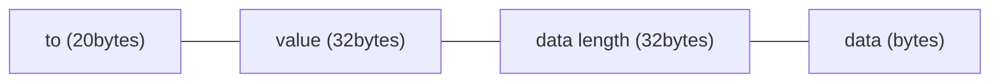

```md
---
eip: 7638
title: SCA 中批量调用编码
description: 用于智能合约账户（SCA）的批量调用编码，具有原子性和节省 Gas 的特性
author: George (@JXRow), Zisu (@lazy1523)
discussions-to: https://ethereum-magicians.org/t/erc-7638-optimized-calls-encoding/18966
status: Draft
type: Standards Track
category: ERC
created: 2024-02-26
---

## 摘要
批量调用编码（BCE）为智能合约账户（SCA）钱包概述了一种解决方案，将多个调用合并为单个调用，将多个参数编码为字节，压缩链上数据，并节省 Gas。它可用于实现原子操作以及非原子操作。

## 动机
通常，用户和合约之间的交互涉及一系列连贯的操作，例如 `approve`-`transferFrom`。虽然 EOA 钱包要求用户按顺序确认每个操作，但 SCA 钱包可以用单个确认来确认所有操作，并在单个调用中完成所有操作，从而实现原子性。如果 `approve` 成功但 `transferFrom` 失败，则会带来安全风险。安全的方法是确保如果一个操作失败，所有关联的操作也失败，从而确保原子性。因此，我们提出了这种编码方法，将多个参数编码为字节，压缩链上数据，并节省 Gas。它可用于实现原子操作和非原子操作。

除了上面提到的 `approve`-`transferFrom` 的原子操作外，还可以实现 Gas 支付委托。 它涉及用户和 bundler 签署一组调用，其中调用的内容包括：

1. 用户希望通过其 SCA 发起多个调用。
2. 用户向 bundler 转账 10 USDT 作为费用，包含在调用中。
3. Bundler 提交调用，支付 ETH Gas 并获得 10 USDT。

用户对调用的内容进行编码，附加他们的签名以确保其完整性，并将其发送给 bundler。 如果 bundler 认为 Gas 支付不足，他们可以选择不提交。 但是，如果他们批准调用的内容，则可以提交已签名的交易。 执行后，用户获得所需的操作，而 bundler 收到费用。

[EIP-4337](./eip-4337.md) 也实现了 Gas 支付委托。 BCE 和 [EIP-4337](./eip-4337.md) 并不互斥，可以在 SCA 中同时实现。

根据经验测试，与替代方法相比，BCE 更简单且 Gas 效率更高。

## 规范
本文档中的关键词“必须”，“不得”，“必需”，“应”，“不应”，“推荐”，“不推荐”，“可以”和“可选”应按照 RFC 2119 和 RFC 8174 中的描述进行解释。

此 ERC **要求** SCA 在合约中实现，其中 Dapp 与 SCA 钱包扩展通信，以将用户的意图传达给钱包，钱包使用批量调用编码将多个调用作为字节发送到用户的 SCA 合约。

_批量调用_ 包含多个 `Call` 字节，每个字节由 `to`\`value`\`data` 的编码定义，如下所示：



设：
- `to`：被调用合约的地址，对应于 Solidity address 类型，20 字节。
- `value`：发送到合约的 ETH 数量（以 wei 为单位），以 wei 为单位，对应于 Solidity uint 类型，32 字节。
- `data length`：数据长度（以字节为单位），对应于 Solidity uint 类型，32 字节。
- `data`：发送到合约的编码函数数据，对应于 Solidity bytes 类型，长度由 `data length` 定义。

多个 `Call` 单元连接起来构成 _批量调用_ 序列。

## 原理
每个调用封装了 3 个参数：`to`\`value`\`data`。传统方法涉及将这 3 个参数打包到一个结构体中，然后将多个结构体放入一个数组中。但是，使用结构体会增加开销，因为它还会打包 `to`\`value`\`data` 的类型，从而增加编码的大小。由于 `to`\`value`\`data` 具有固定的类型，因此可以省略这种额外的编码。在 Solidity 中，使用切片从 `bytes calldata` 读取数据是一种 Gas 效率很高的方法。考虑到这些因素，_批量调用编码_ 可以压缩链上数据并节省 Gas。

## 向后兼容性
此 ERC 不会更改共识层，因此对于整个以太坊来说，不存在向后兼容性问题。

此 ERC 不会更改其他 ERC 标准，因此对于以太坊应用程序来说，不存在向后兼容性问题。

## 参考实现
本提案仅指定了 _批量调用_ 的编码，而具体的实现和命名则由项目自行决定。 以下是使用 _批量调用_ 的 SCA 合约示例（称为 `atomCallbytes`），其中用户原子地签署多个操作，使 bundler 能够代表用户支付 Gas：

### `SmartWallet.sol`

```solidity
pragma solidity ^0.8.0;

import "@openzeppelin/contracts/utils/cryptography/ECDSA.sol";

contract SmartWallet {
    using ECDSA for bytes32;

    uint32 public valid = 1; //to make AtomSign invalid

    address private immutable original;
    address public owner;
    address public bundler;

    mapping(bytes32 => bool) public usedMsgHashes;

    modifier onlyBundler() {
        require(
            bundler == msg.sender,
            "onlyBundler: caller is not the bundler"
        );
        _;
    }

    modifier onlyOwnerAndOriginal() {
        require(
            owner == msg.sender || original == msg.sender,
            "onlyOwnerAndOriginal: caller is not the owner"
        );
        _;
    }

    constructor(address _bundler) {
        original = address(this);
        owner = msg.sender;
        bundler = _bundler;
    }

    function atomSignCall(
        bytes calldata atomCallbytes,
        uint32 deadline,
        bytes calldata signature
    ) external onlyBundler {
        require(deadline >= block.timestamp, "atomSignCall: Expired");
        bytes32 msgHash = keccak256(
            bytes.concat(
                msg.data[:msg.data.length - signature.length - 32],
                bytes32(block.chainid),
                bytes20(address(this)),
                bytes4(valid)
            )
        );
        require(!usedMsgHashes[msgHash], "atomSignCall: Used msgHash");
        require(
            owner == msgHash.toEthSignedMessageHash().recover(signature),
            "atomSignCall: Invalid Signature"
        );

        //do calls
        //执行调用
        uint i;
        while(i < atomCallbytes.length) {
            address to = address(uint160(bytes20(atomCallbytes[i:i+20])));
            uint value = uint(bytes32(atomCallbytes[i+20:i+52]));
            uint len = uint(bytes32(atomCallbytes[i+52:i+84]));

            (bool success, bytes memory result) = to.call{value: value}(atomCallbytes[i+84:i+84+len]);
            if (!success) {
                assembly {
                    revert(add(result, 32), mload(result))
                }
            }

            i += 84 + len;
        }

        usedMsgHashes[msgHash] = true;
    }

    /**
     * if you signed something then regretted, make it invalid
     * 如果你签署了某些内容然后后悔了，使其无效
     */
    function makeAtomSignInvalid() public onlyOwnerAndOriginal {
        valid = uint32(uint(blockhash(block.number)));
    }
}
```

### `Bundler.sol`

```solidity
pragma solidity ^0.8.0;

contract Bundler {

    address public owner;

    modifier onlyOwner() {
        require(
            owner == msg.sender,
            "onlyOwner: caller is not the owner"
        );
        _;
    }

    constructor() {
        owner = msg.sender;
    }

    function executeOperation(
        address wallet,
        bytes calldata data
    ) public onlyOwner {
        (bool success, bytes memory result) = _callTo.call{value: 0}(data);

        if (!success) {
            assembly {
                revert(add(result, 32), mload(result))
            }
        }
    }
}
```

## 安全注意事项
本提案介绍了一种旨在数据压缩的数据编码方案。 它仅涉及数据压缩，不会导致数据丢失或隐藏私有数据。

## 版权
版权和相关权利已通过 [CC0](../LICENSE.md) 放弃。
```