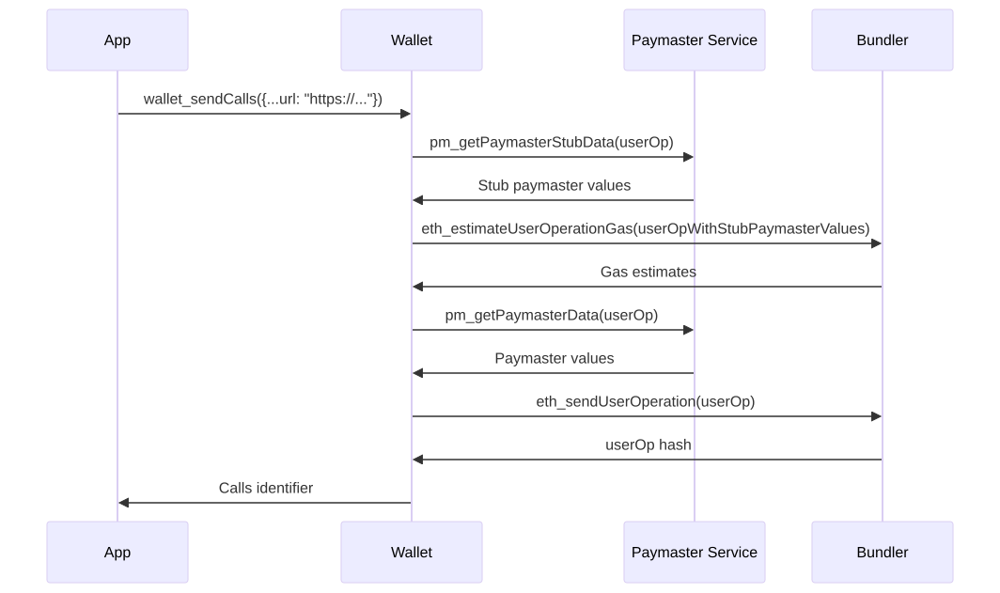
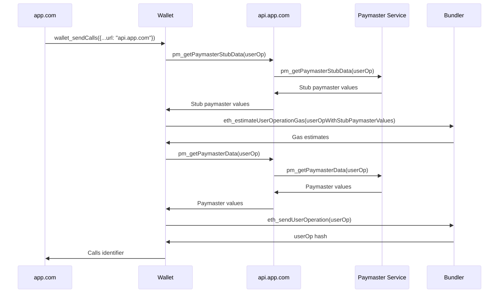

## 摘要

通过 [EIP-5792](./eip-5792.md)，应用可以通过 capabilities 与钱包通信关于高级功能。本提案定义了一种 capability，允许应用请求 [ERC-4337](./eip-4337.md) 钱包与指定的 paymaster 网络服务通信。为了支持这一点，我们还为 paymaster 网络服务定义了一个标准化的 API。

## 动机

应用开发者希望开始使用 paymaster 赞助用户的交易。Paymaster 通常通过网络服务使用。但是，目前没有办法让应用告诉钱包与特定的 paymaster 网络服务通信。同样，对于钱包应如何与这些服务通信也没有标准。我们需要一种方法让应用告诉钱包与特定的 paymaster 网络服务通信，以及钱包进行通信的标准。

## 规范

定义了一个新的 [EIP-5792](./eip-5792.md) 钱包 capability。我们还为 paymaster 网络服务定义了一个标准接口作为先决条件。

### Paymaster 网络服务接口

我们定义了两个 JSON-RPC 方法，由 paymaster 网络服务实现。

#### `pm_getPaymasterStubData`

返回用于 gas 估计的未签名用户操作的 paymaster 相关字段中的存根值。接受未签名的用户操作、入口点地址、链 ID 和上下文对象。Paymaster 服务提供商可以定义应用开发者应在上下文对象中使用的字段。

如果适用于提供的 EntryPoint 版本，此方法可能会返回 paymaster 特定的 gas 值。例如，如果提供的是 EntryPoint v0.7，则此方法可以返回 `paymasterVerificationGasLimit`。此外，对于 EntryPoint v0.7，此方法必须返回 `paymasterPostOpGasLimit` 的值。这是因为 paymaster 支付 postOpGasLimit，因此它不能信任钱包来估计这个量。

钱包应在将 `UserOperation` 提交给 bundler 进行 gas 估计时使用这些提供的 gas 值。

此方法还可以返回带有 `name` 字段和可选 `icon` 字段的 `sponsor` 对象。`name` 字段是赞助交易方的名称，`icon` 字段是指向图像的 URI。钱包开发者可以选择向用户显示赞助商信息。`icon` 字符串必须是 [RFC-2397] 中定义的数据 URI。图像应为正方形，最小分辨率为 96x96px。建议图像格式为无损或基于矢量的格式，例如 PNG、WebP 或 SVG，以使图像易于在钱包上呈现。由于 SVG 图像可以执行 Javascript，因此钱包必须使用 `` 标签呈现 SVG 图像，以确保不会发生不受信任的 Javascript 执行。

在某些情况下，仅调用 `pm_getPaymasterStubData` 就足以提供有效的 paymaster 相关用户操作字段，例如，当 `paymasterData` 不包含签名时。在这种情况下，可以通过此 RPC 调用返回 `isFinal: true` 来跳过对 `pm_getPaymasterData` 的第二次 RPC 调用（如下定义）。

Paymaster 网络服务应在 `pm_getPaymasterStubData` 执行期间对传入的用户操作执行验证，如果它不会赞助该操作，则在此阶段拒绝该请求。

##### `pm_getPaymasterStubData` RPC 规范

请注意，用户操作参数不包括签名，因为用户在填充所有其他字段后签名。

```typescript
// [userOp, entryPoint, chainId, context]
type GetPaymasterStubDataParams = [
  // Below is specific to Entrypoint v0.6 but this API can be used with other entrypoint versions too
  {
    sender: `0x${string}`;
    nonce: `0x${string}`;
    initCode: `0x${string}`;
    callData: `0x${string}`;
    callGasLimit: `0x${string}`;
    verificationGasLimit: `0x${string}`;
    preVerificationGas: `0x${string}`;
    maxFeePerGas: `0x${string}`;
    maxPriorityFeePerGas: `0x${string}`;
  }, // userOp
  `0x${string}`, // EntryPoint
  `0x${string}`, // Chain ID
  Record<string, any> // Context
];

type GetPaymasterStubDataResult = {
  sponsor?: { name: string; icon?: string }; // Sponsor info
  paymaster?: string; // Paymaster address (entrypoint v0.7)
  paymasterData?: string; // Paymaster data (entrypoint v0.7)
  paymasterVerificationGasLimit?: `0x${string}`; // Paymaster validation gas (entrypoint v0.7)
  paymasterPostOpGasLimit?: `0x${string}`; // Paymaster post-op gas (entrypoint v0.7)
  paymasterAndData?: string; // Paymaster and data (entrypoint v0.6)
  isFinal?: boolean; // Indicates that the caller does not need to call pm_getPaymasterData
};
```

###### `pm_getPaymasterStubData` 示例参数

```json
[
  {
    "sender": "0x...",
    "nonce": "0x...",
    "initCode": "0x",
    "callData": "0x...",
    "callGasLimit": "0x...",
    "verificationGasLimit": "0x...",
    "preVerificationGas": "0x...",
    "maxFeePerGas": "0x...",
    "maxPriorityFeePerGas": "0x..."
  },
  "0x5FF137D4b0FDCD49DcA30c7CF57E578a026d2789",
  "0x2105",
  {
    // Illustrative context field. These should be defined by service providers.
    "policyId": "962b252c-a726-4a37-8d86-333ce0a07299"
  }
]
```

###### `pm_getPaymasterStubData` 示例返回值

Paymaster 服务必须检测帐户正在使用的入口点版本，并返回正确的字段。

例如，如果使用 entrypoint v0.6：

```json
{
  "sponsor": {
    "name": "My App",
    "icon": "https://..."
  },
  "paymasterAndData": "0x..."
}
```

如果使用 entrypoint v0.7：

```json
{
  "sponsor": {
    "name": "My App",
    "icon": "https://..."
  },
  "paymaster": "0x...",
  "paymasterData": "0x..."
}
```

如果使用 entrypoint v0.7，以及 paymaster gas 估算值：

```json
{
  "sponsor": {
    "name": "My App",
    "icon": "https://..."
  },
  "paymaster": "0x...",
  "paymasterData": "0x...",
  "paymasterVerificationGasLimit": "0x...",
  "paymasterPostOpGasLimit": "0x..."
}
```

指示调用者无需进行 `pm_getPaymasterData` RPC 调用：

```json
{
  "sponsor": {
    "name": "My App",
    "icon": "https://..."
  },
  "paymaster": "0x...",
  "paymasterData": "0x...",
  "isFinal": true
}
```

#### `pm_getPaymasterData`

返回用于已签名用户操作的 paymaster 相关字段中的值。这些不是存根值，将在用户操作提交到 bundler 期间使用。与 `pm_getPaymasterStubData` 类似，接受未签名的用户操作、入口点地址、链 ID 和上下文对象。

##### `pm_getPaymasterData` RPC 规范

请注意，用户操作参数不包括签名，因为用户在填充所有其他字段后签名。

```typescript
// [userOp, entryPoint, chainId, context]
type GetPaymasterDataParams = [
  // Below is specific to Entrypoint v0.6 but this API can be used with other entrypoint versions too
  {
    sender: `0x${string}`;
    nonce: `0x${string}`;
    initCode: `0x${string}`;
    callData: `0x${string}`;
    callGasLimit: `0x${string}`;
    verificationGasLimit: `0x${string}`;
    preVerificationGas: `0x${string}`;
    maxFeePerGas: `0x${string}`;
    maxPriorityFeePerGas: `0x${string}`;
  }, // userOp
  `0x${string}`, // Entrypoint
  `0x${string}`, // Chain ID
  Record<string, any> // Context
];

type GetPaymasterDataResult = {
  paymaster?: string; // Paymaster address (entrypoint v0.7)
  paymasterData?: string; // Paymaster data (entrypoint v0.7)
  paymasterAndData?: string; // Paymaster and data (entrypoint v0.6)
};
```

###### `pm_getPaymasterData` 示例参数

```json
[
  {
    "sender": "0x...",
    "nonce": "0x...",
    "initCode": "0x",
    "callData": "0x...",
    "callGasLimit": "0x...",
    "verificationGasLimit": "0x...",
    "preVerificationGas": "0x...",
    "maxFeePerGas": "0x...",
    "maxPriorityFeePerGas": "0x..."
  },
  "0x5FF137D4b0FDCD49DcA30c7CF57E578a026d2789",
  "0x2105",
  {
    // Illustrative context field. These should be defined by service providers.
    "policyId": "962b252c-a726-4a37-8d86-333ce0a07299"
  }
]
```

###### `pm_getPaymasterData` 示例返回值

Paymaster 服务必须检测帐户正在使用的入口点版本，并返回正确的字段。

例如，如果使用 entrypoint v0.6：

```json
{
  "paymasterAndData": "0x..."
}
```

如果使用 entrypoint v0.7：

```json
{
  "paymaster": "0x...",
  "paymasterData": "0x..."
}
```

### `paymasterService` Capability

`paymasterService` capability 由应用和钱包实现。

#### 应用实现

应用需要为钱包提供一个 paymaster 服务 URL，它们可以通过该 URL 进行上述 RPC 调用。它们可以使用 `paymasterService` capability 作为 [EIP-5792](./eip-5792.md) `wallet_sendCalls` 调用的一部分来执行此操作。

##### `wallet_sendCalls` Paymaster Capability 规范

```typescript
type PaymasterCapabilityParams = {
  url: string;
  context: Record<string, any>;
}
```

###### `wallet_sendCalls` 示例参数

```json
[
  {
    "version": "1.0",
    "chainId": "0x01",
    "from": "0xd46e8dd67c5d32be8058bb8eb970870f07244567",
    "calls": [
      {
        "to": "0xd46e8dd67c5d32be8058bb8eb970870f07244567",
        "value": "0x9184e72a",
        "data": "0xd46e8dd67c5d32be8d46e8dd67c5d32be8058bb8eb970870f072445675058bb8eb970870f072445675"
      },
      {
        "to": "0xd46e8dd67c5d32be8058bb8eb970870f07244567",
        "value": "0x182183",
        "data": "0xfbadbaf01"
      }
    ],
    "capabilities": {
      "paymasterService": {
        "url": "https://...",
        "context": {
          "policyId": "962b252c-a726-4a37-8d86-333ce0a07299"
        }
      }
    }
  }
]
```

然后，钱包将对 `paymasterService` capability 字段中指定的 URL 进行上述 paymaster RPC 调用。

#### 钱包实现

为了符合此规范，希望利用应用赞助交易的智能钱包：

1. 必须通过它们对 [EIP-5792](./eip-5792.md) `wallet_getCapabilities` 调用的响应来向应用表明它们可以与 paymaster 网络服务通信。
2. 应该调用并使用 [EIP-5792](./eip-5792.md) `wallet_sendCalls` 调用的 capabilities 字段中指定的 paymaster 服务返回的值。例外的一个例子是允许用户选择钱包提供的 paymaster 的钱包。由于可能存在未最终使用提供的 paymaster 的情况——无论是由于服务故障还是由于用户选择了不同的、钱包提供的 paymaster——应用程序不得假设它提供给钱包的 paymaster 是支付交易费用的实体。

##### `wallet_getCapabilities` 响应规范

```typescript
type PaymasterServiceCapability = {
  supported: boolean;
};
```

###### `wallet_getCapabilities` 示例响应

```json
{
  "0x2105": {
    "paymasterService": {
      "supported": true
    }
  },
  "0x14A34": {
    "paymasterService": {
      "supported": true
    }
  }
}
```

以下是说明完整 `wallet_sendCalls` 流程的图，包括钱包如何实现交互。



## 理由

### Gas 估计

当前 paymaster 服务的宽松标准是实现 `pm_sponsorUserOperation`。此方法返回 paymaster 相关用户操作字段的值和更新的 gas 值。此方法的问题在于 paymaster 服务提供商具有不同的 gas 估计方式，这导致不同的估计 gas 值。有时这些估计可能不足。因此，我们认为最好将 gas 估计留给钱包，因为钱包具有更多关于用户操作如何提交的上下文（例如，它们将被提交给哪个 bundler）。然后，钱包可以要求 paymaster 服务赞助给定的由钱包定义的估计值。

上述原因也是我们指定 `pm_getPaymasterStubData` 方法也可以返回 paymaster 特定的 gas 估计值的原因。也就是说，bundler 容易对 paymaster 特定的 gas 值进行不充分的估计，而 paymaster 服务本身最终更适合提供它们。

### 链 ID 参数

目前，paymaster 服务提供商通常为开发人员提供每个链的 URL。也就是说，paymaster 服务 URL 通常不是多链的。那么为什么我们需要链 ID 参数？我们认识到我们必须指定一些约束，以便钱包可以与 paymaster 服务通信关于其请求是针对哪个链的。正如我们所看到的，有两种选择：

1. 正式化当前的宽松标准，并要求 paymaster 服务 URL 与链的比例为 1:1。
2. 要求链 ID 参数作为 paymaster 服务请求的一部分。

我们认为选项 (2) 在这里是更好的抽象。这允许服务提供商在基本上没有不利于提供每个链的 URL 的提供商的情况下，如果他们愿意，可以提供多链 URL。提供每个链的 URL 的提供商只需要接受一个可以忽略的附加参数。当使用每个链的 URL 提供商的应用开发者想要向不同的链提交请求时，他们只需相应地交换 URL。

### 存根数据面临的挑战

在 gas 估计中实现更灵活的工作流程仍然会带来一些已知的挑战，paymaster 服务必须注意这些挑战，以确保在此过程中生成可靠的 gas 估计值。

#### `preVerificationGas`

`preVerificationGas` 值主要受用户操作大小及其零字节与非零字节之比的影响。这可能导致这样一种情况，即 `pm_getPaymasterStubData` 返回的值导致上游 gas 估计得出比 `pm_getPaymasterData` 需要的更低的 `preVerificationGas`。如果发生这种情况，则 bundler 将在 `eth_sendUserOperation` 期间返回一个不足的 `preVerificationGas` 错误。

为了避免这种情况，paymaster 服务必须返回满足以下条件的存根数据：

1. 长度与最终数据相同。
2. 具有小于或等于最终数据的零字节 (`0x00`) 量。

#### 一致的代码路径

在简单的情况下，与最终值长度相同的重复非零字节（例如 `0x01`）的存根值将生成可用的 `preVerificationGas`。虽然这会立即导致 gas 估计错误，因为模拟可能会由于无效的 paymaster 数据而恢复。

在更实际的情况下，有效的存根可能会导致模拟成功，但仍然返回不足的 gas 限制。如果存根数据导致 `validatePaymasterUserOp` 或 `postOp` 函数模拟与最终值不同的代码路径，则可能会发生这种情况。例如，如果模拟的代码要提前返回，则估计的 gas 限制将低于预期，这将导致一旦将用户操作提交给 bundler，上游就会出现 `out of gas` 错误。

因此，paymaster 服务还必须返回一个存根，该存根可以导致模拟执行与最终用户操作预期相同的代码路径。

## 安全考虑事项

Paymaster 服务提供商给应用开发者的 URL 通常包含 API 密钥。应用开发者可能不想将这些 API 密钥传递给钱包。为了解决这个问题，我们建议应用开发者提供一个指向其应用后端的 URL，然后可以代理对 paymaster 服务的调用。以下是此流程的修改图。



此流程将允许开发人员对其 paymaster 服务 API 密钥保密。开发人员可能还想在其后端进行额外的模拟/验证，以确保他们赞助他们想要赞助的交易。

## 版权

通过 [CC0](../LICENSE.md) 放弃版权和相关权利。
