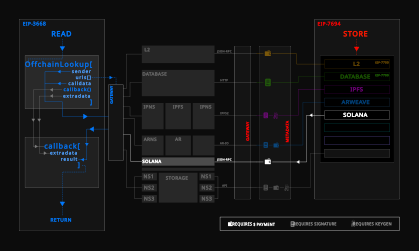
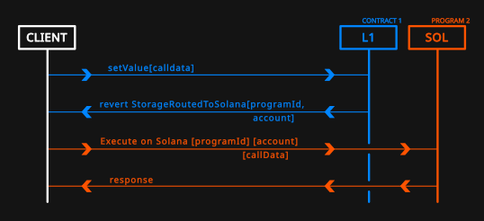

## 摘要

以下标准是对跨链存储路由协议的扩展，引入了 Solana 区块链的存储路由。 通过此规范，任何以太坊 L1 合约都可以将调用推迟到 Solana 区块链作为其核心功能的一部分，前提是客户端能够处理 Solana 交易。 以前可以将写入和存储操作推迟到其他以太坊 L1 合约、L2 合约和链下数据库，本文档将该功能扩展到包括替代 L1 链。 存储在 Solana 上的数据必须通过适当的 HTTP 网关转换为符合 [EIP-3668](./eip-3668) 的格式，通用以太坊合约可以在该网关检索数据。 此标准允许以太坊利用更广泛的跨链区块空间。

## 动机

[EIP-7700](./eip-7700) 中引入的跨链存储路由协议 (CCIP-Store) 描述了三个外部路由器，用于将存储路由到 L1 合约、L2 和数据库。 本文档通过引入以 Solana 作为存储提供商的第四个存储路由器来扩展该规范。

L2 和数据库在其堆栈中都具有中心化催化剂。 对于 L2，此中心化代理是与以太坊主网的共享安全性。 对于数据库，中心化代理是微不足道的； 它是托管数据库的物理服务器。 鉴于此，首选依赖于自身独立共识机制的存储提供商。 本规范指示客户端应如何处理对 Solana 路由器的存储调用。

Solana 是一种低成本的 L1 解决方案，多个钱包提供商与以太坊一起支持该解决方案。 以太坊上有几个链无关协议，这些协议可以从直接访问 Solana 区块空间中受益。 ENS 是一个这样的例子，它可以利用其链无关属性为 Solana 用户提供服务，同时使用 Solana 自己的原生存储。 这一发展将鼓励以太坊和 Solana 之间在核心上的更多跨链功能。



## 规范

Solana 存储路由器 `StorageRoutedToSolana()` 需要 Solana 区块链上经过十六进制编码的 `programId` 和管理器 `account`。 `programId` 相当于 Solana 上的合约地址，而 `account` 是 Solana 上代表 `msg.sender` 处理存储的管理器钱包。

```solidity
// Revert handling Solana storage router
error StorageRoutedToSolana(
    bytes32 programId,
    bytes32 account
);

// Generic function in a contract
// 合约中的通用函数
function setValue(
    bytes32 node,
    bytes32 key,
    bytes32 value
) external {
    // Get metadata from on-chain sources
    // 从链上源获取元数据
    (
        bytes32 programId, // Program (= contract) address on Solana; hex-encoded
                           // Solana 上的程序 (= 合约) 地址；十六进制编码
        bytes32 account // Manager account on Solana; hex-encoded
                         // Solana 上的管理器账户；十六进制编码
    ) = getMetadata(node); // Arbitrary code
                             // 任意代码
    // programId = 0x37868885bbaf236c5d2e7a38952f709e796a1c99d6c9d142a1a41755d7660de3
    // account = 0xe853e0dcc1e57656bd760325679ea960d958a0a704274a5a12330208ba0f428f
    // Route storage call to Solana router
    // 将存储调用路由到 Solana 路由器
    revert StorageRoutedToSolana(
        programId,
        account
    );
};
```

由于 Solana 在其虚拟机设置中原生使用 `base58` 编码，因此在 EVM 上进行十六进制编码的 `programId` 值必须进行 `base58` 解码才能在 SVM 上使用。 实现 Solana 路由器的客户端必须使用连接到 `account` 的 Solana 钱包调用 Solana `programId`，该钱包使用最初收到的经过 `base58` 解码（并转换为适当的数据类型）的 calldata。

```js
/* Pseudo-code to write to Solana program (= contract) */
/* 写入 Solana 程序（= 合约）的伪代码 */
// Decode all 'bytes32' types in EVM to 'PubKey' type in SVM
// 将 EVM 中所有 'bytes32' 类型解码为 SVM 中的 'PubKey' 类型
const [programId, account, node, key, value] = E2SVM(
  [programId, account, node, key, value],
  ["bytes32", "bytes32", "bytes32", "bytes32", "bytes32"]
);
// Instantiate program interface on Solana
// 在 Solana 上实例化程序接口
const program = new program(programId, rpcProvider);
// Connect to Solana wallet
// 连接到 Solana 钱包
const wallet = useWallet();
// Call the Solana program using connected wallet with initial calldata
// 使用连接的钱包和初始 calldata 调用 Solana 程序
// [!] Only approved manager in the Solana program should call
// [!] 只有 Solana 程序中批准的管理器才能调用
if (wallet.publicKey === account) {
  await program(wallet).setValue(node, key, value);
}
```

在上面的示例中，EVM 特定的 `bytes32` 类型变量 `programId`、`account`、`node`、`key` 和 `value` 都必须转换为 SVM 特定的 `PubKey` 数据类型。 Solana 程序中的等效 `setValue()` 函数的形式为

```rust
// Example function in Solana program
// Solana 程序中的示例函数
pub fn setValue(
    ctx: Context,
    node: PubKey,
    key: PubKey,
    value: PubKey
) -> ProgramResult {
    // Code to verify PROGRAM_ID and rent exemption status
    // 验证 PROGRAM_ID 和租金豁免状态的代码
    ...
    // Code for de-serialising, updating and re-serialising the data
    // 用于反序列化、更新和重新序列化数据的代码
    ...
    // Store serialised data in account
    // 将序列化数据存储在帐户中
    // [!] Stored data must be mapped by node & account
    // [!] 存储的数据必须按节点和帐户映射
    ...
}
```

由于 EVM 和 SVM 具有不同的架构，因此定义从 EVM 到 SVM 的精确数据类型转换非常重要。 SVM 中一些预先存在的自定义但流行的自定义数据类型已经分别等同于常见的 EVM 数据类型，例如 `PubKey` 和 `bytes32`。 本规范要求实现以下 EVM 到 SVM 类型双射转换：

|    EVM    |        SVM        |
| :-------: | :---------------: |
|  `uint8`  |       `u8`        |
| `uint16`  |       `u16`       |
| `uint32`  |       `u32`       |
| `uint64`  |       `u64`       |
| `uint128` |      `u128`       |
| `uint256` |      `u256`†      |
| `bytes1`  | `bytes: [u8; 1]`  |
| `bytes2`  | `bytes: [u8; 2]`  |
| `bytes4`  | `bytes: [u8; 4]`  |
| `bytes8`  | `bytes: [u8; 8]`  |
| `bytes16` | `bytes: [u8; 16]` |
| `bytes32` |     `PubKey`      |
|  `bytes`  | `bytes: Vec<u8>`  |
| `string`  |     `String`      |
| `address` | `bytes: [u8; 20]` |

> † `u256` 在 SVM 中不是原生可用的，但通常通过 Rust 中的 `u256` crate 实现

使用这种策略，可以解决 `StorageRoutedToSolana()` 的大部分（如果不是全部）当前用例。

最后，为了在任意以太坊合约中读取存储在 Solana 上的跨链数据，必须通过符合 [EIP-3668](./eip-3668) 的 HTTP 网关将其转换回 EVM 语言。 通用调用网关 URL 的参数必须以 [EIP-7700](./eip-7700) 中描述的 `/` 分隔的嵌套格式指定。 这种网关的核心必须遵循

```js
/* Pseudo-code of an ERC-3668-compliant HTTP gateway tunneling Solana content to Ethereum */
/* 符合 ERC-3668 的 HTTP 网关将 Solana 内容隧道传输到以太坊的伪代码 */
// CCIP-Read call by contract to a known gateway URL; gatewayUrl = 'https://read.solana.namesys.xyz/<programId>/<node>/<key>/'
// 合约通过 CCIP-Read 调用到已知的网关 URL；gatewayUrl = 'https://read.solana.namesys.xyz/<programId>/<node>/<key>/'
const [programId, node, key] = parseQuery(path); // Parse query parameters from path; path = '/<programId>/<node>/<key>/'
                                                   // 从路径解析查询参数；path = '/<programId>/<node>/<key>/'
// Decode 'bytes32' types in EVM to 'PubKey' type in SVM
// 将 EVM 中 'bytes32' 类型解码为 SVM 中的 'PubKey' 类型
const [programId, node, key] = E2SVM(
  [programId, node, key],
  ["bytes32", "bytes32", "bytes32"]
);
// Instantiate program interface on Solana
// 在 Solana 上实例化程序接口
const program = new program(programId, rpcProvider);
// Call the Solana program to read in cross-chain data
// 调用 Solana 程序以读取跨链数据
const value = await program.getValue(node, key);
if (value !== "NOT_FOUND") {
  // Decode 'PubKey' type in SVM to 'bytes32' type in EVM
  // 将 SVM 中 'PubKey' 类型解码为 EVM 中的 'bytes32' 类型
  const value = S2EVM(value, "PubKey");
} else {
  // Null value
  // 空值
  const value = "0x0";
}
// Compile CCIP-Read-compatible payload
// 编译与 CCIP-Read 兼容的有效负载
const data = abi.encode(["bytes"], [value]);
// Create HTTP gateway emitting value in format 'data: ...'
// 创建以 'data: ...' 格式发出值的 HTTP 网关
emitERC3668(data);
```

在上面的示例中，Solana 程序中的通用 `getValue()` 函数的形式为

```rust
// Example getValue() function in Solana program
// Solana 程序中的示例 getValue() 函数
pub fn getValue<'a>(
    ctx: Context,
    node: Pubkey,
    key: Pubkey,
    account: &AccountInfo<'a>, // Lifetime-bound parameter
                                // 生命周期绑定的参数
) -> Result<Pubkey, ProgramError> {
    // Validate that the account belongs to the correct program ID
    // 验证账户是否属于正确的程序 ID
    ...
    // Retrieve the data from the account
    // 从帐户中检索数据
    let data = &account.data.borrow();
    // De-serialise the data from the account
    // 反序列化帐户中的数据
    ...
    // Look up the value by node and key
    // 按节点和键查找值
    match deserialised.get(&node, &key) {
        Some(value) => {
            msg!("VALUE: {:?}", value);
            Ok(value)
        },
        None => {
            msg!("NOT_FOUND");
            Err(ProgramError::InvalidArgument)
        }
    }
}
```

## 理由

`StorageRoutedToSolana()` 的工作方式与 CCIP-Store 中 `StorageRoutedToL2()` 类似，因为客户端需要通过还原事件指向另一条链上的某个合约。 除此之外，唯一的技术差异是 EVM 和 SVM 数据类型之间的转换。



## 向后兼容性

无。

## 安全注意事项

无。

## 版权

通过 [CC0](../LICENSE.md) 放弃版权和相关权利。