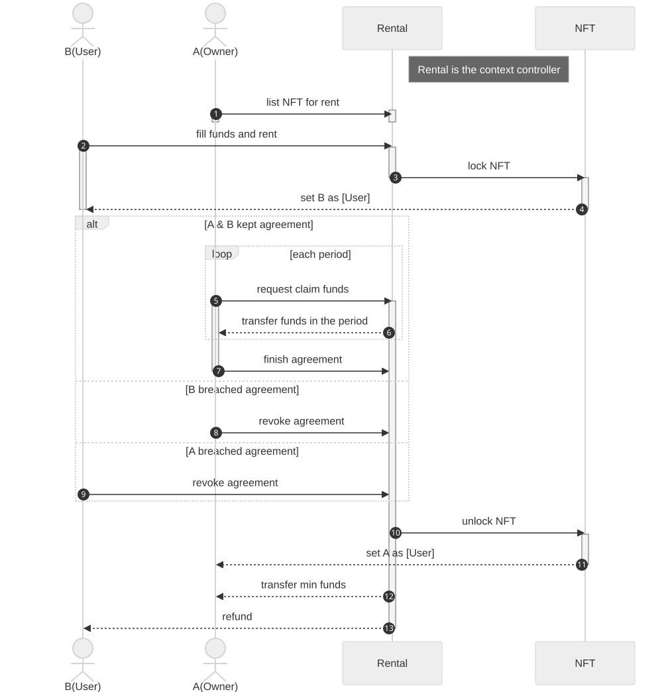
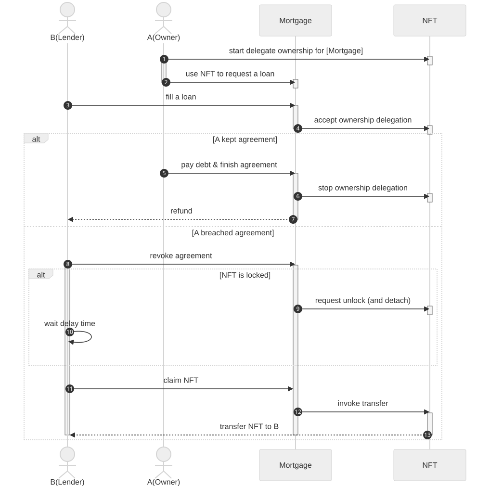

## 摘要

本标准是 [ERC-721](./eip-721.md) 的扩展，旨在为各种上下文指定用户，并具有锁定功能，并允许临时所有权委托，而无需更改原始所有者。

本 EIP 保留了所有者的权益，并通过添加所有权委托和上下文的概念来扩展 NFT 在各种 dApp 中的效用，这些概念定义了特定的角色：控制器和用户，他们可以在定义的上下文中使用 NFT。

## 动机

对于标准 [ERC-721](./eip-721.md) NFT，在金融应用中有几个用例，包括：

- 质押 NFT 以赚取奖励。
- 抵押 NFT 以产生收入。
- 授予用户用于不同目的，如租赁和代币委托——有人付费使用代币，有人付费让另一方使用代币。

传统上，这些应用程序需要所有权转移才能将 NFT 锁定在合约中。然而，其他去中心化应用程序 (dApp) 认可代币所有权是代币所有者有权获得其奖励系统内的利益的证明，例如空投或分层奖励。如果代币所有者的代币锁定在合约中，他们将没有资格获得持有这些代币的利益，或者奖励系统必须支持尽可能多的合约来帮助这些所有者。

这是因为只有一个所有者角色表明所有权，在 [ERC-721](./eip-721.md) 之上开发通常会带来挑战。本提案旨在通过将用例置于控制器处理的上下文中，并通过所有权委托机制在标准级别区分所有权和其他角色来解决这些挑战。通过标准化这些措施，dApp 开发者可以更轻松地在此标准之上构建基础设施和协议。

## 规范

本文档中的关键词“必须 (MUST)”，“不得 (MUST NOT)”，“必需 (REQUIRED)”，“应该 (SHALL)”，“不应该 (SHALL NOT)”，“应该 (SHOULD)”，“不应该 (SHOULD NOT)”，“推荐 (RECOMMENDED)”，“可以 (MAY)”和“可选 (OPTIONAL)”应按照 RFC 2119 中的描述进行解释。

### 定义

本规范包含以下组成部分：

**代币上下文 (Token Context)** 提供了代币的指定用例。它充当代币和上下文之间的关联关系。在每个唯一的代币上下文中，都存在一个已分配的用户，该用户被授权在该上下文中利用该代币。在一个指定的上下文中，有两个不同的角色：

- **控制器 (Controller)**: 此角色拥有控制上下文的权限。
- **用户 (User)**: 此角色表示给定上下文中的主要代币用户。

代币的**所有权 (Ownership Rights)** 被定义为能够：

- 将该代币转移给新的所有者。
- 添加代币上下文：将该代币附加到/从一个或多个上下文中。
- 移除代币上下文：将该代币从一个或多个上下文中分离。

**所有权委托 (Ownership Delegation)** 涉及通过将所有权委托给其他帐户一段特定的时间来区分所有者和所有权。在此期间，所有者暂时放弃所有权，直到委托到期。

### 角色

| 角色                | 说明 / 权限                                                                                                                                  | 每个代币的数量 |
| -------------------- | -------------------------------------------------------------------------------------------------------------------------------------------- | -------------- |
| 所有者 (Owner)        | • 默认情况下拥有 **所有权 (Ownership Rights)**<br>• 委托一个帐户在一段时间内持有 **所有权 (Ownership Rights)**                                         | $1$            |
| 所有权受委托人 (Ownership Delegatee) | • 在委托期间拥有 **所有权 (Ownership Rights)**<br>• 在委托到期前放弃                                                                                | $1$            |
| 所有权管理者 (Ownership Manager)   | • 是持有 **所有权 (Ownership Rights)**的人<br>• 如果尚未委托，则引用 **所有者 (Owner)**，否则引用 **所有权受委托人 (Ownership Delegatee)**             | $1$            |
| **上下文角色 (Context Roles)**    |                                                                                                                              | $n$            |
| 控制器 (Controller)       | • 转移控制器<br>• 设置上下文用户<br>• （取消）锁定代币转移                                                                                      | 每个上下文 $1$    |
| 用户 (User)           | • 授权在其上下文中使用的代币                                                                                                                     | 每个上下文 $1$    |

### 接口

**实现此标准的智能合约必须 (MUST) 实现 `IERC7695` 接口中的所有函数。**

实现此标准的智能合约必须 (MUST) 实现 [ERC-165](./eip-165.md) `supportsInterface` 函数，并且如果 `0x486b6fba` 通过 `interfaceID` 参数传递，则必须 (MUST) 返回常量值 `true`。

```solidity
/// 注意：此接口的 ERC-165 标识符为 0x486b6fba。
interface IERC7695 /* is IERC721, IERC165 */ {
  /// @dev 当通过任何机制更新上下文时，都会发出此事件。
  event ContextUpdated(bytes32 indexed ctxHash, address indexed controller, uint64 detachingDuration);
  /// @dev 当通过任何机制将代币附加到某个上下文时，都会发出此事件。
  event ContextAttached(bytes32 indexed ctxHash, uint256 indexed tokenId);
  /// @dev 当通过任何机制请求从某个上下文中分离代币时，都会发出此事件。
  event ContextDetachmentRequested(bytes32 indexed ctxHash, uint256 indexed tokenId);
  /// @dev 当通过任何机制从某个上下文中分离代币时，都会发出此事件。
  event ContextDetached(bytes32 indexed ctxHash, uint256 indexed tokenId);
  /// @dev 当通过任何机制将用户分配给某个上下文时，都会发出此事件。
  event ContextUserAssigned(bytes32 indexed ctxHash, uint256 indexed tokenId, address indexed user);
  /// @dev 当通过任何机制在某个上下文中（取消）锁定代币时，都会发出此事件。
  event ContextLockUpdated(bytes32 indexed ctxHash, uint256 indexed tokenId, bool locked);
  /// @dev 当通过任何机制启动所有权委托时，都会发出此事件。
  event OwnershipDelegationStarted(uint256 indexed tokenId, address indexed delegatee, uint64 until);
  /// @dev 当通过任何机制接受所有权委托时，都会发出此事件。
  event OwnershipDelegationAccepted(uint256 indexed tokenId, address indexed delegatee, uint64 until);
  /// @dev 当通过任何机制停止所有权委托时，都会发出此事件。
  event OwnershipDelegationStopped(uint256 indexed tokenId, address indexed delegatee);

  /// @notice 获取可能发生分离的最长持续时间。
  function maxDetachingDuration() external view returns (uint64);

  /// @notice 获取上下文的控制器地址和分离持续时间。
  /// @dev 如果上下文不存在，则必须 (MUST) 恢复。
  /// @param ctxHash            要查询控制器的上下文哈希。
  /// @return controller        上下文控制器的地址。
  /// @return detachingDuration 必须等待分离的持续时间（以秒为单位）。
  function getContext(bytes32 ctxHash) external view returns (address controller, uint64 detachingDuration);

  /// @notice 创建一个新的上下文。
  /// @dev 如果上下文已存在，则必须 (MUST) 恢复。
  /// 如果控制器地址为零地址，则必须 (MUST) 恢复。
  /// 如果分离持续时间大于最大分离持续时间，则必须 (MUST) 恢复。
  /// 必须 (MUST) 发出事件 {ContextUpdated} 以反映上下文已创建和控制器已设置。
  /// @param controller        控制已创建上下文的地址。
  /// @param detachingDuration 必须等待分离的持续时间（以秒为单位）。
  /// @param ctxMsg            用于哈希的新上下文消息。
  /// @return ctxHash          已创建上下文的哈希。
  function createContext(address controller, uint64 detachingDuration, bytes calldata ctxMsg)
    external
    returns (bytes32 ctxHash);

  /// @notice 更新现有的上下文。
  /// @dev 如果方法调用者不是当前的控制器，则必须 (MUST) 恢复。
  /// 如果上下文不存在，则必须 (MUST) 恢复。
  /// 如果新的控制器地址为零地址，则必须 (MUST) 恢复。
  /// 如果分离持续时间大于最大分离持续时间，则必须 (MUST) 恢复。
  /// 必须 (MUST) 成功发出事件 {ContextUpdated} 。
  /// @param ctxHash              要设置的上下文哈希。
  /// @param newController        新控制器的地址。
  /// @param newDetachingDuration 必须等待分离的新持续时间（以秒为单位）。
  function updateContext(bytes32 ctxHash, address newController, uint64 newDetachingDuration) external;

  /// @notice 查询代币是否附加到某个上下文。
  /// @param ctxHash 上下文的哈希。
  /// @param tokenId 要查询的 NFT。
  /// @return        如果代币附加到上下文，则为 True； 如果未附加，则为 False。
  function isAttachedWithContext(bytes32 ctxHash, uint256 tokenId) external view returns (bool);

  /// @notice 将代币附加到某个上下文。
  /// @dev 请参阅“代币（取消）锁定规则”中的“attachContext 规则”。
  /// @param ctxHash 上下文的哈希。
  /// @param tokenId 要附加的 NFT。
  /// @param data    没有指定格式的附加数据，必须 (MUST) 在调用控制器上的 {IERC7695ContextCallback} 钩子中保持不变。
  function attachContext(bytes32 ctxHash, uint256 tokenId, bytes calldata data) external;

  /// @notice 请求从某个上下文中分离代币。
  /// @dev 请参阅“代币（取消）锁定规则”中的“requestDetachContext 规则”。
  /// @param ctxHash 上下文的哈希。
  /// @param tokenId 要分离的 NFT。
  /// @param data    没有指定格式的附加数据，必须 (MUST) 在调用控制器上的 {IERC7695ContextCallback} 钩子中保持不变。
  function requestDetachContext(bytes32 ctxHash, uint256 tokenId, bytes calldata data) external;

  /// @notice 执行上下文分离。
  /// @dev 请参阅“代币（取消）锁定规则”中的“execDetachContext 规则”。
  /// @param ctxHash 上下文的哈希。
  /// @param tokenId 要分离的 NFT。
  /// @param data    没有指定格式的附加数据，必须 (MUST) 在调用控制器上的 {IERC7695ContextCallback} 钩子中保持不变。
  function execDetachContext(bytes32 ctxHash, uint256 tokenId, bytes calldata data) external;

  /// @notice 查找代币的上下文用户。
  /// @param ctxHash 上下文的哈希。
  /// @param tokenId 要分离的 NFT。
  /// @return user   上下文用户的地址。
  function getContextUser(bytes32 ctxHash, uint256 tokenId) external view returns (address user);

  /// @notice 更新代币的上下文用户。
  /// @dev 如果方法调用者不是上下文控制器，则必须 (MUST) 恢复。
  /// 如果上下文不存在，则必须 (MUST) 恢复。
  /// 如果代币未附加到上下文，则必须 (MUST) 恢复。
  /// 必须 (MUST) 成功发出事件 {ContextUserAssigned} 。
  /// @param ctxHash 上下文的哈希。
  /// @param tokenId 要更新的 NFT。
  /// @param user    新用户的地址。
  function setContextUser(bytes32 ctxHash, uint256 tokenId, address user) external;

  /// @notice 查询在某个上下文中是否锁定了代币。
  /// @param ctxHash 上下文的哈希。
  /// @param tokenId 要查询的 NFT。
  /// @return        如果代币上下文被锁定，则为 True； 如果未锁定，则为 False。
  function isTokenContextLocked(bytes32 ctxHash, uint256 tokenId) external view returns (bool);

  /// @notice 在某个上下文中（取消）锁定代币。
  /// @dev 请参阅“代币（取消）锁定规则”中的“setContextLock 规则”。
  /// @param ctxHash 上下文的哈希。
  /// @param tokenId 要查询的 NFT。
  /// @param lock    要（取消）锁定的新状态。
  function setContextLock(bytes32 ctxHash, uint256 tokenId, bool lock) external;

  /// @notice 查找指定代币的所有权管理者。
  /// @param tokenId  要查询的 NFT。
  /// @return manager 受委托人的地址。
  function getOwnershipManager(uint256 tokenId) external view returns(address manager);

  /// @notice 查找代币的所有权受委托人。
  /// @dev 如果没有（或已过期）所有权委托，则必须 (MUST) 恢复。
  /// @param tokenId    要查询的 NFT。
  /// @return delegatee 受委托人的地址。
  /// @return until     委托到期时间。
  function getOwnershipDelegatee(uint256 tokenId) external view returns (address delegatee, uint64 until);

  /// @notice 查找代币的待处理所有权受委托人。
  /// @dev 如果没有（或已过期）待处理所有权委托，则必须 (MUST) 恢复。
  /// @param tokenId    要查询的 NFT。
  /// @return delegatee 待处理的受委托人的地址。
  /// @return until     未来的委托到期时间。
  function pendingOwnershipDelegatee(uint256 tokenId) external view returns (address delegatee, uint64 until);

  /// @notice 启动所有权委托并保留所有权，直到特定的时间戳。
  /// @dev 如果有任何待处理的委托，则替换该委托。
  /// 请参阅“所有权委托规则”中的“startDelegateOwnership 规则”。
  /// @param tokenId   要委托的 NFT。
  /// @param delegatee 新的受委托人的地址。
  /// @param until     委托到期时间。
  function startDelegateOwnership(uint256 tokenId, address delegatee, uint64 until) external;

  /// @notice 接受所有权委托请求。
  /// @dev 请参阅“所有权委托规则”中的“acceptOwnershipDelegation 规则”。
  /// @param tokenId 要接受的 NFT。
  function acceptOwnershipDelegation(uint256 tokenId) external;

  /// @notice 停止当前的所有权委托。
  /// @dev 请参阅“所有权委托规则”中的“stopOwnershipDelegation 规则”。
  /// @param tokenId 要停止的 NFT。
  function stopOwnershipDelegation(uint256 tokenId) external;
}
```

**可枚举扩展**

此标准的枚举扩展是可选的 (OPTIONAL)。这允许您的合约发布其完整的上下文列表并使其可被发现。当调用 `supportsInterface` 函数时，如果 `0xcebf44b7` 通过 `interfaceID` 参数传递，则必须 (MUST) 返回常量值 `true`。

```solidity
/// 注意：此接口的 ERC-165 标识符为 0xcebf44b7。
interface IERC7695Enumerable /* is IERC165 */ {
  /// @dev 返回此合约中 `index` 处创建的上下文。
  /// 索引必须是 0 到 {getContextCount} 之间的值，不包括 {getContextCount}。
  /// 注意：当使用 {getContext} 和 {getContextCount} 时，请确保在同一区块上执行所有查询。
  function getContext(uint256 index) external view returns(bytes32 ctxHash);

  /// @dev 返回合约中创建的上下文数。
  function getContextCount() external view returns(uint256);

  /// @dev 返回附加到 `index` 处的代币的上下文。
  /// 索引必须是 0 到 {getAttachedContextCount} 之间的值，不包括 {getAttachedContextCount}。
  /// 注意：当使用 {getAttachedContext} 和 {getAttachedContextCount} 时，请确保在同一区块上执行所有查询。
  function getAttachedContext(uint256 tokenId, uint256 index) external view returns(bytes32 ctxHash);

  /// @dev 返回附加到代币的上下文数。
  function getAttachedContextCount(uint256 tokenId) external view returns(uint256);
}
```

**控制器接口**

建议 (RECOMMENDED) 控制器是一个合约，并且包括回调方法，以便在有任何附加或分离请求时允许回调。当调用 `supportsInterface` 函数时，如果 `0xad0491f1` 通过 `interfaceID` 参数传递，则必须 (MUST) 返回常量值 `true`。

```solidity
/// 注意：此接口的 ERC-165 标识符为 0xad0491f1。
interface IERC7695ContextCallback /* is IERC165 */  {
  /// @dev 一旦通过任何机制附加了代币，就会调用此方法。
  /// 此函数可以 (MAY) 抛出以恢复和拒绝附件。
  /// @param ctxHash  调用此调用的上下文的哈希。
  /// @param tokenId  要附加的 NFT 标识符。
  /// @param operator 调用 {attachContext} 函数的地址。
  /// @param data     没有指定格式的附加数据。
  function onAttached(bytes32 ctxHash, uint256 tokenId, address operator, bytes calldata data) external;

  /// @dev 一旦通过任何机制请求代币分离，就会调用此方法。
  /// @param ctxHash  调用此调用的上下文的哈希。
  /// @param tokenId  正在请求分离的 NFT 标识符。
  /// @param operator 调用 {requestDetachContext} 函数的地址。
  /// @param data     没有指定格式的附加数据。
  function onDetachRequested(bytes32 ctxHash, uint256 tokenId, address operator, bytes calldata data) external;

  /// @dev 一旦通过任何机制分离了代币上下文，就会调用此方法。
  /// @param ctxHash  调用此调用的上下文的哈希。
  /// @param tokenId  正在分离的 NFT 标识符。
  /// @param user     正在分离的上下文用户的地址。
  /// @param operator 调用 {execDetachContext} 函数的地址。
  /// @param data     没有指定格式的附加数据。
  function onExecDetachContext(bytes32 ctxHash, uint256 tokenId, address user, address operator, bytes calldata data) external;
}
```

### 所有权委托规则

**startDelegateOwnership 规则**

- 除非没有委托，否则必须 (MUST) 恢复。
- 除非方法调用者是所有者，所有者的授权运营商或此 NFT 的已批准地址，否则必须 (MUST) 恢复。
- 除非到期时间在将来，否则必须 (MUST) 恢复。
- 如果受委托人地址是所有者或零地址，则必须 (MUST) 恢复。
- 如果代币不存在，则必须 (MUST) 恢复。
- 必须 (MUST) 成功发出事件 `OwnershipDelegationStarted`。
- 在满足上述条件后，如果存在任何待处理的委托，则此函数必须 (MUST) 替换该待处理的委托。

**acceptOwnershipDelegation 规则**

- 如果没有委托，则必须 (MUST) 恢复。
- 除非方法调用者是受委托人，或者受委托人的授权运营商，否则必须 (MUST) 恢复。
- 除非到期时间在将来，否则必须 (MUST) 恢复。
- 必须 (MUST) 成功发出事件 `OwnershipDelegationAccepted`。
- 在满足上述条件后，必须 (MUST) 将受委托人记录为所有权管理者，直到委托到期。

**stopDelegateOwnership 规则**

- 除非已接受委托，否则必须 (MUST) 恢复。
- 除非到期时间在将来，否则必须 (MUST) 恢复。
- 除非方法调用者是受委托人，或者受委托人的授权运营商，否则必须 (MUST) 恢复。
- 必须 (MUST) 成功发出事件 `OwnershipDelegationStopped`。
- 在满足上述条件后，必须 (MUST) 将所有者记录为所有权管理者。

### **代币（取消）锁定规则**

为了更明确地说明代币（取消）锁定方式，这些函数：

- 可以使用 `attachContext` 方法将代币附加到上下文
- 必须 (MUST) 由控制器调用 `setContextLock` 函数以（取消）锁定
- `requestDetachContext` 和 `execDetachContext` 函数必须 (MUST) 由所有权管理者调用，并且必须 (MUST) 按照 `IERC7695ContextCallback` 钩子函数进行操作

以下是场景和规则的列表。

**场景**

**_场景#1:_** 上下文控制器想要（取消）锁定未请求分离的代币。

- 必须 (MUST) 成功调用 `setContextLock`

**_场景#2:_** 上下文控制器想要（取消）锁定已请求分离的代币。

- 必须 (MUST) 恢复 `setContextLock`

**_场景#3:_** 所有权管理者想要（取消锁定并）分离锁定的代币，并且回调控制器实现了 `IERC7695ContextCallback`。

- 调用者必须 (MUST)：
  - 成功调用 `requestDetachContext` 函数
  - 至少等待上下文分离持续时间（请参阅 `getContext` 函数中的变量 `detachingDuration`）
  - 成功调用 `execDetachContext` 函数
- 无论调用结果如何，`requestDetachContext` 必须 (MUST) 调用 `onDetachRequested` 函数
- 无论调用结果如何，`execDetachContext` 必须 (MUST) 调用 `onExecDetachContext` 函数

**_场景#4:_** 所有权管理者想要（取消锁定并）分离锁定的代币，并且回调控制器未实现 `IERC7695ContextCallback`。

- 调用者必须 (MUST)：
  - 成功调用 `requestDetachContext` 函数
  - 至少等待上下文分离持续时间（请参阅 `getContext` 函数中的变量 `detachingDuration`）
  - 成功调用 `execDetachContext` 函数

**_场景#5:_** 所有权管理者想要分离未锁定的代币，并且回调控制器实现了 `IERC7695ContextCallback`。

- 调用者必须 (MUST) 成功调用 `requestDetachContext` 函数
- 无论结果如何，`requestDetachContext` 必须 (MUST) 调用 `onExecDetachContext` 函数
- 不得 (MUST NOT) 调用 `execDetachContext`

**_场景#6:_** 所有权管理者想要分离未锁定的代币，并且回调控制器未实现 `IERC7695ContextCallback`。

- 调用者必须 (MUST) 成功调用 `requestDetachContext` 函数
- 不得 (MUST NOT) 调用 `execDetachContext`

**规则**

**attachContext 规则**

- 除非方法调用者是所有权管理者，所有权管理者的授权运营商或此 NFT 的已批准地址（如果代币未被委托），否则必须 (MUST) 恢复。
- 如果上下文不存在，则必须 (MUST) 恢复。
- 如果代币已附加到上下文，则必须 (MUST) 恢复。
- 必须 (MUST) 发出事件 `ContextAttached`。
- 在满足上述条件后，此函数必须 (MUST) 检查控制器地址是否是智能合约（例如，代码大小 > 0）。如果是，则必须 (MUST) 调用 `onAttached`，并且如果调用失败，则必须 (MUST) 恢复。
  - 调用者提供的 `data` 参数必须 (MUST) 通过其 `data` 参数以未更改的内容传递给 `onAttached` 钩子函数。

**setContextLock 规则**

- 如果上下文不存在，则必须 (MUST) 恢复。
- 如果代币未附加到上下文，则必须 (MUST) 恢复。
- 如果先前已发出分离请求，则必须 (MUST) 恢复。
- 如果方法调用者不是上下文控制器，则必须 (MUST) 恢复。
- 必须 (MUST) 成功发出事件 `ContextLockUpdated`。

**requestDetachContext 规则**

- 如果先前已发出分离请求，则必须 (MUST) 恢复。
- 除非方法调用者是上下文控制器，所有权管理者，所有权管理者的授权运营商或此 NFT 的已批准地址（如果代币未被委托），否则必须 (MUST) 恢复。
- 如果调用者是上下文控制器或者代币上下文未被锁定，则必须 (MUST) 发出 `ContextDetached` 事件。在满足上述条件后，此函数必须 (MUST) 检查控制器地址是否是智能合约（例如，代码大小 > 0）。如果是，则必须 (MUST) 调用 `onExecDetachContext`，并且必须 (MUST) 跳过调用结果。
  - 调用者提供的 `data` 参数必须 (MUST) 通过其 `data` 参数以未更改的内容传递给 `onExecDetachContext` 钩子函数。
- 如果代币上下文被锁定，则必须 (MUST) 发出 `ContextDetachRequested` 事件。在满足上述条件后，此函数必须 (MUST) 检查控制器地址是否是智能合约（例如，代码大小 > 0）。如果是，则必须 (MUST) 调用 `onDetachRequested`，并且必须 (MUST) 跳过调用结果。
  - 调用者提供的 `data` 参数必须 (MUST) 通过其 `data` 参数以未更改的内容传递给 `onDetachRequested` 钩子函数。

**execDetachContext 规则**

- 除非方法调用者是所有权管理者，所有权管理者的授权运营商或此 NFT 的已批准地址（如果代币未被委托），否则必须 (MUST) 恢复。
- 除非先前已发出分离请求并且已过去指定的分离持续时间（在请求分离时使用 `getContext` 函数中的变量 `detachingDuration`），否则必须 (MUST) 恢复。
- 必须 (MUST) 发出 `ContextDetached` 事件。
- 在满足上述条件后，此函数必须 (MUST) 检查控制器地址是否是智能合约（例如，代码大小 > 0）。如果是，则必须 (MUST) 调用 `onExecDetachContext`，并且必须 (MUST) 跳过调用结果。
  - 调用者提供的 `data` 参数必须 (MUST) 通过其 `data` 参数以未更改的内容传递给 `onExecDetachContext` 钩子函数。

### 其他传输规则

除了从 [ERC-721](./eip-721.md) 扩展传输 NFT 的传输机制之外，实现：

- 除非方法调用者是所有权管理者，所有权管理者的授权运营商或此 NFT 的已批准地址（如果代币未被委托），否则必须 (MUST) 恢复。
- 如果有任何所有权委托，则必须 (MUST) 撤销所有权委托。
- 必须 (MUST) 分离每个附加的上下文：
  - 除非先前已发出分离请求并且已过去指定的分离持续时间（在请求分离时使用 `getContext` 函数中的变量 `detachingDuration`）（如果代币被锁定），否则必须 (MUST) 恢复。
  - 必须 (MUST) 检查控制器地址是否是智能合约（例如，代码大小 > 0）。如果是，则必须 (MUST) 调用 `onExecDetachContext` 函数（使用空的 `data` 参数 `""`），并且必须 (MUST) 跳过调用结果。

## 理由

在设计提案时，我们考虑了以下问题。

### 多种用例的多个上下文

本提案以代币上下文为中心，以允许为各种去中心化应用程序 (dApp) 创建不同的上下文。上下文控制器承担促进（租赁或委托）dApp 的角色，通过允许将使用权授予另一个用户，而无需修改 NFT 的所有者记录。此外，本提案为上下文提供了锁定功能，以确保在执行这些 dApp 时的信任，尤其是在质押情况下。

### 为所有者提供解锁机制

通过为所有者提供解锁机制，这种方法允许所有者独立解锁他们的代币，而无需依赖上下文控制器来启动该过程。这可以防止在控制器失去控制权的情况下，所有者将无法解锁其代币的情况。

### 附件和分离回调

**代币（取消）锁定规则**中 `onDetachRequested` 和 `onExecDetachContext` 函数的回调结果将被跳过，因为我们有意删除控制器停止分离的能力，从而确保代币分离独立于控制器的操作。

此外，为了保留拒绝传入附件的权限，如果对 `onAttach` 函数的调用失败，操作将恢复。

### 所有权委托

此功能提供了一种新方法，通过分离所有者和所有权。主要设计用于方便第三方的委托，它允许委托另一个帐户作为所有权的管理者，与所有者不同。

与 `approve` 或 `setApprovalForAll` 方法不同，后者在保持所有权状态的同时授予其他帐户权限。所有权委托不仅仅是授予权限；它涉及将所有者的权利转移给受委托人，并规定了到期后自动恢复的条款。这种机制可以防止潜在的滥用，例如，如果所有者保留所有权，则请求抵押并将转账到备用帐户。

提供 **2 步委托**流程是为了防止在分配受委托人时出现错误，必须 (MUST) 通过两个步骤完成：提供和确认。如果需要在预定的到期日期之前取消委托，则受委托人可以调用 `stopOwnershipDelegation` 方法。

### 传输方法机制

作为与传输方法集成的一部分，我们扩展了其隐式行为以包括代币批准：

- **重置所有权委托：** 自动重置所有权委托。有意不发出 `OwnershipDelegationStopped` 事件。
- **分离所有上下文：** 同样，如果所有与代币关联的上下文中没有一个被锁定，则会分离这些上下文。有意不发出 `ContextDetached` 事件。

这些修改是为了确保代币传输过程中的信任和 gas 效率，从而为用户提供无缝的体验。

## 向后兼容性

本提案与 [ERC-721](./eip-721.md) 向后兼容。

## 安全注意事项

### 分离持续时间

在开发此代币标准以服务于多个上下文时：

- 合约部署者应为分离延迟建立适当的上限阈值（通过 `maxDetachingDuration` 方法）。
- 上下文所有者应预测潜在的用例，并建立一个不超过上限阈值的适当周期。

这种预防措施对于减轻所有者通过发送垃圾邮件列表并在短时间内将代币转移给另一个所有者来滥用系统的风险至关重要。

### 重复的代币使用

在启动新的上下文时，上下文控制器应跟踪 NFT 合约中的所有其他上下文，以防止重复使用。

例如，假设一个场景，其中一个代币被锁定用于特定游戏中的租赁目的。如果该游戏引入了另一个上下文（例如，支持该游戏中的委托），则可能导致在该游戏中重复使用代币，即使其旨在用于不同的上下文。

在这种情况下，可以考虑用于租赁和委托目的的共享上下文。或者必须对新的委托上下文进行一些限制，以防止在该游戏中重复使用该代币。

### 所有权委托缓冲时间

在构建依赖所有权委托进行产品开发的系统时，必须 (MUST) 在请求所有权委托时加入缓冲时间（至少 `maxDetachingDuration` 秒）。这种预防措施对于减轻潜在的滥用风险至关重要，特别是如果其中一个关联的上下文将代币锁定到委托时间到期为止。
例如，假设一个抵押合约建立在本标准之上，该抵押合约的最大分离持续时间为 7 天，而所需的委托期限仅为 3 天。在这种情况下，如果没有足够的缓冲时间，所有者可能会通过提取资金并调用相关上下文来锁定代币来利用该系统，从而阻止其解锁和转移。

### 验证回调调用者

为了增强合约之间交互的安全性，在实现 `IERC7695ContextCallback` 时，必须 (MUST) 验证任何回调函数的调用者。此验证确保回调的 `msg.sender` 确实是预期的合约地址，通常是代币合约或指定的控制器合约。此类检查对于防止恶意实体冒充合法合约可能执行的未经授权的操作至关重要。

### 推荐实践

**租赁**

这是一个典型的租赁用例，假设 A（所有者）拥有一个代币并希望将其代币列出租，并且 B（用户）想要租用该代币以在某个游戏中玩。



**抵押**

在构建抵押系统时，建议支持希望出租其代币同时将其用于抵押贷款的代币所有者。这种方法增强了抵押系统的吸引力，创造了一个更具吸引力和多功能的金融生态系统，可以满足许多不同的需求。

这是一个典型的抵押用例，假设 A（所有者）拥有一个代币并希望抵押，并且 B（贷方）希望通过将其资金借给 A 来赚取利息。



### 代币所有者的风险

**网络钓鱼攻击**

务必注意，所有者角色有权将所有权委托给另一个帐户，从而允许该帐户授权从相应钱包中转出资金。因此，一些恶意行为者可能会通过调用 `startDelegateOwnership` 方法来欺骗代币所有者，使其委托他们作为受委托人。这种风险可以被认为与 `approve` 或 `setApprovalForAll` 方法相同。

**所有权丧失**

在与合约系统（例如，抵押）交互时，所有者必须 (MUST) 将其所有权委托给智能合约：

- 确保委托的时间范围合理且不会过分遥远。如果合约强制执行的委托期限在未来过于遥远，请确保其包含在满足特定条件时撤销所有权委托的条款。未能包含此类条款可能会导致所有权丧失，直到委托到期。
- 请注意，如果合约所有者或其运营商受到损害，则可以更改代币所有权。

## 版权

根据 [CC0](../LICENSE.md) 放弃版权及相关权利。