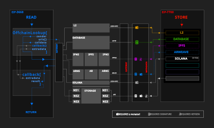
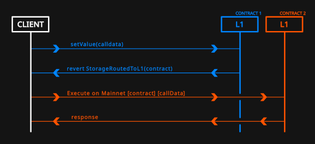
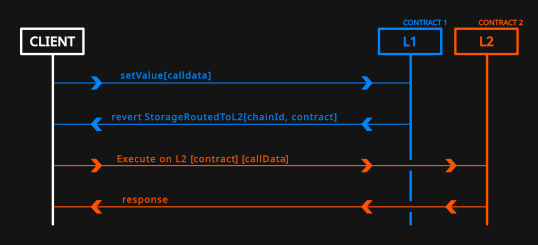
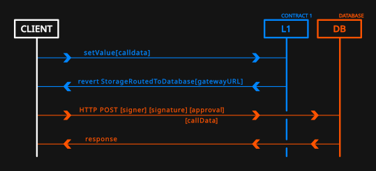
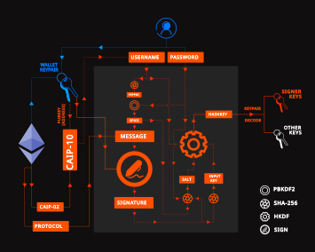

## 摘要
以下标准提供了一种机制，智能合约可以通过该机制将存储路由到外部提供商。特别是，协议可以通过将存储操作的处理路由到另一个系统或网络，来减少与在主网上存储数据相关的 gas 费用。这些存储路由器充当核心 L1 合约的扩展。本文档中的方法专门针对存储路由到三种路由器类型（L1、L2 和数据库）的安全性以及成本效益。使用这些方法写入的跨链数据可以被通用的 [EIP-3668](./eip-3668) 兼容合约检索，从而完成跨链数据生命周期。该文档，昵称为 CCIP-Store，与 [EIP-3668](./eip-3668) 一起，是朝着为跨链存储路由器和数据检索提供安全基础设施迈出的有意义的一步。

## 动机
[EIP-3668](./eip-3668)，又名“CCIP-Read”，一直是为以太坊区块链上的各种合约检索跨链数据的关键，这些合约范围从 DeFi 合约的价格提要，到最近 ENS 用户的记录。后一种情况专门使用跨链存储来绕过通常与链上存储相关的高 gas 费用；这一方面有大量超出 ENS 记录的用例，并且有可能对以太坊的普遍可负担性和可访问性产生重大影响。

通过 [EIP-3668](./eip-3668) 进行跨链数据检索相对简单，因为它假设来自跨链存储的所有相关数据都由兼容 CCIP-Read 的 HTTP 网关转换；这包括 L2 链和数据库。但另一方面，到目前为止，每个利用 CCIP-Read 的服务都必须自己安全地将这些数据写入这些存储类型，同时还在其兼容 CCIP-Read 的合约中加入合理的安全措施，以便在 L1 上验证这些数据。虽然这些安全措施是内置到 L2 架构中的，但数据库存储提供商另一方面必须在存储操作期间加入某种形式的显式安全措施，以便跨链数据的完整性可以在数据检索阶段由 CCIP-Read 合约验证。这方面的例子包括：

- 允许管理命名空间的服务，例如，像 ENS 域名一样存储在 L2 解决方案或链下数据库上的 ENS 域名，以及
- 允许管理存储在外部存储上的数字身份的服务，就像它们存储在原生 L1 智能合约中一样。

在这种情况下，允许将存储路由到外部路由器的规范将有助于创建与底层存储解决方案无关的服务。反过来，这使得新的应用程序无需了解底层路由器即可运行。这个“CCIP-Store”提案精确地概述了流程中的这一部分，即智能合约如何将定制存储路由到 L2 和数据库。



## 规范
### 概述
以下规范围绕跨链存储路由器的结构和描述展开，该路由器负责写入 L2 或数据库存储。本文档介绍了 `StorageRoutedToL2()` 和 `StorageRoutedToDatabase()` 存储路由器，以及简单的 `StorageRoutedToL1()` 路由器，并建议通过新的 EIP 允许新的 `StorageRoutedTo__()` 回退，这些 EIP 充分详细说明其接口和设计。一些预见的新存储路由器的示例包括 Solana 的 `StorageRoutedToSolana()`、Filecoin 的 `StorageRoutedToFilecoin()`、IPFS 的 `StorageRoutedToIPFS()`、IPNS 的 `StorageRoutedToIPNS()`、Arweave 的 `StorageRoutedToArweave()`、ArNS 的 `StorageRoutedToArNS()`、Swarm 的 `StorageRoutedToSwarm()` 等。

### L1 路由器: `StorageRoutedToL1()`
一个最小的 L1 路由器是微不足道的，只需要 L1 `contract` 地址，必须将路由到该地址，而客户端必须确保 calldata 在路由到另一个合约时是不变的。下面给出了一个 L1 路由器的示例实现。

```solidity
// Define revert event
error StorageRoutedToL1(
    address contractL1
);

// Generic function in a contract
function setValue(
    bytes32 node,
    bytes32 key,
    bytes32 value
) external {
    // Get metadata from on-chain sources
    (
        address contractL1, // Routed contract address on L1; may be globally constant
    ) = getMetadata(node); // Arbitrary code
    // contractL1 = 0x32f94e75cde5fa48b6469323742e6004d701409b
    // Route storage call to L1 router
    revert StorageRoutedToL1( 
        contractL1
    );
};
```

在这个例子中，路由必须提示客户端使用完全相同的原始 calldat 构建交易，并通过调用完全相同的函数将其提交给 L1 `contract`。

```solidity
// Function in routed L1 contract
function setValue(
    bytes32 node,
    bytes32 key,
    bytes32 value
) external {
    // Some code storing data mapped by node & msg.sender
    ...
}
```



### L2 路由器: `StorageRoutedToL2()`
一个最小的 L2 路由器只需要 `chainId` 值的列表和相应的 L2 `contract` 地址，而客户端必须确保 calldata 在路由到 L2 时是不变的。下面显示了一个 L1 合约中 L2 路由器的示例实现。

```solidity
// Define revert event
error StorageRoutedToL2(
    address contractL2, 
    uint256 chainId
);

// Generic function in a contract
function setValue(
    bytes32 node,
    bytes32 key,
    bytes32 value
) external {
    // Get metadata from on-chain sources
    (
        address contractL2, // Contract address on L2; may be globally constant
        uint256 chainId // L2 ChainID; may be globally constant
    ) = getMetadata(node); // Arbitrary code
    // contractL2 = 0x32f94e75cde5fa48b6469323742e6004d701409b
    // chainId = 21
    // Route storage call to L2 router
    revert StorageRoutedToL2( 
        contractL2,
        chainId
    );
};
```

在这个例子中，路由必须提示客户端使用完全相同的原始 calldat 构建交易，并通过在 L2 上调用与 L1 上完全相同的函数将其提交给 L2。

```solidity
// Function in L2 contract
function setValue(
    bytes32 node,
    bytes32 key,
    bytes32 value
) external {
    // Some code storing data mapped by node & msg.sender
    ...
}
```



### 数据库路由器: `StorageRoutedToDatabase()`
最小的数据库路由器与 L2 类似，因为：

  a) 与 `chainId` 类似，它需要 `gatewayUrl`，负责处理链下存储操作，并且

  b) 与 `eth_call` 类似，它需要 `eth_sign` 输出以保护数据，客户端必须提示用户进行这些签名。

本规范不要求在 L1 上存储任何其他数据，除了定制的 `gatewayUrl`；因此，存储路由器只能在 revert 中返回 `gatewayUrl`。

```solidity
error StorageRoutedToDatabase(
    string gatewayUrl
);

// Generic function in a contract
function setValue(
    bytes32 node,
    bytes32 key,
    bytes32 value
) external {
    (
        string gatewayUrl // Gateway URL; may be globally constant
    ) = getMetadata(node);
    // gatewayUrl = "https://api.namesys.xyz"
    // Route storage call to database router
    revert StorageRoutedToDatabase( 
        gatewayUrl
    );
};
```



在 revert 之后，客户端必须采取以下步骤：

1. 请求用户提供一个秘密签名 `sigKeygen` 来生成一个确定性的 `dataSigner` 密钥对，

2. 使用生成的数据签名者的私钥对 calldata 进行签名，并生成可验证的数据签名 `dataSig`，

3. 请求用户 `approval` 批准生成的数据签名者，最后，

4. 将 calldata 与签名 `dataSig` 和 `approval` 以及 `dataSigner` 一起发布到网关。

这些步骤在下面详细描述。

#### 1. 生成数据签名者
数据签名者必须从以太坊钱包签名中确定性地生成；参见下图。



这种确定性密钥生成可以在一个统一的 `keygen()` 函数中简洁地实现，如下所示。

```js
/* Pseudo-code for key generation */
/* 密钥生成的伪代码 */
function keygen(
  username, // CAIP identifier for the blockchain account
  username, // 区块链账户的 CAIP 标识符
  sigKeygen, // Deterministic signature from wallet
  sigKeygen, // 来自钱包的确定性签名
  spice // Stretched password
  spice // 拉伸密码
) {
  // Calculate input key by hashing signature bytes using SHA256 algorithm
  // 通过使用 SHA256 算法散列签名字节来计算输入密钥
  let inputKey = sha256(sigKeygen);
  // Calculate salt for keygen by hashing concatenated username, stretched password (aka spice) and hex-encoded signature using SHA256 algorithm
  // 通过使用 SHA256 算法散列连接的用户名、拉伸密码（又名 spice）和十六进制编码的签名来计算密钥生成的 salt
  let salt = sha256(`${username}:${spice}:${sigKeygen}`);
  // Calculate hash key output by feeding input key, salt & username to the HMAC-based key derivation function (HKDF) with dLen = 42
  // 通过将输入密钥、salt 和用户名提供给基于 HMAC 的密钥派生函数 (HKDF)，其中 dLen = 42，来计算哈希密钥输出
  let hashKey = hkdf(sha256, inputKey, salt, username, 42);
  // Calculate and return secp256k1 keypair
  // 计算并返回 secp256k1 密钥对
  return secp256k1(hashKey); // Calculate secp256k1 keypair from hash key
  return secp256k1(hashKey); // 从哈希密钥计算 secp256k1 密钥对
}
```

此 `keygen()` 函数需要三个变量：`username`、`spice` 和 `sigKeygen`。它们的定义如下。

##### 1. `username`
[CAIP-10](https://github.com/ChainAgnostic/CAIPs/blob/ad0cfebc45a4b8368628340bf22aefb2a5edcab7/CAIPs/caip-10.md) 标识符 `username` 是使用 [EIP-155](./eip-155) 从连接的钱包的校验和地址 `wallet` 和 `chainId` 自动派生的。

```js
/* CAIP-10 identifier */
/* CAIP-10 标识符 */
const caip10 = `eip155:${chainId}:${wallet}`;
```

##### 2. `spice`
`spice` 是从可选的私有字段 `password` 计算出来的，客户端必须提示用户输入此字段；此字段允许用户更改给定 `username` 的数据签名者。
```js
/* Secret derived key identifier */ 
/* 秘密派生密钥标识符 */ 
// Clients must prompt the user for this
// 客户端必须提示用户输入此内容
const password = 'key1';
```

密码必须在使用 `PBKDF2` 算法之前进行拉伸，以便：

```js
/* Calculate spice by stretching password */
/* 通过拉伸密码来计算 spice */
let spice = pbkdf2(
            password, 
            pepper, 
            iterations
        ); // Stretch password with PBKDF2
        ); // 使用 PBKDF2 拉伸密码
```

其中 `pepper = keccak256(abi.encodePacked(username))` 并且 `iterations` 计数固定为 `500,000` 以进行暴力破解漏洞保护。

```js
/* Definitions of pepper and iterations in PBKDF2 */
/* PBKDF2 中 pepper 和迭代的定义 */
let pepper = keccak256(abi.encodePacked(username));
let iterations = 500000; // 500,000 iterations
let iterations = 500000; // 500,000 次迭代
```

##### 3. `sigKeygen`
数据签名者必须从节点的 owner 或 manager 密钥派生。所需 `sigKeygen` 的消息有效负载必须格式化为：

```text
Requesting Signature To Generate Keypair(s)\n\nOrigin: ${username}\nProtocol: ${protocol}\nExtradata: ${extradata}
请求签名以生成密钥对\n\n来源：${username}\n协议：${protocol}\n额外数据：${extradata}
```

其中 `extradata` 的计算方式如下，

```solidity
// Calculating extradata in keygen signatures
// 计算密钥生成签名中的额外数据
bytes32 extradata = keccak256(
    abi.encodePacked(
        spice
        wallet
    )
)
```

剩余的 `protocol` 字段是一个特定于协议的标识符，将范围限制为由唯一合约地址表示的特定协议。此标识符不能是全局的，并且必须为每个实现 L1 `contract` 唯一定义，以便：

```js
/* Protocol identifier in CAIP-10 format */
/* CAIP-10 格式的协议标识符 */
const protocol = `eth:${chainId}:${contract}`;
```

使用签名消息有效负载的这种确定性格式，客户端必须提示用户输入以太坊签名。一旦用户签署消息，`keygen()` 函数就可以派生出数据签名者密钥对。

#### 2. 签名数据
由于派生的签名者是特定于钱包的，它可以

- 同时签署给定节点的多个密钥的批量数据，并且
- 同时签署由钱包拥有的多个节点的批量数据

在后台，无需提示用户。伴随链下 calldata 的签名 `dataSig` 必须在其消息有效负载中实现以下格式：

```text
Requesting Signature To Update Off-Chain Data\n\nOrigin: ${username}\nData Type: ${dataType}\nData Value: ${dataValue}
请求签名以更新链下数据\n\n来源：${username}\n数据类型：${dataType}\n数据值：${dataValue}
```

其中 `dataType` 参数是特定于协议的，并格式化为以 `/` 分隔的对象键。例如，如果链下数据嵌套在键中，如 `a > b > c > field > key`，则等效的 `dataType` 是 `a/b/c/field/key`。例如，为了更新链下 ENS 记录 `text > avatar` 和 `address > 60`，`dataType` 必须分别格式化为 `text/avatar` 和 `address/60`。
 
#### 3. 批准数据签名者
`dataSigner` 不存储在 L1 上，客户端必须

- 请求由节点的 owner 或 manager 签名的 `dataSigner` 的 `approval` 签名，并且
- 将此 `approval` 和 `dataSigner` 与以编码形式签名的 calldata 一起发布。

启用 CCIP-Read 的合约随后可以在解析时验证通过签名 calldata 附加的 `approval` 是否来自节点的 manager 或 owner，并且它批准了预期的 `dataSigner`。`approval` 签名必须具有以下消息有效负载格式：

```text
Requesting Signature To Approve Data Signer\n\nOrigin: ${username}\nApproved Signer: ${dataSigner}\nApproved By: ${caip10}
请求签名以批准数据签名者\n\n来源：${username}\n批准的签名者：${dataSigner}\n批准者：${caip10}
```

其中 `dataSigner` 必须进行校验和。

#### 4. 发布兼容 CCIP-Read 的有效负载
链下数据文件中最终的兼容 [EIP-3668](./eip-3668) 的 `data` 有效负载由一个固定的 `callback.signedData.selector` 标识，该选择器等于 `0x2b45eb2b` 并且必须遵循以下格式

```solidity
/* Compile CCIP-Read-compatible payload*/
/* 编译兼容 CCIP-Read 的有效负载 */
bytes encodedData = abi.encode(['bytes'], [dataValue]); // Encode data
bytes encodedData = abi.encode(['bytes'], [dataValue]); // 编码数据
bytes funcSelector = callback.signedData.selector; // Identify off-chain data with a fixed 'signedData' selector = '0x2b45eb2b'
bytes funcSelector = callback.signedData.selector; // 使用固定的“signedData”选择器 = '0x2b45eb2b' 标识链下数据
bytes data = abi.encode(
    ['bytes4', 'address', 'bytes32', 'bytes32', 'bytes'],
    [funcSelector, dataSigner, dataSig, approval, encodedData]
); // Compile complete CCIP-Readable off-chain data
); // 编译完整的 CCIP 可读链下数据
```

客户端必须构造此 `data` 并将其与索引的原始值一起传递给 `POST` 请求中的网关。启用 CCIP-Read 的合约在从 `data` 解码四个参数后必须

- 通过 `approval` 验证 `dataSigner` 是否已获得节点 owner 或 manager 的批准，并且
- 验证 `dataSig` 是否由 `dataSigner` 产生

在解码形式下解析 `encodedData` 值之前。

##### `POST` 请求
客户端向 `gatewayUrl` 发出的 `POST` 请求必须遵循如下所述的格式。

```ts
/* POST request format*/
/* POST 请求格式 */
type Post = {
  node: string
  node: string
  preimage: string
  preimage: string
  chainId: number
  chainId: number
  approval: string
  approval: string
  payload: {
    payload: {
    field1: {
      field1: {
      value: string
      value: string
      signature: string
      signature: string
      timestamp: number
      timestamp: number
      data: string
      data: string
    }
    field2: [
      field2: [
      {
        {
        index: number
        index: number
        value: string
        value: string
        signature: string
        signature: string
        timestamp: number
        timestamp: number
        data: string
        data: string
      }
    ]
    field3: [
      field3: [
      {
        {
        key: number
        key: number
        value: string
        value: string
        signature: string
        signature: string
        timestamp: number
        timestamp: number
        data: string
        data: string
      }
    ]
  }
}
```

下面显示了一个完整的 `Post` 类型对象示例，用于更新节点的多个 ENS 记录。

```ts
/* Example of a POST request */
/* POST 请求示例 */
let post: Post = {
  node: "0xe8e5c24bb5f0db1f3cab7d3a7af2ecc14a7a4e3658dfb61c9b65a099b5f086fb",
  preimage: "dev.namesys.eth",
  chainId: 1,
  approval: "0xa94da8233afb27d087f6fbc667cc247ef2ed31b5a1ff877ac823b5a2e69caa49069f0daa45a464d8db2f8e4e435250cb446d8f279d45a2b865ebf2fff291f69f1c",
  payload: {
    contenthash: {
      value: "ipfs://QmYSFDzEcmk25JPFrHBHSMMLcTKLm6SvuZvKpijTHBnAYX",
      signature: "0x24730d1d85d556245b7766aef413188e22f219c8de263ccbfafee4413f0937c32e4f44068d84c7424f923b878dcf22184f8df86506de1cea3dad932c5bd5e9de1c",
      timestamp: 1708322868,
      data: "0x2b45eb2b000000000000000000000000fe889053f7a0d2571f1898d2835c3cbdf50d766b000000000000000000000000000000000000000000000000000000000000008000000000000000000000000000000000000000000000000000000000000001000000000000000000000000000000000000000000000000000000000000000180000000000000000000000000000000000000000000000000000000000000004124730d1d85d556245b7766aef413188e22f219c8de263ccbfafee4413f0937c32e4f44068d84c7424f923b878dcf22184f8df86506de1cea3dad932c5bd5e9de1c000000000000000000000000000000000000000000000000000000000000000000000000000000000000000000000000000000000000000000000000000041a94da8233afb27d087f6fbc667cc247ef2ed31b5a1ff877ac823b5a2e69caa49069f0daa45a464d8db2f8e4e435250cb446d8f279d45a2b865ebf2fff291f69f1c00000000000000000000000000000000000000000000000000000000000000000000000000000000000000000000000000000000000000000000000000008000000000000000000000000000000000000000000000000000000000000000200000000000000000000000000000000000000000000000000000000000000026e301017012209603ccbcef5c2acd57bdec6a63e8a0292f3ce6bb583b6826060bcdc3ea84ad900000000000000000000000000000000000000000000000000000"
    },
    address: [
      {
        coinType: 0,
        value: "1FfmbHfnpaZjKFvyi1okTjJJusN455paPH",
        signature: "0x60ecd4979ae2c39399ffc7ad361066d46fc3d20f2b2902c52e01549a1f6912643c21d23d1ad817507413dc8b73b59548840cada57481eb55332c4327a5086a501b",
        timestamp: 1708322877,
        data: "0x2b45eb2b000000000000000000000000fe889053f7a0d2571f1898d2835c3cbdf50d766b00000000000000000000000000000000000000000000000000000000000000800000000000000000000000000000000000000000000000000000000000000100000000000000000000000000000000000000000000000000000000000000018000000000000000000000000000000000000000000000000000000000000004160ecd4979ae2c39399ffc7ad361066d46fc3d20f2b2902c52e01549a1f6912643c21d23d1ad817507413dc8b73b59548840cada57481eb55332c4327a5086a501b000000000000000000000000000000000000000000000000000000000000000000000000000000000000000000000000000000000000000000000000000041a94da8233afb27d087f6fbc667cc247ef2ed31b5a1ff877ac823b5a2e69caa49069f0daa45a464d8db2f8e4e435250cb446d8f279d45a2b865ebf2fff291f69f1c000000000000000000000000000000000000000000000000000000000000000000000000000000000000000000000000000000000000000000000000000020000000000000000000000000a0e6ca5444e4d8b7c80f70237f332320387f18c7"
      },
      {
        coinType: 60,
        value: "0x47C10B0491A138Ddae6cCfa26F17ADCfCA299753",
        signature: "0xaad74ddef8c031131b6b83b3bf46749701ed11aeb585b63b72246c8dab4fff4f79ef23aea5f62b227092719f72f7cfe04f3c97bfad0229c19413f5cb491e966c1b",
        timestamp: 1708322917,
        data: "0x2b45eb2b000000000000000000000000fe889053f7a0d2571f1898d2835c3cbdf50d766b0000000000000000000000000000000000000000000000000000000000000080000000000000000000000000000000000000000000000000000000000000010000000000000000000000000000000000000000000000000000000000000001800000000000000000000000000000000000000000000000000000000000000041aad74ddef8c031131b6b83b3bf46749701ed11aeb585b63b72246c8dab4fff4f79ef23aea5f62b227092719f72f7cfe04f3c97bfad0229c19413f5cb491e966c1b000000000000000000000000000000000000000000000000000000000000000000000000000000000000000000000000000000000000000000000000000041a94da8233afb27d087f6fbc667cc247ef2ed31b5a1ff877ac823b5a2e69caa49069f0daa45a464d8db2f8e4e435250cb446d8f279d45a2b865ebf2fff291f69f1c00000000000000000000000000000000000000000000000000000000000000000000000000000000000000000000000000000000