## 摘要

本提案介绍了一种智能合约将其能力委托给其他智能合约或外部账户 (EOA) 的标准方法。委托合约（委托者）必须能够授权 `DelegationManager` 合约调用委托者来执行所需的操作。

该框架使委托合约能够委托其有权执行的任何操作，从而实现更灵活和可扩展的合约交互。本标准概述了促进此类委托所需的最小接口。

此外，本提案与 [ERC-4337](./eip-4337.md) 兼容，尽管其实现不需要 [ERC-4337](./eip-4337.md)。

## 动机

以太坊上智能合约的开发导致了各种各样的去中心化应用程序 (dApps)，这些应用程序利用可组合性以创新的方式相互交互。虽然当前的智能合约确实有能力协同工作，从而实现这些交互，但启用这些交互，尤其是在共享能力或权限方面，仍然是一个繁琐且通常耗费 gas 的过程，并且缺乏向后兼容性。

目前，为了使智能合约能够与另一个智能合约交互或利用其功能，通常需要硬编码权限或开发定制的中间合约。这不仅增加了复杂性和开发时间，而且导致更高的部署和执行 gas 成本。此外，这些交互的刚性限制了适应新要求或以动态方式委托特定、有限权限的能力。

此外，需要为每次交互重复签名会在用户体验中产生摩擦，尤其是在需要频繁或自动交互的场景中。

拟议的标准旨在通过一次签名创建长期会话和委托权限来解决这些挑战。这些委托可用于：
- 与不需要重复签名的 dApp 建立持久会话
- 向 AI 代理或自动化系统授予有限权限
- 创建具有特定功能的可共享邀请链接
- 使第三方委托能够在明确定义的策略约束内行事

通过允许使用单个签名创建开放式但受策略约束的委托，此标准有助于最大限度地减少用户交互，同时最大限度地提高其有意义的内容。用户可以授予具有明确界限的特定功能，而不是重复签署类似的权限。

拟议的标准旨在简化和标准化合约之间的委托过程，从而降低与共享功能相关的运营复杂性和 gas 成本。通过建立一个用于委托权限的通用框架，我们可以简化以太坊生态系统内的交互，使合约更加灵活、经济高效并适应各种应用程序的需求。这为协作和创新开辟了新的可能性，使 dApp 能够以更无缝和高效的方式利用彼此的优势。

## 规范

本文档中的关键词“必须”、“禁止”、“必需”、“应”、“不应”、“应该”、“不应该”、“推荐”、“不推荐”、“可以”和“可选”应按照 RFC 2119 和 RFC 8174 中的描述进行解释。

### 术语

- **委托者** 是可以创建委托的智能合约。
- **委托管理器** 是验证委托权限并调用 *委托者* 执行操作的智能合约。它实现了 `ERC7710Manager` 接口。委托管理器验证和处理委托兑换，并且可以存在具有不同实现的多个委托管理器。合约账户可以成为其自身的委托管理器。
- **委托** 是授予另一地址执行特定操作的权限。
- **被委托人** 是具有兑换委托权限的智能合约、智能合约账户或 EOA。
- **兑换者** 是正在使用委托的 *被委托人*。

### 获取委托

被委托人获取委托的过程有意不在本 ERC 的范围内。本 ERC 仅关注于兑换委托的接口和委托权限的验证。请求和授予委托的机制可以根据用例以各种方式实现，例如通过 [ERC-7715](./eip-7715.md) 或其他协议。这种关注点分离允许在如何创建委托方面具有灵活性，同时保持其兑换的一致接口。

### 概述

#### 兑换委托

当被委托人希望兑换委托时，他们会调用委托管理器上的 `redeemDelegations` 函数，并传入他们想要执行的操作以及他们代表执行的权限证明（即委托）。然后，委托管理器验证委托的有效性，如果有效，则调用委托者上的特权函数，该函数代表委托者执行指定的功能。



### 接口

#### `ERC7710Manager.sol`

委托管理器必须实现 `redeemDelegations`，该函数将负责验证要兑换的委托，然后调用委托者来执行操作。

作为参数传递给 `redeemDelegations` 函数的字节数组 `_permissionContexts` 包含代表委托合约执行特定操作的权限。

作为参数传递给 `redeemDelegations` 函数的 bytes32 数组 `_modes` 和字节数组 `_executionCallDatas` 是 `mode` 和 `executionCalldata` 的数组，它们在 [ERC-7579](./eip-7579.md)（在“执行行为”部分下）中精确定义。简而言之，`mode` 编码了执行的“行为”，可以是单次调用、批量调用等。`executionCallData` 编码了执行的数据，通常至少包括一个 `target`、一个 `value` 和一个 `to` 地址。

这三个数组必须被解释为元组列表，其中每个元组由 (`_permissionContexts[i]`, `_modes[i]`, `_executionCallDatas[i]`) 组成。如果数组长度不同，则该函数必须恢复。每个元组代表一个单独的委托兑换及其相关的权限上下文、执行模式和执行数据。实现必须强制执行批处理的原子性。

#### 权限验证

虽然此接口不包括用于检查委托权限的显式方法，但 dApp 应该在尝试执行操作之前验证权限，方法是：

1. 使用预期参数模拟 `redeemDelegations` 调用
2. 使用模拟结果来确定委托是否会成功
3. 如果模拟失败，则 dApp 可以从用户处请求新的或更新的权限

这种基于模拟的方法比委托管理器公开的方法提供更强的保证，因为它验证整个执行上下文，而不是委托管理器的声明。

```solidity
pragma solidity 0.8.23;

/**
 * @title ERC7710Manager
 * @notice 委托管理器的接口，它公开 redeemDelegations 函数。
 */
interface ERC7710Manager {
    /**
     * @notice 此方法验证提供的权限上下文，如果调用者有权执行，则执行该执行。
     * @dev _permissionContexts bytes[] 的结构由特定的委托管理器实现决定
     * @param _permissionContexts 用于验证授予执行相应执行的权限的数据。
     * @param _action 要执行的操作
     * @param _modes 要执行相关 executioncallData 的模式数组
     * @param _executionCallDatas 要执行的编码的执行数组
     */
  function redeemDelegations(
    bytes[] calldata _permissionContexts,
    bytes32[] calldata _modes,
    bytes[] calldata _executionCallData
  ) external;
}
```

## 原理

本 ERC 的设计动机是需要在以太坊生态系统中引入标准化、安全和高效的委托机制。考虑了以下几个方面：

**灵活性和可扩展性**：拟议的接口被设计为最小但功能强大，允许合约委托各种操作，而不会增加繁重的实现负担。这种平衡旨在鼓励广泛采用和创新。

**互操作性**：与现有标准（例如 [ERC-1271](./eip-1271.md) 和 [ERC-4337](./eip-4337.md)）的兼容性确保了此方法可以无缝集成到当前的以太坊基础设施中。这鼓励了采用并利用了现有的安全实践。

**可用性**：通过使合约能够将特定操作委托给其他人，我们为更用户友好的 DApp 打开了大门，这些 DApp 可以代表用户执行各种任务，减少了对持续用户交互的需求并增强了整体用户体验。

本 ERC 代表着朝着更互联和灵活的以太坊生态系统迈出的一步，智能合约可以更有效地协作并适应用户的需求。

### 执行接口

本规范的先前迭代将 `Action` 定义为一个简单的 `(target, value, data)` 元组，并在委托者上定义了一个特定的执行接口 `executeDelegatedAction(Action _action)`，委托管理器应该调用它。

该方法存在一些缺点：

- 现有的智能账户将与本规范不兼容（除非它们恰好实现了执行接口）。
- 执行行为仅限于单次调用，因为 `Action` 只能编码单次调用。这使得批量处理、delegatecall 和 CREATE2 等复杂的执行行为成为不可能。

为了解决第一个问题，我们决定删除委托者实现任何特定接口的要求。相反，我们依赖委托管理器来正确调用委托者，并且我们依赖委托者只会为知道如何正确调用它的委托管理器创建 `_permissionContexts` 这一事实。

为了解决第二个问题，我们决定采用 [ERC-7579](./eip-7579.md) 中的执行接口，该接口必须在模块化智能账户的上下文中解决类似的问题：定义一个可以支持多种执行类型的标准化执行接口。

## 参考实现

对于侧重于委托兑换的最小参考实现，请参阅 [Example7710Manager](../assets/eip-7710/Example7710Manager.sol)。

有关委托管理器的完整参考实现，请参阅 MetaMask 委托框架，其中包括以下功能：

- [EIP-712](./eip-712.md) 签名验证委托
- 支持 EOA 和合约签名 (ERC-1271)
- 用于细粒度委托控制的警告强制执行
- 批量委托处理
- 委托撤销机制

MetaMask 实现演示了一种构建强大的委托系统的方法，同时遵守本标准Interface的要求。

## 安全考虑

定制授权术语的引入需要仔细考虑授权数据的结构和解释方式。潜在的安全风险包括授权术语的误解以及如果未正确实施接口而采取的未经授权的操作。建议实施此接口的应用程序进行彻底的安全审计，以确保安全地处理授权术语。

### 权限验证

dApp 绝不能假设过去收到委托保证了未来的执行权。委托可能会被撤销、过期或因状态更改而失效。为确保可靠运行：

1. 始终在链上提交委托兑换之前模拟它们
2. 在需要时通过请求新权限来优雅地处理模拟失败
3. 考虑使用不断升级的权限请求来实现重试逻辑
4. 准备好让委托在模拟和执行之间失效

需要讨论。 <!-- TODO -->

## 版权

版权及相关权利通过 [CC0](../LICENSE.md) 放弃。
