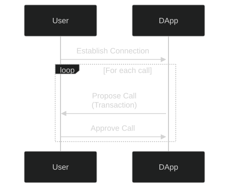
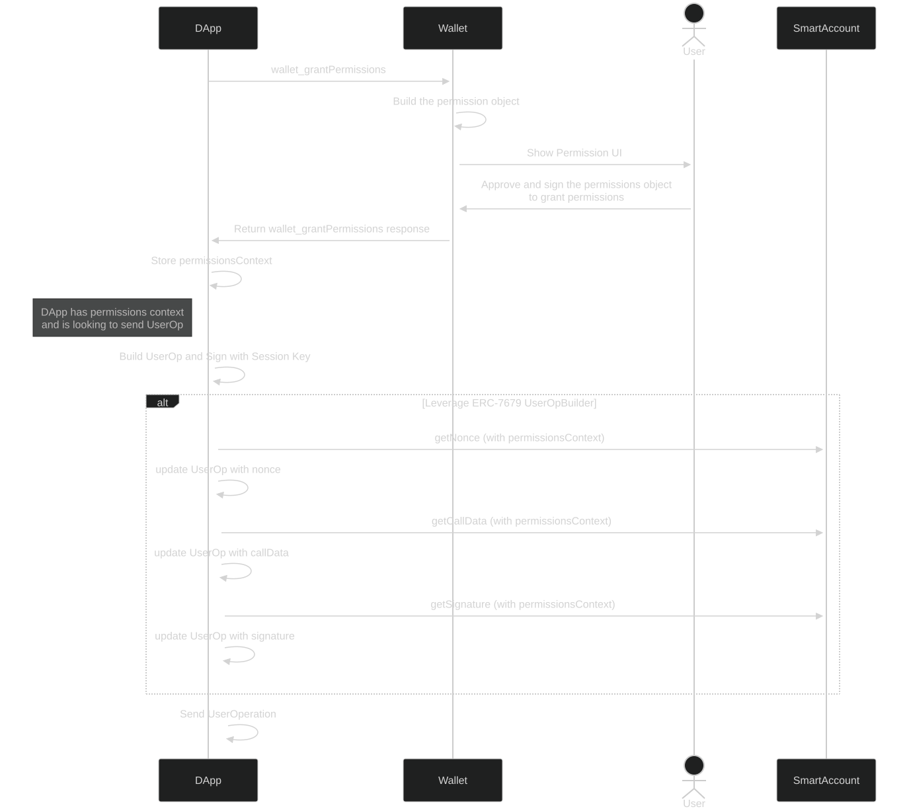

```md
---
eip: 7715
title: 从钱包授予权限
description: 添加用于从钱包授予权限的 JSON-RPC 方法
author: Luka Isailovic (@lukaisailovic), Derek Rein (@arein), Dan Finlay (@danfinlay), Derek Chiang (@derekchiang), Fil Makarov (@filmakarov), Pedro Gomes (@pedrouid), Conner Swenberg (@ilikesymmetry), Lukas Rosario (@lukasrosario)
discussions-to: https://ethereum-magicians.org/t/erc-7715-grant-permissions-from-wallets/20100
status: Draft
type: Standards Track
category: ERC
created: 2024-05-24
requires: 4337, 5792, 7679, 7710
---

## 摘要

我们定义了一个新的 JSON-RPC 方法 `wallet_grantPermissions`，供 DApp 请求钱包授予权限，以便代表用户执行交易。这实现了两个用例：

- 为没有钱包连接的用户执行交易。
- 为具有权限范围的钱包连接的用户执行交易。

## 动机

目前，大多数 DApp 实现的流程类似于以下内容：



每次交互都需要用户使用他们的钱包签署交易。问题是：

- 用户手动批准每笔交易可能会很麻烦，尤其是在游戏等高度互动的应用程序中。
- 无法为没有有效钱包连接的用户发送交易。这使得订阅、被动投资、限价单等用例失效。

在 AA 的上下文中，存在多个特定于供应商的会话密钥实现，这些密钥是具有特定权限的临时密钥。但是，由于这些实现是特定于供应商的，因此 DApp 无法以统一的方式从钱包“请求”会话密钥，而不管具体的钱包实现如何。

## 规范

本文档中的关键词“必须”，“禁止”，“需要”，“应该”，“不应该”，“推荐”，“可以”和“可选”应按照 RFC 2119 中的描述进行解释。

### `wallet_grantPermissions`

我们引入了一个 `wallet_grantPermissions` 方法，供 DApp 请求钱包授予权限。

#### 权限模式

```tsx
type PermissionRequest = {
  chainId: Hex; // uint256 的十六进制编码
  address?: Address;
  expiry: number; // unix 时间戳
  signer: {
    type: string; // 由 ERC 定义的枚举
    data: Record<string, any>;
  };
  permissions: {
    type: string; // 由 ERC 定义的枚举
    data: Record<string, any>;
  }[];
}[];
```

`chainId` 定义了 [EIP-155](./eip-155.md) 的链，它适用于此权限请求，所有地址都可以在其他参数中找到定义。

`address` 标识了此权限请求的目标帐户，这在已建立连接并且已公开多个帐户时非常有用。 它是可选的，允许用户选择要授予哪个帐户的权限。

`expiry` 是一个 UNIX 时间戳（以秒为单位），指定此会话必须过期的截止时间。

`signer` 是一个字段，用于标识与权限关联的密钥或帐户，或者钱包将管理会话。 有关详细信息，请参见“签名者”部分。

`permissions` 定义了签名者可以代表帐户执行的允许行为。 有关详细信息，请参见“权限”部分。

**请求示例**：

`PermissionRequest` 对象的数组是 `wallet_grantPermissions` RPC 期望的最终 `params` 字段。

```tsx
[
    {
        chainId: 123,
        address: '0x...'
        expiry: 1577840461
        signer: {
            type: 'account',
            data: {
                address:'0x016562aA41A8697720ce0943F003141f5dEAe006',
            }
        },
        permissions: [
          {
            type: 'native-token-transfer',
            data: {
                allowance: '0x1DCD6500'
            }
          }
        ],
    }
]
```

#### 响应规范

```tsx
type PermissionResponse = PermissionRequest & {
  context: Hex;
  accountMeta?: {
    factory: `0x${string}`;
    factoryData: `0x${string}`;
  };
  signerMeta?: {
    // 7679 userOp 构建
    userOpBuilder?: `0x${string}`;
    // 7710 委托
    delegationManager?: `0x${string}`;
  };
};
```

首先请注意，响应包含原始请求的所有参数，并且不能保证收到的值与请求的值等效。

`context` 是一个包含所有内容的字段，用于标识吊销权限或提交 userOps 的权限，并且还可以包含非识别数据。它可能是 [ERC-7679](./eip-7679.md) 和 [ERC-7710](./eip-7710.md) 中定义的 `context`。有关详细信息，请参见“原理”部分。

`accountMeta` 是可选的，但存在时，`factory` 和 `factoryData` 字段是必需的，如 [ERC-4337](./eip-4337.md) 中所定义。它们要么都指定，要么都不指定。如果帐户尚未部署，则钱包必须返回 `accountMeta`，并且 DApp 必须通过使用 `factoryData` 作为 calldata 调用 `factory` 合约来部署该帐户。

`signerMeta` 取决于帐户类型。如果签名者类型为 `wallet`，则不是必需的。如果签名者类型为 `key` 或 `keys`，则需要 `userOpBuilder`，如 [ERC-7679](./eip-7679.md) 中所定义。如果签名者类型为 `account`，则需要 `delegationManager`，如 [ERC-7710](./eip-7710.md) 中所定义。

如果请求格式错误或钱包无法/不愿意授予权限，则钱包必须返回错误，错误代码如 [ERC-1193](./eip-1193.md) 中所定义。

`wallet_grantPermissions` 响应示例：

`PermissionResponse` 对象的数组是 `wallet_grantPermissions` RPC 期望的最终 `result` 字段。

```tsx
[
    {
        // 带有修改的原始请求
        chainId: 123,
        address: '0x...'
        expiry: 1577850000
        signer: {
            type: 'account',
            data: {
                address:'0x016562aA41A8697720ce0943F003141f5dEAe006',
            }
        },
        permissions: [
          {
            type: 'native-token-transfer',
            data: {
                allowance: '0x1DCD65000000'
            }
          },
        ]
        // 响应特定的字段
        context: "0x0x016562aA41A8697720ce0943F003141f5dEAe0060000771577157715"
    }
]
```

### `wallet_revokePermissions`

可以通过调用此方法来撤销权限，如果成功，钱包将以空响应进行响应。

#### 请求规范

```tsx
type RevokePermissionsRequestParams = {
  permissionContext: "0x{string}";
};
```

#### 响应规范

```tsx
type RevokePermissionsResponseResult = {};
```

### 签名者和权限类型

在此 ERC 中，我们指定了我们期望常用的签名者和权限列表。

此 ERC 未指定签名者或权限的详尽列表，因为我们希望随着钱包变得更加高级，会开发更多签名者和权限类型。 只要 DApp 和钱包都愿意支持，签名者或权限类型就是有效的。

但是，如果两个签名者或两个权限共享相同的类型名称，则 DApp 可能会请求一种类型的签名者或权限，而钱包授予另一种类型的签名者或权限。 因此，重要的是，没有两个签名者或两个权限共享相同的类型。 因此，新的签名者或权限类型应在 ERC 中指定，或者作为此 ERC 的修订版，或者在另一个 ERC 中指定。

#### 签名者

```tsx
// 钱包是这些权限的签名者
// 此签名者类型不需要 `data`，因为钱包既是签名者又是授予者
type WalletSigner = {
  type: "wallet";
  data: {};
};

// 以下 `key` 和 `keys` 签名者类型支持的密钥类型。
type KeyType = "secp256r1" | "secp256k1" | "ed25519" | "schnorr";

// 表示单个密钥的签名者。
// “Key”类型显式为 secp256r1 (p256) 或 secp256k1，并且公钥采用十六进制编码。
type KeySigner = {
  type: "key";
  data: {
    type: KeyType;
    publicKey: `0x${string}`;
  };
};

// 表示多重签名签名者的签名者。
// `publicKeys` 的每个元素都显式地是相同的 `KeyType`，并且公钥采用十六进制编码。
type MultiKeySigner = {
  type: "keys";
  data: {
    keys: {
      type: KeyType;
      publicKey: `0x${string}`;
    }[];
  };
};

// 可以授予权限的帐户，如 ERC-7710 中所述。
type AccountSigner = {
  type: "account";
  data: {
    address: `0x${string}`;
  };
};
```

#### 权限

```tsx
// 原生代币转移，例如 Ethereum 上的 ETH
type NativeTokenTransferPermission = {
  type: "native-token-transfer";
  data: {
    allowance: "0x..."; // 十六进制值
  };
};

// ERC20 代币转移
type ERC20TokenTransferPermission = {
  type: "erc20-token-transfer";
  data: {
    address: "0x..."; // erc20 合约
    allowance: "0x..."; // 十六进制值
  };
};

// ERC721 代币转移
type ERC721TokenTransferPermission = {
  type: "erc721-token-transfer";
  data: {
    address: "0x..."; // erc721 合约
    tokenIds: "0x..."[]; // 十六进制值数组
  };
};

// ERC1155 代币转移
type ERC1155TokenTransferPermission = {
  type: "erc1155-token-transfer";
  data: {
    address: "0x..."; // erc1155 合约
    allowances: {
      [tokenId: string]: "0x..."; // 十六进制值
    };
  };
};

// 会话中总共花费的最大 gas 限制
type GasLimitPermission = {
  type: "gas-limit";
  data: {
    limit: "0x..."; // 十六进制值
  };
};

// 会话总共可以进行的调用次数
type CallLimitPermission = {
  type: "call-limit";
  data: {
    count: number;
  };
};

// 会话在每个时间间隔内可以进行的调用次数
type RateLimitPermission = {
  type: "rate-limit";
  data: {
    count: number; // 每个时间间隔内的次数
    interval: number; // 以秒为单位
  };
};
```

### 钱包管理的会话

如果签名者指定为 `wallet`，则钱包本身管理会话。 如果钱包批准了请求，则必须接受 [ERC-5792](./eip-5792.md) 的 `wallet_sendCalls`，并具有 `permissions` 功能，其中可能包括具有 `permissionsContext` 的会话。 例如：

```tsx
[
  {
    version: "1.0",
    chainId: "0x01",
    from: "0xd46e8dd67c5d32be8058bb8eb970870f07244567",
    calls: [
      {
        to: "0xd46e8dd67c5d32be8058bb8eb970870f07244567",
        value: "0x9184e72a",
        data: "0xd46e8dd67c5d32be8d46e8dd67c5d32be8058bb8eb970870f072445675058bb8eb970870f072445675",
      },
      {
        to: "0xd46e8dd67c5d32be8058bb8eb970870f07244567",
        value: "0x182183",
        data: "0xfbadbaf01",
      },
    ],
    capabilities: {
      permissions: {
        context: "<permissionContext>",
      },
    },
  },
];
```

收到此请求后，钱包必须按照请求的权限发送调用。 钱包不应要求用户进行进一步的交易确认。

### 功能

如果钱包支持 [ERC-5792](./eip-5792.md)，则钱包应使用 `permissions` 密钥响应 **`wallet_getCapabilities`** 请求。

钱包应在响应中包含 `signerTypes` (`string[]`) 和 `permissionTypes` (`string[]`)，以指定其支持的签名者类型和权限类型。
例如：

```json
{
  "0x123": {
    "permissions": {
      "supported": true,
      "signerTypes": ["keys", "account"],
      "keyTypes": ["secp256k1", "secp256r1"],
      "permissionTypes": ["erc20-token-transfer", "erc721-token-transfer"]
    }
  }
}
```

如果钱包使用 CAIP-25 授权，则钱包应在 CAIP-25 `sessionProperties` 对象中包含 `permissions` 密钥。 要包含的其他密钥是 `permissionTypes`，其中包含以逗号分隔的支持的权限类型列表，以及 `signerTypes`，其中包含以逗号分隔的支持的签名者类型列表。

例如：

```json
{
  //...
  "sessionProperties": {
    "permissions": "true",
    "signerTypes": "keys,account",
    "permissionTypes": "erc20-token-transfer,erc721-token-transfer"
  }
}
```

### 使用会话发送交易

#### 具有 `Key` 类型签名者的 ERC-7679

`wallet_grantPermissions` 在 `signerMeta` 字段内回复 `permissionsContext` 和 `userOpBuilder` 地址。 DApp 可以将该数据与 [ERC-7679](./eip-7679.md) 提供的方法一起使用，以构建 [ERC-4337](./eip-4337.md) userOp。

[ERC-7679](./eip-7679.md) UserOp Builder 合约在其所有方法中定义了 `bytes calldata context` 参数。 它等效于 `wallet_grantPermissions` 调用返回的 `permissionsContext`。

使用 [ERC-7679](./eip-7679.md) UserOp Builder 格式化 userOp 签名的示例

```jsx
const getSignature = async ({
  address,
  userOp,
  permissionsContext,
}: GetSignatureArgs) => {
  return readContract(config, {
    abi: BUILDER_CONTRACT_ABI,
    address: BUILDER_CONTRACT_ADDRESS,
    functionName: "getSignature",
    args: [address, userOp, permissionsContext],
  });
};
```

**整个流程的示例：**



#### ERC-7710

当请求类型为 `account` 的权限时，返回的数据可以使用 ERC-7710 中指定的接口进行兑换。 这允许权限的接收者使用任何帐户类型（EOA 或合约）来形成交易或 UserOp，使用他们喜欢的任何支付或中继基础设施，方法是向返回的 `permissions.signerMeta.delegationManager` 发送内部消息，并使用设置为返回的 `permissions.permissionsContext` 的 `_data` 参数和构成权限接收者希望用户帐户发出的消息的 `_action` 数据调用其 `function redeemDelegation(bytes calldata _data, Action calldata _action) external;` 函数，如以下结构所示：

```
struct Action {
    address to;
    uint256 value;
    bytes data;
}
```

在这种方式中使用权限的简单伪代码示例，假设同一上下文中存在两个 ethers 签名者，其中 `alice` 想要从 `bob` 请求权限，可能如下所示：

```
// Alice 从 Bob 请求权限
const permissionsResponse = await bob.request({
  method: 'wallet_grantPermissions',
  params: [{
    address: bob.address,
    chainId: 123,
    signer: {
      type: 'account',
      data: {
        id: alice.address
      }
    },
    permissions: [
      {
        type: 'native-token-transfer',
        data: {
          allowance: '0x0DE0B6B3A7640000'
        },
      },
      {
        type: 'gas-limit';
        data: {
          limit: '0x0186A0',
        },
      },
    ],
    expiry: Math.floor(Date.now() / 1000) + 3600 // 从现在起 1 小时
  }]
});

// 提取 permissionsContext 和 delegationManager
const permissionsContext = permissionsResponse.permissionsContext;
const delegationManager = permissionsResponse.signerMeta.delegationManager;

// Alice 形成她希望 Bob 的帐户采取的行动
const action = {
  to: alice.address,
  value: '0x06F05B59D3B20000'
  data: '0x'
};

// Alice 通过调用 Bob 帐户上的 redeemDelegation 来发送交易
const tx = await bob.sendTransaction({
  to: delegationManager,
  data: bob.interface.encodeFunctionData('redeemDelegation', [
    permissionsContext,
    action
  ])
});

```

## 原理

`suggesting transactions => approving transactions => sending transactions` 的典型交易流程在几个方面受到严重限制：

- 用户必须在线才能发送交易。 DApp 无法在用户离线时为其发送交易，这使得订阅或自动交易等用例无法实现。

- 用户必须手动批准每笔交易，这会中断原本可以流畅的用户体验。

通过此 ERC，DApp 可以请求钱包授予权限并代表用户执行交易，从而规避上述问题。

### `permissionsContext`

由于此 ERC 仅指定钱包和 DApp 之间的交互，但未指定钱包如何强制执行权限，因此我们需要一种灵活的方式让钱包将信息传递给 DApp，以便它可以构建赋予权限的交易。

`permissionsContext` 字段旨在成为一个最大程度灵活的不透明字符串，可以为不同的权限方案编码任意信息。 我们特别考虑了三个方案：

- 如果 DApp 利用 [ERC-7679](./eip-7679.md)，则可以在与 UserOp 构建器交互时将 `permissionsContext` 用作 `context` 参数。
- 如果 DApp 利用 [ERC-7710](./eip-7710.md)，则可以在与委托管理器交互时将 `permissionsContext` 用作 `_data`。
- 如果 DApp 利用应用内会话，则在使用 `wallet_sendCalls` 时，它将使用 `permissionContext` 作为会话的标识符。

### 非详尽的签名者和权限列表

随着钱包技术的进步，我们希望开发出新型的签名者和权限。 我们考虑强制每个签名者和权限都必须具有 UUID 以避免冲突，但最终决定暂时坚持使用更简单的方法，即简单地强制这些类型在 ERC 中定义。

## **向后兼容性**

不支持 `wallet_grantPermissions` 的钱包在调用 JSON-RPC 方法时应返回错误消息。

## **安全注意事项**

### **有限的权限范围**

DApp 应该只请求他们需要的权限，并设置合理的到期时间。

钱包必须正确强制执行权限。 最终，用户必须信任他们的钱包软件已正确实施，并且权限应被视为钱包实施的一部分。

### **网络钓鱼攻击**

恶意 DApp 可能会冒充合法的应用程序，并诱骗用户授予广泛的权限。 钱包必须清楚地向用户显示权限，并警告他们不要授予危险的权限。

## 版权

通过 [CC0](../LICENSE.md) 放弃版权和相关权利。
```