## 摘要

本规范定义了一种 JSON 格式，其中包含在钱包签名之前，正确地在钱包屏幕上向人展示结构化数据以供审查所需的附加信息。

[ERC-7730](./eip-7730.md) 规范使用附加的格式化信息丰富了 ABIs 和结构化消息（如 EVM 交易的 calldata 或 [EIP-712](./eip-712.md) 消息）的模式中包含的类型数据，以便钱包在签名之前显示数据时可以构建更好的 UI。例如，包含金额的 solidity 字段（编码为 uint256）可以转换为正确的数量级，并附加正确的代码。

钱包将使用（钱包管理的）ERC-7730 文件以及要签名的原始数据，以构建适合人类审查的显示。

在编写本文档时（本规范的第 1 版），唯一支持的结构化数据是 EVM 交易中的智能合约调用（又名 calldata）和 EIP-712 结构化消息。

## 动机

在硬件钱包屏幕上正确验证交易（也称为明文签名）是终端用户与任何 Blockchain 交互时良好安全实践的关键要素。不幸的是，大多数要签名的数据，即使使用数据结构描述（如 ABIs 或 EIP-712 类型）丰富，在正确地向用户展示它们以供审查方面也不是自给自足的。其中包括：

* 函数名称或主要消息类型通常是面向开发者的名称，不能转换为用户清晰的意图
* 要签名的数据中的字段仅绑定到原始类型，但这些字段可以以许多不同的方式显示。例如，整数可以显示为百分比、日期等...
* 某些字段需要额外的元数据才能正确显示，例如，token 金额需要知道小数位和代码，以及 token 地址本身的位置才能正确格式化。

本规范旨在提供一种简单、开放的标准格式，为钱包提供额外的格式化信息，以便正确格式化要签名的结构化数据，供用户审查。

提供这些额外的格式化信息需要深入了解智能合约或消息的使用方式。预计 DApp 开发者最适合编写此类文件。开放标准的目的是只编写一次此文件，并使其与大多数支持此标准的钱包一起使用。

## 规范

本文档中的关键词 "MUST"，“MUST NOT”，“REQUIRED”，“SHALL”，“SHALL NOT”，“SHOULD”，“SHOULD NOT”，“RECOMMENDED”，“NOT RECOMMENDED”，“MAY” 和 “OPTIONAL” 应按照 RFC 2119 和 RFC 8174 中的描述进行解释。

### 简单示例

以下是如何在 [ERC-20](./eip-20.md) 合约上进行 `transfer` 函数调用的明文签名的示例。

```json
{
    "$schema": "https://eips.ethereum.org/assets/eip-7730/erc7730-v1.schema.json",

    "context": {
        "$id": "Example ERC-20",
        "contract" : {
            "abi": "https://api.example.io/api?module=contract&action=getabi&address=0xdac17f958d2ee523a2206206994597c13d831ec7",
            "deployments": [ 
                {
                    "chainId": 1,
                    "address": "0xdAC17F958D2ee523a2206206994597C13D831ec7"
                },
                {
                    "chainId": 137,
                    "address": "0xc2132D05D31c914a87C6611C10748AEb04B58e8F"
                },
                {
                    "chainId": 42161,
                    "address": "0xFd086bC7CD5C481DCC9C85ebE478A1C0b69FCbb9"
                }
            ]
        }
    }, 

    "metadata": {
        "owner": "Example",
        "info": {
            "legalName": "Example Inc.",
            "url": "https://example.io/",
            "deploymentDate": "2017-11-28T12:41:21Z"  
        }
    },

    "display": {
        "formats": {
            "transfer(address _to,uint256 _value)": {
                "intent": "Send",
                "fields": [
                    {
                        "path": "_to",
                        "label": "To",
                        "format": "addressOrName"
                    },
                    {
                        "path": "_value",
                        "label": "Amount",
                        "format": "tokenAmount",
                        "params": {
                            "tokenPath": "@.to"
                        }
                    }
                ],
                "required": ["_to", "_value"],
                "excluded": []
            }
        }
    }
}
```

`$schema` 键指的是本规范 json 模式的最新版本（在编写时为版本 1）。

`context` 键用于为此文件提供绑定上下文信息。它可以被视为对正在审查的结构化数据的一组 *约束*，指示 ERC-7730 文件对于此数据是否有效。在将 ERC-7730 格式化信息应用于要签名的数据之前，钱包 MUST 确保满足这些约束。

在此示例中，上下文部分指示 ERC-7730 文件应仅应用于 Example 智能合约，该合约的部署地址已提供，并且仅当它们与参考 ABI 匹配时才适用。请注意，ABI 用于定义在 `display.formats` 部分中格式化的字段的唯一 *路径* 引用，因此 ABI 对于所有明文签名的合约都是强制性的。

`metadata` 部分包含当 ERC-7730 文件适用于给定上下文时可以信任的常量。本节通常用于：
* 提供有关合约调用/消息接收者的可显示信息
* 提供枚举或编码 id 参数的可显示值，通常是智能合约/消息特定的
* 提供文件中各种格式使用的通用常量

在此示例中，元数据部分仅包含接收者信息，其形式为可显示名称（`owner` 键）和钱包 MAY 使用的附加信息（`info` 键）以提供有关接收者的详细信息。

最后，`display` 部分包含如何在 `formats` 键下格式化目标合约调用的每个字段的定义。

在此示例中，被描述的函数由其 solidity 签名 `transfer(address _to,uint256 _value)` 标识。这是用于计算函数选择器 `0xa9059cbb` 的签名（使用 solidity 签名保证了合约上下文中的唯一性）。
* `intent` 键包含一个人类可读的字符串，钱包 SHOULD 显示该字符串以向用户解释函数调用的意图。
* `fields` 键包含所有 CAN 被显示的参数，以及格式化它们的方式
* `required` 键指示钱包 SHOULD 显示哪些参数。
* `excluded` 键指示哪些参数被有意省略（在此示例中为无）。

在此示例中，`_to` 参数和 `_value` SHOULD 都被显示，一个作为可由受信任名称（ENS 或其他）替换的地址，另一个作为使用目标 ERC-20 合约的元数据格式化的金额。

### 常用概念

#### 密钥命名约定

在本规范中，所有以 `$` 开头的键名都是 *内部的*，除了规范文件本身的可读性之外没有其他价值。它们不应该在任何用于构建 UI 以审查结构化数据的函数中使用。

#### 结构化数据

本规范旨在可扩展，以描述任何类型的 *结构化数据* 的显示格式。

通过 *结构化数据*，我们针对任何具有以下特性的文件格式：
* 一个定义明确的 *类型* 系统；被描述的数据本身就是一种特定类型
* 类型系统的描述，即 *schema*，它应该允许将数据拆分为 *字段*，每个字段都通过一个 *路径* 清楚地标识，该路径可以描述为一个字符串。

钱包通常通过显示结构化数据来审查其内容，然后在授权操作之前以对结构化数据的某种序列化的 *签名* 形式进行。因此，结构化数据包含在 *容器结构* 中：
* 容器结构具有定义明确的 *签名* 方案（序列化方案、哈希方案和签名算法）。
* 容器结构不一定遵循与结构化数据相同的类型系统。
* 钱包接收完整的容器结构，并使用签名方案在整个结构上生成签名。


当前规范涵盖 EVM 智能合约 calldata：
* 在 Solidity 中定义
* schema 是 ABI（链接到时预计为 json 格式）
* 容器结构是以 RLP 编码序列化的 EVM 交易

它还支持 EIP-712 消息
* 在 EIP-712 中定义
* schema 从消息本身提取，从 `types` 定义和 `primaryType` 密钥中提取。
* EIP-712 消息是自包含的，签名应用于哈希消息本身。

*schema* 在 `context` 键下被引用并绑定到此文件。反过来，它支持使用 *路径* 字符串来定位 `display` 部分中的特定字段，以描述在显示之前应将什么格式应用于这些字段。

格式取决于并为结构化数据上的底层 *类型* 定义。[参考](#reference) 部分涵盖了本规范当前版本支持的格式和类型。

在格式化结构化数据字段时，有时需要引用 *容器结构* 的值。这些值取决于容器结构本身，并在[参考](#reference) 部分中定义。

#### 路径引用

本规范使用有限的 [json path](https://www.rfc-editor.org/rfc/rfc9535) 表示法来引用可以在多个 json 文档中找到的值。

对 json path 规范的限制如下：
* 路径 MUST 使用点表示法，包括用于切片和数组选择器（即，应该通过 `array_name.[index]` 选择数组的元素）
* 仅支持名称、索引和切片选择器。
* 切片选择器 MUST NOT 包含可选步骤。起始索引是包含的，结束索引是不包含的。可以省略起始或结束索引以指示数组的开头或结尾。

此外，还引入了额外的 *根*，以支持描述单个通用表示法中多个文件上的路径。根节点标识符根据下表指示此路径引用哪个文档或数据位置：

| 根节点标识符 | 指的是                                                                                                           | 值的位置                                                                                                                         |
|----------------------|---------------------------------------------------------------------------------------------------------------------|----------------------------------------------------------------------------------------------------------------------------------------|
| #                    | 路径适用于结构化数据 *schema*（合约的 ABI 路径，EIP-712 的消息类型本身的路径） | 值可以在结构化数据的序列化表示形式中找到                                                            | 
| $                    | 路径适用于描述结构化数据格式的当前文件，在与包含项合并之后             | 值可以在合并的文件本身中找到                                                                                          | 
| @                    | 路径适用于要签名的结构化数据的容器                                                   | 值可以在要签名的序列化容器中找到，并且在[参考](#reference) 部分中每个容器都有唯一定义 |

可以省略根节点和后续分隔符，在这种情况下，路径是相对于正在描述的结构的 *relative*。如果不存在封装结构，则相对路径指的是当前文件中描述的顶层结构，并且等效于 `#.` 根节点。

对于引用结构化数据字段的路径，如果字段具有可变长度的原始类型（如 solidity 中的 `bytes` 或 `string`），则可以将切片选择器附加到路径，以引用切片指示的特定字节集。

*例子*

引用序列化结构化数据中的值
* `#.params.amountIn` 或 `params.amountIn` 指的是 ABI 中定义的顶层结构 `params` 中的参数 `amountIn`
* `#.data.path.[0].path.[-1].to` 或 `data.path.[0].path.[-1].to` 指的是从 `path` 数组的最后一个成员中获取的字段 `to`，该数组本身是从封闭 `path` 数组的第一个成员中获取的，而封闭 `path` 数组本身是顶层 `data` 结构的一部分。
* `#.params.path.[:20]` 或 `#.params.path.[0:20]` 指的是 `path` 字节数组的前 20 个字节
* `#.params.path.[-20:]` 指的是 `path` 字节数组的最后 20 个字节
* `#.details.[]` 指的是 PermitBatch 消息的 Permit 详细信息的数组

引用格式规范文件中的值
* `$.metadata.enums.interestRateMode` 指的是规范文件中定义的枚举值（通常是将整数转换为显示的字符串）
* `$.display.definitions.minReceiveAmount` 指的是跨字段格式定义重用的通用定义

引用容器中的值（此处为 EVM Tx 容器）
* `@.value` 指的是封闭交易的本机货币金额
* `@.to` 指的是封闭交易的目标地址（通常，是通过 `context` 部分绑定到此 ERC-7730 的智能合约）

#### 组织文件

智能合约和 EIP-712 消息通常会重用共享类似显示格式的通用接口或类型。本规范支持一种基本的包含机制，该机制支持共享描述特定接口或类型的文件。

`includes` 顶级键是指向 MUST 遵循此规范的 ERC-7730 文件的 URL。

使用包含另一个文件的 ERC-7730 文件的钱包 SHOULD 将这些文件合并为单个参考文件。合并时，通过优先考虑包含文件来解决公共唯一键之间的冲突。
*合并字段格式规范*

合并[字段格式规范](#field-format-specification)时，必须格外小心。这些对象在 `fields` 键下分组到一个数组中，从而允许对字段格式化程序进行排序。合并这两个数组时，钱包 SHOULD：
* 将共享相同 `path` 值的对象合并在一起，从而使用包含文件的参数覆盖被包含文件的参数。
* 将 `path` 值不是被包含文件一部分的对象追加到结果数组。

*例子*

此文件定义了单个 `approve` 函数的通用 ERC-20 接口：
```json
{
    "context": {
        "contract": {
            "abi": [
                {
                    "inputs": [
                        {
                            "name": "_spender",
                            "type": "address"
                        },
                        {
                            "name": "_value",
                            "type": "uint256"
                        }
                    ],
                    "name": "approve",
                    "type": "function"
                }
            ]
        }
    },
    "display": {
        "formats": {
            "approve(address _spender,uint256 _value)": {
                "intent": "Approve",
                "fields": [
                    {
                        "path": "_spender",
                        "label": "Spender",
                        "format": "addressOrName"
                    },
                    {
                        "path": "_value",
                        "label": "Amount",
                        "format": "tokenAmount",
                        "params": {
                            "tokenPath": "@.to",
                            "threshold": "0x8000000000000000000000000000000000000000000000000000000000000000",
                            "thresholdLabel": "Unlimited"
                        }
                    }
                ],
                "required": ["_spender", "_value"]
            }
        }
    }
}
```
请注意，没有用于将合约绑定到特定地址或所有者的密钥，也没有任何特定于合约的元数据。

以下文件将包含此通用接口并将其绑定到特定的 USDT 合约，从而将阈值覆盖为相对于 USDT 的值：
```json
{
    "context": {
        "$id": "Example Contract",
        "contract" : {
            "deployments": [
                {
                "chainId": 1,
                "address": "0xdAC17F958D2ee523a2206206994597C13D831ec7"
                }
            ]
        }
    }, 

    "includes": "./example-erc20.json",
    
    "metadata": {
        "owner": "Example",
        "info": {
            "legalName": "Example Inc.",
            "url": "https://example.io/",
            "deploymentDate": "2017-11-28T12:41:21Z"  
        },
        "token": {
            "ticker": "STABLE",
            "name": "Example Stablecoin",
            "decimals": 6
        }
    },

    "display": {
        "formats": {
            "approve(address _spender,uint256 _value)": {
                "fields": [
                    {
                        "path": "_value",
                        "params" : {
                            "threshold": "0xFFFFFFFFFFFFFFFFFF"
                        }
                    }
                ]
            }
        }
    }
}
```
请注意，`context.contract` 下的密钥将合并在一起以构建完整的合约绑定对象。字段格式化程序 `_value` 参数 `threshold` 将被值 `0xFFFFFFFFFFFFFFFFFF` 覆盖。

### `Context` 部分

`context` 部分描述了一组 *约束*，在使该 ERC-7730 文件格式化这些数据之前，结构化数据和容器结构必须经过验证。钱包 MUST 验证其尝试签名的结构化数据和容器是否与 `context` 部分的约束匹配。

本规范的当前版本仅支持两种类型的绑定上下文，EVM 智能合约和 EIP-712 域。

所有上下文都支持 `$id` 子键作为内部标识符（仅与向 ERC-7730 文件提供人类可读的名称相关）

#### EVM 智能合约绑定上下文（表示为“calldata”）

`contract` 子键用于引入 EVM 智能合约绑定上下文，以下约束表示为 `contract` 的子键。
  
**`contract.abi`**

参考 ABI（以 json 表示形式提供）的 URL，或 ABI 本身作为一个 json 数组。

钱包 MUST 验证 ABI 是否适用于被调用的合约。

ERC-7730 中描述的所有以 `#.` 根节点开头的路径（通常用于描述合约调用的单个参数）都使用来自所引用 ABI 的参数名称的选择器名称。

`contract.abi` 键对于智能合约 ERC-7730 文件是强制性的。

**`contract.deployments`**

部署选项的数组。钱包 MUST 验证包含交易的目标链和合约地址是否与这些部署选项之一匹配。

部署选项是一个具有以下内容的对象：
  * `chainId`：已部署描述的合约的链的 [EIP-155 标识符](./eip-155.md)。
  * `address`：在指定的 `chainId` 链上已部署的合约的地址。

---
*以下合约约束被认为是草案*

**`contract.addressMatcher`**

一个 URL，可用于检查是否可以使用 ERC-7730 文件格式化当前交易 `(chainId, contract address)`。

钱包 MAY 使用此 URL 检查未知地址，默认是在未知地址上未能满足约束。

**`contract.factory`**

一个对象，描述用于部署可以使用 ERC-7730 文件进行明文签名的智能合约的工厂。

工厂是一个 json 对象，具有：
* `deployEvent` 键，用于指定部署可明文签名的合约时发出的事件的 solidity 签名。
* `deployments` 键：一个部署选项数组，与 `contract.deployments` 中的相同。这些部署表示 *工厂* 部署到的地址。

要验证工厂约束，钱包 MUST 检查：
* 当前交易目标地址是否包含在签名 `factory.deployEvent` 的事件中
* 该事件的发出者是由部署在与 `factory.deployments` 中的某个部署选项匹配的地址的工厂合约
---

#### EIP-712 消息绑定上下文（表示为“消息”）

* `eip712` 子键用于引入要绑定的 EIP-712 消息类型：

**`eip712.schemas`**

`schemas` 键是指向 EIP-712 schema（以 json 表示形式）的 URL，或者是单个 *EIP-712 json schema* 或指向单个消息 schema 的 URL 的数组。

*EIP-712 schema* 包含 EIP-712 消息的子集，该子集仅包含消息的 `types` 和 `primaryType` 元素，在本规范中以 json 表示法表示。

钱包 MUST 验证正在签名的消息是否与 schema 的 `types` 和 `primaryType` 匹配。

ERC-7730 文件中相对于消息的所有路径（根节点 `#.`）都使用从 schema 中的类型 *名称* 中获取的选择器。因此，对于 `eip712` 上下文，`schema` 是一个强制性键。

*例子*

在 [此处](../assets/eip-712/Example.js) 的规范中包含的示例 EIP-712 消息中，消息的 schema 将是以下 json。请注意包含在数组中，因为单个 ERC-7730 可以描述多个消息。

```json
{
    "context": {
        "eip712": {
            "schemas": [
                {
                    "types": {
                        "EIP712Domain": [
                            { "name": "name", "type": "string" },
                            { "name": "version", "type": "string" },
                            { "name": "chainId", "type": "uint256" },
                            { "name": "verifyingContract", "type": "address" }
                        ],
                        "Person": [
                            { "name": "name", "type": "string" },
                            { "name": "wallet", "type": "address" }
                        ],
                        "Mail": [
                            { "name": "from", "type": "Person" },
                            { "name": "to", "type": "Person" },
                            { "name": "contents", "type": "string" }
                        ]
                    },
                    "primaryType": "Mail"
                }
            ]
        }
    }
}
```

**`eip712.domain`**

`domain` 约束是一个 json 对象，包含简单的键值对，描述消息的 *EIP-712 Domain* MUST 匹配的一组值。

钱包 MUST 验证此 `domain` 绑定中的每个键值对是否与消息的 `domain` 键值对的值匹配。请注意，消息在其 `domain` 中可以具有比 ERC-7730 文件中列出的更多的键。EIP-712 域是一个自有格式的键列表，但是这些键非常常见：
  
* `name`：消息验证器的名称
* `version`：消息的版本
* `chainID`：消息绑定到的链的 [EIP-155](./eip-155.md) 标识符
* `verifyingContract`：消息绑定到的地址

请注意，由于 `eip712.deployments` 约束，`chainId` 和 `verifyingContract` 也可以以更灵活的方式（支持多个部署值）绑定到它们的值。

**`eip712.deployments`**

部署选项的数组。

当设置 `eip712.deployments` 约束时，钱包 MUST 验证：
* 正在显示的消息是否同时具有 `domain.chainId` 和 `domain.verifyingContract` 键
* 域中的 `chainId` 和 `verifyingContract` 值是否与 `eip712.deployments` 中指定的一个部署选项匹配

部署选项是一个具有以下内容的对象：
* `chainId`：已部署描述的合约的链的 EIP-155 标识符。
* `address`：在指定的 `chainId` 链上已部署的合约的地址。

**`eip712.domainSeparator`**

一个包含要检查的 *domainSeparator* 值的十六进制字符串。

钱包 MUST 验证消息 *EIP-712 Domain* 哈希（如 EIP-712 中定义）到 `eip712.domainSeparator` 中的值。

当 EIP-712 域的确切构造未知时（例如，当智能合约代码仅包含域分隔符的哈希值时），仍然可以使用 `domainSeparator` 和 `domain.verifyingContract` 来定位正确的消息接收者。

*例子*

```json
{
    "context" : {
        "eip712": {
            "schemas": [
                {
                    "types": {
                        "EIP712Domain": [],
                        "PermitDetails": [],
                        "PermitSingle": []
                    },
                    "primaryType": "PermitSingle"
                }
            ],
            "domain": {
                "name": "Permit2"
            },
            "deployments": [
                {
                    "chainId": 1,
                    "address": "0x000000000022D473030F116dDEE9F6B43aC78BA3"
                },
                {
                    "chainId": 42161,
                    "address": "0x000000000022D473030F116dDEE9F6B43aC78BA3"
                }
            ]
        }
    }
}
```
前面的代码段定义了 `Permit2` EIP-712 消息的上下文（为了便于阅读，已省略了类型）。

`domain` 键指示已签名消息的域 MUST 包含一个值为 `Permit2` 的 `name` 键。`deployments` 键意味着该域必须同时包含 `chainId` 和 `verifyingContract` 键，并且它们必须与部署选项之一匹配（此处为 ETH 主网和 Arbitrum）。

### `Metadata` 部分

`metadata` 部分包含与当前合约/消息范围内的常量值相关的信息（如 `context` 部分匹配）。

在钱包和明文签名上下文中，这些常量值要么用于在批准签名操作时构建 UI，要么提供对正在签名的数据的参数/检查。但是这些常量值与钱包范围之外相关，应该理解为与绑定合约/消息相关的参考值。

除了 `metadata.owner` 键之外的所有键都是可选的。

**`metadata.owner`**

一个包含合约 *所有者* 或消息的验证合约的可显示名称的键。

钱包 MAY 使用此值来显示正在审查的交互的目标。

**`metadata.info`**

一个包含有关合约 *所有者* 的其他结构化信息的键：
  * `legalName` 是合法所有者实体的名称
  * `deploymentDate` 是合约（或验证合约）的部署日期
  * `url` 是所有者的官方 URL

钱包 MAY 使用此信息来显示有关目标合约的更多详细信息。

**`metadata.token`**

`token` 键仅与 `contract` ERC-7730 文件相关，并且仅适用于支持 ERC-20 接口的合约。

当合约本身不支持检索它的可选调用时，它包含 ERC-20 元数据。如果合约确实支持 `name()`、`symbol()` 和 `decimals()` 智能合约调用，则它 SHOULD NOT 存在。

所描述的合约的 ERC-20 token 元数据位于子键 `name`、`ticker` 和 `decimals` 中

**`metadata.constants`**

此键在一个 json 对象中包含所有可以在格式化程序中用作参数的常量，或者在此合约/消息的上下文中具有意义的常量。

它是一个键/值对列表，该键用于引用此常量（作为以根节点 `$.` 开头的 *path*，即 `$.metadata.constants.KEY_NAME`）。

*例子*

```json
{
    "metadata": {
        "constants": {
            "nativeAssetAddress": "0xEeeeeEeeeEeEeeEeEeEeeEEEeeeeEeeeeeeeEEeE"
        }
    }
}
```
此代码段引入了一个常量 `nativeAssetAddress`（通常用于表示底层本机网络货币的地址，该货币特定于智能合约）。可以使用路径 `$.metadata.constants.nativeAssetAddress` 引用此常量

**`metadata.enums`**

`enums` 键包含枚举的参数（包括采用固定数量的已知值的参数的宽松意义）的可显示值。这些 `enums` 用于用人类可读的值替换特定的参数值。

`enums` 对象的每个键都是一个 *enumeration* 名称。可以使用以根节点 `$.` 开头的路径（即 `$.metadata.enums.ENUM_NAME`）在 `display` 部分格式化程序中引用枚举名称。

枚举是一个 json 对象，具有键/值对的平面列表，每个键是要替换的枚举 *value*，而该值是要使用的显示字符串，而不是枚举值。

---
*以下内容被认为是草案*

或者，枚举可以是一个简单的字符串，而不是具有可显示值的 json 对象，其中包含一个 URL。该 URL MUST 返回具有枚举键值的 json 对象。

钱包 MAY 使用此 URL 解析在 URL 所有者控制下的更动态的枚举值。

*例子*

```json
{
    "metadata": {
        "enums": {
            "interestRateMode": {
                "1": "stable",
                "2": "variable"
            },
            "vaultIDs": "https://example.com/vaultIDs"
        }
    }
}
```
此代码段引入了一个枚举，该枚举描述了用于表示多种利率模式的整数参数的可显示值。可以使用路径 `$.metadata.enums.interestRateMode` 引用它。

它还展示了如何描述更动态的枚举，例如可以通过 URL 检索的可能的 vaultID 列表（作为整数值）。可以使用 `$.metadata.enums.vaultIDs` 引用此动态枚举。

```json
{
  "display": {
    "formats": {
      "repay(address asset, uint256 amount, uint256 interestRateMode)": {
        "$id": "repay",
        "intent": "Repay loan",
        "fields": [
          {
            "path": "amount",
            "format": "tokenAmount",
            "label": "Amount to repay",
            "params": { "tokenPath": "asset" }
          },
          {
            "path": "interestRateMode",
            "format": "enum",
            "label": "Interest rate mode",
            "params": { "$ref": "$.metadata.enums.interestRateMode" }
          }
        ],
        "required": ["amount", "interestRateMode"]
      }
    }
  }
}
```

在此示例中，使用在 `$.metadata.enums.interestRateMode` 下定义的枚举来格式化 `interestRateMode` 字段。

### `Display` 部分

`display` 部分包含绑定结构化数据的每个字段的实际格式化指令。 它分为两部分，一个 `display.definitions` 键，其中包含可以在其他部分中重用的通用格式，以及一个 `display.formats` 键，其中包含绑定到规范文件的每个函数/消息类型的实际格式化指令。

**`display.definitions`**

`definitions` 键是一个对象，其中每个子键都是一个 [*字段格式规范*](#field-format-specification)。 子键名称是通用定义的名称，用于以从根节点 `$.` 开始的路径的形式引用此对象（即 `$.display.definitions.DEF_NAME`）。

定义通常不包括 [*字段格式规范*](#field-format-specification) 的 `path` 或 `value` 键，因为它们旨在在其他字段规范中重用，这些规范将在本地指定它们应用于什么路径。

*例子*

```json
{
    "display": {
        "definitions": {
            "sendAmount": {
                "label": "Amount to Send",
                "format": "tokenAmount",
                "params": {
                    "tokenPath": "fromToken",
                    "nativeCurrencyAddress": "$.display.constants.addressAsEth"
                }
            }
        }
    }
}
```
此代码段定义了一个用于发送金额的通用格式化程序，可以通过简单地引用路径 `$.display.definitions.sendAmount` 来使用。

**`metadata.formats`**

`formats` 键是一个对象，其中包含用于格式化结构化数据的实际信息。 它是一个 json 对象，其中每个子键都是一个正在描述的特定函数调用（对于合约）或特定消息类型（对于 EIP-712）。 这些值各自是一个 *结构化数据格式规范*。

对于合约，键名 MUST 是以下三种形式之一：
* 要描述的函数的 4 字节选择器，以十六进制字符串表示法：相应的函数 MUST 位于 `context.abi` 中指定的 abi 中。
* 用于计算选择器的函数签名，即没有参数名称且没有空格（请参阅 Solidity 文档）：相应的函数 MUST 位于 `context.abi` 中指定的 abi 中。
* 完整的 solidity 签名，包括参数名称：相应的函数 MUST 位于 `context.abi` 中指定的 abi 中，并且参数名称 MUST 与 ABI 中的名称匹配。

对于 EIP-712，键名 MUST 是包含在 `context.eip712.schemas` 中的主类型名称之一。

#### 结构化数据格式规范

*结构化数据格式规范* 用于描述如何格式化单个函数或 EIP-712 消息的所有字段。 它包含在 `display.formats` 的每个子键下的单个 json 对象中。

**`$id`**

此键纯粹是内部的，用于为此规范指定人类可读的标识符。

**`intent`** 

用于以用户友好的方式指定函数调用或消息签名的 *intent*。

意图可以采用两种形式：
* 具有人类可读内容的简单字符串
* 具有字符串键值对的平面列表的 json 对象，表示更复杂的意图。 键和值都应该是人类可理解且用户友好的。

钱包 SHOULD 使用此 `intent` 值在签名之前审查结构化数据时显示清晰的意图。 在显示复杂的 json 意图时，期望键表示标签，并且值应显示在其标签之后。

```json
{
    "display": {
        "formats": {
            "withdraw(uint256)": {
                "intent": {
                    "Native Staking": "Withdraw",
                    "Rewards": "Consensus & Exec"
                }
            }
        }
    }
}
```
此代码段定义了合约上的提款函数的意图，并期望该意图以结构化的方式显示在钱包屏幕上。

**`fields`**

`fields` 键定义了结构化数据（函数或消息）的各个字段的格式化信息。 每个键名都是结构化数据中的一个 [path](#path-references)，`fields` 是一个元素数组，这种递归允许构建 ERC-7730 文件本身，但**不推荐**。预计资源有限的钱包将仅支持 ERC-7730 文件本身中非常有限的递归，因此该规范的最初目的是使用 *path* 机制“扁平化”要显示的字段列表。

*示例*

假设有以下 solidity 合约

```solidity
pragma solidity ^0.8.0;

contract MyContract {

    struct MyParamType {
        string name;
        uint256 value;
    }

    // Function declaration
    function myFunction(address _address, uint256 _amount, MyParamType memory _param) public {
        // Function logic here
    }
}
```

以下 ERC-7730 展示了三种 `fields` 选项的示例
```json
{
    "display": {
        "formats": {
            "myFunction(address _address,uint256 _amount,MyParamType _param)" : {
                "fields": [
                    {
                        "path": "_address",
                        "$ref": "$.display.definitions.sendTo",
                        "params": { "type": "eoa" }
                    },
                    {
                        "path": "_amount",
                        "label": "物品数量",
                        "format": "raw"
                    },
                    {
                        "path": "_param",
                        "fields": [
                            { "path": "name", "$ref": "$.display.definitions.itemName" },
                            { "path": "value", "$ref": "$.display.definitions.itemReference" }
                        ]
                    }
                ]
            }
        }
    }
}
```
* `_address` 字段是内部引用的一个例子（示例中未包含该引用），使用另一个值覆盖引用 `type` 参数。
* `_amount` 字段展示了一个简单格式化器的例子，以其自然表示形式显示一个带有标签的整数。
* `_param` 字段展示了使用递归结构定义格式化器的例子，最终为路径 `#._param.name` 和 `#._param.value` 定义了两个嵌入式格式化器。

请注意，递归定义等同于以下定义，这是首选形式：
```json
{
    "display": {
        "formats": {
            "myFunction(address _address,uint256 _amount,MyParamType _param)" : {
                "fields": [
                    { "path":"_param.name", "$ref": "$.display.definitions.itemName" },
                    { "path":"_param.value", "$ref": "$.display.definitions.itemReference" }
                ]
            }
        }
    }
}
```

**`required`**

必需字段，作为引用特定字段的 *paths* 数组。

钱包 SHOULD 至少显示 `required` 键引用的所有字段。

**`excluded`**

有意排除的字段，作为引用特定字段的 *paths* 数组。

没有格式化器且未在此列表中声明的字段在钱包解释描述符时 MAY 被视为错误。

**`screens`**

钱包特定的分组信息。 `screens` 子键的结构是钱包制造商特定的，更多细节请参见 [wallets](#wallets-specific-layouts) 部分。

当前的 ERC-7730 规范不包含布局或排序信息，因为控制这些内容的能力高度依赖于钱包。

预计支持高级重新排序和布局功能的钱包将在 `screens` 对象中启用这些功能。

钱包 SHOULD NOT 覆盖钱包特定 `screens` 键中 `fields` 键的格式化信息。

#### 字段格式规范

*field format specification* 是一个 json 对象，定义了如何格式化结构化数据的单个字段。

* `path` 是结构化数据中字段位置的绝对或相对路径，如 [path section](#path-references) 中所述。可以使用字面量 `value` 来显示一个常量，而不是查找结构化数据中的字段。
* `label` 是一个可显示的字符串，应该在此字段显示之前显示
* `format` 键指示在显示字段值之前应该如何格式化该值。[Reference](#field-formats) 部分列出了支持的格式
* 每个字段格式可能在 `params` 子键中包含参数。[Reference](#field-formats) 部分描述了可用的参数
* 每个字段定义都可以有一个可选的内部 `$id`，用于轻松识别描述的字段

#### 路径中的切片

可以在路径的末尾应用切片。

对 uint256、bytes 和 string 等原始类型的切片意味着相关的 [字段格式规范](#field-format-specification) MUST 仅应用于底层数据的相应字节切片。

对数组类型的切片意味着相关的 [字段格式规范](#field-format-specification) 或递归 [结构化数据格式规范](#structured-data-format-specification) MUST 应用于切片的所有数组元素。

*示例*

```json
{
    "display": {
        "formats": {
            "0x09b81346": {
                "fields": [
                    {
                        "path": "params.amountInMaximum",
                        "label": "要发送的最大金额",
                        "format": "tokenAmount",
                        "params": {
                            "tokenPath": "params.path.[0:20]"
                        }
                    }
                ]
            }
        }
    }
}
```
`tokenPath` 参数使用 `bytes` 值上的切片，指示只应将前 20 个字节作为地址，并用作格式化相应 token 金额的参考。

```json
{
    "display": {
        "formats": {
              "0xb2f1e6db": {
                "fields": [
                    {
                        "path": "pools.[-1]",
                        "label": "最后一个池",
                        "format": "raw"
                    }
                ]
            }
        } 
    }
}
```
此示例使用数组切片来指示只应使用 `raw` 格式显示 `pools` 数组的最后一个元素。

```json
{
    "display": {
        "formats": {
            "PermitBatch": {
                "fields": [
                    {
                        "path": "details.[]",
                        "fields": [
                            {
                                "path": "amount",
                                "label": "金额授权",
                                "format": "tokenAmount",
                                "params": {
                                    "tokenPath": "token"
                                }
                            },
                            {
                                "path": "expiration",
                                "label": "授权过期",
                                "format": "date",
                                "params": {
                                    "encoding": "timestamp"
                                }
                            }
                        ]
                    }
                ]
            }
        }
    }
}
```
此示例使用完整的数组选择器 `details.[]` 将底层两个底层格式的列表应用于 `details` 数组的所有元素。

### 参考

### 容器结构值

本节描述了此规范支持的所有容器结构和相关值的可能引用路径。

#### EVM 交易容器

| 值引用 | 值描述 | 示例 |
|-----------------|---------------------------------------------------------------------------------------------|----------|
| @.from          | 交易发送者的地址 |          |
| @.value         | 交易的本机货币值 |          |
| @.to            | 包含交易的目标地址，即目标智能合约地址 |          |

#### EIP-712 容器

| 值引用 | 值描述 | 示例 |
|-----------------|-----------------------------------------------------------------------------------------------------------------------------------|----------|
| @.from          | 消息签名者的地址 |          |
| @.value         | EIP-712 没有底层货币值转移，因此钱包 MAY 将其解释为 0 |          |
| @.to            | 验证合约地址（如果已知）。如果未知，钱包 SHOULD 拒绝使用 ERC-7730 文件来清除签名消息 |          |

### 字段格式

在以下引用中，格式标题是在 [*field format specification*](#field-format-specification) 的 `format` 键下使用的值。

#### 整数格式

可用于 uint/int solidity 类型的格式。

---
| **`raw`**     |                                                                       |
|---------------|-----------------------------------------------------------------------|
| *Description* | 以自然、本地化的表示形式将整数显示为原始整数 |
| *Parameters*  | 无 |
| *Examples*    | 值 1000 显示为 `1000` |

---
| **`amount`**  |                                                                              |
|---------------|------------------------------------------------------------------------------|
| *Description* | 使用最佳代码/数量级匹配，以本机货币显示金额 |
| *Parameters*  | 无 |
| *Examples*    | 值 0x2c1c986f1c48000 显示为 `0.19866144 ETH` |

---
| **`tokenAmount`**       |                                                                                                                                                                                                                                                      |
|-------------------------|------------------------------------------------------------------------------------------------------------------------------------------------------------------------------------------------------------------------------------------------------|
| *Description*           | 使用 token 小数转换值，并附加 token 代码名称。如果值高于可选 `threshold`，则显示带有代码的 `message`。 |
| *Parameters*            | --- |
| `tokenPath` or `token`  | token 合约地址的路径引用或常量值。用于关联正确的代码。如果未找到代码或未设置 `tokenPath`/`token`，则钱包 SHOULD 显示原始值，并显示“Unknown token”警告 |
| `nativeCurrencyAddress` | 字符串或字符串数组。如果 `tokenPath` 指向的地址等于 `nativeCurrencyAddress` 中的一个地址，则 tokenAmount 将被解释为以本机货币表示 |
| `threshold`             | 整数值，高于该值时显示为特殊消息。可选 |
| `message`               | 要显示的阈值以上消息。可选，默认为“Unlimited” |
| *Examples*              | --- |
| `1 DAI`                 | 字段值 = 1000000 <br> `tokenPath` =0x6B17...1d0F (DAI，6 位小数) |
| `Unlimited DAI`         | 字段值 = 0xFFFFFFFF <br> `token` =0x6B17...1d0F (DAI，6 位小数) <br> `threshold` "0xFFFFFFFF" |
| `Max DAI`               | 字段值 = 0xFFFFFFFF <br> `tokenPath` =0x6B17...1d0F (DAI，6 位小数) <br> `threshold` "0xFFFFFFFF" <br> `message` = "Max" |
| `0.002 ETH`             | 字段值 = 2000000000000000 <br> `tokenPath` = 0xEeeeeEeeeEeEeeEeEeEeeEEEeeeeEeeeeeeeEEeE <br> `nativeCurrencyAddress` = ["0xEeeeeEeeeEeEeeEeEeEeeEEEeeeeEeeeeeeeEEeE"] |

---
| **`nftName`**                                              |                                                                                                               |
|------------------------------------------------------------|---------------------------------------------------------------------------------------------------------------|
| *Description*                                              | 如果钱包找到，则将值显示为集合中的特定 NFT，否则回退到原始整数 token ID |
| *Parameters*                                               | --- |
| `collectionPath` or `collection`                           | 集合地址的路径引用或常量值 |
| *Examples*                                                 | --- |
| `Collection Name: BoredApeYachtClub` <br> `Token ID: 1036` | 字段值 = 1036 <br> `collectionPath` = ""0xBC4CA0EdA7647A8aB7C2061c2E118A18a936f13D |

---
| **`date`**                  |                                                                                           |
|-----------------------------|-------------------------------------------------------------------------------------------|
| *Description*               | 使用指定的编码将整数显示为日期。日期显示 RECOMMENDED 使用 RFC 3339 |
| *Parameters*                | --- |
| `"encoding": "timestamp"`   | 值被编码为 unix 时间戳 |
| `"encoding": "blockheight"` | 值是一个区块高度，并转换为近似的 unix 时间戳 |
| *Examples*                  | --- |
| `2024-02-29T08:27:12`       | Field Value = 1709191632 <br> `encoding` = "timestamp" |
| `2024-02-29T09:00:35`       | Field Value = 19332140 <br> `encoding` = "blockheight" |

---
| **`duration`** |                                                                                         |
|----------------|-----------------------------------------------------------------------------------------|
| *Description*  | 将整数显示为持续时间，以秒为单位解释，并表示为持续时间 HH:MM:ss |
| *Parameters*   | 无 |
| *Examples*     | --- |
| `02:17:30`     | 字段值 = 8250 |

---
| **`unit`**    |                                                                                                                                                                                                                                                                                                                   |
|---------------|-------------------------------------------------------------------------------------------------------------------------------------------------------------------------------------------------------------------------------------------------------------------------------------------------------------------|
| *Description* | 使用 `decimals` (`value / 10^decimals`) 将值转换为浮点数，并显示附加的相应单位。如果 `prefix` 为 true，则该值进一步转换为科学表示法，最小化有效数并将指数转换为添加到单位符号前面的 SI 前缀 |
| *Parameters*  | --- |
| `base`        | 基本单位的符号，一个 SI 单位或其他可接受的符号，如“%”、“bps” |
| `decimals`    | 整数表示中的小数位数，默认为 0 |
| `prefix`      | 一个布尔值，指示是否应附加 SI 前缀，默认为 `False` |
| *Examples*    | --- |
| `10h`         | 字段值 = 10 <br> `base` = "h" |
| `1.5d`        | 字段值 = 15 <br> `base` = "d" <br> `decimals` = 1 |
| `36ks`        | 字段值 = 36000 <br> `base` = "s" <br> `prefix` = True |

---
| **`enum`**    |                                                                                            |
|---------------|--------------------------------------------------------------------------------------------|
| *Description* | 使用引用的常量枚举值转换值 |
| *Parameters*  | --- |
| `$ref`        | 一个内部路径（以根节点 `$.` 开头），指向 `metadata.constants` 中的枚举 |
| *Examples*    | |

#### 字符串格式

可用于字符串的格式。

---
| **`raw`**     |                                               |
|---------------|-----------------------------------------------|
| *Description* | 显示为 UTF-8 编码的字符串 |
| *Parameters*  | 无 |
| *Examples*    | --- |
| `Ledger`      | 字段值 = ['4c','65','64','67','65','72'] |

#### 字节格式

可用于字节的格式

---
| **`raw`**     |                                                |
|---------------|------------------------------------------------|
| *Description* | 将字节数组显示为十六进制编码的字符串 |
| *Parameters*  | 无 |
| *Examples*    | --- |
| `123456789A`  | 字段值 = Value ['12','34','56','78','9a'] |

---
| **`calldata`**           |                                                                                                                                                                                                                                                                                                                                                                           |
|--------------------------|---------------------------------------------------------------------------------------------------------------------------------------------------------------------------------------------------------------------------------------------------------------------------------------------------------------------------------------------------------------------------|
| *Description*            | 数据包含对另一个智能合约的调用。要查找与此嵌入式 calldata 匹配的相关 ERC-7730 文件，请使用 `callee` 参数和 `selector`。如果未找到 ERC-7730 或钱包不支持嵌入式 calldata，它 MAY 显示嵌入式 calldata 的哈希值，如果可能，目标 `calleePath` 将解析为可信名称。 |
| *Parameters*             | --- |
| `selector`               | 可选 selector，如果不存在，calldata 的前 4 个字节将被解释为 selector |
| `calleePath` or `callee` | 被调用的合约的路径引用或常量值 |
| *Examples*               | |

#### 地址

可用于地址的格式

---
| **`raw`**       |                                                                                              |
|-----------------|----------------------------------------------------------------------------------------------|
| *Description*   | 将地址显示为 [EIP-55](./eip-55.md) 格式化的字符串。截断取决于设备 |
| *Parameters*    | 无 |
| *Examples*      | --- |
| `0x5aAe...eAed` | 字段值 0x5aAeb6053F3E94C9b9A09f33669435E7Ef1BeAed |

---
| **`addressName`**       |                                                                                                                                                                                                             |
|-------------------------|-------------------------------------------------------------------------------------------------------------------------------------------------------------------------------------------------------------|
| *Description*           | 如果存在可信来源，则将地址显示为可信名称，否则显示为 EIP-55 格式化的地址。有关可信来源的参考，请参见 [下一节](#address-types-and-sources) |
| *Parameters*            | --- |
| `types`                 | 地址的预期类型数组（参见 [下一节](#address-types-and-sources)）。如果设置，钱包 SHOULD 检查地址是否与提供的类型之一匹配 |
| `sources`               | 名称的可接受来源数组（参见 [下一节](#address-types-and-sources)）。如果设置，钱包 SHOULD 将名称查找限制为相关来源 |
| `senderAddress`         | 字符串或字符串数组。如果 `addressName` 指向的地址等于 `senderAddress` 中的一个地址，则 addressName 将被解释为 `@.from` 引用的发送者 |
| *Examples*              | --- |
| `vitalik.eth`           | 字段值 0xd8dA6BF26964aF9D7eEd9e03E53415D37aA96045 <br> `types` = ["eoa"] (外部拥有的帐户) <br> `sources` = ["ens"] (以太坊名称服务) |
| `Uniswap V3: WBTC-USDC` | 字段值 0x99ac8cA7087fA4A2A1FB6357269965A2014ABc35 <br> `types` = ["contract"] |
| `Sender`                | 字段值 0x0000000000000000000000000000000000000000 <br> `senderAddress` = ["0x0000000000000000000000000000000000000000"] <br> `types` = ["eoa"] |

#### 地址类型和来源

地址名称可信来源指定了应使用哪种类型和来源的可信名称来替换具有人类可读名称的地址。

指定后，钱包 MUST 仅使用指定的来源来解析地址名称。如果能够，钱包 MUST 验证地址的类型。

如果省略，钱包 MAY 使用任何来源来解析地址。

| 地址类型 | 描述 |
|--------------|------------------------------------------------|
| wallet       | 地址是由钱包控制的帐户 |
| eoa          | 地址是一个外部拥有的帐户 |
| contract     | 地址是一个众所周知的智能合约 |
| token        | 地址是一个众所周知的 ERC-20 token |
| collection   | 地址是一个众所周知的 NFT 集合 |

钱包 MAY 验证 `wallet` 地址是否确实由钱包控制，如果不是，则拒绝签名。

来源值是钱包制造商特定的。一些示例值可以是：

| 来源类型 | 描述 |
|-------------|------------------------------------------------------------------------------------------------------------------------------------|
| local       | 地址 MAY 被用户信任的本地名称替换。钱包 MAY 认为 `sources` 的 `local` 设置始终有效 |
| ens         | 地址 MAY 被关联的 ENS 域替换 |

### 钱包特定布局

钱包 MAY 通过定义绑定到 `display.formats.screens` 字段的模式来扩展具有钱包特定布局指令的规范。

## 理由

### 人类可读性

预计 ERC-7730 采用的主要限制将是编写此接口描述文件的复杂性，而不是编写它的兴趣。

这推动了在引入此 ERC 规范时做出的一些选择：
* ERC 本身的形式将允许任何钱包（硬件或软件，无限制）使用这些文件，反过来，dApp 开发人员提供自己的 ERC-7730 描述的好处也会增加
* 该规范旨在让开发人员直接阅读，以便于开发人员直接编辑。
* 此外，将创建一组编辑工具并开源，以简化最终用户对结果的可视化

### 钱包限制

钱包的广泛支持是采用此规范的关键。

硬件钱包往往具有更有限的功能，这将影响它们可以安全显示的内容，特别是因为该规范的目的是在规范和正在审核的数据之间创建强大的安全绑定。

这种考虑正在推动为 ERC-7730 做出的一些选择：
* 字段的复杂 UI 构造，如布局、分组和重新排序，已留给钱包特定的部分，但尚未指定。一段时间后，我们可能会看到钱包在最小功能方面出现模式。
* 字段的表示形式已创建为允许在处理复杂消息结构时“扁平化”字段列表。预计这种扁平化的表示形式在硬件钱包上效果更好，并且首先推荐使用。
* 一些需要递归构造的格式化程序，如 `calldata`，预计首先会受到限制地工作，尤其是在硬件钱包上。

### 为什么 ABI 仍然是必要的？

函数调用的完整签名不包含有关函数调用中可能使用的复杂参数类型的信息，仅包含它们的名称，而 ABI 确实携带此信息。这就是为什么 ABI 是参考，函数签名 MUST 与之匹配。允许使用函数调用的完整形式，以简化编写和读取 ERC-7730 文件。

### 部署模型

使 ERC-7730 可用于钱包是采用的关键因素。我们有一些选择：
- 在每个 dApps GitHub 存储库或网站中：有利于自主性，但对于钱包发现新的 ERC-7730 文件可能会有问题
- 基金会运营的存储库，如 ethereum chainID 列表：分散和可发现性之间的良好替代方案。
- Ledger 存储库：作为短期解决方案，Ledger 提供了一个中央存储库（参见 Ledger GitHub 存储库）

### 可扩展到其他结构化数据格式

将来，此规范可以扩展到结构化数据，如 [EIP-2771](./eip-2771.md) 中的 Meta Transaction 或 [EIP-4337](./eip-4337.md) 中的 User Operations。

## 测试用例

更多示例可以在资产文件夹 [这里](../assets/eip-7730/example-main.json) 和 [这里](../assets/eip-7730/example-include.json) 中找到。

## 安全注意事项

ERC-7730 引入的主要安全问题是避免使用 ERC-7730 格式化机制诱骗用户签署错误内容的攻击。

需要缓解的两个主要攻击向量：
* 避免在不应使用它的数据上使用格式良好、受信任的 ERC-7730 文件
* 避免格式错误、不正确的 ERC-7730 文件，这些文件会隐藏关键参数或通过错误格式创建误解

### 绑定上下文

绑定 `context` 是我们通过在 ERC-7730 文件本身中指定 **何种** 结构化数据应由该文件格式化来缓解第一次攻击的方法。

dApps 开发人员必须确保绑定上下文中的约束足够严格，仅适用于相关数据。

钱包在格式化任何数据以供最终用户审查之前，必须确保满足所有约束。

还预计将格式应用于数据的方式不会受到来自控制通信方式的攻击者的 MITM 或篡改攻击的影响。约束设计简单，因此即使在资源受限的硬件钱包上也可以创建与数据的强大加密绑定。

### 管理模型

规范不会直接缓解第二次攻击（除了提供建议）。更期望钱包使用两步管理流程，而不是信任直接来自公共存储库的 ERC-7730 文件。

相反，钱包 SHOULD 在信任该文件构建用户的 UI 之前，对 ERC-7730 文件本身和相应的 dApps 进行一些额外的验证。



## 版权

版权和相关权利通过 [CC0](../LICENSE.md) 放弃。
