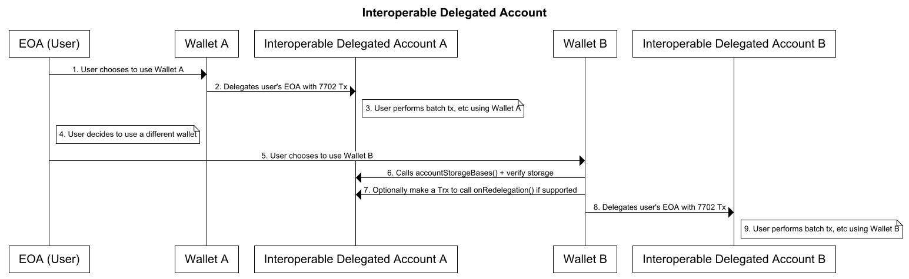

```md
---
eip: 7779
title: 可互操作的委托账户
description: 委托的外部拥有账户的接口，以实现钱包之间更好的重新委托。
author: David Kim (@PowerStream3604), Richard Meissner (@rmeissner), Akshay Patel (@akshay-ap), Joshua Kim (@LightningHun), Fangting (@trinity-0111), Yoav Weiss (@yoavw)
discussions-to: https://ethereum-magicians.org/t/erc-7779-interoperable-delegated-account/21237
status: Draft
type: Standards Track
category: ERC
created: 2024-10-02
requires: 7201, 7702
---

## 摘要

本提案概述了在 [EIP-7702](./eip-7702.md) 合并后使委托的 EOA 可互操作的接口。通过 [EIP-7702](./eip-7702.md)，EOA 将能够启用执行抽象，从而带来更丰富的功能账户，包括 gas 赞助、批量执行等。

然而，需要帮助促进重新委托的存储管理，因为对存储的无效管理可能会导致存储冲突，从而导致账户的意外行为（例如，账户被锁定、安全漏洞等）。

`InteroperableDelegatedAccount` 接口建议委托的 EOA 可互操作的接口，并促进更好的重新委托环境。

## 动机

在 [EIP-7702](./eip-7702.md) 合并后，预计相当数量的 EOA 钱包将从纯 EOA 账户迁移到委托的 EOA 账户。

这是为了实现更具吸引力的钱包 UX，包括一步交换、自动订阅、gas 赞助等。

然而，考虑到委托的 EOA 将利用其自己的绑定到其智能账户实现的存储，因此存储管理对于促进钱包之间的迁移至关重要，以更好地确保用户可以随时自由迁移其钱包应用程序的主权。

EOA（外部拥有账户）目前由密码学密钥对组成，该密钥对主要以助记词的形式进行管理。

这种简单性提供了钱包之间无摩擦的互操作性，使用户可以自由地在不同的钱包应用程序之间迁移。

但是，在 [EIP-7702](./eip-7702.md) 合并后，每个 EOA 都将被赋予将其自身委托给智能账户的能力，这将影响迁移，因为当用户迁移其钱包时，存储保留在连续的上下文中，而 EOA 可以委托给不同的智能账户。

鉴于钱包特定的验证和执行逻辑，账户抽象钱包也存在互操作性问题，但其在 EOA 中的重要性要大得多，因为 EOA 用户已经熟悉钱包迁移，并且迁移钱包是一种常见操作。

本规范提供了一种标准方法，用于获取委托账户中使用的存储库，以及一种可选机制来清理存储。

此外，值得注意的是，本规范不仅限于基于 [EIP-7702](./eip-7702.md) 的智能账户，还适用于通常使用自定义存储槽的智能账户和智能合约。

## 规范

本文档中的关键词“必须”，“不得”，“必需”，“应”，“不应”，“应该”，“不应该”，“推荐”，“不推荐”，“可以”和“可选”应按照 RFC 2119 和 RFC 8174 中的描述进行解释。

```solidity
interface IInteroperableDelegatedAccount {

	/*
	 * @dev    Provides the namespace of the account.
	 *         namespace of accounts can possibly include, account version, account name, wallet vendor name, etc
	 *         账户的命名空间。
	 *         账户的命名空间可能包括账户版本、账户名称、钱包供应商名称等
	 * @notice this standard does not standardize the namespace format
	 *         此标准不标准化命名空间格式
	 * e.g.,   "v0.1.2.7702Account.WalletProjectA"
	 */
	function accountId() external view returns (string);
	
	/*
	 * @dev    Externally shares the storage bases that has been used throughout the account.
	 *         Externally shares the storage bases that has been used throughout the account. Most of 7702 accounts will have their distinctive storage base to reduce the chance of storage collision.
	 *         对外共享整个账户中使用的存储库。大多数 7702 账户将具有其独特的存储库，以减少存储冲突的可能性。
	 *         This allows the external entities to know what the storage base is of the account.
	 *         这允许外部实体知道账户的存储库是什么。
	 *         Wallets willing to redelegate already-delegated accounts should call accountStorageBase() to check if it confirms with the account it plans to redelegate.
	 *         愿意重新委托已委托账户的钱包应调用 accountStorageBase() 以检查它是否与计划重新委托的账户确认。
	 *
	 *         The bytes32 array should be stored at the storage slot: keccak(keccak('InteroperableDelegatedAccount.ERC.Storage')-1) & ~0xff
	 *         bytes32 数组应存储在存储槽：keccak(keccak('InteroperableDelegatedAccount.ERC.Storage')-1) & ~0xff
	 *         This is an append-only array so newly redelegated accounts should not overwrite the storage at this slot, but just append their base to the array.
	 *         这是一个仅追加数组，因此新重新委托的账户不应覆盖此槽中的存储，而只需将其库追加到数组中。
	 *         This append operation should be done during the initialization of the account.
	 * 		   此追加操作应在账户初始化期间完成。
	 * 		   This array should return a value of keccak hash unless using external storage.
	 * 		   除非使用外部存储，否则此数组应返回 keccak 哈希值。
	 */
	function accountStorageBases() external view returns (bytes32[]);

}
```

```solidity
interface IRedelegableDelegatedAccount {

	/*
	 * @dev    Function called before redelegation.
	 *         重新委托之前调用的函数。
	 *         This function should prepare the account for a delegation to a different implementation.
	 *         此函数应准备好账户以委托给不同的实现。
	 *         This function could be triggered by the new wallet that wants to redelegate an already delegated EOA.
	 *         此函数可以由想要重新委托已委托的 EOA 的新钱包触发。
	 *         It should uninitialize storages if needed and execute wallet-specific logic to prepare for redelegation.
	 *         如果需要，它应该取消初始化存储并执行钱包特定的逻辑以准备重新委托。
	 *         msg.sender should be the owner of the account.
	 *         msg.sender 应该是账户的所有者。
	 */
	function onRedelegation() external returns (bool);

}
```

账户必须实现 `IInteroperableDelegatedAccount` 才能符合标准。

账户必须使用 `keccak256()` 来计算 `accountStorageBases()` 的存储库，除非使用外部存储合约。

账户可以实现 `IRedelegableDelegatedAccount`。

### `accountId()`

此函数是一个视图函数，用于获取账户信息。

一个用例可能是钱包显示重新委托过程，例如，您是否愿意迁移您的账户 `“Wallet A” → “Wallet B”`。

钱包 A 信息可以从 `accountId()` 中提取。

### `accountStorageBases()`

此函数返回该账户已使用的基本存储插槽的列表。

为了符合此标准，账户必须使用 `keccak256()` 来防止在计算存储插槽时发生冲突。

EIP-7702 账户计划使用自定义的非零存储插槽，以尽可能避免存储冲突，但是，一直没有关于如何获取它们的标准化方法。

此函数提供了一种标准化方法，供钱包和其他应用程序检查账户的基本存储插槽，并验证基本存储插槽与新要重新委托的账户的基本存储插槽是否足够远。

请注意，根据账户管理存储的方式，映射等可能存在一些例外。

这为钱包和应用程序提供了一种标准方法来获取基本存储插槽以进行验证，而不是仅仅依靠哈希的概率。

如果账户使用外部存储，则应返回带有连接的外部存储合约地址的 ERC 编号前缀插槽。

```solidity
<ERC-Number><ERC-Number><ERC-Number>..N...<Storage-Contract-Address>
```
例如，如果存储合约地址是 `0xAAAAAAAAAAAAAAAAAAAAAAAAAAAAAAAAAAAAAAAA`，则返回值应为
```
0x777977797779777977797779AAAAAAAAAAAAAAAAAAAAAAAAAAAAAAAAAAAAAAAA
```

当账户被委托时（例如，在账户初始化阶段），账户实现应将账户的基本存储插槽附加到以下插槽位置：`keccak(keccak('InteroperableDelegatedAccount.ERC.Storage')-1) & ~0xff`。

存储变量将使用 `bytes32[]` 类型，并且是一个仅追加变量，新委托的账户会将其存储插槽哈希附加到该变量。如果已经存在相同的条目，则账户可以选择不将其存储库附加到数组。

如果账户识别出存在冲突的存储库，则账户可以执行进一步的链下或链上存储验证，并决定是否进行委托。

如果冲突的存储包括可能针对用户的可疑存储值（例如，影子签名者等），则钱包可能会恢复委托。

### `onRedelegation()`

此函数用于准备重新委托给新账户。

调用此函数时，现有的委托账户应执行操作，以在用户重新委托给新账户时，尽可能不限制或影响用户。

例如，账户可以尽可能取消初始化存储变量，以便为新钱包提供干净的存储。

但是，此标准并未明确说明在此函数调用期间要执行的行为，因为钱包实现具有非常独特的体系结构和细节。

**该标准期望钱包实现使用此函数将其恢复到 ***尽可能*** 清洁的存储状态。**

`onRedelegation()` 应通过检查 `msg.sender` 值来验证调用者是否确实是授权用户。

如果实现了自定义验证方案，或者作为一种特殊情况，也可以通过“自调用”来完成。



## 理由

### 存储库检查

即使有些人可能认为哈希的概率已经很大，账户无需检查，假设每个钱包都使用不同的存储库插槽，但本标准的设计考虑了钱包验证 EOA 存储的需求。
实际上，本标准的想法恰恰相反。值得扫描存储，或者至少是委托账户将使用的存储，钱包想要委托到的存储。例如，就像开发人员验证 Diamond ([ERC-2535](./eip-2535.md)) 中 Facet 的存储以防止存储冲突，而不仅仅依赖哈希概率一样。
与此相一致，`accountStorageBases()` 的设计不仅是为了返回当前钱包实现的存储库，而且是为了返回账户已使用的完整历史存储插槽。
这可以为委托前的 EOA 存储扫描提供有价值的信息。

### 可选的 `onRedelegation()`

`onRedelegation()` 被设计为可选的，以降低符合此标准的门槛。此外，可能存在一些账户在功能上不需要在重新委托之前进行钩子逻辑，或者存在一些账户不适合 `onRedelegation()` 的设计原则，例如，过度使用映射或难以取消初始化的数据类型。

值得注意的是，`onRedelegation()` 并不强制账户完全清除其存储。这更像是一个尽力而为的函数，目的是为 EOA 在新钱包中的未来使用留下最干净的阶段。或者执行一个函数来准备重新委托。

## 向后兼容性

在 [EIP-7702](./eip-7702.md) 讨论之前构建的现有智能账户需要进行更改才能支持此标准。

此标准专门用于 EOA 的智能账户，但可以进一步应用于各种案例和体系结构。

## 安全注意事项

1. 调用 `onRedelegation()` 应包括安全机制以正确验证所有者。
2. 此标准强制账户
    1. 在调用 `accountStorageBase()` 时提供正确的存储库插槽
    2. 如果账户支持 `onRedelegation()`，则执行适当的操作以使账户存储尽可能保持干净状态（例如，取消初始化存储变量等）
    
    但是，账户是否通过行为动作遵循上述三个强制措施取决于账户。
    
    如果需要，账户可以通过链下方法检查信息的真实性。
    
3. 根据账户实现管理存储的方式，完全清除存储可能不是一种可适应的操作。
    
    此标准建议账户完全清除其存储，但是，如果账户无法执行此操作，则适用例外情况。
    
    如果账户无法完全清除其存储，则该标准期望账户执行它可以执行的最大程度的操作，以支持用户的重新委托操作。
    
    同样，账户应确保在调用 `onRedelegation()` 后，初始化程序不能被任意实体触发。
    
4. 考虑到这可能会导致漏洞（例如，签名回复攻击），`onRedelegation()` 不应重置重放保护。

5. 值得注意的是，此标准是一个 ERC，这意味着即使 ERC 强制执行它，实际实现也可能不符合它。例如，声称支持此标准但实际上并非如此的账户。因此，建议验证账户是否是已知安全的且符合该标准的实现。

6. 该标准强制通过 `keccak256()` 计算存储插槽，以减少冲突。哈希的 preimage 可以是名称/版本或组合，这完全由账户自行决定。

## 版权

版权及相关权利通过 [CC0](../LICENSE.md) 放弃。
```