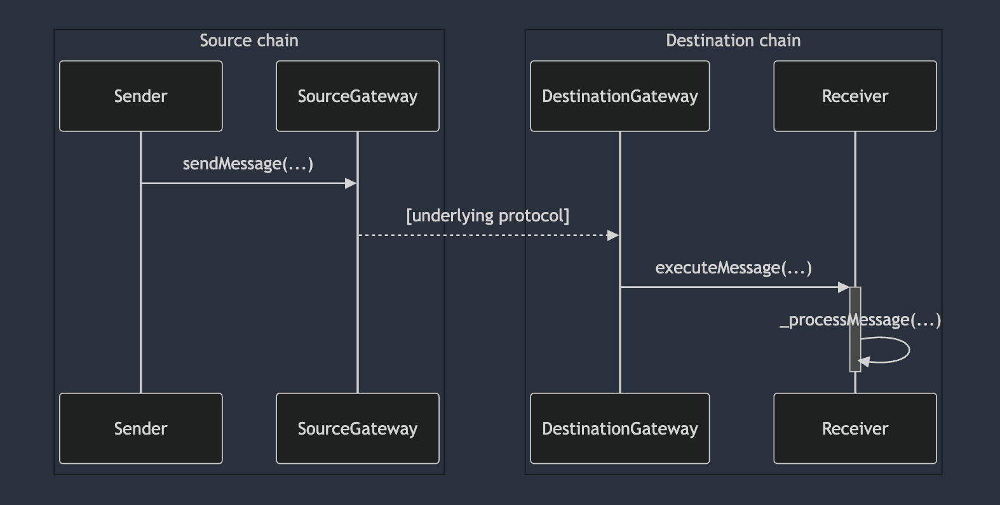

## 摘要

本提案描述了一个接口以及相应的工作流程，用于智能合约通过跨链消息传递协议发送任意数据。本提案的最终目标是使所有此类消息传递协议都可以通过此接口访问（原生或使用“适配器”），以提高它们的可组合性和互操作性。这将允许一种新型的跨链原生智能合约出现，同时减少供应商锁定。本提案在设计上是模块化的，允许用户通过属性利用特定于桥的功能，同时为“仅仅发送一条简单的消息”这一简单功能提供简单的“通用”访问。

## 动机

跨链消息传递协议（或桥）允许部署在不同区块链上的智能合约之间进行通信。存在大量此类协议，具有多个去中心化程度，不同的架构，实现不同的接口，并为用户提供不同的保证。

因为几乎每个协议都使用特定的接口实现不同的工作流程，所以桥之间的可移植性目前基本上是不可能的。这也阻止了依赖于跨链通信的通用合约的开发。

本 ERC 的目标是提供一个标准接口以及相应的工作流程，用于执行合约之间的跨链通信。不原生实现此接口的现有跨链通信协议应该能够使用适配器网关合约来采用它。

与该领域之前的 ERC 相比，本 ERC 提供与以太坊/EVM 生态系统之外的链的兼容性，并且可扩展以支持各种协议的不同功能集，同时提供共享的标准功能核心。

## 规范

本文档中的关键词“必须”、“禁止”、“需要”、“应”、“不应”、“推荐”、“不推荐”、“可以”和“可选”应按照 RFC 2119 和 RFC 8174 中的描述进行解释。

### 消息字段编码

跨链消息由发送者、接收者、有效负载和属性列表组成。

#### 发送者 & 接收者

发送者帐户（在源链中）和接收者帐户（在目标链中）必须使用 [CAIP-10] 帐户标识符表示。请注意，这些是 ASCII 编码的字符串。

[CAIP-10] 帐户标识符嵌入了 [CAIP-2] 链标识符以及一个地址。在接口的某些部分，地址和链部分将分开提供，而不是作为单个字符串，或者链部分将是隐含的。

#### 有效负载

有效负载是一个不透明的 `bytes` 值。

#### 属性

属性是结构化的消息数据和/或元数据。每个属性都是一个键值对，其中键确定值的类型和编码，以及其含义和行为。

一些属性是必须发送给接收者的消息数据，尽管只要它们的含义得到保留，就可以对其进行转换。其他属性是元数据，将由中间网关使用，并且可能在消息到达接收者之前被删除。

属性集是可扩展的。建议通过将属性及其特性发布为 ERC 来对其进行标准化。

网关可以支持任何属性集。网关必须始终接受空属性列表。

每个属性键必须具有 Solidity 函数签名的格式，即名称后跟括号中的类型列表。例如，`minGasLimit(uint256)`。

在本规范中，属性被编码为 `bytes` 数组（即，`bytes[]`）。数组的每个元素必须以 Solidity 函数调用的形式编码一个属性，即键哈希的前 4 个字节，后跟 ABI 编码的值。

### 发送过程

**源网关**是一个提供协议以将消息发送到另一个链上的接收者的合约。它必须实现 `IERC7786GatewaySource`。

```solidity
interface IERC7786GatewaySource {
    event MessagePosted(bytes32 indexed outboxId, string sender, string receiver, bytes payload, uint256 value, bytes[] attributes);

    error UnsupportedAttribute(bytes4 selector);

    function supportsAttribute(bytes4 selector) external view returns (bool);

    function sendMessage(
        string calldata destinationChain, // [CAIP-2] 链标识符
        string calldata receiver, // [CAIP-10] 帐户地址
        bytes calldata payload,
        bytes[] calldata attributes
    ) external payable returns (bytes32 outboxId);
}
```

#### `supportsAttribute`

返回一个布尔值，指示网关是否支持由从属性签名计算出的选择器标识的属性。

可以通过支持其他属性来升级网关。一旦存在对属性的支持，就不应删除对属性的支持，以保持与网关用户的向后兼容性。

#### `sendMessage`

启动消息的发送。

网关可能需要采取进一步的行动才能使消息的发送生效，例如为 gas 提供付款。请参见后处理。

如果包含不支持的属性键，则必须使用 `UnsupportedAttribute` 恢复。如果属性的值对其预期类型不是有效的编码，则可以恢复。

可以接受与消息一起发送的调用值（原生代币）。如果包含调用值但它不是网关支持的功能，则必须恢复。未指定此值在目标上的表示方式。

可以生成并返回唯一的非零_outbox 标识符_，否则返回零。此标识符可用于在事件中和进行后处理时跟踪收件箱中消息的生命周期。

必须发出 `MessagePosted` 事件，包括该函数返回的可选的收件箱标识符。

#### `MessagePosted`

此事件表明潜在的发送者已请求发送消息。

如果存在 `outboxId`，则可能需要进行后处理才能通过跨链通道发送消息。

#### 后处理

在发送者调用 `sendMessage` 之后，网关可能需要采取进一步的行动才能使消息生效。这称为_后处理_。例如，通常需要支付一些费用来支付在目标位置执行消息的 gas 费用。

任何此类操作的确切接口都不在本 ERC 的范围内。如果支持并存在 `postProcessingOwner` 属性，则此类操作必须仅限于指定的帐户，否则它们必须能够由任何一方以一种不能损害消息最终接收的方式执行。

### 接收过程

**目标网关**是一个实现用于验证在其他链上发送的消息的协议的合约。目标网关的接口及其调用方式不在本 ERC 的范围内。

该协议必须确保使用 `IERC7786Receiver` 接口（如下所述）将已发送的消息传递给其**接收者**，接收者必须实现该接口。

一旦可以安全地传递消息（请参见属性），网关必须使用消息标识符和内容调用 `executeMessage`，除非发送者或接收者明确要求其他操作。

对于正在中继的消息，`messageId` 必须为空或唯一（对于调用的网关）。未指定此标识符的格式，网关可以自行决定使用它。例如，它可以是创建消息的 `MessagePosted` 事件的标识符。

网关必须验证 `executeMessage` 是否返回正确的值，否则必须恢复。

```solidity
interface IERC7786Receiver {
    function executeMessage(
        string calldata messageId, // 网关特定，空或唯一
        string calldata sourceChain, // [CAIP-2] 链标识符
        string calldata sender, // [CAIP-10] 帐户地址
        bytes calldata payload,
        bytes[] calldata attributes
    ) external payable returns (bytes4);
}
```

#### `executeMessage`

传递从另一个链发送的消息。

接收者必须验证此函数的调用者是否是**已知的网关**，即，它信任其基础跨链消息传递协议的网关。

必须返回 `IERC7786Receiver.executeMessage.selector` (`0x675b049b`)。

#### 交互图



### 属性

期望一对网关的基础协议保证一系列属性。有关详细的定义和讨论，我们参考 XChain Research 的 _跨链互操作性报告_。

- 该协议必须保证安全性：仅当消息在源处发送时，才会在目的地传递消息。传递过程必须确保消息仅在发送交易完成后传递一次，且不能传递多次。请注意，可以有多个具有相同参数的消息，必须分别传递它们。
- 该协议必须保证活性：假设源链和目标链的活性和抗审查性，最终将已发送的消息传递到目标。
- 该协议应保证及时性：已发送的消息在有界传递时间内传递到目标，该时间应记录在案。
- 以上属性不应依赖于对某些中心化参与者的信任。例如，安全性应由某种无需信任的机制来保证，例如轻客户端证明或由开放的去中心化的验证器集进行的证明。中继应是去中心化的或无需许可的，以确保活性；中心化的中继可能会失败，从而停止协议。

## 理由

属性的设计使网关可以公开桥提供的任何特定功能，而无需使用特定的端点。具有唯一的端点并通过属性实现模块化，应允许合约更改其使用的网关，同时继续以相同的方式表达消息。这种可移植性具有许多优势：

- 依赖特定网关发送消息的合约容易受到网关暂停、弃用或简单中断的影响。如果合约和网关之间的通信是标准的，则合约的管理员可以更新网关的地址（在存储中）以使用。特别是，当有新版本可用时，发送者可以更新到新网关。
- 应该可以进行桥分层。特别是，此接口应允许一种新型的桥，该桥通过多个独立的桥路由消息。消息的传递可能需要这些独立桥中的一个或多个，具体取决于是否需要提高活性或安全性。

由于某些跨链通信协议需要超出目标和有效负载的其他参数，并且因为我们希望在不知道这些其他参数的情况下通过这些桥发送消息，因此可能需要对消息进行后处理（在调用 `sendMessage` 之后，并在传递消息之前）。可以通过属性来支持其他参数，这将消除对后处理步骤的需求。如果未通过属性提供这些其他参数，则需要额外调用网关才能发送消息。如果可能，应设计网关，以便任何有传递消息动机的人都可以加入。恶意参与者提供无效参数不应阻止其他人成功中继消息。

某些协议网关支持在接收者上进行任意直接调用。在这种情况下，接收者必须检测到正在被网关调用，以正确识别跨链消息。网关上提供了 getter，可以确定跨链消息的来源（源链和发送者地址）。这种方法的缺点是它允许任何人触发从网关到任何合约的任何调用。如果网关持有任何资产（[ERC-20](./eip-20.md) 或类似资产），这是很危险的。在接收者上使用专用的 `executeMessage` 函数可以保护网关持有的任何资产或权限免受此类攻击。如果需要执行直接调用的能力，则可以将其实现为任何实现此 ERC 的网关之上的包装器。

## 向后兼容性

现有的跨链消息传递协议实现专有接口。我们建议协议原生实现此处定义的标准接口，并建议为那些不实现标准接口的协议开发标准适配器。

## 安全注意事项

不幸的是，[CAIP-2] 和 [CAIP-10] 名称不是唯一的。使用非规范字符串可能会导致未定义的行为，包括消息传递失败和资产锁定。虽然源网关在检查用户输入是否有效方面发挥着作用，但我们也认为应付出更多努力来标准化和记录每个 [CAIP-2] 命名空间的规范格式。这项工作超出了本 ERC 的范围。

## 版权

版权和相关权利通过 [CC0](../LICENSE.md) 放弃。

[CAIP-10]: https://github.com/ChainAgnostic/CAIPs/blob/3da24e4e912ae179713b2b1b11d6ecb5df06a8dc/CAIPs/caip-10.md
[CAIP-2]: https://github.com/ChainAgnostic/CAIPs/blob/cbee09d2885065ba15482398828d5c5e3ac57faa/CAIPs/caip-2.md
