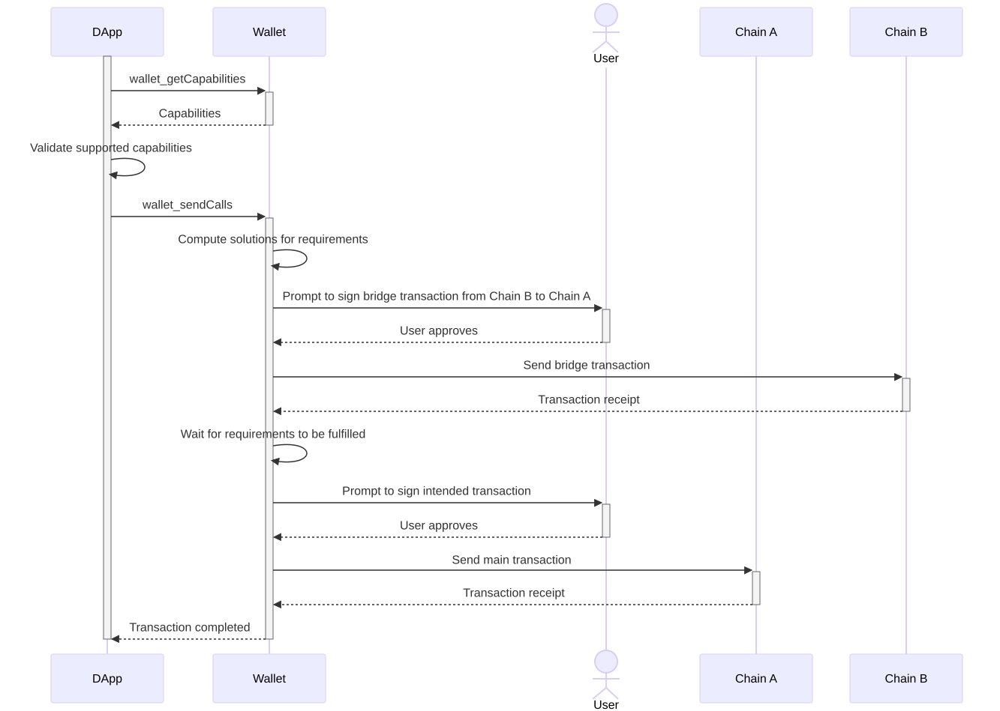
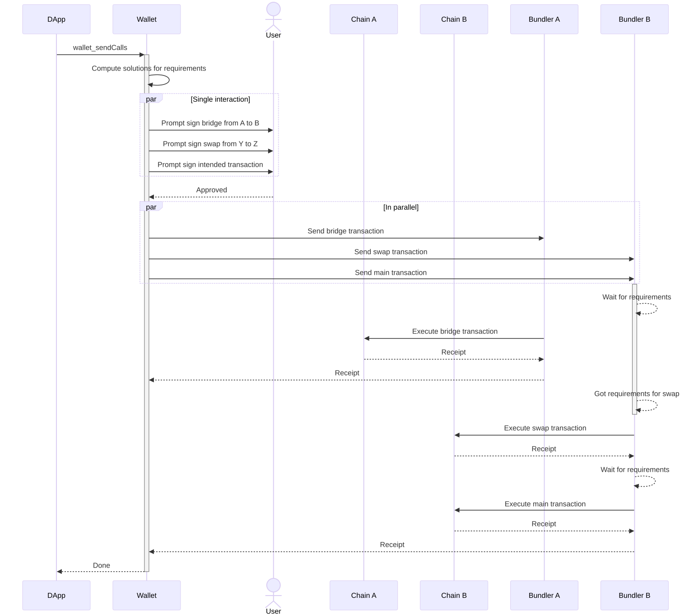

```md
---
eip: 7795
title: 钱包调用 Token 能力
description: 钱包调用 API 扩展，用于常见 token 类型的交易先决条件
author: Agustín Aguilar (@agusx1211), Michael Standen (@ScreamingHawk), Peter Kieltyka (@pkieltyka), William Hua (@attente), Philippe Castonguay (@PhABC)
discussions-to: https://ethereum-magicians.org/t/erc-7795-wallet-call-token-capabilities/21426
status: Draft
type: Standards Track
category: ERC
created: 2024-10-22
requires: 20, 721, 1155, 5792
---

## 摘要

该 ERC 通过定义一些能力来扩展 [EIP-5792](./eip-5792.md)，这些能力允许 dApp 为交易指定常见的 token 先决条件，例如拥有某些 [ERC-20](./eip-20.md)、[ERC-721](./eip-721.md) 或 [ERC-1155](./eip-1155.md) token。然后，钱包可以帮助用户在执行交易之前满足这些要求。

## 动机

dApp 通常只存在于一个网络上，但这会缩小这些 dApp 可以访问的直接流动性。发生这种情况是因为大多数用户只有有限数量的网络上的资金。随着网络数量的增长，dApp 和用户所选择的网络之间的交集可能性降低。

鉴于 dApp 无法与钱包沟通有关其“最终意图”，它们只能使用交易请求来传达用户应该采取的最后操作。但是，用户需要“猜测”需要执行哪些先前的操作才能满足该最终操作的先决条件。

这种猜测可能涉及将资金整合到单个网络中，或将资产兑换成 dApp 接受的另一种资产。这对用户来说是一个繁琐的过程，并导致 UX 大大降低。

## 规范

本文档中的关键词“MUST”、“MUST NOT”、“REQUIRED”、“SHALL”、“SHALL NOT”、“SHOULD”、“SHOULD NOT”、“RECOMMENDED”、“NOT RECOMMENDED”、“MAY”和“OPTIONAL”应按照 RFC 2119 和 RFC 8174 中的描述进行解释。

该 ERC 通过添加可与 `wallet_sendCalls` 和 `wallet_getCapabilities` 方法一起使用的新功能来扩展 [EIP-5792](./eip-5792.md)。这些功能允许为钱包可以处理的常见 token 标准指定不同类型的交易要求。

如果 dApp 希望自己处理需求实现，则 **MAY** 选择不使用此功能。

### ERC-20 最低余额能力

dApp 可以在 `wallet_sendCalls` 请求中使用 `erc20MinBalance` 功能，以请求钱包确保所有者拥有指定 [ERC-20](./eip-20.md) token 的最低余额。

#### `wallet_getCapabilities` 响应

Schema:

```typescript
type Erc20MinBalanceCapability = {
  supported: boolean;
  versions: string[];
}
```

示例:

```json
{
  "0x1": {
    "erc20MinBalance": {
      "supported": true,
      "versions": ["1.0"]
    }
  }
}
```

#### `wallet_sendCalls` 请求

1.0 版本 Schema:

```typescript
type Erc20MinBalanceParams = {
  version: string;
  chainId: `0x${string}`; // Hex chain id
  owner: `0x${string}`; // Address
  token: `0x${string}`; // Address
  minAmount: `0x${string}`; // Hex value
};
```

此功能要求在执行交易之前，`owner` 地址 **MUST** 在 `chainId` 上拥有至少 `minAmount` 的 `token` 的余额。

示例:

```json
[
  {
    "version": "1.0",
    "from": "0xd46e8dd67c5d32be8058bb8eb970870f07244567",
    "calls": [
      {
        "to": "0xd46e8dd67c5d32be8058bb8eb970870f07244567",
        "value": "0x00",
        "data": "0x...",
        "chainId": "0x01",
      }
    ],
    "capabilities": {
      "erc20MinBalance": {
        "version": "1.0",
        "chainId": "0x01",
        "owner": "0xd46e8dd67c5d32be8058bb8eb970870f07244567",
        "token": "0xa0b86991c6218b36c1d19d4a2e9eb0ce3606eb48",
        "minAmount": "0x0f4240"
      }
    }
  }
]
```

### ERC-20 最小授权额度能力

dApp 可以在 `wallet_sendCalls` 请求中使用 `erc20MinAllowance` 功能，以请求钱包确保所有者拥有指定 [ERC-20](./eip-20.md) token 的最小授权额度。
请注意，此功能并不意味着所有者拥有 token 的余额，仅意味着授权额度等于或大于指定金额。

#### `wallet_getCapabilities` 响应

Schema:

```typescript
type Erc20MinAllowanceCapability = {
  supported: boolean;
  versions: string[];
}
```

示例:

```json
{
  "0x1": {
    "erc20MinAllowance": {
      "supported": true,
      "versions": ["1.0"]
    }
  }
}
```

#### `wallet_sendCalls` 请求

1.0 版本 Schema:

```typescript
type Erc20MinAllowanceParams = {
  version: string;
  chainId: `0x${string}`; // Hex chain id
  owner: `0x${string}`; // Address
  operator: `0x${string}`; // Address
  token: `0x${string}`; // Address
  minAmount: `0x${string}`; // Hex value
};
```

此功能要求在执行交易之前，`owner` 地址 **MUST** 在 `chainId` 上，对于 `operator` 拥有至少 `minAmount` 的 `token` 的授权额度。

示例:

```json
[
  {
    "version": "1.0",
    "from": "0xd46e8dd67c5d32be8058bb8eb970870f07244567",
    "calls": [
      {
        "to": "0xd46e8dd67c5d32be8058bb8eb970870f07244567",
        "value": "0x00",
        "data": "0x...",
        "chainId": "0x01",
      }
    ],
    "capabilities": {
      "erc20MinAllowance": {
        "version": "1.0",
        "chainId": "0x01",
        "owner": "0xd46e8dd67c5d32be8058bb8eb970870f07244567",
        "token": "0xa0b86991c6218b36c1d19d4a2e9eb0ce3606eb48",
        "operator": "0xd46e8dd67c5d32be8058bb8eb970870f07244567",
        "minAmount": "0x0f4240"
      }
    }
  }
]
```

### ERC-721 所有权能力

dApp 可以在 `wallet_sendCalls` 请求中使用 `erc721Ownership` 功能，以请求钱包确保所有者拥有指定 [ERC-721](./eip-721.md) token 的所有权。

#### `wallet_getCapabilities` 响应

Schema:

```typescript
type Erc721OwnershipCapability = {
  supported: boolean;
  versions: string[];
}
```

示例:

```json
{
  "0x1": {
    "erc721Ownership": {
      "supported": true,
      "versions": ["1.0"]
    }
  }
}
```

#### `wallet_sendCalls` 请求

1.0 版本 Schema:

```typescript
type Erc721OwnershipParams = {
  version: string;
  chainId: `0x${string}`; // Hex chain id
  owner: `0x${string}`; // Address
  token: `0x${string}`; // Address
  tokenId: `0x${string}`; // Hex value
};
```

此功能要求在执行交易之前，`owner` 地址 **MUST** 在 `chainId` 上拥有 `token` 的 `tokenId` 的所有权。

示例:

```json
[
  {
    "version": "1.0",
    "from": "0xd46e8dd67c5d32be8058bb8eb970870f07244567",
    "calls": [
      {
        "to": "0xbc4ca0eda7647a8ab7c2061c2e118a18a936f13d",
        "value": "0x00",
        "data": "0x...",
        "chainId": "0x01",
      }
    ],
    "capabilities": {
      "erc721Ownership": {
        "version": "1.0",
        "chainId": "0x01",
        "owner": "0xd46e8dd67c5d32be8058bb8eb970870f07244567",
        "token": "0xbc4ca0eda7647a8ab7c2061c2e118a18a936f13d",
        "tokenId": "0x10"
      }
    }
  }
]
```

### ERC-721 授权能力

dApp 可以在 `wallet_sendCalls` 请求中使用 `erc721Approval` 功能，以请求钱包确保所有者已授权指定的 [ERC-721](./eip-721.md) token。
请注意，此功能并不意味着所有者拥有 token 的余额，仅意味着授权额度等于或大于指定金额。

#### `wallet_getCapabilities` 响应

Schema:

```typescript
type Erc721ApprovalCapability = {
  supported: boolean;
  versions: string[];
}
```

示例:

```json
{
  "0x1": {
    "erc721Approval": {
      "supported": true,
      "versions": ["1.0"]
    }
  }
}
```

#### `wallet_sendCalls` 请求

1.0 版本 Schema:

```typescript
type Erc721ApprovalParams = {
  version: string;
  chainId: `0x${string}`; // Hex chain id
  owner: `0x${string}`; // Address
  operator: `0x${string}`; // Address
  token: `0x${string}`; // Address
  tokenId: `0x${string}`; // Hex value
};
```

此功能要求在执行交易之前，`owner` 地址 **MUST** 授权 `operator` 转移 `chainId` 上 `token` 的 `tokenId`。

示例:

```json
[
  {
    "version": "1.0",
    "from": "0xd46e8dd67c5d32be8058bb8eb970870f07244567",
    "calls": [
      {
        "to": "0xbc4ca0eda7647a8ab7c2061c2e118a18a936f13d",
        "value": "0x00",
        "data": "0x...",
        "chainId": "0x01",
      }
    ],
    "capabilities": {
      "erc721Approval": {
        "version": "1.0",
        "chainId": "0x01",
        "owner": "0xd46e8dd67c5d32be8058bb8eb970870f07244567",
        "operator": "0xbc4ca0eda7647a8ab7c2061c2e118a18a936f13d",
        "token": "0xbc4ca0eda7647a8ab7c2061c2e118a18a936f13d",
        "tokenId": "0x10"
      }
    }
  }
]
```

### ERC-1155 最低余额能力

dApp 可以在 `wallet_sendCalls` 请求中使用 `erc1155MinBalance` 功能，以请求钱包确保所有者拥有指定 [ERC-1155](./eip-1155.md) token 的最低余额。

#### `wallet_getCapabilities` 响应

Schema:

```typescript
type Erc1155MinBalanceCapability = {
  supported: boolean;
  versions: string[];
}
```

示例:

```json
{
  "0x1": {
    "erc1155MinBalance": {
      "supported": true,
      "versions": ["1.0"]
    }
  }
}
```

#### `wallet_sendCalls` 请求

1.0 版本 Schema:

```typescript
type Erc1155MinBalanceParams = {
  version: string;
  chainId: `0x${string}`; // Hex chain id
  owner: `0x${string}`; // Address
  token: `0x${string}`; // Address
  tokenId: `0x${string}`; // Hex value
  minAmount: `0x${string}`; // Hex value
};
```

此功能要求在执行交易之前，`owner` 地址 **MUST** 在 `chainId` 上拥有 `token` 的 `tokenId` 的至少 `minAmount` 余额。

示例:

```json
[
  {
    "version": "1.0",
    "from": "0xd46e8dd67c5d32be8058bb8eb970870f07244567",
    "calls": [
      {
        "to": "0x631998e91476da5b870d741192fc5cbc55f5a52e",
        "value": "0x00",
        "data": "0x...",
        "chainId": "0x01",
      }
    ],
    "capabilities": {
      "erc1155MinBalance": {
        "version": "1.0",
        "chainId": "0x01",
        "owner": "0xd46e8dd67c5d32be8058bb8eb970870f07244567",
        "token": "0x631998e91476da5b870d741192fc5cbc55f5a52e",
        "tokenId": "0x10",
        "minAmount": "0x0f4240"
      }
    }
  }
]
```

### ERC-1155 最小授权额度能力

dApp 可以在 `wallet_sendCalls` 请求中使用 `erc1155MinAllowance` 功能，以请求钱包确保所有者拥有指定 [ERC-1155](./eip-1155.md) token 的最小授权额度。
请注意，此功能并不意味着所有者拥有 token 的余额，仅意味着授权额度等于或大于指定金额。

#### `wallet_getCapabilities` 响应

Schema:

```typescript
type Erc1155MinAllowanceCapability = {
  supported: boolean;
  versions: string[];
}
```

示例:

```json
{
  "0x1": {
    "erc1155MinAllowance": {
      "supported": true,
      "versions": ["1.0"]
    }
  }
}
```

#### `wallet_sendCalls` 请求

1.0 版本 Schema:

```typescript
type Erc1155MinAllowanceParams = {
  version: string;
  chainId: `0x${string}`; // Hex chain id
  owner: `0x${string}`; // Address
  operator: `0x${string}`; // Address
  token: `0x${string}`; // Address
  tokenId: `0x${string}`; // Hex value
  minAmount: `0x${string}`; // Hex value
};
```

此功能要求在执行交易之前，`owner` 地址 **MUST** 在 `chainId` 上，对于 `operator` 拥有 `token` 的 `tokenId` 的至少 `minAmount` 授权额度。

示例:

```json
[
  {
    "version": "1.0",
    "from": "0xd46e8dd67c5d32be8058bb8eb970870f07244567",
    "calls": [
      {
        "to": "0x631998e91476da5b870d741192fc5cbc55f5a52e",
        "value": "0x00",
        "data": "0x...",
        "chainId": "0x01",
      }
    ],
    "capabilities": {
      "erc1155MinAllowance": {
        "version": "1.0",
        "chainId": "0x01",
        "owner": "0xd46e8dd67c5d32be8058bb8eb970870f07244567",
        "operator": "0xbc4ca0eda7647a8ab7c2061c2e118a18a936f13d",
        "token": "0x631998e91476da5b870d741192fc5cbc55f5a52e",
        "tokenId": "0x10",
        "minAmount": "0x0f4240"
      }
    }
  }
]
```

### 使用示例

该 ERC 充当构建依赖于跨链操作的用户体验的基础组件。它可以根据用例和钱包实现的组合以各种方式利用。请考虑以下高级示例。

以下示例中未显示 `wallet_getCallsStatus` 和 `wallet_showCallsStatus` 方法，这些方法用于查询调用包的状态并将其显示给用户。dApp **MAY** 使用这些方法来提供更好的用户体验，同时等待交易完成。更多信息可以在 [EIP-5792](./eip-5792.md) 规范中找到。

#### 使用 EOA 钱包的市场与桥的交互

用户想要在 **Chain A** 上购买 [ERC-721](./eip-721.md) token，但只有 **Chain B** 上的资金。用户使用基于外部拥有帐户 (EOA) 的钱包。dApp 使用 `wallet_sendCalls` 请求预期的交易，其中包括市场交易以及拥有 chain A 上的资金的要求。

在这种情况下，钱包 **MAY** 提示用户签署必要的交易以满足要求，然后再继续进行主要交易。钱包 **SHOULD** 计算可能的解决方案以满足要求，并且 **MUST** 确保在执行主要交易之前满足这些先决条件。



#### 使用智能合约钱包桥接、兑换和支付

dApp 请求用户付款，该付款 **MUST** 在 **Chain B** 上以 **Token Z** 进行，但用户持有 **Chain A** 上的 **Token Y**。dApp 使用 `wallet_sendCalls` 请求预期的交易，包括付款交易以及在 Chain B 上拥有足够的 Token Z 的要求。

在这种情况下，智能合约钱包 **MAY** 提示用户一次性签署所有必要的交易，并以适当的顺序执行它们。钱包 **SHOULD** 计算解决方案以满足要求，并且 **MUST** 确保在继续进行主要交易之前满足所有先决条件。

签名的交易 **MAY** 同时发送给 bundler，他们会在交易可用时执行它们，即使钱包断开连接，也可以完成操作。



## 理由

该 ERC 扩展了 [EIP-5792](./eip-5792.md)，而不是定义新的 RPC 方法，因为：

1. **一致性**：利用现有的能力发现机制
2. **可组合性**：可以将需求与其他 [EIP-5792](./eip-5792.md) 功能结合使用
3. **灵活性**：钱包可以仅实现它们支持的需求
4. **可扩展性**：可以将新的需求类型添加为其他功能

将需求拆分为单独的功能而不是单一功能类型的决定允许：

1. 钱包的粒度支持
2. 清晰的能力发现
3. 需求类型的独立版本控制
4. 简化基本钱包的实现

## 安全考虑

该 ERC 不会引入任何新的安全风险或信任假设。

用户已经信任他们的钱包提供商来代表他们制作、操作和发送交易。该 ERC 仅向交易请求添加了一个新字段，钱包可以使用该字段来做出更明智的关于交易构建的决策。

## 版权

版权和相关权利通过 [CC0](../LICENSE.md) 放弃。
```