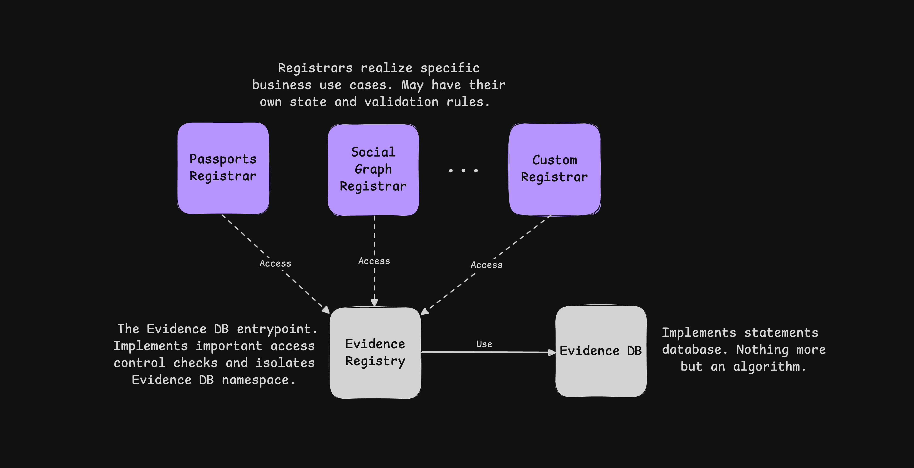

## 摘要

本 EIP 引入了一个链上注册表系统，用于存储和证明抽象声明。用户可以利用该系统存储对其私有数据的承诺，以便稍后通过零知识证明其有效性和真实性，而无需泄露有关数据本身的任何信息。此外，开发者可以使用位于 `0x781246D2256dc0C1d8357c9dDc1eEe926a9c7812` 的单例 `EvidenceRegistry` 合约，来集成自定义的、特定于业务的注册器，以管理和处理特定的声明。

## 动机

本 EIP 源于对可证明声明的存储和发布进行本地化和解开的需求，以便未来的协议可以锚定到标准化的单例链上注册表，并从交叉重用中受益。

可证明声明的聚合显著提高了大量以零知识隐私为导向的解决方案的可重用性、可移植性和安全性。注册表的抽象规范允许以很少或最少的约束来实现自定义的基于身份、基于声誉、基于出席证明等的协议。

给定的提案为特定解决方案的构建奠定了重要的基础。预计更具体的声明和承诺结构的规范将作为单独的 EIP 出现。

## 规范

本文档中的关键词 "MUST"、"MUST NOT"、"REQUIRED"、"SHALL"、"SHALL NOT"、"SHOULD"、"SHOULD NOT"、"RECOMMENDED"、"MAY" 和 "OPTIONAL" 按照 RFC 2119 中的描述进行解释。

### 定义

- “稀疏 Merkle 树 (SMT)” 是一种特殊的 Merkle 树，它通过利用哈希函数以确定性和幂等的方式在给定位置存储键/值对来工作。 Poseidon 哈希函数通常用于优化与 ZK 的兼容性。
- “声明”是某些抽象证据的可接受的结构化表示。声明的范围可以从简单的 `string` 到某些 SMT 的 Merkle 根。
- “承诺”是一种特殊的公共值，它是通过混淆声明以隐藏它而产生的。承诺允许在 ZK 中证明声明的真实性，而无需泄露声明本身。
- “承诺密钥”是一个与声明混合的私有盐值，以获得对该声明的承诺。承诺密钥必须保持私有，以维护声明的机密性。

### 总则

链上注册表系统由两个子系统组成：带有 `EvidenceDB` 和 `Registrar` 组件的 `EvidenceRegistry`。本 EIP 将侧重于描述和标准化前者，而 `Registrar` 规范可能会作为单独的提案进行修改。



链上证据注册系统实体图。

`EvidenceRegistry` 充当协议范围内的可证明数据库 `EvidenceDB` 的入口点，其中可以写入任意 `32-byte` 数据，并在以后按需证明。 `Registrar` 实体实现特定的业务用例，构建可证明的数据，并利用 `EvidenceRegistry` 将此数据放入 `EvidenceDB` 中。

为了证明某些数据存在或不存在于 `EvidenceDB` 中，可以使用 Merkle 证明。了解特定的 `Registrar` 如何构建并将数据放入 `EvidenceDB` 中，可以实现一个链上 ZK 验证器（使用 Circom 或任何其他堆栈）并证明数据包含（或排除）在数据库中。

在“参考实现”部分中，可以找到通用 SMT 驱动的 `EvidenceDB` 验证器电路的 Circom 实现，以及 `EvidenceRegistry` 和 `EvidenceDB` 智能合约的 Solidity 实现。

### 证据数据库

`EvidenceDB` 智能合约可以实现任意可证明的键/值数据结构，但是它必须支持元素的`添加`、`更新`和`删除`。所有支持的写入操作必须保持幂等性（即，`添加`后跟`删除`不应更改数据库的状态）。选择的数据结构必须能够提供元素包含和排除证明。修改 `EvidenceDB` 状态的函数只能由 `EvidenceRegistry` 调用。

作为参考，`EvidenceDB` 智能合约可以实现以下接口：

```solidity
pragma solidity ^0.8.0;

/**
 * @notice Evidence DB interface for Sparse Merkle Tree based statements database.
 * @notice 基于稀疏 Merkle 树的声明数据库的证据数据库接口。
 */
interface IEvidenceDB {
    /**
     * @notice Represents the proof of a node's inclusion/exclusion in the tree.
     * @notice 表示树中节点包含/排除的证明。
     * @param root The root hash of the Merkle tree.
     * @param siblings An array of sibling hashes can be used to get the Merkle Root.
     * @param existence Indicates the presence (true) or absence (false) of the node.
     * @param key The key associated with the node.
     * @param value The value associated with the node.
     * @param auxExistence Indicates the presence (true) or absence (false) of an auxiliary node.
     * @param auxKey The key of the auxiliary node.
     * @param auxValue The value of the auxiliary node.
     */
    struct Proof {
        bytes32 root;
        bytes32[] siblings;
        bool existence;
        bytes32 key;
        bytes32 value;
        bool auxExistence;
        bytes32 auxKey;
        bytes32 auxValue;
    }
    
    /**
     * @notice Adds the new element to the tree.
     * @notice 将新元素添加到树中。
     */
    function add(bytes32 key, bytes32 value) external;

    /**
     * @notice Removes the element from the tree.
     * @notice 从树中移除元素。
     */
    function remove(bytes32 key) external;

    /**
     * @notice Updates the element in the tree.
     * @notice 更新树中的元素。
     */
    function update(bytes32 key, bytes32 newValue) external;

    /**
     * @notice Gets the SMT root.
     * @notice 获取 SMT 根。
     * SHOULD NOT be used on-chain due to roots frontrunning.
     * 由于根抢跑，不应在链上使用。
     */
    function getRoot() external view returns (bytes32);

    /**
     * @notice Gets the number of nodes in the tree.
     * @notice 获取树中节点的数量。
     */
    function getSize() external view returns (uint256);
    
    /**
     * @notice Gets the max tree height (number of branches in the Merkle proof)
     * @notice 获取最大树高（Merkle 证明中的分支数）
     */
    function getMaxHeight() external view returns (uint256);

    /**
     * @notice Gets Merkle inclusion/exclusion proof of the element.
     * @notice 获取元素的 Merkle 包含/排除证明。
     */
    function getProof(bytes32 key) external view returns (Proof memory);

    /**
     * @notice Gets the element value by its key.
     * @notice 通过键获取元素值。
     */
    function getValue(bytes32 key) external view returns (bytes32);
}
```

### 证据注册表

`EvidenceRegistry` 智能合约是本 EIP 的核心部分。 `EvidenceRegistry` 必须实现以下接口，但是，它可以被扩展：

```solidity
pragma solidity ^0.8.0;

/**
 * @notice Common Evidence Registry interface.
 * @notice 通用证据注册表接口。
 */
interface IEvidenceRegistry {
    /**
     * @notice MUST be emitted whenever the Merkle root is updated.
     * @notice 只要 Merkle 根被更新，就必须发出。
     */
    event RootUpdated(bytes32 indexed prev, bytes32 indexed curr);

    /**
     * @notice Adds the new statement to the DB.
     * @notice 将新声明添加到数据库。
     */
    function addStatement(bytes32 key, bytes32 value) external;

    /**
     * @notice Removes the statement from the DB.
     * @notice 从数据库中移除声明。
     */
    function removeStatement(bytes32 key) external;

    /**
     * @notice Updates the statement in the DB.
     * @notice 更新数据库中的声明。
     */
    function updateStatement(bytes32 key, bytes32 newValue) external;

    /**
     * @notice Retrieves historical DB roots creation timestamps.
     * @notice 检索历史数据库根创建时间戳。
     * Latest root MUST return `block.timestamp`.
     * 最新根必须返回 `block.timestamp`。
     * Non-existent root MUST return `0`.
     * 不存在的根必须返回 `0`。
     */
    function getRootTimestamp(bytes32 root) external view returns (uint256);

    /**
     * @notice Builds and returns the isolated key for `source` and given `key`.
     * @notice 为 `source` 和给定的 `key` 构建并返回隔离的密钥。
     */
    function getIsolatedKey(address source, bytes32 key) external view returns (bytes32);
}
```

`addStatement`、`removeStatement` 和 `updateStatement` 方法必须隔离声明 `key`，以便数据库为调用者分配特定的命名空间。如果被添加的隔离密钥已经存在于 `EvidenceDB` 中，或者被删除或更新的隔离密钥不存在，则这些方法必须回退。

`EvidenceRegistry` 必须维护 `EvidenceDB` 根的线性历史记录。 `getRootTimestamp` 方法不得回退。相反，如果查询的 `root` 不存在，它必须返回 `0`。如果请求最新的根，该方法必须返回 `block.timestamp`。

在与 `EvidenceDB` 通信之前，必须按以下方式隔离 `key`：

```solidity
bytes32 isolatedKey = hash(msg.sender, key)
```

其中 `hash` 是安全的协议范围内的哈希函数选择。

### 哈希函数

相同的安全哈希函数必须同时在 `EvidenceRegistry` 和 `EvidenceDB` 中使用。建议使用 ZK 友好的哈希函数，例如 `poseidon`，以简化数据库证明。

如果选择 ZK 友好的哈希函数，则 `EvidenceRegistry` 不得接受超出底层椭圆曲线素数域大小（`BN128` 为 `21888242871839275222246405745257275088548364400416034343698204186575808495617`）的 `keys` 或 `values`。

## 理由

在 EIP 规范期间，我们考虑了两种方法：每个协议都有自己的注册表，以及所有协议都统一在一个单例注册表下。我们已决定采用后者，因为这种方法具有以下优点：

1. 跨链可移植性。只需要发送一个 `bytes32` 值（SMT 根）跨链，即可证明注册表的状态。
2. 信任的中心化。用户只需要信任一个单一的、无需许可的、不可变的智能合约。
3. 集成简化。单例设计形式化了系统接口、哈希函数和整体证明结构，以简化集成。

该提案被故意写得尽可能抽象，以不限制可能的业务用例，并允许 `Registrars` 实现任意可证明的解决方案。

预计基于这项工作，未来的 EIP 将描述具体的注册器，其中包含生成承诺、管理承诺密钥和证明操作声明的确切程序。例如，可能有一个用于链上核算国民护照的注册器，一个带有 [EIP-4337](./eip-4337.md) 机密帐户身份管理的注册器，一个用于 POAP 的注册器等。

选择 `EvidenceDB` 命名空间是为了隔离对数据库单元格的写入访问，确保除了发行者之外，没有其他实体可以更改其内容。但是，此决定将访问控制管理责任完全委托给注册器，这是它们开发过程中要考虑的重要方面。

`EvidenceRegistry` 在链上维护根的最小可行（gas 方面）历史记录，以实现平滑的注册器集成。如果需要更详细的历史记录，建议实施链下服务来解析 `RootUpdated` 事件。

## 向后兼容性

此 EIP 完全向后兼容。

### 部署方法

`EvidenceRegistry` 是一个单例合约，可通过 `0x781246D2256dc0C1d8357c9dDc1eEe926a9c7812` 获取，它是通过来自 `0x4e59b44847b379578588920ca78fbf26c0b4956c` 的“确定性部署代理”以及 salt `0x04834e077c463de76a20df3770a7b96a5e5eb826922d1514f943cd5b41ccaed0` 部署的。

## 参考实现

提案中提供了 `EvidenceRegistry` 和 `EvidenceDB` Solidity 智能合约的参考实现，以及证据注册表状态验证器 Circom 电路。

SMT 的底层 Solidity 和 Circom 实现可以在[这里](../assets/eip-7812/contracts/SparseMerkleTree.sol)和[这里](../assets/eip-7812/circuits/SparseMerkleTree.circom)找到。

SMT 的高度设置为 `80`。

> 请注意，参考实现取决于 `@openzeppelin/contracts v5.1.0` 和 `circomlib v2.0.5`。

### EvidenceDB 实现

```solidity
// SPDX-License-Identifier: CC0-1.0
pragma solidity ^0.8.21;

import {Initializable} from "@openzeppelin/contracts/proxy/utils/Initializable.sol";

import {IEvidenceDB} from "./interfaces/IEvidenceDB.sol";

import {SparseMerkleTree} from "./libraries/SparseMerkleTree.sol";
import {PoseidonUnit2L, PoseidonUnit3L} from "./libraries/Poseidon.sol";

contract EvidenceDB is IEvidenceDB, Initializable {
    using SparseMerkleTree for SparseMerkleTree.SMT;

    address private _evidenceRegistry;

    SparseMerkleTree.SMT private _tree;

    modifier onlyEvidenceRegistry() {
        _requireEvidenceRegistry();
        _;
    }

    function __EvidenceDB_init(address evidenceRegistry_, uint32 maxDepth_) external initializer {
        _evidenceRegistry = evidenceRegistry_;

        _tree.initialize(maxDepth_);

        _tree.setHashers(_hash2, _hash3);
    }

    /**
     * @inheritdoc IEvidenceDB
     */
    function add(bytes32 key_, bytes32 value_) external onlyEvidenceRegistry {
        _tree.add(key_, value_);
    }

    /**
     * @inheritdoc IEvidenceDB
     */
    function remove(bytes32 key_) external onlyEvidenceRegistry {
        _tree.remove(key_);
    }

    /**
     * @inheritdoc IEvidenceDB
     */
    function update(bytes32 key_, bytes32 newValue_) external onlyEvidenceRegistry {
        _tree.update(key_, newValue_);
    }

    /**
     * @inheritdoc IEvidenceDB
     */
    function getRoot() external view returns (bytes32) {
        return _tree.getRoot();
    }

    /**
     * @inheritdoc IEvidenceDB
     */
    function getSize() external view returns (uint256) {
        return _tree.getNodesCount();
    }

    /**
     * @inheritdoc IEvidenceDB
     */
    function getMaxHeight() external view returns (uint256) {
        return _tree.getMaxDepth();
    }

    /**
     * @inheritdoc IEvidenceDB
     */
    function getProof(bytes32 key_) external view returns (Proof memory) {
        return _tree.getProof(key_);
    }

    /**
     * @inheritdoc IEvidenceDB
     */
    function getValue(bytes32 key_) external view returns (bytes32) {
        return _tree.getNodeByKey(key_).value;
    }

    /**
     * @notice Returns the address of the Evidence Registry.
     * @notice 返回证据注册表的地址。
     */
    function getEvidenceRegistry() external view returns (address) {
        return _evidenceRegistry;
    }

    function _requireEvidenceRegistry() private view {
        if (_evidenceRegistry != msg.sender) {
            revert NotFromEvidenceRegistry(msg.sender);
        }
    }

    function _hash2(bytes32 element1_, bytes32 element2_) private pure returns (bytes32) {
        return PoseidonUnit2L.poseidon([element1_, element2_]);
    }

    function _hash3(
        bytes32 element1_,
        bytes32 element2_,
        bytes32 element3_
    ) private pure returns (bytes32) {
        return PoseidonUnit3L.poseidon([element1_, element2_, element3_]);
    }
}
```

### EvidenceRegistry 实现

```solidity
// SPDX-License-Identifier: CC0-1.0
pragma solidity ^0.8.21;

import {Initializable} from "@openzeppelin/contracts/proxy/utils/Initializable.sol";

import {IEvidenceDB} from "./interfaces/IEvidenceDB.sol";
import {IEvidenceRegistry} from "./interfaces/IEvidenceRegistry.sol";

import {PoseidonUnit2L} from "./libraries/Poseidon.sol";

contract EvidenceRegistry is IEvidenceRegistry, Initializable {
    uint256 public constant BABY_JUB_JUB_PRIME_FIELD =
        21888242871839275222246405745257275088548364400416034343698204186575808495617;

    IEvidenceDB private _evidenceDB;

    mapping(bytes32 => uint256) private _rootTimestamps;

    modifier onlyInPrimeField(bytes32 key) {
        _requireInPrimeField(key);
        _;
    }

    modifier onRootUpdate() {
        bytes32 prevRoot_ = _evidenceDB.getRoot();
        _rootTimestamps[prevRoot_] = block.timestamp;
        _;
        emit RootUpdated(prevRoot_, _evidenceDB.getRoot());
    }

    function __EvidenceRegistry_init(address evidenceDB_) external initializer {
        _evidenceDB = IEvidenceDB(evidenceDB_);
    }

    /**
     * @inheritdoc IEvidenceRegistry
     */
    function addStatement(
        bytes32 key_,
        bytes32 value_
    ) external onlyInPrimeField(key_) onlyInPrimeField(value_) onRootUpdate {
        bytes32 isolatedKey_ = getIsolatedKey(msg.sender, key_);

        if (_evidenceDB.getValue(isolatedKey_) != bytes32(0)) {
            revert KeyAlreadyExists(key_);
        }

        _evidenceDB.add(isolatedKey_, value_);
    }

    /**
     * @inheritdoc IEvidenceRegistry
     */
    function removeStatement(bytes32 key_) external onlyInPrimeField(key_) onRootUpdate {
        bytes32 isolatedKey_ = getIsolatedKey(msg.sender, key_);

        if (_evidenceDB.getValue(isolatedKey_) == bytes32(0)) {
            revert KeyDoesNotExist(key_);
        }

        _evidenceDB.remove(isolatedKey_);
    }

    /**
     * @inheritdoc IEvidenceRegistry
     */
    function updateStatement(
        bytes32 key_,
        bytes32 newValue_
    ) external onlyInPrimeField(key_) onlyInPrimeField(newValue_) onRootUpdate {
        bytes32 isolatedKey_ = getIsolatedKey(msg.sender, key_);

        if (_evidenceDB.getValue(isolatedKey_) == bytes32(0)) {
            revert KeyDoesNotExist(key_);
        }

        _evidenceDB.update(isolatedKey_, newValue_);
    }

    /**
     * @inheritdoc IEvidenceRegistry
     */
    function getRootTimestamp(bytes32 root_) external view returns (uint256) {
        if (root_ == bytes32(0)) {
            return 0;
        }

        if (root_ == _evidenceDB.getRoot()) {
            return block.timestamp;
        }

        return _rootTimestamps[root_];
    }

    /**
     * @inheritdoc IEvidenceRegistry
     */
    function getIsolatedKey(address source_ bytes32 key_) public pure returns (bytes32) {
        return PoseidonUnit2L.poseidon([bytes32(uint256(uint160(source_))), key_]);
    }

    function getEvidenceDB() external view returns (address) {
        return address(_evidenceDB);
    }

    function _requireInPrimeField(bytes32 key_) private pure {
        if (uint256(key_) >= BABY_JUB_JUB_PRIME_FIELD) {
            revert NumberNotInPrimeField(key_);
        }
    }
}
```

### EvidenceRegistry 验证器实现

```solidity
// LICENSE: CC0-1.0
pragma circom 2.1.9;

include "SparseMerkleTree.circom";

template BuildIsolatedKey() {
    signal output isolatedKey;

    signal input address;
    signal input key;

    component hasher = Poseidon(2);
    hasher.inputs[0] <== address;
    hasher.inputs[1] <== key;

    hasher.out ==> isolatedKey;
}

template EvidenceRegistrySMT(levels) {
    // Public Inputs
    // 公共输入
    signal input root;

    // Private Inputs
    // 私有输入
    signal input address;
    signal input key;

    signal input value;

    signal input siblings[levels];

    signal input auxKey;
    signal input auxValue;
    signal input auxIsEmpty;

    signal input isExclusion;

    // Build isolated key
    // 构建隔离密钥
    component isolatedKey = BuildIsolatedKey();
    isolatedKey.address <== address;
    isolatedKey.key <== key;

    // Verify Sparse Merkle Tree Proof
    // 验证稀疏 Merkle 树证明
    component smtVerifier = SparseMerkleTree(levels);
    smtVerifier.siblings <== siblings;

    smtVerifier.key <== isolatedKey.isolatedKey;
    smtVerifier.value <== value;

    smtVerifier.auxKey <== auxKey;
    smtVerifier.auxValue <== auxValue;
    smtVerifier.auxIsEmpty <== auxIsEmpty;

    smtVerifier.isExclusion <== isExclusion;

    smtVerifier.root <== root;
}

component main {public [root]} = EvidenceRegistrySMT(80);
```

## 安全考虑

从安全的角度来看，有几个重要的方面必须强调。

预计各个注册器将提供声明的管理和证明功能。证明通常通过 ZK 证明执行，这需要可信设置。不正确设置的 ZK 验证器可能会被利用来验证伪造的证明。

`EvidenceDB` 的 `getRoot` 方法不应被集成注册器在链上使用，以检查数据库状态的有效性。相反，所需的 `root` 应作为函数参数传递，并通过 `getRootTimestamp` 方法进行检查，以避免被抢跑。

## 版权

版权和相关权利通过 [CC0](../LICENSE.md) 放弃。