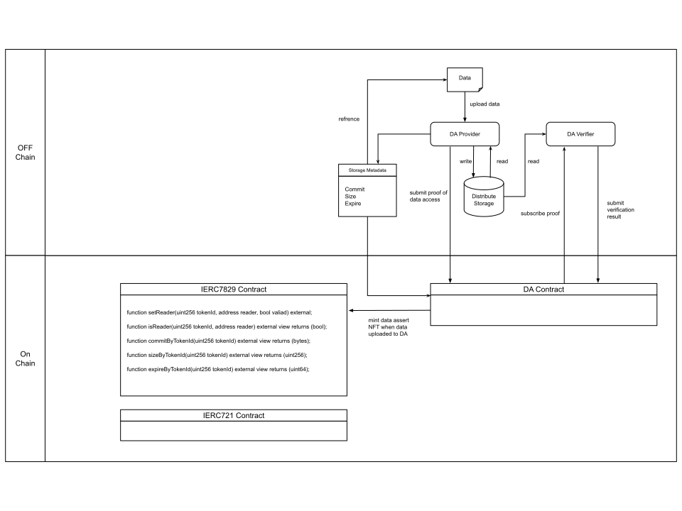

```md
---
eip: 7829
title: 数据资产 NFT
description: 将数据资产——在线数字产品——引入 NFT，并通过存储证明确保其完整性。
author: Allen Dong (@Allen2730), Lonika Zhang <lonika@memolabs.net>, Steven He <steven@memolabs.net>
discussions-to: https://ethereum-magicians.org/t/erc-7829-data-asset-nft/21881
status: Draft
type: Standards Track
category: ERC
created: 2024-11-29
requires: 165, 721
---

## 摘要

本提案是对 [ERC-721](./eip-721.md) 的扩展。本提案引入了一个新的角色，即读取者（Reader），由所有者（Owner）授予，并允许单个 NFT 拥有多个读取者。此外，本提案扩展了 ERC-721 的元数据接口，要求元数据应至少包括承诺（commitment）、大小（size）、过期时间（expire time）和上传者地址（uploader's address）。本提案还提出了一种存储证明机制，以确保元数据信息的正确性。

## 动机

ERC-721 提出了使用 NFT 来代表数字或物理资产的所有权。目前，NFT 元数据被认为是 NFT 内容，其稀缺性决定了 NFT 的价值。NFT 所有者可以通过转移 NFT 的所有权，将 NFT 的内容价值转化为收入。然而，由于高昂的交易费用、存储成本和其他费用，NFT 目前只能代表高价值资产的所有权，这限制了 NFT 可以代表的资产范围。对于数据资产尤其如此，数据资产指的是创作者创建的数字产品，例如在线博客、视频、小型游戏或音乐。因此，数据资产的价值取决于其质量、创作者是否出名、是否受到炒作等等。

此外，为了降低存储成本，NFT 内容通常存储在链下或使用跨链存储，NFT 内容的链接保存在链上。链下用户可以通过访问链接来访问 NFT 内容。然而，链上合约无法访问该链接来确定数据的状态，例如数据丢失、数据篡改或数据过期。这些情况可能导致数据偏离其实际价值，但 NFT 仍然存在于链上，并且底层版权仍在市场上出售。

本提案引入了数据资产 NFT，通过结合模块化数据层——数据可用性（Data Availability，DA），解决了链上数据资产的困境。

## 规范

### 术语

在本提案中，我们将数据资产分为三个部分：

- 存储元数据（Storage Metadata）：包括承诺（commitment）、大小（size）、过期时间（expire）和上传者地址（uploader's address）。由区块链上的存储合约存储和维护。
- 权限元数据（Permission Metadata）：包括所有权和读取权限的信息，以及哪些地址可以修改此信息。由区块链上的权限合约存储和维护。
- 数据内容（Data Content）：用户上传到存储系统的数据。数据内容存储在链下存储节点中。

**每个符合规范的数据权限合约必须实现接口**：

数据权限合约是 ERC-721 的扩展，增加了读取者角色，其中单个数据资产可以对应多个读取者。

```solidity
interface IERC7829 is IERC721 {
    event UpdateReader(uint256 indexed tokenId, address indexed reader, bool valiad);
    
    function setReader(uint256 tokenId, address reader, bool valiad) external;
    
    function isReader(uint256 tokenId, address reader) external view returns (bool);
    
    function commitByTokenId(uint256 tokenId) external view returns (bytes);
    
    function sizeByTokenId(uint256 tokenId) external view returns (uint256);
    
    function expireByTokenId(uint256 tokenId) external view returns (uint64);
}
```

以下是数据资产 NFT 的元数据 JSON 模式：

```json
{
  "title": "Data Asset Metadata",
  "type": "object",
  "properties": {
    "name": {
      "type": "string",
      "description": "Identifies the asset to which this NFT represents"
    },
    "description": {
      "type": "string",
      "description": "Describes the asset to which this NFT represents"
    },
    "commit": {
      "type": "string",
      "description": "A commit pointing to the data resource"
    },
    "size": {
        "type": "integer",
        "description": "The size of the data resource"
    },
    "expire": {
        "type": "integer",
        "description": "The expire time of the data resource",
    }
  }
}
```

读取者角色不应涉及权限变更，这意味着读取者不能调用诸如 `transfer`、`approve`、`setApprovalForAll` 和 `setReader` 之类的函数。

当 Alice 调用 `transfer` 函数将 Alice 的一个数据资产 NFT 转移给 Bob 时：

- 所有者地址设置为 Bob 的地址；
- 批准的地址设置为 0。
- 但是，所有读取者都会被保留。

### 扩展：存储合约

本提案扩展了 NFT 的元数据信息。元数据信息由用户上传，需要相关的证书，可以是存储节点对 NFT 元数据信息的签名。本提案规定 NFT 元数据应至少包括承诺（commitment）、大小（size）、过期时间（expire）和上传者地址（uploader's address）。

本提案的实施者选择一个可信的存储系统和一个可信的模块化数据层 DA，或者自己部署模块化存储层 DA。

当所有者或批准的操作员调用 transfer、approve 或 setReader 函数时，他们必须额外检查当前时间 `block.timestamp` 是否大于过期时间 `expire`，然后再进行调用。如果当前时间 `block.timestamp` 小于过期时间 `expire`，则继续执行后续操作；如果当前时间 `block.timestamp` 大于过期时间 `expire`，则中断后续操作并返回异常消息。

### 扩展：存储证明

本提案使用存储证明来证明数据内容的可用性，从而证明 NFT 元数据的正确性，尤其是 NFT 的 `expire`。

本提案不限制使用的证明方案，但建议使用 KZG 多项式承诺技术。KZG 多项式承诺技术可以在初始化期间生成两个生成器元素 $g_1$ 和 $g_2$。它还会根据数据内容生成相应的承诺 C，并在上传元数据时将其作为数据的唯一标识符上传。生成证明时，验证者生成一个随机数 $z$，证明者根据数据内容和随机数 $z$ 生成证明 $P=(y, π)$，验证 $e(π, yg_1-zg_2) = e(C - y*g_1, g_2)$。

此外，KZG 多项式承诺技术可以将多个证明聚合为一个证明，并且两步验证可以验证所有证明的正确性，包括对所有承诺求和以获得聚合承诺 $C_n$，并通过验证 $e(π_n, y_ng_1-zg_2) = e(C_n - y_n*g_1, g_2)$ 来验证聚合证明 $P_n=(y_n, π_n)$。

为了避免长时间的证明生成时间，可以使用随机抽样来随机选择要质疑的数据。因此，合约需要提供一个安全的伪随机数生成函数，用于随机选择受质疑的数据，该函数也可以用作 KZG 的随机数 $z$。

在验证过程中，对所有承诺求和以获得聚合承诺需要大量的 gas 费用。本提案建议使用乐观证明，即假设聚合承诺是正确的，并且仅在验证期间验证 $e(π_n, y_ng_1-zg_2) = e(C_n - y_n*g_1, g_2)$。验证聚合证明后，无法证明数据的可用性，因此需要一定的挑战期。在挑战期间，任何人都可以挑战承诺证明 $C_n$。如果挑战成功，挑战者将获得奖励，而证明者将受到惩罚；如果挑战失败，挑战者将受到惩罚，而证明者将获得额外的利益。

## 理由



数据资产 NFT 的最大挑战是数据内容的可见但不可访问性：在建立 NFT 数据内容的访问控制权限后，即，访问数据内容需要一定的访问权限，没有数据访问权限的用户如何保证在获得访问权限时数据内容存在？为了防止用户在不知情的情况下进行不正确的操作，有必要将有关数据内容的信息上传到链上，特别是，应将数据内容的过期时间上传到链上。用户可以访问数据内容的过期时间来判断他们的 NFT 是否有效并做出相应的决定。

尽管存储节点承诺在过期时间内始终保存数据，但在不受信任的环境中，存储节点可能会在过期时间内删除数据内容。因此，存储节点需要在过期时间内定期提交存储证明，以确保过期时间的正确性。这确保了在不受信任的环境中，用户可以获得有关受限制访问的资源的基本信息。

## 向后兼容性

本提案结合了现有的 721 扩展，并且向后兼容 ERC-721 标准。

## 安全考虑

数据资产 NFT 的安全性不仅取决于区块链，还取决于模块化数据层 DA。因此，本提案的实施者需要仔细选择模块化数据层 DA。

## 版权

版权和相关权利通过 [CC0](../LICENSE.md) 放弃。
```