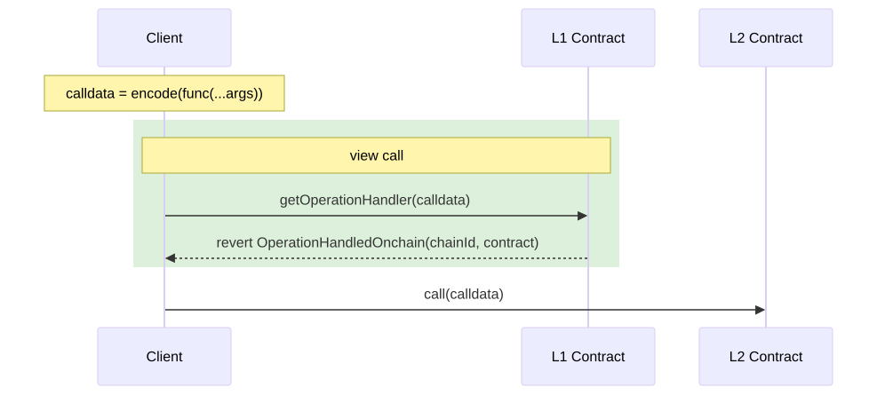
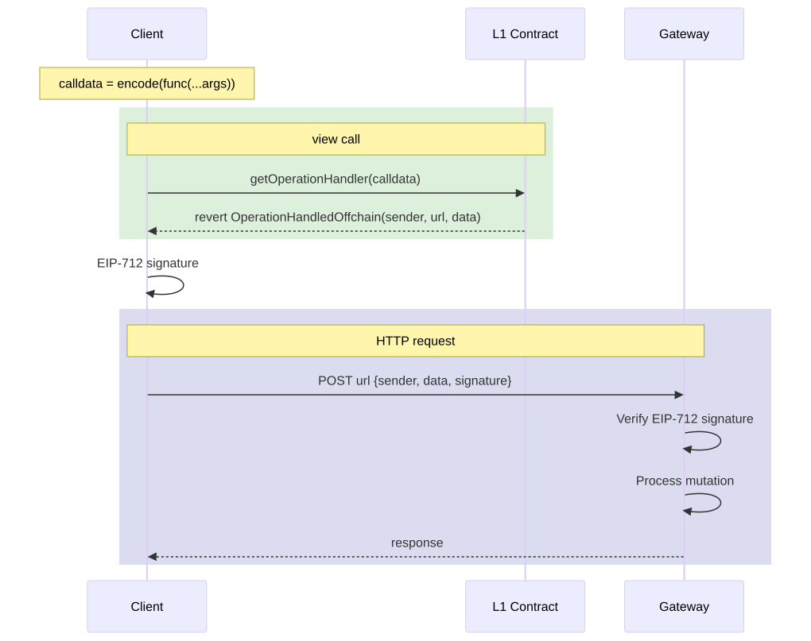

## 摘要

本 EIP 介绍了一种允许智能合约将写操作重定向到外部系统的协议。该协议定义了一种标准化方式，使合约能够指示操作应由部署到 L2 链、L1 或链下数据库的合约处理，从而为简单的开发者体验和客户端实现提供了一个入口点。

## 动机

随着以太坊生态系统的发展，越来越需要有效的方式来管理跨不同层和系统的数据存储。

该协议通过以下方式应对这些挑战：

- 提供一种通过 view 函数确定操作处理程序的 gas 有效方式
- 实现与 L2 解决方案和链下数据库的无缝集成
- 通过类型化签名和标准化接口维护强大的安全保证

## 规范

### 核心组件

该协议由三个主要组件组成：

1. 一个名为 `getOperationHandler` 的 view 函数接口，用于确定操作处理程序，该处理程序可以是以下类型之一：
a. 用于链上处理程序的 `OperationHandledOnchain`
b. 用于通过网关的链下处理程序的 `OperationHandledOffchain`
2. 用于链下存储授权的标准化消息格式

### 接口

```solidity
interface OperationRouter {

  /** 
    * @dev 当在 getOperationHandler 函数上收到不支持的编码函数时引发的错误
    */
  error FunctionNotSupported();

  /**
    * @dev 当变更正在链上（即 Layer 1 或 Layer 2）被延迟时引发的错误
    * @param chainId 要执行延迟变更的链 ID。
    * @param contractAddress 应该与延迟变更进行交易的合约地址。
    */
  error OperationHandledOnchain(
      uint256 chainId,
      address contractAddress
  );

  /**
    * @notice 用于定义 EIP-712 中定义的类型化数据签名的域的结构体。
    * @param name 签名对应的合约的用户友好名称。
    * @param version 正在使用的域对象的版本。
    * @param chainId 签名对应的链的 ID
    * @param verifyingContract 签名相关的合约地址。
    */
  struct DomainData {
      string name;
      string version;
      uint64 chainId;
      address verifyingContract;
  }

  /**
    * @notice 用于定义链下存储授权的消息上下文的结构体
    * @param data 原始的 ABI 编码函数调用
    * @param sender 执行变更的用户的地址 (msg.sender)。
    * @param expirationTimestamp 变更将过期的的时间戳。
    */
  struct MessageData {
      bytes data;
      address sender;
      uint256 expirationTimestamp;
  }

  /**
    * @dev 当变更正在被延迟到链下实体时引发的错误
    * @param sender EIP-712 域定义
    * @param url 用于请求执行链下变更的 URL
    * @param data 原始的 ABI 编码函数调用以及授权上下文
    */
  error OperationHandledOffchain(
      DomainData sender,
      string url,
      MessageData data
  );

  /**
    * @notice 确定编码函数调用的适当处理程序
    * @param encodedFunction ABI 编码函数调用
    */
  function getOperationHandler(bytes calldata encodedFunction) external view;
}

```

链上流程指定如下：



重要的是要注意，`getOperationHandler` 依赖于给定的参数（编码函数）来指定请求将被重定向到哪个合约，因此，它无法处理可能导致不同目标合约的 `multicall` 交易。这意味着已知的 `multicall` 将被重定向到不同的合约，应该以顺序方式处理，首先调用 `getOperationHandler`，然后向返回的合约进行实际交易。

#### 数据库流程

到网关的 HTTP 请求遵循 [EIP-3668](./eip-3668) 提出的相同标准，其中 URL 接收 `/{sender}/{data}.json`，使 API 的行为就像智能合约一样。但是，引入了 [EIP-712 Typed Signature](./eip-712.md) 以启用身份验证。



### 实现示例

部署到 L1 的合约必须实现 `getOperationHandler` 以充当将请求重定向到相应处理程序的路由器。

```solidity
contract OperationRouterExample {
    function getOperationHandler(bytes calldata encodedFunction) external view {
        bytes4 selector = bytes4(encodedFunction[:4]);

        if (selector == bytes4(keccak256("setText(bytes32, string)"))) {
            revert OperationHandledOffchain(
                DomainData(
                    "IdentityResolver",
                    "1",
                    1,
                    address(this)
                ),
                "https://api.example.com/profile",
                MessageData(
                    encodedFunction,
                    msg.sender,
                    block.timestamp + 1 hours
                )
            );
        }

        if (selector == bytes4(keccak256("setAddress(bytes32,address)"))) {
            revert OperationHandledOnchain(
                10,
                address(0x123...789)
            );
        }
    }
}

```

客户端实现如下所示：

```tsx
 try {
  const calldata = {
    functionName: 'setText',
    abi,
    args: [key, value],
    address,
    account
  }
 
  await client.readContract({
    functionName: 'getOperationHandler',
    abi,
    args: [encodeFunctionData(calldata)],
  })
} catch (err) {
  const data = getRevertErrorData(err)

  switch (data?.errorName) {
    case 'OperationHandledOffchain': {
      const [domain, url, message] = errorResult.args as [
        DomainData,
        string,
        MessageData,
      ]
      await handleDBStorage({ domain, url, message, signer })
    }
    case 'OperationHandledOnchain': {
      const [chainId, contractAddress] = data.args as [bigint, `0x${string}`]

      const l2Client = createPublicClient({
        chain: getChain(Number(chainId)),
        transport: http(),
      }).extend(walletActions)

      const { request } = await l2Client.simulateContract({
        ...calldata,
        address: contractAddress,
      })
      await l2Client.writeContract(request)
    }
    default:
      console.error('error registering domain: ', { err })
  }
```

## 理由

该标准旨在启用链下写入操作，旨在作为 CCIP-Read ([ERC-3668](./eip-3668)) 的补充，该标准已被社区广泛采用。

## 向后兼容性

本 EIP 完全向后兼容，因为它：

- 引入了与现有接口不冲突的新接口
- 使用 view 函数来收集链下信息
- 可以与现有的存储模式一起实施

## 安全注意事项

### 处理程序验证

链下处理程序必须：

- 验证 EIP-712 签名
- 实施适当的访问控制
- 安全地处理并发修改

### 一般建议

- 为链下处理程序实施速率限制
- 对链下通信使用安全传输 (HTTPS)
- 监控可能表明攻击的异常模式
- 为失败的事务实施适当的错误处理

## 版权

版权和相关权利已通过 [CC0](../LICENSE.md) 放弃。