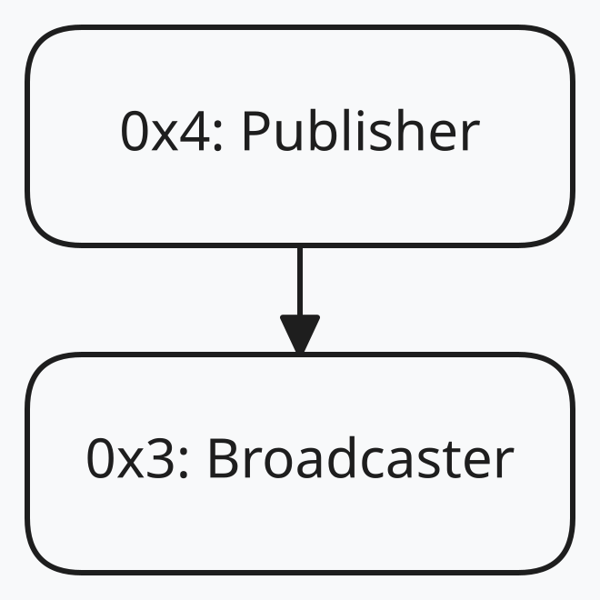
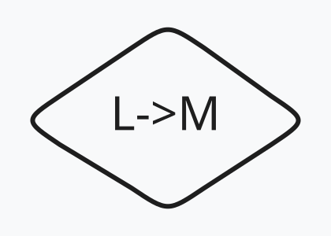
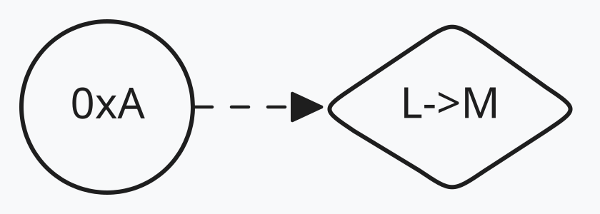
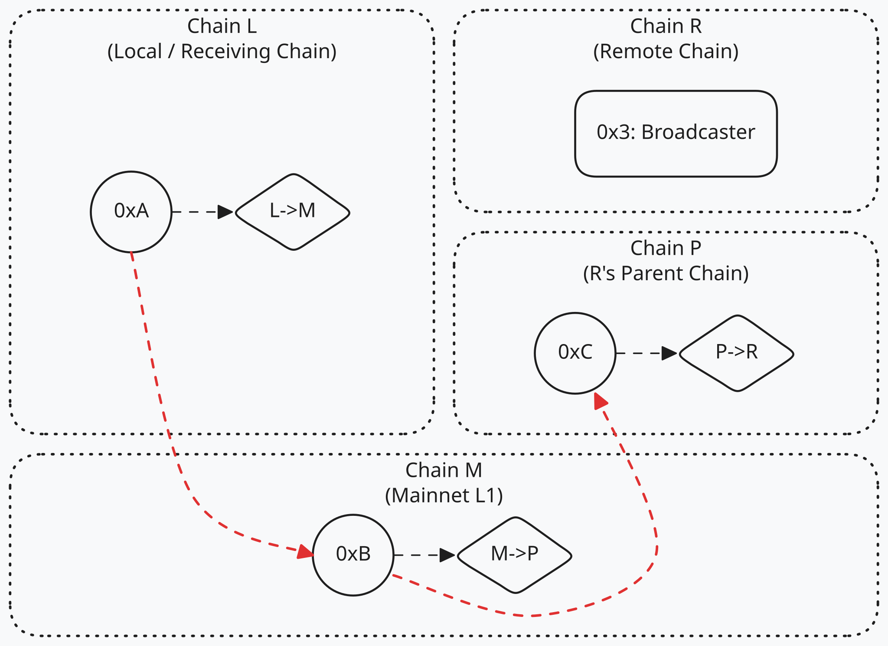
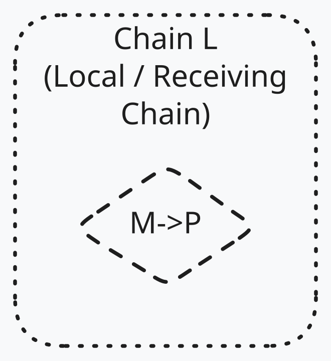
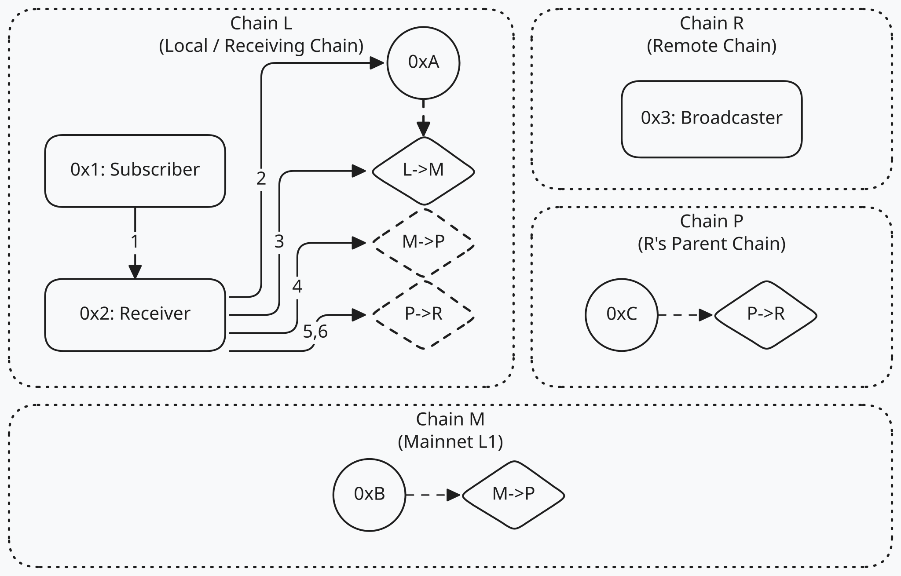

## 摘要

此 ERC 定义了一个使用存储证明进行跨 Rollup 消息传递的协议。用户可以在源链上广播消息，并且这些消息可以在与源链共享公共祖先的任何其他链上进行验证。

每个链都部署一个单例的 Receiver 和 Broadcaster 合约。Broadcaster 存储消息；Receiver 验证远程链上 Broadcaster 的存储。为此，Receiver 首先验证存储证明链以恢复远程区块哈希，然后验证该区块上 Broadcaster 的存储。

关键的是，用于验证存储证明的逻辑没有硬编码在 Receiver 中。相反，它将此委托给用户指定的 BlockHashProver 合约列表。每个 BlockHashProver 定义如何验证特定主链的存储证明，以恢复特定目标链的区块哈希。由于 Rollup 合约的存储布局可能会随时间变化，因此存储证明验证过程本身也必须是可升级的——因此 BlockHashProver 是可升级的。这种灵活的、可升级的证明验证模型是本标准的核心贡献。

## 动机

以太坊生态系统正经历着 Rollup 链数量的快速增长。随着链数量的增长，用户体验变得更加分散，从而产生了对 Rollup 链之间可信“互操作性”的需求。这些 Rollup 链托管在不同的 Rollup 堆栈上，具有异构属性，并且到目前为止，还没有一种简单、可信、统一的机制来在这些不同的链之间发送消息。

许多类型的应用程序都可以从一个统一的跨链广播消息系统中受益。一些例子包括：

- **基于意图的协议：** 这些协议使“填充者”能够代表用户快速执行跨链操作，然后通过较慢的、可信的消息传递来结算这些操作。然而，由于缺乏一个简单、统一的接口来发送结算消息，意图协议通常会开发专有方法。这提高了填充者、集成商和新协议的采用门槛。一个可在 Rollup 堆栈上运行的可插拔、标准化的消息传递解决方案将允许开发者和标准作者专注于意图堆栈的其他组件，例如履行约束、订单格式和托管。
- **多链应用程序的治理：** 多链应用程序通常有一个链，其中包含核心治理合约。标准化的广播消息传递系统简化了提案结果到多链应用程序所有实例的传播。
- **多链预言机：** 某些类型的预言机可能受益于能够将其数据发布到单个链，同时使相同的数据可以轻松地在许多其他链上访问。

## 规范

本文档中的关键词“MUST”、“MUST NOT”、“REQUIRED”、“SHALL”、“SHALL NOT”、“SHOULD”、“SHOULD NOT”、“RECOMMENDED”、“MAY”和“OPTIONAL”应按照 RFC 2119 中的描述进行解释。

### 兼容性要求

链必须满足以下条件才能与系统兼容：

- 必须在父链上存储最终确定的区块哈希
- 必须在子链状态中存储父链区块哈希
- 必须与 L1 具有 EVM 等效性。BlockHashProver 作为副本部署在许多链上，因此需要在所有这些链上表现相同

### 常量

```solidity
uint256 constant BLOCK_HASH_PROVER_POINTER_SLOT = uint256(keccak256("eip7888.pointer.slot")) - 1;
```

### Broadcaster

Broadcaster 负责在状态中存储消息，以供其他链上的 Receiver 读取。Broadcaster 的调用者称为 Publisher。Broadcaster 仅存储 32 字节的消息。

Broadcaster 不接受来自同一 publisher 的重复消息。

<div align="center">

<br/>
<em>图 1：地址为 0x4 的 Publisher 调用地址为 0x3 的 Broadcaster</em>
</div>

```solidity
/// @notice 向 receiver 广播消息。
interface IBroadcaster {
    /// @notice 广播消息时发出。
    /// @param  message publisher 广播的消息。
    /// @param  publisher publisher 的地址。
    event MessageBroadcast(bytes32 indexed message, address indexed publisher);

    /// @notice 广播消息。调用者被称为“publisher”。
    /// @dev    如果 publisher 已经广播了消息，则必须回滚。
    ///         必须发出 MessageBroadcast。
    ///         必须将 block.timestamp 存储在槽 keccak(message, msg.sender) 中。
    /// @param  message 要广播的消息。
    function broadcastMessage(bytes32 message) external;
}
```

### BlockHashProver
BlockHashProver 证明了可以直接访问彼此最终确定区块的两个链之间的单向链接。此链接中的链称为**主链**和**目标链**。BlockHashProver 负责验证存储证明，以证明主链状态中存在最终确定的目标区块哈希。

由于 BlockHashProver 是单向的，因此每个链需要有两个：
* 一个主链为子链，目标为父链。
* 一个主链为父链，目标为子链。

BlockHashProver 必须确保它们在所有链上都具有相同的已部署代码哈希。

<div align="center">

<br/>
<em>图 2：主链为 L，目标链为 M 的 BlockHashProver</em>
</div>

```solidity
/// @notice IBlockHashProver 负责在给定其主链状态的情况下检索其目标链的区块哈希。
///         主链的状态由区块哈希和证明给出，或者由在主链上执行的 BlockHashProver 给出。
///         单个主链和目标链由该合约的逻辑固定。
interface IBlockHashProver {
    /// @notice 验证给定主链区块哈希和证明的目标链区块哈希。
    /// @dev    如果在主链上调用，必须回滚。
    ///         如果输入无效或输入不足以确定区块哈希，则必须回滚。
    ///         必须返回目标链区块哈希。
    ///         必须是纯函数，但有一个例外：MAY 读取 address(this).code。
    /// @param  homeBlockHash 主链的区块哈希。
    /// @param  input 从主链区块哈希确定目标链区块哈希所需的任何必要输入。
    /// @return targetBlockHash 目标链的区块哈希。
    function verifyTargetBlockHash(bytes32 homeBlockHash, bytes calldata input)
        external
        view
        returns (bytes32 targetBlockHash);

    /// @notice 获取目标链的区块哈希。通过直接访问主链上的状态来实现。
    /// @dev    如果未在主链上调用，则必须回滚。
    ///         如果无法确定目标链的区块哈希，则必须回滚。
    ///         必须返回目标链区块哈希。
    ///         SHOULD 使用输入来确定要返回的特定区块哈希。（例如，输入可以是区块号）
    ///         SHOULD NOT 从其自己的存储中读取。此合约并非旨在具有状态。
    ///         MAY 进行外部调用。
    /// @param  input 获取目标链区块哈希所需的任何必要输入。
    /// @return targetBlockHash 目标链的区块哈希。
    function getTargetBlockHash(bytes calldata input) external view returns (bytes32 targetBlockHash);

    /// @notice 验证给定目标链区块哈希和证明的存储槽。
    /// @dev    此函数 MUST NOT 假定它正在主链上被调用。
    ///         如果输入无效或输入不足以确定存储槽及其值，则必须回滚。
    ///         必须返回目标链上的存储槽及其值
    ///         必须是纯函数，但有一个例外：MAY 读取 address(this).code。
    /// @param  targetBlockHash 目标链的区块哈希。
    /// @param  input 确定单个存储槽及其值的任何必要输入。
    /// @return account 目标链上帐户的地址。
    /// @return slot 目标链上帐户的存储槽。
    /// @return value 存储槽的值。
    function verifyStorageSlot(bytes32 targetBlockHash, bytes calldata input)
        external
        view
        returns (address account, uint256 slot, bytes32 value);

    /// @notice 区块哈希 provers 的版本。
    /// @dev    必须是纯函数，但有一个例外：MAY 读取 address(this).code。
    function version() external pure returns (uint256);
}
```

### BlockHashProverPointer

BlockHashProver 可用于获取或验证目标区块哈希，但由于其验证逻辑是不可变的，因此对主链或目标链结构的更改可能会破坏这些 Prover 中的逻辑。BlockHashProverPointer 是指向 BlockHashProver 的指针，如果需要更改证明逻辑，可以对其进行更新。

BlockHashProverPointer 用于引用 BlockHashProver，而不是直接引用 Prover。为此，无论在何处部署 BlockHashProver，都需要部署 BlockHashProverPointer 来引用它。

BlockHashProverPointer 允许被许可方更新指针内的 Prover 引用。选择哪个方应该具有更新 Prover 引用的权限应仔细考虑。一般规则是，如果对目标链或主链的更新可能会破坏当前 Prover 中的逻辑，那么能够进行该更新的一方或机制也应被授予更新 Prover 的权限。有关 BlockHashProverPointer 所有权和更新的更多信息，请参见[安全注意事项](#security-considerations)。

当更新 BlockHashProverPointer 以指向新的 BlockHashProver 实现时：
* 新 BlockHashProver 的主链和目标链必须与先前的 BlockHashProver 相同。
* 新 BlockHashProver 必须具有比先前的 BlockHashProver 更高的版本。

BlockHashProverPointer 必须将 BlockHashProver 实现的代码哈希存储在槽 `BLOCK_HASH_PROVER_POINTER_SLOT` 中。

<div align="center">

<br/>
<em>图 3：地址为 0xA 的 BlockHashProverPointer 指向主链为 L，目标链为 M 的 BlockHashProver</em>
</div>

```solidity
/// @title  IBlockHashProverPointer
/// @notice 保存最新版本区块哈希 prover 的代码哈希。
///         必须将代码哈希存储在存储槽 BLOCK_HASH_PROVER_POINTER_SLOT 中。
///         prover 的不同版本必须具有相同的主链和目标链。
///         如果指针的 prover 已更新，则新 prover 必须具有比旧 prover 更高的 IBlockHashProver::version()。
///         这些指针始终通过其主链上的地址引用。
interface IBlockHashProverPointer {
    /// @notice 返回 prover 最新版本的代码哈希。
    function implementationCodeHash() external view returns (bytes32);

    /// @notice 返回主链上 prover 最新版本的地址。
    function implementationAddress() external view returns (address);
}
```

### 路由

路由是从本地链上的 Receiver 到远程链的相对路径。它由 BlockHashProverPointer 指示的许多单一度链接构成。Receiver 使用 Pointer 引用的 BlockHashProver 来验证一系列证明以获得远程链的区块哈希。由主链上的 Pointer 地址列表定义的路由。

有效路由 必须 遵守以下规则：
- `route[0]` Pointer 的主链必须等于本地链
- `route[i]` Pointer 的目标链必须等于 `route[i+1]` Pointer 的主链

<div align="center">

<br/>
<em>图 4：从链 L 到链 R 的路由 [0xA, 0xB, 0xC]<br/>
链 L 是 L2，链 M 是以太坊主网，链 P 是另一个 L2，链 R 是结算到链 P 的 L3</em>
</div>

### 标识符

远程链上的帐户由从本地链采用的路由加上远程链上的地址标识。路由中使用的 Pointer 地址以及远程地址以累积方式进行 keccak256 哈希处理，以形成**远程帐户 ID**。

通过这种方式，相对于本地链，远程链上的任何地址（包括 Pointer 和 Broadcaster）都可以通过其远程帐户 ID 唯一标识。

ID 取决于路由，因此始终相对于本地链。换句话说，给定链上的同一帐户将根据来自本地链的路由具有不同的 ID。

远程账号 ID 定义为 `accumulator([...route, remoteAddress])`

```solidity
function accumulator(address[] memory elems) pure returns (bytes32 acc) {
    for (uint256 i = 0; i < elems.length; i++) {
        acc = keccak256(abi.encode(acc, elems[i]));
    }
}
```

在图 4 中：
- `0x3` 处 Broadcaster 的远程帐户 ID 是 `accumulator([0xA, 0xB, 0xC, 0x3])`
- BlockHashProverPointer `0xC` 的远程帐户 ID 是 `accumulator([0xA, 0xB, 0xC])`。

### BlockHashProverCopies

BlockHashProverCopies 是部署在非主链上的 BlockHashProver 的精确副本。当从 Pointer 中取消引用 BlockHashProver 代码哈希时，可以使用 BlockHashProver 的副本执行其逻辑。由于 Pointer 通过代码哈希引用 prover，因此可以部署 Prover 的本地副本并用于执行特定的证明逻辑。Receiver 缓存 `mapping(bytes32 blockHashProverPointerId => IBlockHashProver blockHashProverCopy)` 的映射，以跟踪 BlockHashProverCopies。

<div align="center">

<br/>
<em>图 5：链 L 上 BlockHashProver M->P 的 BlockHashProverCopy</em>
</div>

### Receiver

Receiver 负责验证存储在其他链上 Broadcaster 中的 32 字节消息。调用者向 Receiver 提供到远程帐户的路由和证明来验证路由。

<div align="center">

<br/>
<em>图 6：Receiver 从链 R 上的 Broadcaster 读取消息的示例</em>
</div>

图 6 中的调用执行以下操作：
1. Subscriber 调用 `IReceiver::verifyBroadcastMessage`，传递路由 `[0xA, 0xB, 0xC]`、证明数据、消息、publisher。
2. Receiver 调用 `IBlockHashProverPointer(0xA)::implementationAddress` 以获取 BlockHashProver L->M 的地址
3. Receiver 调用 `IBlockHashProver(Prover L->M)::getTargetBlockHash`，传递 Subscriber 给出的输入以获取链 M 的区块哈希。
4. Receiver 调用 `IBlockHashProver(Prover Copy M->P)::verifyTargetBlockHash`，传递链 M 的区块哈希和 Subscriber 给出的证明数据以获取链 P 的区块哈希。
5. Receiver 调用 `IBlockHashProver(Prover Copy P->R)::verifyTargetBlockHash`，传递链 P 的区块哈希和 Subscriber 给出的证明数据以获取链 R 的区块哈希。
6. 最后，Receiver 调用 `IBlockHashProver(Prover Copy P->R)::verifyStorageSlot`，传递 Subscriber 给出的输入以获取 Broadcaster 的存储槽。Receiver 将 Broadcaster 的远程帐户 ID 和消息的时间戳返回给 Subscriber。

```solidity
/// @notice 从 broadcaster 读取消息。
interface IReceiver {
    /// @notice 读取远程链上帐户的存储所需的参数。
    /// @dev    存储证明始终是针对单个槽的，如果证明针对多个槽，则 IReceiver 必须回滚
    /// @param  route BlockHashProverPointer 在到远程链的路由上的主链地址。
    /// @param  bhpInputs 到 BlockHashProver / BlockHashProverCopies 的输入。
    /// @param  storageProof 传递给最后一个 BlockHashProver / BlockHashProverCopy 的证明
    ///                      以验证给定目标区块哈希的存储槽。
    struct RemoteReadArgs {
        address[] route;
        bytes[] bhpInputs;
        bytes storageProof;
    }

    /// @notice 从远程链接读取广播消息。
    /// @param  broadcasterReadArgs 一个 RemoteReadArgs 对象：
    ///         - 指向广播链的路由
    ///         - 帐户证明适用于 broadcaster 的帐户
    ///         - 存储证明适用于消息槽
    /// @param  message 要读取的消息。
    /// @param  publisher 广播消息的 publisher 的地址。
    /// @return broadcasterId broadcaster 的唯一标识符。
    /// @return timestamp 广播消息的时间戳。
    function verifyBroadcastMessage(RemoteReadArgs calldata broadcasterReadArgs, bytes32 message, address publisher)
        external
        view
        returns (bytes32 broadcasterId, uint256 timestamp);

    /// @notice 更新存储中的区块哈希 prover 副本。
    ///         检查 BlockHashProverCopy 是否具有与存储在 BlockHashProverPointer 中的相同的代码哈希
    ///         检查版本是否正在增加。
    /// @param  bhpPointerReadArgs 一个 RemoteReadArgs 对象：
    ///         - 指向 BlockHashProverPointer 主链的路由
    ///         - 帐户证明适用于 BlockHashProverPointer 的帐户
    ///         - 存储证明适用于 BLOCK_HASH_PROVER_POINTER_SLOT
    /// @param  bhpCopy 本地链上的 BlockHashProver 副本。
    /// @return bhpPointerId BlockHashProverPointer 的 ID
    function updateBlockHashProverCopy(RemoteReadArgs calldata bhpPointerReadArgs, IBlockHashProver bhpCopy)
        external
        returns (bytes32 bhpPointerId);

    /// @notice 本地链上对应于 bhpPointerId 的 BlockHashProverCopy
    ///         如果 BlockHashProverPointer 不存在，则必须返回 0。
    function blockHashProverCopy(bytes32 bhpPointerId) external view returns (IBlockHashProver bhpCopy);
}
```

## 理由

### 广播 vs 单播

任何给定链上的合约都不能决定哪些其他链可以检查其状态，哪些不能。合约自然地将其状态广播给任何能够读取它的东西。定向消息传递应用程序始终可以构建在广播消息传递系统之上。

有关单播应用程序的示例，请参见[参考实现](#reference-implementation)。

### 使用存储证明

消息读取使用存储证明。另一种方法是通过链的规范桥传递消息（可能是批处理的）。但是，存储证明比这种方法具有一些优势：

- 它们只需要发送和接收消息的链上的 gas 代币，而不需要中间路由上的链上的 gas 代币。
- 默认情况下进行批处理。由于存储槽共享一个通用的存储根，因此缓存存储根允许读取器以更低的成本打开相邻的槽。这提供了一种隐式批处理形式，而规范桥需要创建一种显式批处理形式。
- 如果两个链的共同祖先是以太坊，则使用规范桥发送消息需要在以太坊上发送交易，这可能会导致很高的成本。

### 每个 publisher 没有重复的消息

为了允许 publisher 多次发送同一消息，此 ERC 中需要存在某种 nonce 系统。由于 nonce 可以在 Publisher / Subscriber 层实现，并且并非所有 Publisher / Subscriber 都需要此功能，因此将其从本 ERC 中排除。

#### 成本比较
在这里，我们将比较使用存储证明的成本与通过规范桥发送消息的成本，其中父链是以太坊。在这里，我们将只考虑 L1 gas 的成本，因为我们假设它在 L2 gas 成本中占主导地位。

路由中的每个步骤都需要 1 个存储证明。这些证明可以估计为大约 6.5k 字节。这些证明很可能会在 L2/L3 上提交，因此包含在 L1 上的 blob 中，该 blob 具有波动的 blob gas 价格。由于 Rollup 可以在 calldata 和 blob 之间动态切换，我们可以计算出可以使用标准 calldata 成本的正常 L1 gas 的最大量作为上限。Pectra 之后，非零字节 calldata 的上限是每字节 40 gas，对于 6.5k 字节，相当于 260,000 L1 gas。

我们想将其与通过规范 Rollup 桥发送单个消息进行比较，该消息是父->子或子->父消息。此估计值取决于不同 Rollup 框架的桥的特定实现，但我们估计它约为 150,000 gas。

这使得存储证明的上限约为规范桥的 2 倍，但实际上很少达到此上限。最重要的是，Receiver 可以实施缓存策略，允许许多消息共享相同的存储证明。

### 缓存
此 ERC 目前没有描述 Receiver 如何缓存存储证明的结果以提高效率。简而言之，一旦执行了存储证明，就不需要再次执行它，而是可以将结果存储在 Receiver 中。这允许共享相同或部分相同的路由的消息共享先前执行的存储证明，而是查找结果。作为一个例子，我们可以考虑两个 L2 之间的路由：
1. 以太坊区块哈希由 L2' 上的 Receiver 直接在 L2' 上查找
2. L2'' 的区块哈希使用存储证明进行证明
3. L2'' 上 Broadcaster 的根帐户使用存储证明进行证明
4. Broadcaster 帐户中的槽值使用存储证明进行证明
此过程中，第 4 步之前的所有结果都可以存储在 Receiver 缓存中，并由 Broadcaster 中任何未读消息重复使用。Receiver 甚至可以更进一步，在帐户树中缓存各个节点，以使先前的消息降低第 4 步的成本。

### 在标识符中使用路由

链通常由链 ID 标识。链 ID 由链所有者设置，因此不能保证是唯一的。使用 Pointer 的地址保证是唯一的，因为它提供了一种解包嵌入在状态根中的嵌套区块哈希的方法。远程链上的存储槽可以由许多不同的远程帐户 ID 标识，但一个远程帐户 ID 不能标识多个存储槽。

### BlockHashProver、Pointer 和 Copy

#### BlockHashProver
每个 Rollup 都实现用于管理和存储区块哈希的独特逻辑。为了适应这种多样性，BlockHashProver 实现了特定于链的过程。这种灵活性允许与每个 Rollup 的不同架构集成。

BlockHashProver 处理验证给定目标区块哈希的存储槽的最后一步，以适应具有不同状态树格式的 Rollup。

#### BlockHashProverPointer
路由通过 Pointer 而不是直接引用 BlockHashProver。这种间接性至关重要，因为：
- 链升级可能需要重新部署 BlockHashProver
- 路由必须在这些升级中保持稳定和有效 - 确保正在传输的消息不会中断
- Pointer 在允许 BlockHashProver 实现发展的同时保持路由一致性

#### BlockHashProverCopies
由于 BlockHashProverPointer 通过其代码哈希引用 BlockHashProver，因此 BlockHashProver 的副本可以部署在任何位置，并且可以可靠地理解为包含与 Pointer 引用的代码相同的代码。这允许 Receiver 在本地使用 BlockHashProver 的代码，其主链是远程链。

## 参考实现

以下是一个单向跨链代币迁移器的示例。迁移器的燃烧端是一个 publisher，它通过 Broadcaster 发送燃烧消息。铸币端通过另一个链上的 Receiver 订阅这些燃烧消息。

```solidity
/// @notice 燃烧和铸币迁移器的消息格式。
struct BurnMessage {
    address mintTo;
    uint256 amount;
    uint256 nonce;
}
```

```solidity
/// @notice 示例单向跨链代币迁移器的燃烧端。
/// @dev    此合约被视为“publisher”
contract Burner {
    /// @notice 要燃烧的代币。
    IERC20 public immutable burnToken;
    /// @notice 通过其发布消息的 broadcaster。
    IBroadcaster public immutable broadcaster;
    /// @notice 递增的 nonce，因此每次燃烧都是唯一的消息。
    uint256 public burnCount;

    /// @notice 令牌燃烧时发出的事件。
    /// @dev    Publishers SHOULD 发出足够的信息来重建消息。
    event Burn(BurnMessage messageData);

    constructor(IERC20 _burnToken, IBroadcaster _broadcaster) {
        burnToken = _burnToken;
        broadcaster = _broadcaster;
    }

    /// @notice 燃烧代币并广播事件。
    ///         相应的代币铸币者将在另一个链上订阅该消息并铸造代币。
    function burn(address mintTo, uint256 amount) external {
        // 首先，提取代币并燃烧它们
        burnToken.transferFrom(msg.sender, address(this), amount);
        burnToken.burn(amount);

        // 接下来，构建一条唯一的消息
        BurnMessage memory messageData = BurnMessage({mintTo: mintTo, amount: amount, nonce: burnCount++});
        bytes32 message = keccak256(abi.encode(messageData));

        // 最后，广播消息
        broadcaster.broadcastMessage(message);

        emit Burn(messageData);
    }
}
```

```solidity
/// @notice 示例单向跨链代币迁移器的铸币端。
///         必须为此合约授予其代币的铸币权限。
/// @dev    此合约被视为“subscriber”
contract Minter {
    /// @notice 另一条链上 Burner 合约的地址。
    address public immutable burner;
    /// @notice 与 Burner 使用的另一条链上的 broadcaster 对应的 BroadcasterID。
    ///         Minter 只会接受 Burner 通过此 Broadcaster 发布的消息。
    bytes32 public immutable broadcasterId;
    /// @notice 用于侦听消息的 receiver。
    IReceiver public immutable receiver;
    /// @notice 用于跟踪已处理消息的映射。
    ///         Subscribers SHOULD 跟踪已处理的消息，因为 Receiver 不会跟踪。
    ///         Broadcaster 确保消息是唯一的，因此不可能有真正的重复消息。
    mapping(bytes32 => bool) public processedMessages;
    /// @notice 要铸造的代币。
    IERC20 public immutable mintToken;

    constructor(address _burner, bytes32 _broadcasterId, IReceiver _receiver, IERC20 _mintToken) {
        burner = _burner;
        broadcasterId = _broadcasterId;
        receiver = _receiver;
        mintToken = _mintToken;
    }

    /// @notice 收到消息后铸造代币。
    function mintTokens(IReceiver.RemoteReadArgs calldata broadcasterReadArgs, BurnMessage calldata messageData)
        external
    {
        // 从数据计算消息
        bytes32 message = keccak256(abi.encode(messageData));

        // 确保消息尚未处理
        require(!processedMessages[message], "Minter: Message already processed");

        // 验证广播消息
        (bytes32 actualBroadcasterId,) = receiver.verifyBroadcastMessage(broadcasterReadArgs, message, burner);

        // 确保消息来自预期的 broadcaster
        require(actualBroadcasterId == broadcasterId, "Minter: Invalid broadcaster ID");

        // 将消息标记为已处理
        processedMessages[message] = true;

        // 将代币铸造给接收者
        mintToken.mint(messageData.mintTo, messageData.amount);
    }
}
```

## 安全注意事项

### 链升级
如果链升级，使得 BlockHashProver 的 `verifyTargetBlockHash` 或 `getTargetBlockHash` 函数可能返回已完成的目标区块哈希之外的数据，则 `Receiver` 可能会读取无效消息。例如，如果链将其区块哈希存储在父链上的特定映射中，并且该存储位置稍后被重新利用，则旧的 BlockHashProver 可能能够传递无效的区块哈希。因此，重要的是：
* BlockHashProver 的编写方式应能够检测到这样的更改
* 能够重新利用这些存储位置的所有者意识到 BlockHashProver 并确保它们不会破坏它

### BlockHashProverPointer 所有权/更新
恶意的 BlockHashProverPointer 所有者可以进行 DoS 攻击或伪造消息。但是，负责设置历史父/子区块哈希位置的链所有者也可以这样做。因此，预计此链所有者与 BlockHashProverPointer 的所有者相同，以免引入其他风险。

* 如果引用的 BlockHashProver 的目标链是父链，则主链所有者预计是 BlockHashProverPointer 的所有者。
* 如果引用的 BlockHashProver 的目标链是子链，则目标链所有者预计是 BlockHashProverPointer 的所有者。

如果所有者未能履行其在必要时使用新的 BlockHashProver 实现更新 Pointer 的责任，则消息可能无法到达其目的地。

如果所有者恶意更新 Pointer 以指向产生欺诈结果的 BlockHashProver，则可以伪造消息。

如果确信连接它们的路由上的链不会升级以破坏 BlockHashProver，则可以在没有正确拥有的 BlockHashProverPointer 的情况下部署未拥有的 BlockHashProverPointer。

### 消息保证
此 ERC 描述了一种协议，用于确保可以读取远程链上的消息，但不能保证它们将被读取。Receiver 调用者有责任选择他们希望读取的消息。

由于 ERC 仅使用最终确定区块，因此消息可能需要很长时间才能在链之间传播。最终确定在路由中按顺序发生，因此读取消息的时间是路由中每个步骤的每个区块哈希的最终确定之和。

## 版权
版权和相关权利通过 [CC0](../LICENSE.md) 放弃。
