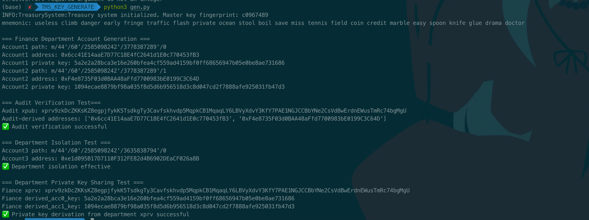

## 摘要

本提案旨在为机构资产的链上金库管理提供一种标准化的方法，确保安全的私钥生成、分层管理和部门权限隔离，同时支持多链环境中的资产安全和交易效率。通过定义统一的推导路径和安全机制，本提案为金库管理提供了一种高效且安全的解决方案。

## 动机

随着区块链和 DeFi 的快速发展，链上资产的安全管理已变得至关重要。传统的私钥管理难以满足大型组织在复杂场景中的安全需求，在这些场景中，分层密钥管理、权限控制和多重签名机制至关重要。本提案为机构金库管理提供了一种标准化的解决方案，确保资产安全和交易效率。

## 规范

### 推导路径

为了安全地进行链上金库账户密钥管理，实现方式**必须**使用以下分层确定性 (HD) 路径：

```latex
m/44'/60'/entity_id' / department_id' / account_index
```

路径组成部分：

1. **主密钥 (**`m`**)**

   - **应该**代表根 HD 钱包私钥。

2. **BIP-44 合规层 (`44'`)**

   - **必须**使用 `44'`（强化）来指示 BIP-44 合规性。

3. **币种类型层 (`60'`)**

   - 对于以太坊和 EVM 兼容链**应该**使用 `60'`（强化）。

4. **实体标识符 (`entity_id'`)**

   - **必须**通过将子公司名称哈希为强化索引来派生。
   - **不得**在不同的子公司之间重复使用相同的 `entity_id'`。

5. **部门标识符 (**`department_id'`**)**

   - **应该**通过将部门名称哈希为强化索引来派生。
   - **必须**通过强化派生隔离部门之间的密钥。

6. **账户索引 (**`account_index`**)**

   - **必须**使用非强化派生以允许统一的账户管理。

**关于 BIP-44 适配的说明**：

- 由于以太坊/EVM 的账户模型（非 UTXO），BIP-44 `change` 层**应该**省略。

### 哈希转换

为了推导出 `entity_id` 和 `department_id`：

1. **实体索引计算**

   - **应该**将 `entity_id` 计算为：

```python
entity_hash = sha256(f"ENTITY:{entity}".encode()).digest()  
entity_index = int.from_bytes(entity_hash[:4], "big") | 0x80000000   # 2^31 ≤ index < 2^32
```

2. **部门索引计算**

   - **必须**将 `department_id` 计算为：

```python
dept_hash = sha256(f"DEPT:{entity_hash}:{department}".encode()).digest()  
dept_index = int.from_bytes(dept_hash[:4], "big") | 0x80000000   # 2^31 ≤ index < 2^32
```

3. **输出约束**

   - 生成的索引**必须**是 `[2^31, 2^32-1]` 范围内的整数，以强制执行强化派生。

### 基于角色的访问扩展路径

为了更精细的访问控制（例如，部门内的角色）：

```latex
m/60'/entity_id' / department_id' /role_id'/ account_index
```

1. **角色标识符 (**`role_id'`**)**

   - **应该**使用强化派生来隔离特定于角色的密钥。

**兼容性提示**：

- 省略 `44'` 层**可能**会导致与标准钱包（例如，MetaMask）不兼容。
- 与此类钱包的集成**必须**实现自定义插件来处理此偏差。

### 较小实体的简化路径

对于没有子公司的实体：

```latex
m/44'/60' / department_id' /0/ account_index
```

**兼容性保证**

- 此结构**应该**确保与主流 BIP-44 钱包的兼容性。

### 密钥派生算法

实现方式**必须**遵守：

```latex
E = Map<entity, List<Department>>
n = Layer2 curve order
path = m/44'/60'/entity_id' / department_id' / account_index
BIP32() = Official BIP-0032 derivation function on secp256k1
hash = SHA256
root_key = BIP32(path)
for each E:
	key = hash(root_key|hierarchical_hash_to_index(entity,department))
	return key
```

**加密要求**：

- **应该**将 BIP-0032 与 `secp256k1` 一起使用以进行 HD 派生。
- **必须**将哈希与根密钥连接起来，以防止跨层密钥泄漏。

### **兼容性考虑**

本规范的灵感来自 BIP-44 (`m/purpose'/coin_type'/account'/change/address_index`)，但是：

- **不得**为基于以太坊的系统使用 `change` 层。
- **可以**为了满足组织需求，将层次结构扩展到 BIP-44 的 5 层结构之外。

## 理由

本提案适用的场景有：

1. **公司和部门隔离**：集团内的不同子公司，以及每个子公司内的不同部门，都可以创建隔离的链上账户。增强的派生用于隔离暴露风险。
2. **集团统一管理权限**：集团管理员持有主私钥，可以派生所有子公司的私钥，从而授予整个集团查看和发起交易的最高权限，方便集团管理员进行统一管理。
3. **共享部门私钥**：如果子公司 A 的管理员 Alice 需要与新管理员 Bob 共享子公司 A 下的账户，她只需要共享子公司 A 的主私钥。然后可以从该密钥派生各个部门的账户。
4. **共享审计公钥**：如果审计部门需要审计特定部门下的交易，可以将指定部门的扩展公钥与审计部门共享。通过这个扩展公钥，可以派生该部门下的所有下属公钥，使审计部门可以跟踪与这些公钥地址相关的所有交易。

## 向后兼容性

本标准符合 BIP39、BIP32、BIP44。

## 参考实现

```python
"""
Secure Treasury Management System
企业级分层确定性钱包实现，符合 BIP-44
"""

import hashlib
import logging
from typing import Tuple, Dict
from bip32utils import BIP32Key
from eth_account import Account
from mnemonic import Mnemonic  # 添加 BIP39 支持

# 配置日志
logging.basicConfig(level=logging.INFO)
logger = logging.getLogger("TreasurySystem")

class TreasurySystem:
    def __init__(self, mnemonic: str):
        """
        初始化金库系统
        :param mnemonic: BIP-39 助记词（12/24 个单词）
        """
        if not Mnemonic("english").check(mnemonic):
            raise ValueError("Invalid BIP-39 mnemonic")
        
        # 使用标准 BIP-39 生成种子
        self.seed = Mnemonic.to_seed(mnemonic, passphrase="")
        self.root_key = BIP32Key.fromEntropy(self.seed)
        
        logger.info("Treasury system initialized. Master key fingerprint: %s", 
                  self.root_key.Fingerprint().hex())

    @staticmethod
    def _hierarchical_hash(entity: str, department: str) -> Tuple[int, int]:
        """
        分层哈希计算（符合提案规范）
        Returns: (entity_index, department_index)
        """
        # 实体哈希
        entity_hash = hashlib.sha256(f"ENTITY:{entity}".encode()).digest()
        entity_index = int.from_bytes(entity_hash[:4], 'big') | 0x80000000
        
        # 部门哈希（链式）
        dept_input = f"DEPT:{entity_hash.hex()}:{department}".encode()
        dept_hash = hashlib.sha256(dept_input).digest()
        dept_index = int.from_bytes(dept_hash[:4], 'big') | 0x80000000
        
        return entity_index, dept_index

    def _derive_key(self, path: list) -> BIP32Key:
        """通用密钥派生方法"""
        current_key = self.root_key
        for index in path:
            if not isinstance(index, int):
                raise TypeError(f"Invalid derivation index type: {type(index)}")
            current_key = current_key.ChildKey(index)
        return current_key

    def generate_account(self, entity: str, department: str, 
                        account_idx: int = 0) -> Dict[str, str]:
        """
        生成部门账户（BIP44 5 层结构）
        Path: m/44'/60'/entity'/dept'/account_idx
        """
        e_idx, d_idx = self._hierarchical_hash(entity, department)
        
        # BIP-44 标准路径
        derivation_path = [
            0x8000002C,  # 44' (强化)
            0x8000003C,  # 60' (以太坊)
            e_idx,       # entity_index (强化)
            d_idx,       # department_index (强化)
            account_idx  # 地址索引
        ]
        
        key = self._derive_key(derivation_path)
        priv_key = key.PrivateKey().hex()
        
        return {
            'path': f"m/44'/60'/{e_idx}'/{d_idx}'/{account_idx}",
            'private_key': priv_key,  # 警告：切勿在生产环境中暴露此信息
            'address': Account.from_key(priv_key).address
        }

    def get_audit_xpub(self, entity: str, department: str) -> str:
        """
        检索部门级扩展公钥（用于审计）
        Path: m/44'/60'/entity'/dept'
        """
        e_idx, d_idx = self._hierarchical_hash(entity, department)
        path = [
            0x8000002C,  # 44'
            0x8000003C,  # 60'
            e_idx,       # entity'
            d_idx        # dept'
        ]
        return self._derive_key(path).ExtendedKey()

    def get_dept_xprv(self, entity: str, department: str) -> str:
        """
        获取部门级扩展私钥（严格控制）
        Path: m/44'/60'/entity'/dept'
        """
        e_idx, d_idx = self._hierarchical_hash(entity, department)
        path = [
            0x8000002C,  # 44'
            0x8000003C,  # 60'
            e_idx,       # entity'
            d_idx        # dept'
        ]
        return self._derive_key(path).ExtendedKey()


    @staticmethod
    def derive_addresses_from_xpub(xpub: str, count: int = 20) -> list:
        """从扩展公钥派生地址（审计用途）"""
        audit_key = BIP32Key.fromExtendedKey(xpub)
        return [
            Account.from_key(
                audit_key
                        .ChildKey(i)   # 地址索引
                        .PrivateKey()
            ).address
            for i in range(count)
        ]


if __name__ == "__main__":
    # 示例用法（删除生产环境中的私钥打印）
    try:
        # 使用标准助记词
        mnemo = Mnemonic("english")
        mnemonic = mnemo.generate(strength=256)
        treasury = TreasurySystem(mnemonic)
        print(f"mnemonic: {mnemonic}")
        
        print("\n=== 财务部门账户生成 ===")
        finance_acc1 = treasury.generate_account("GroupA", "Finance", 0)
        finance_acc2 = treasury.generate_account("GroupA", "Finance", 1)
        print(f"Account1 path: {finance_acc1['path']}")
        print(f"Account1 address: {finance_acc1['address']}")
        print(f"Account1 private key: {finance_acc1['private_key']}")
        print(f"Account2 path: {finance_acc2['path']}")
        print(f"Account2 address: {finance_acc2['address']}")
        print(f"Account2 private key: {finance_acc2['private_key']}")

        print("\n=== 审计验证测试 ===")
        audit_xpub = treasury.get_audit_xpub("GroupA", "Finance")
        print(f"Audit xpub: {audit_xpub}")
        audit_addresses = TreasurySystem.derive_addresses_from_xpub(audit_xpub, 2)
        print(f"Audit-derived addresses: {audit_addresses}")
        
        assert finance_acc1['address'] in audit_addresses, "Audit verification failed"
        assert finance_acc2['address'] in audit_addresses, "Audit verification failed"
        print("✅ Audit verification successful")

        print("\n=== 部门隔离测试 ===")
        other_dept_acc = treasury.generate_account("GroupA", "Audit", 0)
        print(f"Account3 path: {other_dept_acc['path']}")
        print(f"Account3 address: {other_dept_acc['address']}")
        assert other_dept_acc['address'] not in audit_addresses, "Isolation breach"
        print("✅ Department isolation effective")


        print("\n=== 部门私钥共享测试 ===")
        # 获取部门级扩展私钥
        dept_xprv = treasury.get_audit_xpub("GroupA", "Finance").replace('xpub', 'xprv')  # 实际应通过专用方法获取
        print(f"Fiance xprv: {dept_xprv}")
        # 从扩展私钥派生账户私钥
        dept_key = BIP32Key.fromExtendedKey(dept_xprv)
        derived_acc0_key = dept_key.ChildKey(0).PrivateKey().hex()
        derived_acc1_key = dept_key.ChildKey(1).PrivateKey().hex()
        print(f"Fiance derived_acc0_key: {derived_acc0_key}")
        print(f"Fiance derived_acc1_key: {derived_acc1_key}")
        # 验证私钥派生能力
        assert derived_acc0_key == finance_acc1['private_key'], \
            "Account 0 private key derivation failed"
        assert derived_acc1_key == finance_acc2['private_key'], \
            "Account 1 private key derivation failed"
        print("✅ Private key derivation from department xprv successful")

    except Exception as e:
        logger.error("System error: %s", e, exc_info=True)
```

运行脚本：

```shell
pip install bip32utils eth_account

python stms.py
```

输出：



## 安全注意事项

对于金库管理者来说，分层确定性钱包管理更加方便，但需要额外考虑主密钥的保护措施，例如用于拆分和存储助记词或主密钥的方案。

## 版权

版权及相关权利通过 [CC0](../LICENSE.md) 放弃。