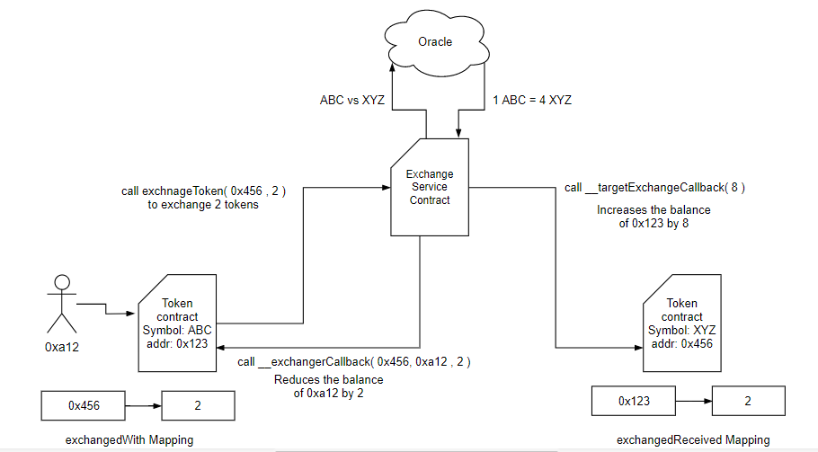
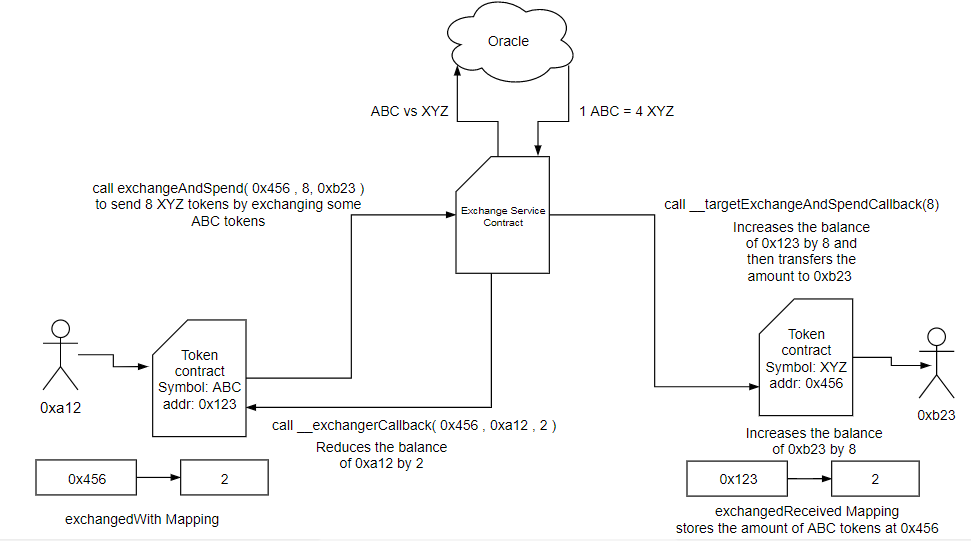

## 简述
一个代币合约的标准，提供代币交换服务，从而促进跨代币支付。

## 摘要
以下标准提供了以任何其他已注册代币的形式进行支付的功能，并允许代币合约在现有代币合约中存储任何其他代币。此标准允许 ERC20 代币持有者将其代币与另一个 ERC20 代币进行交换，并使用交换后的代币进行支付。成功支付后，先前的指定的 ERC20 代币将被存储在与它们交换的 ERC20 代币合约中。本提案使用术语“目标合约”，用于表示我们想要与之交换代币的合约。

## 动机
现有的代币标准不提供交换代币的功能。现有的代币转换器减少了现有代币的总供应量，这在某种意义上摧毁了货币。代币转换器并没有解决这个问题，因此不鼓励创建新代币。这个解决方案不会摧毁现有的代币，而是将它们保存在与之交换的代币合约中，这反过来又增加了后者的市场价值。

## 规范
### 发送者接口
想要将其代币与另一个代币交换的 ERC20 代币合约必须继承此接口。

#### 存储变量
##### exchnagedWith
此映射存储与另一个代币交换的代币数量，以及后者的地址。每次交换更多代币时，整数值都会相应递增。此映射充当记录，表示哪个目标合约持有我们的代币。

```solidity
mapping ( address => uint ) private exchangedWith;
```
##### exchangedBy
此映射存储发起交换的人员的地址和交换的代币数量。

```solidity
mapping ( address => uint ) private exhangedBy;
```

#### 方法

注意：调用者必须处理返回值的 false (bool success)。调用者不得假设永远不会返回 false！

##### exchangeToken
此函数调用处理交换的中间交换服务合约。此函数将目标合约的地址和我们想要交换的数量作为参数，并返回布尔值 `success` 和 `creditedAmount`。

```solidity
function exchangeToken(address _targetContract, uint _amount) public returns(bool success, uint creditedAmount)
```

##### exchangeAndSpend
此函数调用处理交换和支出的中间交换服务合约。此函数将目标合约的地址、我们想要以目标合约代币形式花费的数量以及接收者的地址作为参数，并返回布尔值 `success`。

```solidity
function exchangeAndSpend(address _targetContract, uint _amount,address _to) public returns(bool success)
```

##### __exchangerCallback
此函数由交换服务合约调用到我们的代币合约，以从我们的余额中扣除计算出的金额。它将目标合约的地址、交换代币的人员的地址以及要从交换者帐户中扣除的金额作为参数，并返回布尔值 `success`。

注意：要求只有交换服务合约才有权调用此函数。

```solidity
function __exchangerCallback(address _targetContract,address _exchanger, uint _amount) public returns(bool success)
```

#### 事件

##### Exchange
此事件记录任何已发生的新交换。

```solidity
event Exchange(address _from, address _ targetContract, uint _amount)
```

##### ExchangeSpent
此事件记录任何已发生并已立即花费的新交换。

```solidity
event ExchangeSpent(address _from, address _targetContract, address _to, uint _amount)
```

### 接收者接口
想要接收交换的代币的 ERC20 代币合约必须继承此接口。

#### 存储变量
##### exchangesRecieved
此映射存储以另一种代币形式接收的代币数量，以及其地址。每次交换更多代币时，整数值都会相应递增。此映射充当记录，表示除了自身之外，此合约还持有哪些代币。

```solidity
mapping ( address => uint ) private exchnagesReceived;
```
#### 方法

注意：调用者必须处理返回值的 false (bool success)。调用者不得假设永远不会返回 false！

##### __targetExchangeCallback
此函数由中间交换服务合约调用。此函数应将 `_amount` 个目标合约的代币添加到交换者的地址，以成功完成交换。

注意：要求只有交换服务合约才有权调用此函数。

```solidity
function __targetExchangeCallback (uint _to, uint _amount) public returns(bool success)
```

##### __targetExchangeAndSpendCallback
此函数由中间交换服务合约调用。此函数应将 `_amount` 个目标合约的代币添加到交换者的地址，并将其转移到 `_to` 地址，以成功完成交换和支出。

注意：要求只有交换服务合约才有权调用此函数。

```solidity
function __targetExchangeAndSpendCallback (address _from, address _to, uint _amount) public returns(bool success)
```

#### 事件
##### Exchange
此事件记录任何已发生的新交换。

```solidity
event Exchange(address _from, address _with, uint _amount)
```

##### ExchangeSpent
此事件记录任何已发生并已立即花费的新交换。
```solidity
event ExchangeSpent(address _from, address _ targetContract, address _to, uint _amount)
```

### 交换服务合约

这是一个中间合约，提供交换和支出的网关。此合约使用 Oracle 来获取经过身份验证的汇率。

#### 存储变量

##### registeredTokens

此数组存储所有已注册用于交换的代币。只有注册代币才能参与交换。

```solidity
address[] private registeredTokens;
```

#### 方法

##### registerToken

此函数由代币合约的所有者调用，以注册其代币。它将代币的地址作为参数，并返回布尔值 `success`。

注意：在任何交换之前，必须确保已注册该代币。

```solidity
function registerToken(address _token) public returns(bool success)
```

##### exchangeToken

此函数由想要将其代币与 `_targetContract` 代币交换的代币持有者调用。此函数查询汇率，计算转换后的金额，调用 `__exchangerCallback` 并调用 `__targetExchangeCallback`。它将目标合约的地址和要交换的金额作为参数，并返回布尔值 `success` 和记入的金额。

```solidity
function exchangeToken(address _targetContract, uint _amount, address _from) public returns(bool success, uint creditedAmount)
```

##### exchangeAndSpend

此函数由想要将其代币与 `_targetContract` 代币交换的代币持有者调用。此函数查询汇率，计算转换后的金额，调用 `__exchangerCallback` 并调用 `__targetExchangeAndSpendCallback`。它将目标合约的地址和要交换的金额作为参数，并返回布尔值 `success` 和记入的金额。

```solidity
function exchangeAndSpend(address _targetContract, uint _amount, address _from, address _to) public returns(bool success)
```

#### 事件

##### Exchanges

此事件记录任何已发生的新交换。

```solidity
event Exchange( address _from, address _by, uint _value ,address _target )
```
##### ExchangeAndSpent

此事件记录任何已发生并已立即花费的新交换。

```solidity
event ExchangeAndSpent ( address _from, address _by, uint _value ,address _target ,address _to)
```

### 图解说明

#### 交换代币


注意：成功交换后，右侧的合约拥有左侧合约的一些代币。

#### 交换和花费代币



注意：成功交换后，右侧的合约拥有左侧合约的一些代币。

## 理由

这样的设计提供了一个适用于所有遵循它的 ERC20 代币的一致的交换标准。
这种策略的主要优点是交换的代币不会丢失。它们可以被花费或保存。
代币转换面临着转换后销毁代币的主要缺点。这种机制将代币视为传统的货币，代币不会被销毁，而是被存储。

## 向后兼容性

此提案完全向后兼容。由此提案扩展的代币也应遵循 ERC20 标准。ERC20 标准的功能不应受到此提案的影响，但会为其提供额外的功能。

## 版权

通过 [CC0](../LICENSE.md) 放弃版权和相关权利。